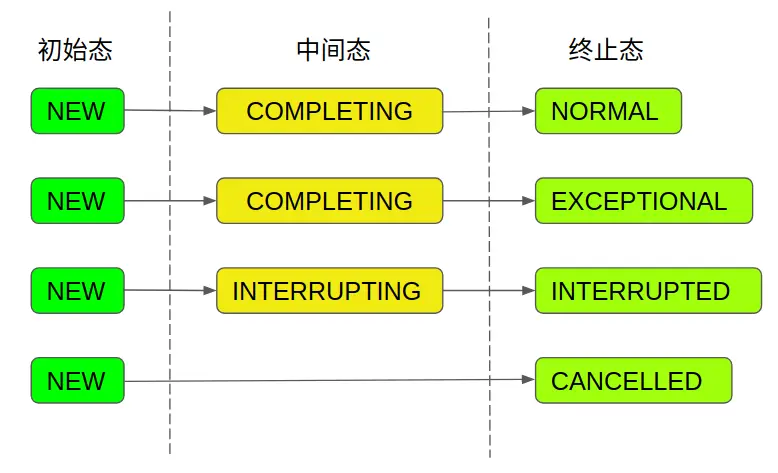

# 1 预备知识

<!--more-->

## 1.1 Callable接口

JDK1.5之前，创建线程只有两种方式：继承`Thread`类或实现`Runnable`接口，并重写其中的`run`方法。然而，这两种方式都存在一个缺陷，那就是在任务执行完成之后**无法获取任务执行结果**。为了解决这一问题，JDK1.5版本中提供了`Callable`接口以及`Future`接口。

`Runnable`接口与`Callable`接口的对比如下：

```java
@FunctionalInterface
public interface Runnable {
    public abstract void run();
}

@FunctionalInterface
public interface Callable<V> {
    V call() throws Exception;
}
```

可以看出二者有以下两点不同：

1. `Callable`有返回值，而`Runnable`没有
2. `Callable`可以抛出异常，而`Runnable`不行

`Callable`接口中的返回值保证了**任务执行结果能够被传递出去**。另外，如果在任务中发生了异常，`Callable`能够将其向上抛出给任务的调用者进行处理，我们甚至可以利用这个特性来中断一个任务的执行。而`Runnable`中的`run`方法无法抛出异常，只能在方法内部进行`catch`处理。

在有了`Callable`接口之后，我们可以将`Callable`作为一个有返回值的任务提交给另外一个线程执行，并在合适的时候，判断任务是否完成，然后获取线程的执行结果或者撤销任务。这一工作则是交给`Future`接口实现。

## 1.2 Future接口

`Future`接口被设计用来代表一个异步操作的执行结果，可以用它来获取一个操作的执行结果、取消一个操作、判断一个操作是否已完成或被取消。`Future`接口的定义如下：

```java
public interface Future<V> {

    /**
     * 取消任务，当有以下三种情况之一时，cancel操作失败：任务已经执行完成、任务已经被取消、任务因为某种原因不能取消。其他情况下，cancel方法将返回true。
     */
    boolean cancel(boolean mayInterruptIfRunning);

    /**
     * 判断任务是否被取消。如果任务在完成之前被取消，则返回true。
     */
    boolean isCancelled();

    /**
     * 判断任务是否完成。任务正常执行完毕、任务抛出异常以及任务被取消均会返回true。
     */
    boolean isDone();

    /**
     * 用于获取任务执行结果，如果任务还在执行中，则阻塞等待。
     * 该方法可能抛出以下三种异常
     * CancellationException：当任务被取消时，get方法抛出该异常
     * ExecutionException：如果任务执行过程中抛出异常，get方法抛出该异常
     * InterruptedException: 如果执行任务的线程在等待过程中被打断，get方法抛出该异常
     */
    V get() throws InterruptedException, ExecutionException;

    /**
     * 该方法与get类似，不同点在于该方法只等待指定时间，如果指定时间内任务未完成，则抛出TimeoutException，其余抛出异常与get方法相同
     */
    V get(long timeout, TimeUnit unit)
        throws InterruptedException, ExecutionException, TimeoutException;
}
```

`Future`接口中的方法解释，上面的注释已经写得很详细了，这里补充说明一下`cancel`方法。`cancel`方法返回`true`**并不代表任务真的已经取消了**，这取决于调用`cancel`时任务所处的状态：

- 如果发起`cancel`时任务还没有被执行，则之后该任务也不会被执行。
- 如果发起`cancel`时任务已经被执行了，这时需要取决于`mayInterruptIfRunning`参数的值：
  - `mayInterruptIfRunning`为`true`，则当前正在执行的任务会被中断。
  - `mayInterruptIfRunning`为`false`，则可以**允许正在执行的任务继续运行，直到它执行完毕**。

# 2 FutureTask源码解析

`FutureTask`类实现了`RunnableFuture`接口，而`RunnableFuture`接口则继承了`Runnable`接口以及`Future`接口，实际上也就等同于`FutureTask`类同时实现了`Runnable`接口以及`Future`接口。

实现`Runnable`接口表明`FutureTask`是一个可执行的任务。而实现`Future`接口则允许我们对这个任务执行某些操作，比如判断任务是否执行完毕、获取任务的执行结果或者直接取消任务的执行等。

## 2.1 状态介绍

在`FutureTask`中，状态是由`state`属性表示的，该属性由`volatile`关键字修饰，确保了不同线程对于它修改的可见性。`FutureTask`共有以下7种状态：

```java
/**
 * The run state of this task, initially NEW.  The run state
 * transitions to a terminal state only in methods set,
 * setException, and cancel.  During completion, state may take on
 * transient values of COMPLETING (while outcome is being set) or
 * INTERRUPTING (only while interrupting the runner to satisfy a
 * cancel(true)). Transitions from these intermediate to final
 * states use cheaper ordered/lazy writes because values are unique
 * and cannot be further modified.
 *
 * Possible state transitions:
 * NEW -> COMPLETING -> NORMAL
 * NEW -> COMPLETING -> EXCEPTIONAL
 * NEW -> CANCELLED
 * NEW -> INTERRUPTING -> INTERRUPTED
 */
private volatile int state;
private static final int NEW          = 0;
private static final int COMPLETING   = 1;
private static final int NORMAL       = 2;
private static final int EXCEPTIONAL  = 3;
private static final int CANCELLED    = 4;
private static final int INTERRUPTING = 5;
private static final int INTERRUPTED  = 6;
```

其中，包括1个初始态、2个中间态以及4个终止态。各状态之间的转换路径如下：




参考资料：

[FutureTask源码解析(1)——预备知识](https://segmentfault.com/a/1190000016542779)

[FutureTask源码解析(2)——深入理解FutureTask](https://segmentfault.com/a/1190000016572591)
