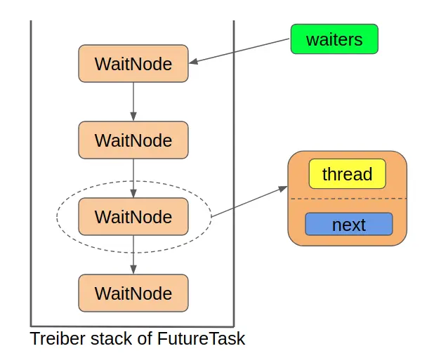

# 1 接口介绍

<!--more-->

## 1.1 Callable接口

JDK1.5之前，创建线程只有两种方式：继承`Thread`类或实现`Runnable`接口，并重写其中的`run`方法。然而，这两种方式都存在一个缺陷，那就是在任务执行完成之后**无法获取任务执行结果**。为了解决这一问题，JDK1.5版本中提供了`Callable`接口以及`Future`接口。

`Runnable`接口与`Callable`接口的对比如下：

```java
@FunctionalInterface
public interface Runnable {
    public abstract void run();
}

@FunctionalInterface
public interface Callable<V> {
    V call() throws Exception;
}
```

可以看出二者有以下两点不同：

1. `Callable`有返回值，而`Runnable`没有
2. `Callable`可以抛出异常，而`Runnable`不行

`Callable`接口中的返回值保证了**任务执行结果能够被传递出去**。另外，如果在任务中发生了异常，`Callable`能够将其向上抛出给任务的调用者进行处理。而`Runnable`中的`run`方法无法抛出异常，只能在方法内部进行`catch`处理。

那么我们如何获取`Callable`接口的返回结果呢？这就需要介绍一下`Future`接口了。

## 1.2 Future接口

`Future`接口被设计用来代表一个异步操作的执行结果，可以用它来获取一个操作的执行结果、取消一个操作、判断一个操作是否已完成或被取消。`Future`接口的定义如下：

```java
public interface Future<V> {

    /**
     * 取消任务，当有以下三种情况之一时，cancel操作失败：任务已经执行完成、任务已经被取消、任务因为某种原因不能取消。其他情况下，cancel方法将返回true。
     */
    boolean cancel(boolean mayInterruptIfRunning);

    /**
     * 判断任务是否被取消。如果任务在完成之前被取消，则返回true。
     */
    boolean isCancelled();

    /**
     * 判断任务是否完成。任务正常执行完毕、任务抛出异常以及任务被取消均会返回true。
     */
    boolean isDone();

    /**
     * 用于获取任务执行结果，如果任务还在执行中，则阻塞等待。
     * 该方法可能抛出以下三种异常
     * CancellationException：当任务被取消时，get方法抛出该异常
     * ExecutionException：如果任务执行过程中抛出异常，get方法抛出该异常
     * InterruptedException: 如果执行任务的线程在等待过程中被打断，get方法抛出该异常
     */
    V get() throws InterruptedException, ExecutionException;

    /**
     * 该方法与get类似，不同点在于该方法只等待指定时间，如果指定时间内任务未完成，则抛出TimeoutException，其余抛出异常与get方法相同
     */
    V get(long timeout, TimeUnit unit)
        throws InterruptedException, ExecutionException, TimeoutException;
}
```

`Future`接口中的方法解释，上面的注释已经写得很详细了，这里补充说明一下`cancel`方法。`cancel`方法返回`true`**并不代表任务真的已经取消了**，这取决于调用`cancel`时任务所处的状态：

- 如果发起`cancel`时任务还没有被执行，则之后该任务也不会被执行。
- 如果发起`cancel`时任务已经被执行了，这时需要取决于`mayInterruptIfRunning`参数的值：
  - `mayInterruptIfRunning`为`true`，则当前正在执行的任务会被中断。
  - `mayInterruptIfRunning`为`false`，则可以**允许正在执行的任务继续运行，直到它执行完毕**。

## 1.3 ListenableFuture接口


# 2 FutureTask源码解析

`FutureTask`类实现了`RunnableFuture`接口，而`RunnableFuture`接口则继承了`Runnable`接口以及`Future`接口，实际上也就等同于`FutureTask`类同时实现了`Runnable`接口以及`Future`接口。

实现`Runnable`接口表明`FutureTask`是一个可执行的任务。而实现`Future`接口则允许我们对这个任务执行某些操作，比如判断任务是否执行完毕、获取任务的执行结果或者直接取消任务的执行等。

## 2.1 状态介绍

在`FutureTask`中，状态是由`state`属性表示的，该属性由`volatile`关键字修饰，确保了不同线程对于它修改的可见性。`FutureTask`共有以下7种状态：

```java
/**
 * The run state of this task, initially NEW.  The run state
 * transitions to a terminal state only in methods set,
 * setException, and cancel.  During completion, state may take on
 * transient values of COMPLETING (while outcome is being set) or
 * INTERRUPTING (only while interrupting the runner to satisfy a
 * cancel(true)). Transitions from these intermediate to final
 * states use cheaper ordered/lazy writes because values are unique
 * and cannot be further modified.
 *
 * Possible state transitions:
 * NEW -> COMPLETING -> NORMAL
 * NEW -> COMPLETING -> EXCEPTIONAL
 * NEW -> CANCELLED
 * NEW -> INTERRUPTING -> INTERRUPTED
 */
private volatile int state;
private static final int NEW          = 0;
private static final int COMPLETING   = 1;
private static final int NORMAL       = 2;
private static final int EXCEPTIONAL  = 3;
private static final int CANCELLED    = 4;
private static final int INTERRUPTING = 5;
private static final int INTERRUPTED  = 6;
```

其中，包括1个初始态、2个中间态以及4个终止态。各状态之间的转换路径如下：


- 任务的初始状态都是`NEW`
- 任务的终止状态有4种：
  - `NORMAL`：任务正常执行完毕
  - `EXCEPTIONAL`：任务执行过程中发生异常
  - `CANCELLED`：任务被取消（只有当调用`cancel`方法，并且指定参数为`false`时才会导致这一状态）
  - `INTERRUPTED`：任务被取消，且执行任务的线程被中断（只有当调用`cancel`方法，并且指定参数为`true`时才会导致这一状态）
- 任务的中间状态有两种：
  - `COMPLETING`：正在设置任务结果，包括正常执行结果以及异常结果
  - `INTERRUPTING`：正在中断运行任务的线程

值得一提的是，任务的中间状态持续时间很短，其并不代表任务正在执行，而是任务已经执行完毕，正在设置最终的返回结果。实际上，**只要任务不处于**`NEW`**状态，就说明任务已经执行完毕**。

将一个任务的状态由`NEW`设置为其他状态的只有以下三个方法：

- `set`：对应`NEW -> COMPLETING -> NORMAL`状态变化
- `setException`：对应`NEW -> COMPLETING -> EXCEPTIONAL`状态变化
- `cancel`：传入参数为`false`时，对应`NEW -> CANCELLED`状态变化；传入参数为`true`时，对应`NEW -> INTERRUPTING -> INTERRUPTED`状态变化。

后续将分别介绍这三种方法。

## 2.2 Treiber栈

在`FutureTask`任务执行过程中，可能会有不止一个线程来调用其`get`方法来阻塞获取任务执行结果。如果此时任务还没有执行完，那么这些获取结果的线程会阻塞等待，直到任务执行完毕之后被唤醒。`FutureTask`中则是使用Treiber栈这一数据结构来存储阻塞等待的线程。

Treiber栈是一种无锁并发栈，其无锁的特性是基于CAS原子操作实现的。Treiber栈的实现非常简单，就是CAS+重试，具体可以参考下面《Java并发编程实战》中的实现：

```java
public class ConcurrentStack<E> {
    private AtomicReference<Node<E>> top = new AtomicReference<>();

    public void push(E item) {
        Node<E> newHead = new Node<>(item);
        Node<E> oldHead;
        do {
            oldHead = top.get();
            newHead.next = oldHead;
        } while (!top.compareAndSet(oldHead, newHead));
    }

    public E pop() {
        Node<E> oldHead;
        Node<E> newHead;
        do {
            oldHead = top.get();
            if (oldHead == null)
                return null;
            newHead = oldHead.next;
        } while (!top.compareAndSet(oldHead, newHead));
        return oldHead.item;
    }

    private static class Node<E> {
        public final E item;
        public Node<E> next;
        public Node(E item) {
            this.item = item;
        }
    }
}
```

`FutureTask`将所有等待的线程包装为`WaitNode`结点，并将这些结点组织成Triber栈的结构。`WaitNode`结点定义如下：

```java
/**
 * Simple linked list nodes to record waiting threads in a Treiber
 * stack.  See other classes such as Phaser and SynchronousQueue
 * for more detailed explanation.
 */
static final class WaitNode {
    volatile Thread thread;
    volatile WaitNode next;
    WaitNode() { thread = Thread.currentThread(); }
}
```

为了能够正常使用Triber栈，`FutureTask`中定义了指向栈顶结点的`waiters`属性：

```java
/** Treiber stack of waiting threads */
private volatile WaitNode waiters;
```

综上，`FutureTask`中的Triber栈的结构如下：



## 2.3 核心属性

`FutureTask`中主要有以下5个核心属性：

```java
/**
 * The run state of this task, initially NEW.  The run state
 * transitions to a terminal state only in methods set,
 * setException, and cancel.  During completion, state may take on
 * transient values of COMPLETING (while outcome is being set) or
 * INTERRUPTING (only while interrupting the runner to satisfy a
 * cancel(true)). Transitions from these intermediate to final
 * states use cheaper ordered/lazy writes because values are unique
 * and cannot be further modified.
 *
 * Possible state transitions:
 * NEW -> COMPLETING -> NORMAL
 * NEW -> COMPLETING -> EXCEPTIONAL
 * NEW -> CANCELLED
 * NEW -> INTERRUPTING -> INTERRUPTED
 */
private volatile int state;

/** The underlying callable; nulled out after running */
private Callable<V> callable;
/** The result to return or exception to throw from get() */
private Object outcome; // non-volatile, protected by state reads/writes
/** The thread running the callable; CASed during run() */
private volatile Thread runner;
/** Treiber stack of waiting threads */
private volatile WaitNode waiters;
```

其作用分别如下：

- `state`：任务运行状态
- `callable`：任务本身
- `outcome`：任务执行结果。任务正常执行完毕时，该属性中存储任务执行的返回结果；任务执行过程中发生异常时，该属性中存储任务中所发生的异常
- `runner`：执行任务的线程
- `waiters`：Triber栈的栈顶指针，Triber栈中存储着所有阻塞等待任务执行结果的线程

## 2.4 构造方法

`FutureTask`主要有以下两个构造方法：

```java
/**
 * Creates a {@code FutureTask} that will, upon running, execute the
 * given {@code Callable}.
 *
 * @param  callable the callable task
 * @throws NullPointerException if the callable is null
 */
public FutureTask(Callable<V> callable) {
    if (callable == null)
        throw new NullPointerException();
    this.callable = callable;
    this.state = NEW;       // ensure visibility of callable
}

/**
 * Creates a {@code FutureTask} that will, upon running, execute the
 * given {@code Runnable}, and arrange that {@code get} will return the
 * given result on successful completion.
 *
 * @param runnable the runnable task
 * @param result the result to return on successful completion. If
 * you don't need a particular result, consider using
 * constructions of the form:
 * {@code Future<?> f = new FutureTask<Void>(runnable, null)}
 * @throws NullPointerException if the runnable is null
 */
public FutureTask(Runnable runnable, V result) {
    this.callable = Executors.callable(runnable, result);
    this.state = NEW;       // ensure visibility of callable
}
```

上面两个构造方法做的事情其实都是一样的：

1. 用传入的参数初始化`callable`成员变量
2. 将初始状态设置为`NEW`

## 2.5 Runnable接口实现

上文中提到，`FutureTask`同时实现了`Runnable`接口与`Future`接口，我们这一小节先看一下其对应的`Runnable`接口实现。

`Runnable`接口中其实就一个`run`方法，下面是`FutureTask`中`run`方法的对应实现：

```java
public void run() {
    // 只有在state等于NEW的情况下，才会执行后续逻辑
    // 首先使用CAS操作将runner属性设置为当前线程，即记录执行任务的线程
    if (state != NEW ||
        !UNSAFE.compareAndSwapObject(this, runnerOffset,
                                     null, Thread.currentThread()))
        return;
    try {
        Callable<V> c = callable;
        // 重新检查一下state是否为NEW，从而判断任务执行前是否调用了cancel方法
        if (c != null && state == NEW) {
            V result;
            boolean ran;
            try {
                // 执行任务逻辑
                result = c.call();
                ran = true;
            } catch (Throwable ex) {
                result = null;
                ran = false;
                // 执行过程中发生异常，调用setException方法设置异常结果
                setException(ex);
            }
            // 正常执行完毕，调用set方法设置任务执行结果
            if (ran)
                set(result);
        }
    } finally {
        // runner must be non-null until state is settled to
        // prevent concurrent calls to run()
        runner = null;
        // state must be re-read after nulling runner to prevent
        // leaked interrupts
        int s = state;
        if (s >= INTERRUPTING)
            handlePossibleCancellationInterrupt(s);
    }
}
```

上面代码的注释已经很清晰了，这里我就不再多说了。唯一需要说的一点在于`try`代码块中对于`state`变量的判断。为什么前面已经进行过一次判断了，这里还要再判断一次`state`是否等于`NEW`呢？

前面我们提到过，`FutureTask`不仅实现了`Runnable`接口，还实现了`Future`接口，自然需要实现`Future`接口中包括`cancel`方法在内的5个方法。注意`Future`接口中对于`cancel`方法的描述：

> If successful, and this task has not started when {@code cancel} is called, this task should never run.

翻译为中文为：如果在任务执行前`cancel`方法被成功调用，则该任务永远不会被执行。因为`cancel`方法随时都有可能被调用（调用之后会改变`state`的值），因此在正式执行任务之前，还需要再对`state`的值进行一次判断（避免在设置`runner`的过程中`cancel`方法被调用）。如果在任务执行之前`state`的值不为`NEW`，说明`cancel`方法被调用，此时应该放弃任务的执行。

值得一提的是，在任务执行之前手动调用`set`方法或者`setException`也会造成`state`状态发生改变，从而导致任务不会被执行。不过可以获取到你手动设置的返回值或异常。不过`set`方法和`setException`都是`protected`方法，在不同包下是没有办法调用这两个方法的，而且通常也没有这样做的。

参考资料：

[FutureTask源码解析(1)——预备知识](https://segmentfault.com/a/1190000016542779)

[FutureTask源码解析(2)——深入理解FutureTask](https://segmentfault.com/a/1190000016572591)

[Treiber Stack简单分析](https://segmentfault.com/a/1190000012463330)

[Treiber Stack介绍 ](https://www.cnblogs.com/micrari/p/7719408.html)
