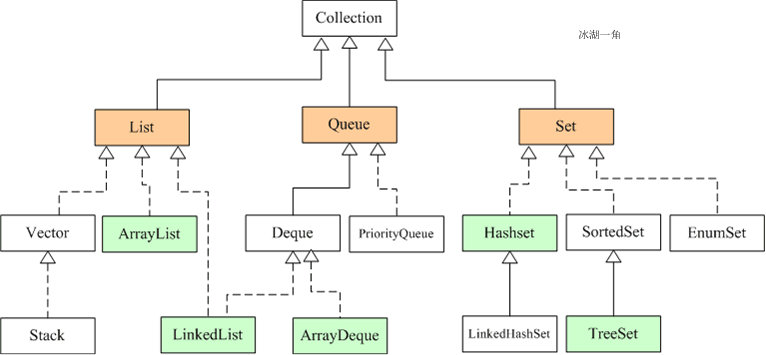
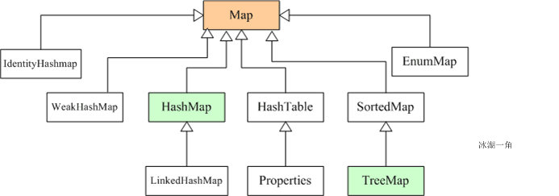

# 1 Java集合框架

<!--more-->

## 1.1 总体介绍

Java集合大致可以分为两大体系，一个是`Collection`，另一个`Map`：

- `Collection`：主要由`List`、`Set`以及`Queue`接口组成。
  - `List`：代表有序、可重复的集合。
  - `Set`：代表无序、不可重复的集合。
  - `Queue`：提供了基于队列的集合体系。
- `Map`：代表具有映射关系的键值对集合。

## 1.2 List集合

`List`集合的特点就是存取有序，可以存储重复的元素，可以用下标进行元素的操作。

`List`的主要实现类有`ArrayList`、`LinkedList`、`Vector`以及`Stack`：

- `ArrayList`
  - 基于动态数组实现，需要分配连续的内存空间。
  - 支持随机访问，可直接通过元素下标获取元素。
  - 由于插入与删除操作需要移动数组元素，所以插入删除效率较低。
  - 当数组满时，会进行扩容（使用`copyOf`实现）。
- `LinkedList`
  - 基于双向链表实现，不需要分配连续的内存空间。
  - 不支持随机访问，每次查询都只能从一端开始遍历，直到找到查询的对象。
  - 插入与删除只需要变更指针指向即可，效率较高。
  - 由于需要记录前驱以及后继指针，因此内存占用较高。
- `Vector`
  - 与`ArrayList`类似，但`Vector`是线程安全的。
  - 由于`Vector`的线程安全实现仅仅是在每个方法上面添加了`synchronized`关键字，因此效率低，如今已经很少使用了。
- `Stack`
  - `Stack`是`Vector`的子类，不同的是，它的数据结构是先进后出，也就是栈。
  - `Stack`同样是线程安全的，同样效率低，不推荐使用，建议使用`Deque`双端队列来替代`Stack`。

## 1.3 Map集合

`Map`中保存的是键值对，键要求唯一、不可重复，值可以重复，无下标。

`Map`的主要实现类有`HashMap`、`LindedHashMap`、`TreeMap`：

- `HashMap`：基于哈希表实现，查找对象时通过哈希函数计算其位置。
  - 由于使用的是哈希表存储元素，所以无法保证数据的输入顺序与输出顺序一致。
  - 使用链地址法解决哈希冲突，当链表长度大于8并且哈希表长度大于64时，将链表转化为红黑树。
- `LinkedHashMap`：底层原理与`HashMap`类似，只是内部多了一个双向链表，用来维护插入顺序或者LRU顺序。默认为按照插入顺序排序。
- `TreeMap`：基于红黑树实现，每个key-value都作为红黑树的一个结点。可以使用自然排序（默认升序）或者自定义比较器排序。

## 1.4 Set集合

`Set`集合的特点是存取无序、元素不重复、无下标。

`Set`的主要实现类有`HashSet`、`LinkedHashSet`和`TreeSet`。

`Set`的这几个实现类都是基于`Map`的几个实现类所实现的，key存储`Set`的元素，value置为`null`。

## 1.5 Queue集合

`Queue`是一个队列集合，队列通常是指先进先出（FiFO）的容器。新元素插入到队列的尾部，访问元素操作会返回队列头部的元素。通常，队列不允许随机访问队列的元素。

`Queue`主要实现类有`ArrayDeque`、`LinkedList`、`PriorityQueue`：

- `ArrayQueue`是一个基于数组实现的双端队列，既然是双端队列，那么即可以先进先出（FIFO队列的特性），也可以先进后出（栈的特性）。
- `LinkedList`是`List`接口的实现类，也是`Deque`（双端队列）的实现类，底层是双向链表的数据结构。
- `PriorityQueue`基于堆实现，该类能够对存储在其中的元素按照元素大小进行排序。

**参考资料**：

[【集合系列】- 初探 java 集合框架图](http://www.justdojava.com/2019/09/16/java-collection-1/)

[Java集合框架史上最详解（list set 以及map）](https://chasing987.github.io/2020/12/13/Java%E9%9B%86%E5%90%88%E6%A1%86%E6%9E%B6%20list-set-map%20/)