# 1 Java中实现多线程的几种方式

<!--more-->

主要有以下几种实现方式；

- 继承`Thread`类
- 实现`Runnable`接口
- 实现`Callable`接口，并配合`FutureTask`类

## 1.1 继承Thread类

示例如下：

```java
public class ThreadDemo {
    public static void main(String[] args) {
        // 除了显式定义MyThread类外，我们还可以使用匿名内部类的方式
        Thread t = new MyThread();
        t.start();
        for (int i = 0; i < 100; i++) {
            System.out.println("main线程" + i);
        }
    }
}

// 继承Thread类，并实现其中的run()方法
class MyThread extends Thread {
    @Override
    public void run() {
        for (int i = 0; i < 100; i++) {
            System.out.println("子线程输出：" + i);
        }
    }
}
```

## 1.2 实现Runnable接口

代码如下：

```java
public class ThreadDemo {
    public static void main(String[] args) {
        // 除了显示定义接口外，我们还可以使用lambda的方式
        Runnable target = new MyRunnable();
        Thread t1 = new Thread(target, "1号线程");
        t1.start();
    }
}

// 实现Runnable接口，并实现其中的run方法
class MyRunnable implements Runnable {
    @Override
    public void run() {
        for (int i = 0; i < 10; i++) {
            System.out.println(Thread.currentThread().getName() + "->" + i);
        }
    }
}
```

`Thread`类本身也是实现了`Runnable`接口，`Thread`类中持有一个类型为`Runnable`的`target`属性，执行`Thread`类中的`run`方法底层是调用`target.run()`。

```java
public class Thread implements Runnable {
    private Runnable target;

    public void run() {
        if (target != null) { // 底层调用的是 Runnable 的 run 方法 target.run();
        }
    }
}
```

## 1.3 实现Callable接口配合FutureTask类

代码如下：

```java
public class ThreadDemo {
    public static void main(String[] args) {
        Callable<String> call = new MyCallable();
        FutureTask<String> task = new FutureTask<>(call);
        Thread t = new Thread(task);
        t.start();
        try {
            // 获取call方法返回的结果（正常/异常结果）
            String s = task.get();
            System.out.println(s);
        } catch (Exception e) {
            e.printStackTrace();
        }
    }
}

// 实现Callable接口，并重写其中的call方法
// 泛型类型即为call方法的返回值类型
class MyCallable implements Callable<String> {
    @Override
    public String call() throws Exception {
        return Thread.currentThread().getName() + "->" + "Hello World";
    }
}
```

由于`Runnable`接口中的`run`方法无返回值，所以就有了`call`方法。`Callable`接口中的`call`方法有返回值，且我们可以通过`FutureTask`中的`get`方法获取该返回值。`get`方法会阻塞等待，直到任务完成并获得返回值。

`FutureTask`实现了`Runnable`接口，因为`Thread`类只能执行`Runnable`实例的任务对象，所以我们要先把`Callable`包装为`FutureTask`对象，然后再传递给`Thread`类执行任务。

# 2 Thread类中的start()和run()方法有什么区别？

- `run`：被称为线程体，包含了要执行的这个线程的内容，方法执行结束，此线程随之终止。直接调用`run`方法是在主线程中执行了`run`，没有启动新的线程，需要顺序执行。

- `start`：使用`start`是启动新的线程，此线程处于就绪状态，通过这一新线程间接执行`run`中的代码。

简单来说，就是直接调用`run`方法不会开启新的线程，而`start`方法可以。

# 3 interrupt方法的使用？

打断线程相关的几个API如下：

- `public void interrupt()`：使用`t1.interrupt()`这种方式进行调用（`t1`为`Thread`对象实例），打断`t1`线程。
- `public static boolean interrupted()`：静态方法，通过`Thread.interrupted()`这种方式调用，判断当前运行线程是否被打断。打断返回`true`，清除打断标记（将打断标记设为`false`）；未打断返回`false`。
- `public boolean isInterrupted()`：判断当前线程是否被打断，不会清除打断标记。

使用`interrupt()`打断线程分为以下三种情况：

- 打断**正常运行**的线程。调用`interrupt`方法打断正在运行的线程时，只会将该线程的打断状态设置为`true`，之后的具体的操作就看线程代码是如何编写的了。
- 打断调用`sleep`、`wait`、`join`等方法进入**阻塞状态**的线程。调用`interrupt`方法打断这些线程时，会抛出`java.lang.InterruptedException`异常，并且会清空打断状态（将打断状态设为`false`）。
- 打断**`park`**线程。调用`interrupt`方法打断被`park`住的线程时，会将该线程的打断状态设置为`true`。如果打断标记是`true`，则`park`会失效。

# 4 Java中的线程状态？

从操作系统层面来看，共有以下五种状态：

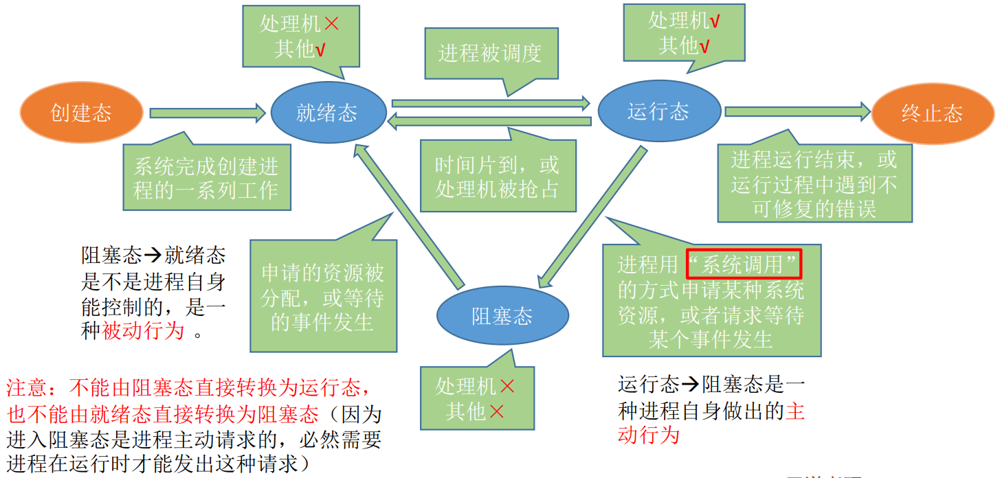

从Java API层面，根据`Thread.State`枚举，java中的线程状态可以分为以下六种。

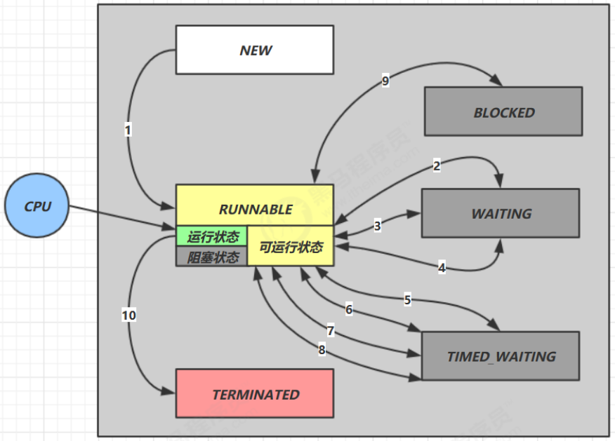

- **NEW**：新创建了一个线程对象，但还没有调用`start()`方法。

- **RUNNABLE**：调用了`start()`方法之后。注意，Java API层面的RUNNABLE涵盖了操作系统层面的【就绪态】、【运行态】以及【阻塞态】（由于BIO导致的线程阻塞，在Java里无法区分，仍然认为是可运行）。

- **BLOCKED**：表示线程阻塞于锁。

- **WAITING**：进入该状态的线程需要等待其他线程做出一些特定动作（通知或中断）。

- **TIMEED_WAITING**：该状态不同于WAITING，它可以在特定的时间后自行返回。

- **TERMINATED**：表示该线程已经执行完毕

# 5 synchronized底层原理？

## 5.1 Java对象头

在介绍`synchronized`底层原理之前，首先需要了解Java中的对象头。

在HotSpot虚拟机汇总，对象在内存中存储的布局可以分为3块区域：

- 对象头（Header）
- 实例数据（Instance Data）
- 对齐填充（Padding）

其中的对象头又可以分为3部分：

- Mark Word
- 类型指针（即对象指向其类型元数据的指针）
- 数组长度（只存在于数组对象中）

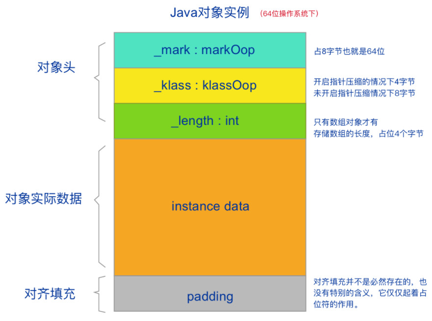

对象头中的Mark Word是保存锁状态的关键，64位虚拟机中的Mark Word如下：

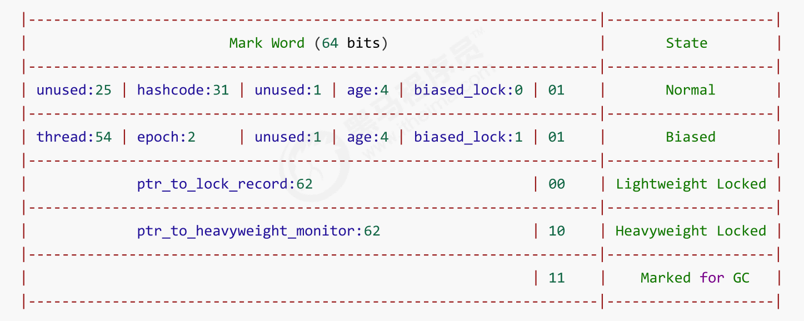

## 5.2 重量级锁

**重量级锁**的实现依赖于**Monitor**，翻译为中文就是监视器或管程。每个java对象都可以关联一个Monitor对象，如果使用`synchronized`给对象加上重量级锁之后，该对象头的Mark Word中就被设置为指向Monitor对象的指针。

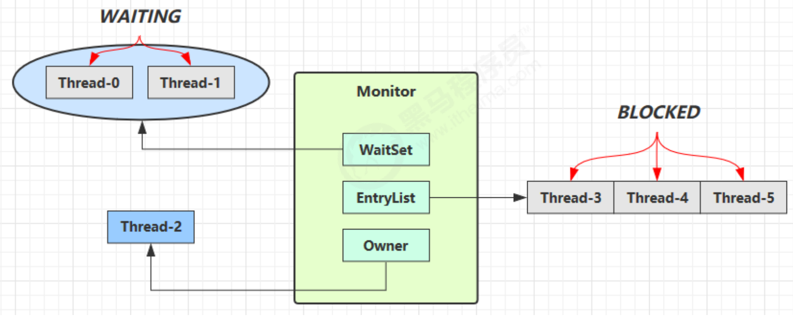

工作流程：

- 初始Monitor中Owner为`null`。
- 当Thread-2执行`synchronized(obj)`时，会将Monitor中的Owner置为Thread-2，并且Monitor对象中只能有一个Owner。此时`obj`对象的Mark Word指向Monitor，对象原有的Mark Word则存入了Monitor中。
- 在Thread-2上锁的过程中，Thread-3、Thread-4、Thread-5也来执行`synchronized(obj)`，就会被插入到EntryList中，并被置为BLOCKED状态。
- Thread-2执行完同步代码块的内容，设置Owner为`null`，然后唤醒EntryList中等待的线程来竞争锁，竞争是**非公平**的。如果这时有新的线程想要获取锁，可能直接就抢占到了，阻塞队列中的线程就会继续阻塞。
- WaitSet中的Thread-0，是以前获得过锁，但条件不满足进入WAITTING状态的线程（wait-notify机制，后续讲）。

## 5.3 轻量级锁

### 5.3.1 轻量级锁原理

重量级锁会导致线程阻塞，从而发生上下文切换，开销较大。因此，从JDK1.6后，Java使用**轻量级锁**这一更加轻量的锁对`synchronized`进行优化。

轻量级锁的使用场景：虽然有多个线程要对锁对象加锁，但加锁的时间是错开的，那么此时可以用轻量级锁，而不是重量级锁。

假设有两个方法同步块，利用同一个对象加锁：

```java
static final Object obj = new Object();
public static void method1() {
    synchronized(obj) {
        // 同步块A
        method2();
    }
}
public static void method2() {
    synchronized(obj) {
        // 同步块B
    }
}
```

工作流程如下：

- 虚拟机首先在当前线程的**栈帧**中建立一个**锁记录（Lock Record）**，用于存储锁对象目前的Mark Word的拷贝，官方称之为Displaced Mark Word。

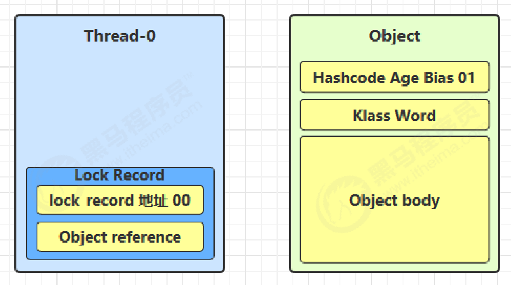

- 拷贝对象头中的Mark Word复制到Lock Record中。
- 拷贝成功后，虚拟机将使用CAS操作尝试将锁对象的Mark Word更新为指向Lock Record的指针，并令Lock Record指向锁对象。
- 如果CAS替换成功，那么这个线程就拥有了该对象的锁，并且对象Mark Word的锁标志位设置为“00”，表示该对象处于轻量级锁定状态。

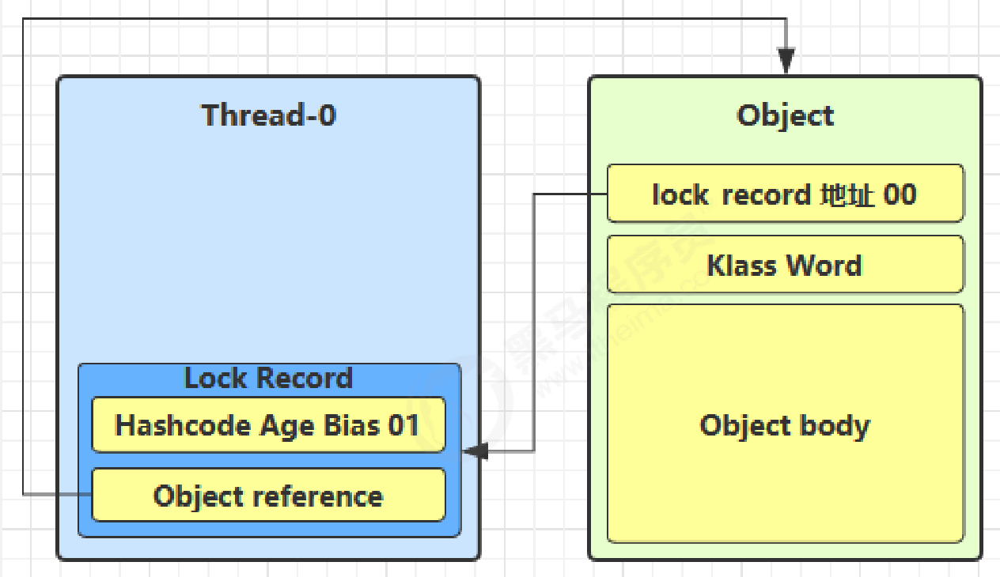

- 如果CAS替换失败，虚拟机首先会检查对象的Mark Word是否指向当前线程的栈帧
  - 如果是，就说明当前线程已经拥有了这个对象的轻量级锁，那么再添加一条Lock Record作为重入的计数（锁重入）。重入的Lock Record中不存储对象的Mark Word，而是置为`null`。
  - 如果不是，说明是其他线程已经持有了该对象的轻量级锁，说明存在竞争，进入锁膨胀过程。

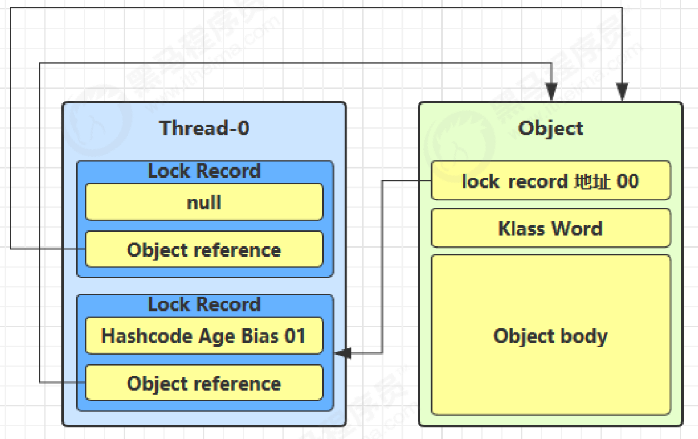

- 当退出`synchronized`代码块（解锁时）
  - 如果有取值为`null`的Lock  Record，表示发生了锁重入，这时删除该Lock Record，表示重入计数减1。
  - 如果Lock Record的值不为`null`，这时使用CAS将Mark Word的值恢复给对象头
    - 成功，则解锁成功。
    - 失败，说明轻量级锁进行了锁膨胀或已经升级为重量级锁，进入重量级锁解锁流程。

### 5.4.2 锁膨胀

轻量级锁锁使用的场景是线程交替执行同步块的情况，如果存在同一时间多个线程获取同一个锁的情况，轻量级锁无法处理，就会导致轻量级锁膨胀为重量级锁。

如果在尝试加轻量级锁的过程中，CAS操作无法成功，一种情况是其他线程为此对象加上了轻量级锁（有竞争），这时需要进行锁膨胀，将轻量级锁变为重量级锁。

- 当Thread-1进行轻量级加锁时，Thread-0已经对该对象加了轻量级锁

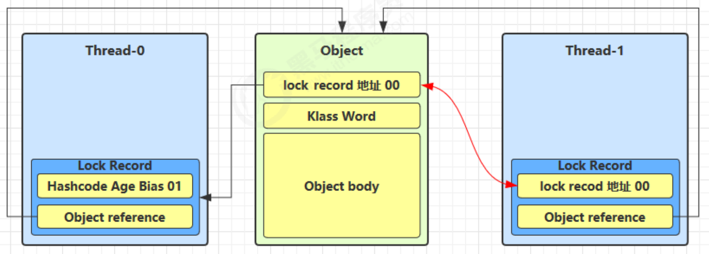

- Thread-1加轻量级锁失败，进入锁膨胀流程：为Object对象申请Monitor锁，通过Object对象头获取到持锁线程Thread-0，将Monitor的Owner置为Thread-0，令Object的对象头指向重量级锁地址，然后自己进入Monitor的EntryList中BLOCKED。

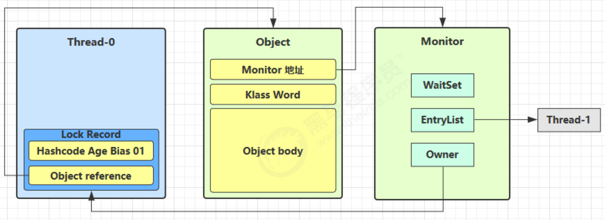

- 当Thread-0退出同步块解锁时，使用CAS将Mark Word的值恢复给对象头失败，这时进入重量级解锁流程，即按照Object对象头中的Monitor地址找到Monitor对象，设置其中的Owner为`null`，唤醒EntryList中的BLOCKED线程。

## 5.4 偏向锁

轻量级锁在没有竞争时，每次重入仍然需要执行CAS操作。JDK1.6中引入了偏向锁来做进一步优化：只有第一次使用CAS将**线程ID**设置到对象的Mark Word头，之后发现这个线程ID是自己就表示没有竞争，不用重新CAS。之后只要不发生竞争，这个对象就归该线程所有。

```java
static final Object obj = new Object();
public static void m1() {
    synchronized(obj) {
        // 同步块A
        m2();
    }
}
public static void m2() {
    synchronized(obj) {
        // 同步块B
        m3();
    }
}
public static void m3() {
    synchronized(obj) {
        // 同步块C
    }
}
```

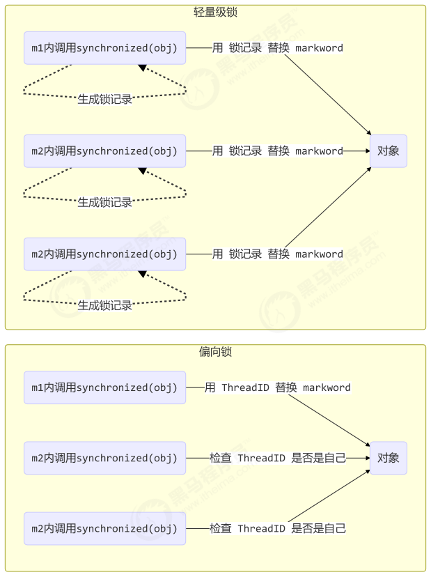

由于偏向锁维护成本太高，JDK15中默认关闭偏向锁。

## 5.5 锁优化

### 5.5.1 自旋锁

重量级锁竞争的时候，可以使用**自旋**来优化，如果当前线程自旋成功（即持锁线程已经推退出了同步块，释放了锁），这时当前线程就可以避免阻塞，从而可以直接获得锁。

自旋锁不会使线程状态发生切换，一直处于用户态，即线程一直是活动的，减少了不必要的上下文切换执行速度快。非自旋锁在获取不到锁的时候会进入阻塞状态，从而进入内核态，当获取到锁的时候从内核态恢复，需要进行线程上下文切换。（**线程被阻塞后会进入内核调度状态，导致系统在用户态与内核态之间来回切换，严重影响锁的性能**）。

### 5.5.2 锁消除

**锁消除**是指JVM即时编译器在运行时，对一些**代码上要求同步，但是被检测到不可能存在共享数据竞争的锁的消除**。

锁消除主要通过**逃逸分析**来实现。比如下面的代码：

```java
public void vectorTest(){
    Vector<String> vector = new Vector<String>();
    for(int i = 0 ; i < 10 ; i++){
        vector.add(i + "");
    }

    System.out.println(vector);
}
```

在运行这段代码时，JVM可以检测到变量`vector`没有逃逸出方法`vectorTest()`之外，所以JVM可以大胆的将`vector`内部的加锁操作消除（`Vector`是线程安全集合类），

### 5.5.3 锁粗化

**锁粗化**的概念比较好理解，就是**将多个连续的加锁、解锁操作连接在一起，扩展成一个范围更大的锁**。因为一系列的加锁解锁操作，可能会导致不必要的性能损耗，反而不如只使用一个范围更大的锁。

比如上面的例子，`vector`每次`add`的时候都需要加锁操作，JVM检测到对同一个对象（vector）连续加锁、解锁操作，会合并成一个更大范围的加锁、解锁操作，即加锁解锁操作会移到for循环之外。

**参考资料**：

[深入分析Synchronized原理(阿里面试题)](https://www.cnblogs.com/aspirant/p/11470858.html)

[深入分析synchronized原理和锁膨胀过程(二)](https://juejin.cn/post/6844903805121740814)

[聊一聊JAVA指针压缩的实现原理（图文并茂，让你秒懂）](https://blog.csdn.net/e891377/article/details/108905401)

[java并发编程——JAVA对象头（含32位虚拟机与64位虚拟机）](https://blog.csdn.net/e891377/article/details/108905401)

[难搞的偏向锁终于被 Java 移除了](https://blog.csdn.net/superjava_/article/details/122218367)

[认真的讲一讲：自旋锁到底是什么](https://www.jianshu.com/p/9d3660ad4358?utm_source=oschina-app)

# 6 wait()与sleep()的区别？

- 所属类不同：`sleep()`是`Thread`类中的静态方法，而`wait()`是`Object`类中的成员方法。
- 使用场景不同：`sleep()`一般用于当前线程休眠，而`wait()`则多用于多线程之间的通信。
- 对锁的处理机制不同：调用`sleep()`方法时，线程不会释放锁；调用`wait()`方法时，线程会释放锁。但是**二者都会释放CPU**。
- 使用区域不同：`wait()`方法必须放在**同步控制方法或同步控制块（先获取锁）**中使用，`sleep()`方法则可以放在任何地方使用。

# 7 Java内存模型？

## 7.1 介绍

**Java内存模型（Java Memory Model，JMM）**是一种抽象的概念，实际上并不存在，描述的是一组规则或规范，通过这组规范定义了程序中各种变量的访问规则。这里说的变量包括实例字段，静态字段和构成数组对象的元素等线程之间共享的变量，不包括局部变量与方法参数，因为后者是线程私有的，不会被共享，自然也就不存在竞争问题。

Java内存模型屏蔽了各种硬件和操作系统的内存访问差异，实现让Java程序在各种平台下都能达到一致的内存访问效果。

Java内存模型规定了所有的变量都存储在**主内存（Main Memory）**中。每个线程还有自己的**工作内存（Working Memory）**，线程的工作内存中保存了被该线程使用的变量的主内存副本，线程对变量的所有操作都必须在工作内存中进行，而不能直接读写主内存中的数据。不同线程之间也无法直接访问对方工作内存中的变量，线程间变量值的传递均需要通过主内存来完成，线程、主内存、工作内存三者的交互关系如下图：


Java内存模型是围绕着程序执行的原子性、有序性、可见性展开的，下面我们来看一下这三大特性。

## 7.2 原子性

**原子性**指的是一个操作是不可中断的，即使是在多线程环境下，一个操作一旦开始就不会被其他线程影响。

Java中的`synchronized`关键字以及其他锁保证原子性。

## 7.3 可见性

**可见性**是指当多个线程访问同一个变量时，一个线程修改了这个变量的值，其他线程能够立即得知这个修改。存在可见性问题的根本原因是由于工作内存的存在，线程持有的是共享变量的副本，无法感知其他线程对于共享变量更改，导致读取的值不是最新的。

Java中有三个关键字可以实现可见性：`volatile`、`synchronized`以及`final`。

`volatile`实现可见性以及有序性的原理后面会讲。

`synchronized`在线程加锁前会**清空工作内存**中共享变量的值，使用共享内存时需要从主内存中重新读取最新的值（lock基本操作的规则）；线程解锁前，必须把共享变量的最新值刷新到主内存中。在解锁前会将本地内存修改的内容**刷新到主内存**中（unlock基本操作的规则）。

- 如果对一个变量执行lock操作，那将会清空工作内存中此变量的值，在执行引擎使用这个变量前，需要重新执行load或assign操作以初始化变量的值。
- 对一个变量执行unlock操作之前，必须先把此变量同步回主内存中。

`synchronized`通过正是通过上述方式实现了可见性。

而`final`修饰的变量是不可变的，自然也就不存在可见性问题。

## 7.4 有序性

`synchronized`能不能保证有序性网络上众说纷纭，而且有序性也没人能给出一个具体的定义，比较混乱，所以这里我不再讨论`synchronized`能否保证有序性的问题。只讨论指令重排序。

`synchronized`中在`monitorenter`之后会加一个Acquire屏障，禁止该屏障之前的指令重排序到该屏障之后；`monitorexit`之前也会加一个Release屏障，禁止该屏障之后的指令重排序到该屏障之前。也就是说，**`synchronized`能够禁止同步块外部的指令重排序到同步块内，但是无法禁止同步块内的指令重排序**。

`volatile`则能够通过内存屏障禁止指令重排序。

**参考资料**：

[全面理解Java内存模型(JMM)及volatile关键字](https://blog.csdn.net/javazejian/article/details/72772461)

[Java并发编程之synchronized](http://www.philpy.top/articles/133#synchronized_54)

# 8 volatile关键字原理？

`volatile`的底层实现原理是内存屏障（Memory Barrier或Memory Fence）。

- 对`volatile`变量的**写指令后会加入写屏障（sfence）**。
- 对`volatile`变量的**读指令前会加入读屏障（lfence）**。

内存屏障能够保证`volatile`变量的可见性和有序性：

- 可见性
  - 写屏障保证在该屏障之前的，对共享变量的改动都同步到主内存中。
  - 读屏障保证在该屏障之后，对共享变量的读取加载的是主内存中的最新数据。
- 有序性
  - 写屏障会确保执行重排序时，不会将写屏障之前的代码排在写屏障之后。
  - 读屏障会确保指令重排序时，不会将读屏障之后的代码排在读屏障之前。

# 9 什么是CAS？

## 9.1 CAS介绍

**CAS（Compare And Swap）**作用是让CPU比较内存中某个值是否和预期的值相同，如果相同则将这个值更新为新值，不相同则不做更新。

CAS操作是**原子性**的，所以多线程并发使用CAS更新数据时，可以不使用锁。简单来说，CAS操作涉及到三个值：

- 需要读写的内存位置V
- 预期原值A
- 新值B

如果内存位置的值与原值相匹配，那么处理器会自动将该位置的值更新为新值。否则，处理器不做任何操作。

## 9.2 ABA问题

CAS的使用流程通常如下：

1. 从地址V中读取值A
2. 通过CAS以原子的方式将地址V中的值从A修改为B

虽然CAS操作是原子性的，但是上述这两个操作的组合并不是原子性的，因此可能会出现下面的情况：

1. 线程1执行读取操作，获取原值A，此时发生切换，切换到线程2
2. 线程2将原值由A修改为B
3. 线程2将原值由B修改为A
4. 线程1恢复运行，将期望值与原值进行比较，发现两个值相等，成功执行CAS

在第4步中，由于内存中数据仍然为A，因此CAS操作成功，但实际上该数据已经被线程2修改过了，这就是**ABA问题**。

对于ABA问题，比较有效的方案是引入**版本号**，内存中的值每发生一次变化，版本号都加1。在进行CAS操作时，不仅比较内存中的值，也会比较版本号，只有当二者都没有发生变化时，CAS才能执行成功。

## 9.3 CAS的缺点

CAS具有以下缺点：

- **循环时间长，开销大**。CAS操作失败后，会进行循环重试，如果CAS长时间都不成功，会造成极大的CPU开销。
- **只能保证一个共享变量的原子操作**。当对一个共享变量执行操作时，我们可以使用循环CAS的方式来保证原子操作，但是对多个共享变量操作时，循环CAS就无法保证操作的原子性，这个时候就需要用锁了。
- **ABA问题**。

**参考资料**：

[JUC原子类：CAS详解](https://juejin.cn/post/6999652773109186573)

[java高级进阶之锁🔒与CAS详解](https://blog.51cto.com/u_15399050/5168147#CAS_208)

# 10 什么是伪共享？

## 10.1 伪共享介绍

**伪共享（false sharing）**的非标准定义为：当多线程修改互相独立的变量时，如果这些变量共享同一个缓存行（cache line），就会无意中影响彼此的性能，这就是伪共享。

比如现在有两个线程，运行在处理器core1上的线程A想要更新变量`x`的值，运行在处理器core2上的线程B想要更新变量`y`的值，变量`x`和`y`位于同一个缓存行中。

- 如果线程A去修改core1缓存中的`x`变量，由于缓存一致性协议（MESI协议），core2中包含变量`x`与`y`的缓存行就会被标记为失效状态（Invalidated）。
- 同理，线程B去修改core2缓存中的`y`变量也会导致core1中包含变量`x`与`y`的缓存行失效。

这种频繁的缓存失效十分影响性能。实际上，变量`x`和`y`都是被独立线程操作的，而且两操作之间也没有任何关系。只不过由于它们共享了一个缓存行，所有的竞争冲突都是由于这一缓存行的共享带来的。

在实际编程中，数组所分配的都是连续内存空间，相邻的几个数组元素很容易被存储在同一个缓存行中，从而导致伪共享问题。下面我们说一下如何解决伪共享这一问题。

## 10.2 伪共享解决

伪共享问题可以使用**缓存行填充（Padding）**来解决。

Java中有一个`@sun.misc.Contended`注解，在使用此注解的对象或字段的前后各增加128字节大小的padding，从而使得cpu将对象预读至缓存时**占用不同的缓存行**，这样就不会造成伪共享问题。

**参考资料**：

[伪共享（false sharing），并发编程无声的性能杀手](https://www.cnblogs.com/cyfonly/p/5800758.html)

[【并发编程】CPU cache结构和缓存一致性（MESI协议）](https://blog.csdn.net/reliveIT/article/details/50450136)

[一篇文章让你明白CPU缓存一致性协议MESI](https://cloud.tencent.com/developer/article/1548942)

# 11 ThreadLocal原理？

## 11.1 ThreadLocal介绍

`ThreadLocal`可以理解为线程的局部变量，一个`ThreadLocal`对象只有当前自身线程可以访问，其他线程都无法访问，从而避免了线程竞争导致的并发安全问题。

`Thread`类中有一个类型为`ThreadLocal.ThreadLocalMap`的实例变量`threadLocals`，也就是说每个线程都有一个自己的`ThreadLocalMap`。`ThreadLocalMap`的key为`ThreadLocal`实例对象（实际上是`ThreadLocal`实例对象的**弱引用**），value为真正要存储的值。

每个线程在向`ThreadLocal`中存放值的时候，实际上都是令`ThreadLocal`实例对象作为key，将要存放的值作为value存放到线程的`ThreadLocalMap`中；线程从`ThreadLocal`中读取数据的时候也是以`ThreadLocal`实例对象作为key，在自己的`ThreadLocalMap`中查找对应的value。一个线程中可以创建多个`ThreadLocal`实例对象。

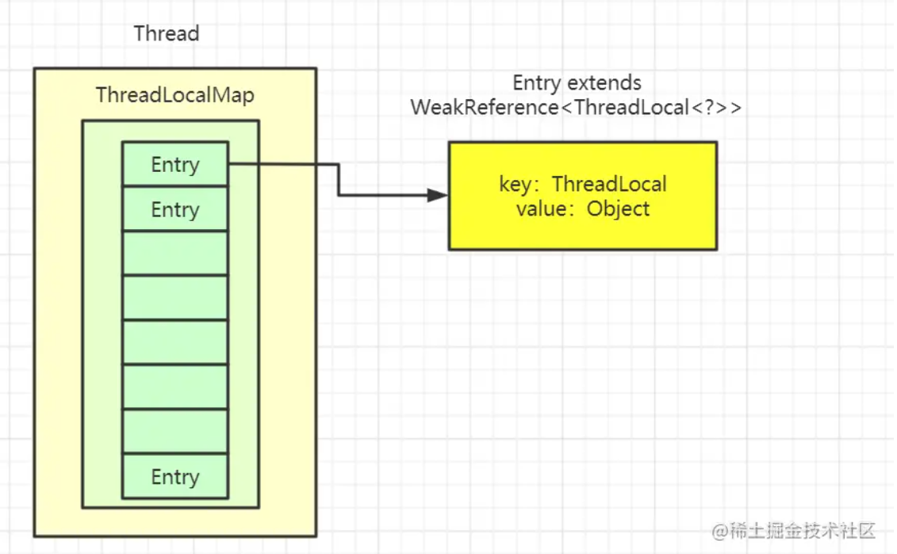

## 11.2 为什么ThreadLocal中的key要设计成弱引用？

首先看一下`ThreadLocalMap`类中`Entry`类的代码：

```java
/**
  * The entries in this hash map extend WeakReference, using
  * its main ref field as the key (which is always a
  * ThreadLocal object).  Note that null keys (i.e. entry.get()
  * == null) mean that the key is no longer referenced, so the
  * entry can be expunged from table.  Such entries are referred to
  * as "stale entries" in the code that follows.
  */
static class Entry extends WeakReference<ThreadLocal<?>> {
    /** The value associated with this ThreadLocal. */
    Object value;

    Entry(ThreadLocal<?> k, Object v) {
        super(k);
        value = v;
    }
}
```

`Entry`类继承自弱引用类`WeakReference`，并且对`ThreadLocal`类型的key调用了父类的构造函数，即key作为弱引用，而value仍然是强引用。


为了回答上面的问题，我们首先假设`Entry`中对于`ThreadLocal`实例对象的引用为强引用，即上图中的连线5为强引用。在这种情况下，即使我们在程序中将`ThreadLocal`实例对象的引用置为`null`（引用置为`null`说明我们已经不需要使用该对象了），此时由于`Entry`对于`ThreadLocal`实例对象的引用仍然是强引用，GC无法将该对象回收，造成内存泄露。只有当线程结束时，其所使用的内存空间才会得到释放。然而现在大多使用线程池，线程是要进行复用的，所以这些不被使用的`ThreadLocal`实例对象就会一直占用着内存空间，造成内存泄露。

如果`Entry`中对于`ThreadLocal`实例对象的引用为弱引用的话，即上图中的连线5为弱引用。在这种情况下，当我们在程序中将`ThreadLocal`实例对象的引用置为`null`之后，此时只有一个弱引用指向这一`ThreadLocal`实例对象，在下一次GC时该对象就会被回收掉。

`ThreadLocal`实例对象被回收之后，`Entry`中的key变为了`null`，但是value仍然存在，且`Entry`对于value的引用是强引用，如果不做处理的话，仍然有可能发生内存泄露。为了解决这一问题，**`get`、`set`以及`remove`操作都会清除key为`null`的`Entry`**。

## 11.3 为什么ThreadLocalMap中的value不设计为弱引用？

value不设置为弱引用，是因为不清楚这个value除了`ThreadLocalMap`的引用是否还存在其他引用（通常，程序中肯定是有`ThreadLocal`实例对象的引用的，当引用为`null`时，也就说明不再需要使用`ThreadLocal`实例对象了），如果不存在其他引用，当GC的时候就会直接将这个value回收掉，而此时我们的`ThreadLocal`可能还在使用期间，就会造成value为`null`的错误，所以要将其设计为强引用。

## 11.4 ThreadLocalMap中如何解决哈希冲突？

**线性探测法**。

**参考资料**：

[面试官：小伙子，听说你看过ThreadLocal源码？（万字图文深度解析ThreadLocal）](https://juejin.cn/post/6844904151567040519#heading-8)

[ThreadLocal 源码全详解（ThreadLocalMap）](https://juejin.cn/post/7113023112655929358#heading-3)

[ThreadLocal为啥要用弱引用？不知道](https://cloud.tencent.com/developer/article/1769423)

# 12 Java中的线程池？

Java中线程池的主要实现可以分为三个：

- `ThreadPoolExecutor`：常规线程池
- `ScheduledExecutorService`：延时任务和定时任务
- `ForkJoinPool`：体现了一种分治思想，适用于能够进行任务拆分的CPU密集型运算。

主要继承关系如下：

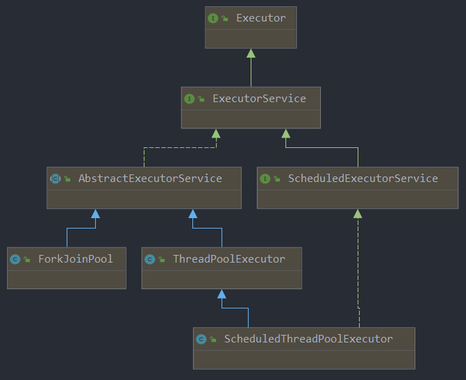

下面依次对这三种线程池进行介绍。

## 12.1 ThreadPoolExecutor

### 12.1.1 线程池状态

`ThreadPoolExecutor`中定义了一个`AtomicInteger`类型的变量`ctl`，其高3位表示线程池状态，低29位表示线程数。将线程池状态与线程数信息存储在一个原子变量`ctl`中，这样就可以用一次CAS原子操作进行赋值。

`ThreadPoolExecutor`的运行状态主要有以下5种：

| **状态名** | **高3位** |                        **状态描述**                        |
| :--------: | :-------: | :--------------------------------------------------------: |
|  RUNNING   |    111    |     能接收新提交的任务，并且也能够处理阻塞队列中的任务     |
|  SHUTDOWN  |    000    |          不会接收新任务，但会处理阻塞队列中的任务          |
|    STOP    |    001    | 不会接收新任务，中断正在执行的任务，并抛弃阻塞队列中的任务 |
|  TIDYING   |    010    |        所有的任务都已终止，线程数（`ctl`后29位）为0        |
| TERMINATED |    011    |           `terminated()`方法执行完毕后进入该状态           |

当线程池变为TIDYING状态时，会执行钩子方法`terminated()`，`terminated()`方法执行完毕后，线程池进入TERMINATED状态。

线程池各个状态之间的转化如下：

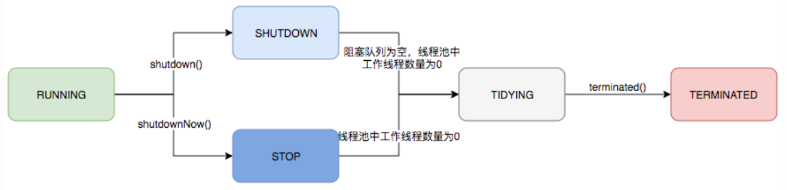

### 12.1.2 构造方法

`ThreadPoolExecutor`的构造方法如下：

```java
public ThreadPoolExecutor(int corePoolSize,
                          int maximumPoolSize,
                          long keepAliveTime,
                          TimeUnit unit,
                          BlockingQueue<Runnable> workQueue,
                          ThreadFactory threadFactory,
                          RejectedExecutionHandler handler)
```

其中：

- `corePoolSize`：核心线程数（线程池的基本大小）
  - 提交一个任务到线程池时，线程池会创建一个新的线程来执行任务。注意：即使有空闲的核心线程能执行该任务，也会创建新的线程。
  - 如果线程池中的线程数已经大于或等于`corePoolSize`，则不会创建新的线程。如果有空闲核心线程，则交由空闲基本线程执行任务，否则，则将任务保存到阻塞队列中。
  - 如果调用了线程池的`prestartAllCoreThreads()`方法，线程池会提前创建并启动所有核心线程
- `maximumPoolSize`：线程池允许创建的最大线程数（线程池的最大数量）
  - 阻塞队列已满，线程数小于`maximumPoolSize`便可以创建新的线程执行任务。新创建的线程被称为救急线程，`maximumPoolSize`与`corePoolSize`之间的差值也被称为救急线程数。
  - 如果使用无界的阻塞队列，则该`maximumPoolSize`参数不起作用。
- `keepAliveTime`：线程池的救急线程空闲时的存活时间。
- `unit`：`keepAliveTime`的单位。
- `workQueue`：阻塞队列，用于保存等待执行的任务。常见的有以下几种阻塞队列：
  - `ArrayBlockingQueue`：基于数组结构的有界阻塞队列，使用该队列，线程池中能创建的最大线程数为`maximumPoolSize`。
  - `LinkedBlockQueue`：基于链表结构的无界阻塞队列，使用该队列，线程池中能创建的最大线程数为`corePoolSize`。
  - `SynchronousQueue`：一个不存储元素的阻塞队列，每个插入操作必须等到另一个线程调用移除操作，否则插入操作一直处于阻塞状态。
  - `PriorityBlockingQueue`：具有优先级的无界阻塞队列，使用该队列，线程池中能创建的最大线程数为`corePoolSize`。
- `threadFactory`：创建线程的工厂类，通过自定义的线程工厂可以给每个新建的线程设置一个具有识别度的线程名。
- `handler`：拒绝策略。当阻塞队列满了，且没有空闲的线程，如果继续提交任务，必须采取一种策略处理该任务，线程池提供了以下4种策略（`RejectedExecutionHandler`的4个实现类）：
  - `AbortPolicy`：丢弃任务并抛出`RejectedExecutionException`异常，**默认策略**。
  - `CallerRunsPolicy`：由调用线程（提交任务的线程）处理该任务。
  - `DiscardOldestPolicy`：丢弃阻塞队列中最靠前的任务，将当前任务加入队列。
  - `DiscardPolicy`：直接丢弃任务，不进行任何处理，也不抛出异常。

### 12.1.3 执行过程

线程池内部采用了生产者消费者模型将线程与任务解耦，从而使线程池同时管理任务与线程。

当任务提交到线程池中之后，需要经过以下流程：

1. 首先检测线程池运行状态，如果不是RUNNING，则直接拒绝，线程池要保证在RUNNING的状态下执行任务。
2. 判断当前线程池中线程数是否达到核心线程数？如果没达到，则创建一个新的线程来执行任务（核心线程）。
3. 判断阻塞队列是否已满？如果没满，则将新提交的任务存储在阻塞队列中。
4. 判断当前线程池中线程数是否达到最大线程数？如果没达到，则创建一个新的线程来执行任务（救急线程）。
5. 如果阻塞队列已满且已达到最大线程数，则执行拒绝策略来处理这个任务。

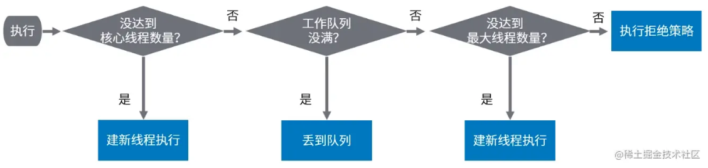

### 12.1.4 Executors创建线程池

`Executors`工具类中为我们提供了封装好的线程池，主要有以下三种：

- **newFixedThreadPool**：创建一个拥有n个线程的的线程池。

  ```java
  public static ExecutorService newFixedThreadPool(int nThreads) {
      return new ThreadPoolExecutor(nThreads, nThreads,
                                    0L, TimeUnit.MILLISECONDS,
                                    new LinkedBlockingQueue<Runnable>());
  }
  ```

  - 核心线程数等于最大线程数（没有救急线程被创建），因此也无需超时时间。
  - 阻塞队列是无界的，可以放任意数量的任务

- **newCachedThreadPool**：创建一个大小无界的缓冲线程池。

  ```java
  public static ExecutorService newCachedThreadPool() {
      return new ThreadPoolExecutor(0, Integer.MAX_VALUE,
                                    60L, TimeUnit.SECONDS,
                                    new SynchronousQueue<Runnable>());
  }
  ```

  - 核心线程数为0，最大线程数为$2^{29}-1$（虽然指定`maximumPoolSize`为`Integer.MAX_VALUE`，但是由于线程数是在`ctl`的后29位记录的，所以最大线程数最大不能超过$2^{29} - 1$，`addWorker`方法中也能看出来，如果线程数大于最大线程数或$2^{29} - 1$是无法创建新线程的），救急线程的空闲生存时间是60s，意味着全部都是救急线程（60s后可以回收），救急线程可以无限创建。
  - `SynchronousQueue`作为阻塞队列，没有容量，对于每一个take的线程会阻塞直到有一个put的线程放入元素位置。

- **newSingleThreadExecutor**：创建一个只有一个线程的单线程池。

  ```java
  public static ExecutorService newSingleThreadExecutor() {
      return new FinalizableDelegatedExecutorService
          (new ThreadPoolExecutor(1, 1,
                                  0L, TimeUnit.MILLISECONDS,
                                  new LinkedBlockingQueue<Runnable>()));
  }
  ```

  - 保证所有任务按照**指定顺序执行**，线程数固定为1，任务数多于1时会放入无界队列排队，任务执行完毕，这唯一的线程也不会被释放。

**线程池不推荐使用Executors去创建**，原因如下：

- `FixedThreadPool`和`SingleThreadPool`允许的请求队列长度为`Integer.MAX_VALUE`，可能会堆积大量的请求，从而导致OOM。
- `CachedThreadPool`允许的创建线程数量为`Integer.MAX_VALUE`（实际上允许创建的 最大线程数为$2^{29}-1$），可能创建大量的线程，从而导致OOM。

### 12.1.5 submit与execute

Java线程池提供了两种不同的方式来执行任务：`execute`与`submit`。

```java
public void execute(Runnable command)
```

使用`execute`只能执行`Runnable`类型的任务，没有返回值，没办法获取任务执行结果。

```java
public Future<?> submit(Runnable task);
public <T> Future<T> submit(Runnable task, T result);
public <T> Future<T> submit(Callable<T> task);
```

`submit`有以上三种形式，虽然可以同时接收`Runnable`类型与`Callable`类型的任务，但实际上其最终会将其封装为`FutureTask`对象，然后调用`execute`执行该`FutureTask`对象（`FutureTask`实现了`Runnable`接口），并将`FutureTask`返回。调用者可以获取该`FutureTask`对象然后调用其`get`方法阻塞获取执行结果。

`submit`的代码实现之一如下，其他的也都大同小异：

```java
public <T> Future<T> submit(Callable<T> task) {
    if (task == null) throw new NullPointerException();
    // 这里的ftask实际类型是FutureTask
    RunnableFuture<T> ftask = newTaskFor(task);
    execute(ftask);
    return ftask;
}
```

总的来说：

- `execute`方法执行任务没有返回值。
- `submit`方法执行任务返回`FutureTask`类型的对象，调用者可以调用该对象的`get`方法阻塞获取任务执行的返回值（`submit`中调用了`execute`方法）。
- `execute`会直接抛出任务执行时的异常，`submit`会吞掉异常，可通过`FutureTask`的`get`方法将任务执行时的异常重新抛出。

**参考资料**：

[Java线程池实现原理及其在美团业务中的实践](https://tech.meituan.com/2020/04/02/java-pooling-pratice-in-meituan.html)

[JUC线程池: ThreadPoolExecutor详解](https://pdai.tech/md/java/thread/java-thread-x-juc-executor-ThreadPoolExecutor.html)

[Java线程池必备知识：核心参数、工作流、监控、调优手段](https://developer.aliyun.com/article/842806)

[Java ThreadPoolExecutor 使用及原理探究](https://blog.csdn.net/u012410733/article/details/107142969)

## 12.2 ScheduledThreadPoolExecutor

`ScheduledThreadPoolExecutor`继承自`ThreadPoolExecutor`，同时也实现了`ScheduledExecutorService`。其任务的执行策略分为两大类：

- 在一定延迟之后只执行一次某个任务
- 在一定延迟之后周期性的执行某个任务

其主要API如下：

```java
public interface ScheduledExecutorService extends ExecutorService {

    /**
    * 在指定的delay之后执行Runnable任务，这是一个一次性操作，command只会被执行一次
    */
    public ScheduledFuture<?> schedule(Runnable command,
                                       long delay, TimeUnit unit);

    /**
    * 与第一个方法相似，不同之处在于执行的是一个Callable任务
    */
    public <V> ScheduledFuture<V> schedule(Callable<V> callable,
                                           long delay, TimeUnit unit);

    /**
    * 在给定的initialDelay延迟之后开始执行command任务，然后以固定的频率period周期性的执行这个任务。
    其中，period指定两个任务开始时间之间的间隔时间。需要注意的是，如果任务本身执行时长超过了period，那么就会等待任务执行完毕后立马执行该任务，而不会让另一个核心线程并发执行这个任务。
    */
    public ScheduledFuture<?> scheduleAtFixedRate(Runnable command,
                                                  long initialDelay,
                                                  long period,
                                                  TimeUnit unit);
    /**
    * 在给定的initialDelay延迟之后开始执行command任务，然后以固定的频率period周期性的执行这个任务。
    其中，period指定前一个任务的结束时间和下一个任务开始时间的间隔时间。
    */
    public ScheduledFuture<?> scheduleWithFixedDelay(Runnable command,
                                                     long initialDelay,
                                                     long delay,
                                                     TimeUnit unit);
}
```

`ScheduledThreadPoolExecutor`有以下两个内部实现类：

- `ScheduledFutureTask`
  - `SceduledFutureTask`继承了`FutureTask`类，并且实现了`RunnableScheduledFuture`接口，拥有时间调度的功能。
  - `ScheduledFutureTask`本质上是在原任务上增加了延迟时间和轮询时间的控制属性，使之能被延迟阻塞队列正常调度，并实现对应的延迟功能和轮询功能。
- `DelayedWorkQueue`
  - `DelayedWorkQueue`是线程池中的任务阻塞队列，用于存放还未分配线程执行的任务。
  - `DelayedWorkQueue`本质是一个基于数组的最小堆，其依据任务的执行时间点的大小排序。
  - 工作线程向`DelayedWorkQueue`获取任务时，若没有任务或者没有任务到达执行时间时都会返回空或者阻塞，因此获取到的任务一定是可以立即执行的任务。

**参考资料**：

[ScheduledThreadPoolExecutor(JAVA线程池)](https://juejin.cn/post/6844904149142732813)

## 12.3 ForkJoinPool

`ForkJoinPool`体现了一种分治思想，适用于能够进行任务拆分的CPU密集型运算。`ForkJoinPool`在分治的基础上加入了多线程，可以把每个任务的分解和合并交给不同的线程来完成，进一步提升了运算效率。

# 13 Java中的AQS？

## 13.1 AQS属性介绍

首先我们先来看下AQS的核心属性：

- 锁相关的属性有两个：

  ```java
  // 锁的状态，为0表示锁没有被占用，大于0表示当前已经有线程持有该锁
  private volatile int state;
  // 当前持有锁的线程，注意这个属性是从AbstractOwnableSynchronizer继承而来
  private transient Thread exclusiveOwnerThread;
  ```

- 同步队列（sync queue）相关的属性有两个：

  ```java
  // 队头，哑结点
  private transient volatile Node head;
  // 队尾，新入队的节点
  private transient volatile Node tail;
  ```

- 队列中的`Node`中需要关注的属性有四组：

  ```java
  // 节点所代表的线程
  volatile Thread thread;
  
  // 双向链表，每个节点需要保存自己的前驱节点和后继节点的引用
  volatile Node prev;
  volatile Node next;
  
  // 线程所处的等待锁的状态，初始化时，该值为0
  volatile int waitStatus;
  // 表示当前结点已取消调度
  static final int CANCELLED =  1;
  // 表示后继结点在等待当前结点唤醒
  static final int SIGNAL    = -1;
  // 表示结点等待在Condition上，存放在条件队列中
  static final int CONDITION = -2;
  // 共享锁模式下，前驱结点不仅会唤醒其后继结点，同时也可能会唤醒后继的后继结点
  static final int PROPAGATE = -3;
  
  // 该属性用于条件队列或者独占锁与共享锁的标记
  Node nextWaiter;
  ```

同步队列中存放着等待锁的线程，其头结点永远是一个哑结点，它不代表任何线程（某些情况下可以看作是代表了当前持有锁的线程），其`thread`属性永远是`null`。只有从头结点往后的结点才代表了等待锁的线程。

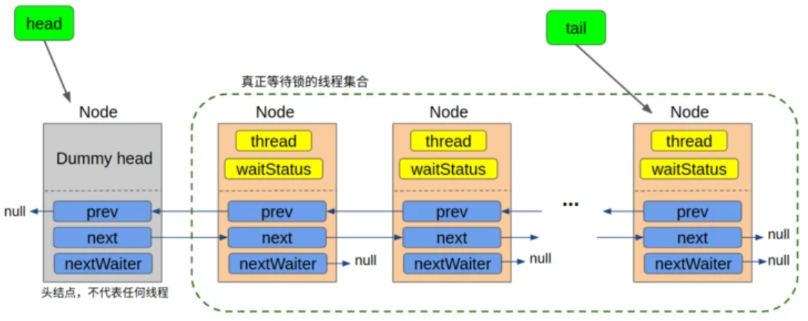

## 13.2 独占锁的获取

`acquire`方法定义在AQS类中，描述了获取锁的流程：

```java
public final void acquire(int arg) {
    if (!tryAcquire(arg) &&
        acquireQueued(addWaiter(Node.EXCLUSIVE), arg))
        selfInterrupt();
}
```

可以看出，该方法中涉及了四个方法的调用：

- **`protected boolean tryAcquire(int arg)`**
  该方法由继承AQS的子类实现，为获取锁的具体逻辑。通常是使用CAS操作将`state`由0变为正数，标识当前线程已获得锁，然后将`exclusiveOwnerThread`属性设置为当前线程。

- **`private Node addWaiter(Node mode)`**
  该方法由AQS实现，负责在获取锁失败后调用，将当前请求锁的线程包装成`Node`丢到同步队列的队尾，并返回这个`Node`。参数`mode`标识当前是共享锁还是独占锁。

- **`final boolean acquireQueued(final Node node, int arg)`**
  该方法由AQS实现，主要对上面刚加入队列的`Node`不断尝试（自旋）以下操作：

  - 在前驱结点是`head`结点（说明当前线程已经排到同步队列的队首了）时，尝试继续获取锁。

  - 如果获取锁成功，则直接返回，结束自旋。返回值为中断标志，表示抢锁过程中是否发生过中断，`boolean`类型。

  - 如果获取锁失败，则跳过前驱结点中`waitStatus`为`CANCELLED`的结点，**找到前驱结点中离自己最近的正常等待的结点**。

    - 如果该前驱结点的`waitStatus`为`SINGAL`，则直接调用`LockSupport.park(this)`将自己挂起。
    - 如果该前驱结点的`waitStatus`不为`SINGAL`时，则将该前驱结点的`waitStatus`置为`SINGAL`，然后将自己挂起。
  
    之所以要将前驱结点的`waitStatus`设置为`SINGAL`，是为了确保自己挂起后能够被唤醒。一个结点在释放锁或者放弃获取锁时，如果它的`waitStatus`属性为`SINGAL`，它还要完成一个额外的操作——唤醒它的后继结点。
  
- **`static void selfInterrupt()`**
  该方法由AQS实现，用来中断当前线程。由于中断标志为`true`时`park`无法起到挂起作用，所以如果在抢锁过程中发生中断，AQS会将中断标志置为`false`（调用`Thread.interrupted()`方法），然后记录一下是否发生过中断。如果确实发生过中断，则在退出`acquire`方法之前，调用`selfInterrupt`（该方法实际上调用了`Thread.currentThread().interrupt()`）自我中断一下，将之前屏蔽的中断补上。

## 13.3 同步队列中的尾分叉

我们看一下`addWaiter`将当前线程包装成`Node`放入到队尾中的代码：

```java
/**
  * Creates and enqueues node for current thread and given mode.
  *
  * @param mode Node.EXCLUSIVE for exclusive, Node.SHARED for shared
  * @return the new node
  */
private Node addWaiter(Node mode) {
    // 将当前线程封装为Node结点
    Node node = new Node(mode);

    for (;;) {
        Node oldTail = tail;
        // 队列不为空，将包装有当前线程的node结点设置为队尾结点
        if (oldTail != null) {
            // 1. 设置node的前驱结点为当前的尾结点
            node.setPrevRelaxed(oldTail);
            // 2. 使用CAS修改tail属性，使其指向当前结点
            if (compareAndSetTail(oldTail, node)) {
                // 3. 修改原来的尾结点，使其next指向当前结点
                oldTail.next = node;
                return node;
            }
        // 队列为空，初始化队列
        } else {
            initializeSyncQueue();
        }
    }
}
```

我们可以看到，将一个结点`node`添加到同步队列的末尾需要三步：

1. 设置`node`的前驱结点为当前的尾结点
2. 使用CAS修改`tail`属性，使其指向当前结点`node`
3. 修改原来的尾结点，使它的`next`指向当前结点

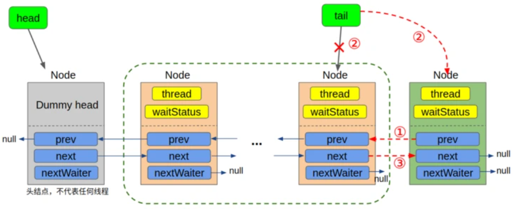

需要注意的是，这里的三步并不是一个原子操作，第一步很容易成功，而第二步由于是一个CAS操作，在并发条件下有可能失败，第三步只有在第二步成功的条件下才执行。这里的CAS保证了同一时刻只有一个结点能成为尾结点，其他结点将失败，失败后将回到for循环中国继续重试。

所以，当有大量的线程在同时入队的时候，同一时刻只有一个线程能完整地完成这三步，**而其他线程只能完成第一步**，于是就出现了尾分叉：

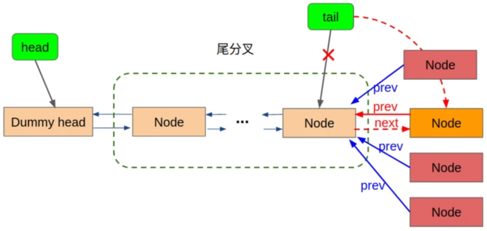

注意，这里第三步是在第二步执行成功后才执行的，这就意味着，即使我们完成了第二步，将新的结点设置成了尾结点，此时**旧的尾结点的`next`值可能还是`null`**（因为还没有来得及执行第三步）。如果此时有线程恰好从头结点开始向后遍历整个链表，则它是遍历不到新加进来的尾结点的，但这显然是不合理的，因为现在的`tail`已经指向了新的尾结点。另一方面，当我们完成了第二步之后，第一步肯定是完成了的，所以如果我们从尾结点开始向前遍历，可以遍历到所有的结点。这也就是为什么AQS的源码中，都是**从尾结点开始逆向遍历同步队列**——因为一个结点要入队，则它的`prev`属性一定是有值的，但是它的`next`属性可能暂时还没有值。

至于那些分叉的入队失败的其他结点，在下一轮的循环中，它们的`prev`属性会重新指向新的尾结点，继续尝试新的CAS操作，最终，所有结点都会通过自旋不断的尝试入队，直到成功为止。

## 13.4 独占锁的释放

`release`方法定义在AQS类中，描述了释放锁的流程。

```java
public final boolean release(int arg) {
    if (tryRelease(arg)) {
        Node h = head;
        if (h != null && h.waitStatus != 0)
            unparkSuccessor(h);
        return true;
    }
    return false;
}
```

相比于获取锁的`acquire`方法，释放锁的过程要简单很多，它只涉及到两个子函数的调用：

- **`protected boolean tryRelease(int arg)`**
  该方法由继承AQS的子类实现，为释放锁的具体逻辑。
- **`private void unparkSuccessor(Node node)`**
  在锁成功释放之后，当队列不为空以及头结点之后存在等待被唤醒的结点时，`unparkSuccessor`方法被调用。该方法向后找到距离`head`结点最近的等待被唤醒的结点（`waitStatus`不为`CANCELLED`），然后唤醒该结点。

## 13.5 共享锁的获取与释放

共享锁与独占锁的获取与释放逻辑十分类似，因此这里就不再具体说了，有一点需要说一下。

在独占锁模式中，我们只有在获取了独占锁的结点释放锁时，才会唤醒后继结点——这是合理的，因为独占锁只能被一个线程持有，如果它还没有被释放，就没有必要去唤醒它的后继结点。

而在共享锁模式下，当一个结点获取到了共享锁，我们在获取成功后就可以直接唤醒后继结点，而不需要等到该结点释放锁的时候（当然，释放锁的时候也会唤醒后续结点），这是因为共享锁可以被多个线程同时持有，一个结点获取到了锁，后续结点都可以直接来获取。因此，**在共享锁模式下，获取锁和释放锁结束时，都会唤醒后继结点**。

## 13.6 Condition接口实现

AQS中定义了`ConditionObject`类实现了`Condition`，它的核心属性只有两个：

```java
/** First node of condition queue. */
private transient Node firstWaiter;
/** Last node of condition queue. */
private transient Node lastWaiter;
```

这两个属性分别代表了条件队列的队头和队尾。

每当我们新建一个`ConditionObject`对象，都会对应一个条件队列。每一个调用了`ConditionObject`对象的`await`方法的线程（在持有锁的情况下）都会被包装成`Node`扔进一个条件队列中，并将`waitStatus`设置为`CONDITION`。

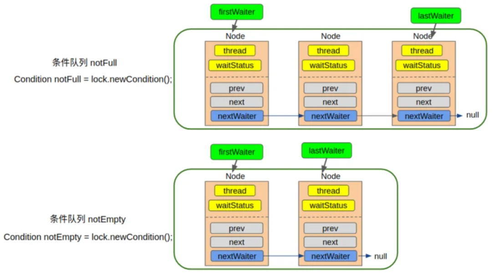

每个条件队列都是独立的，相互不影响的。条件队列通过先前介绍过的`nextWaiter`属性来串联结点（单向链表）。

`Condition`接口中比较需要我们关注的有`signalAll`、`signal`以及`await`方法，下面我们就来看下这几个方法在AQS中的实现。

### 13.6.1 signalAll实现

在看`signalAll`之前，我们首先要区分调用`signalAll`方法的线程与`signalAll`方法要唤醒的线程（等待在对应的条件队列里的线程）：

- 调用`signalAll`方法的线程本身是已经持有了锁，现在准备释放锁了。
- 在条件队列里的线程是已经在对应的`Condition`上挂起了，等待着被唤醒，然后去争锁。

需要注意的是，在调用`Condition`的`signalAll`或`signal`方法时，线程必须已经持有了锁。这一点与调用`notifyAll`和`notify`类似。

`singalAll`方法代码如下：

```java
public final void signalAll() {
    // 如果当前线程未持有锁，抛出异常
    if (!isHeldExclusively())
        throw new IllegalMonitorStateException();
    Node first = firstWaiter;
    // 如果当前条件队列不为空，执行doSignalAll方法
    if (first != null)
        doSignalAll(first);
}

private void doSignalAll(Node first) {
    lastWaiter = firstWaiter = null;
    // 将条件队列中的所有结点都迁移至同步队列中
    do {
        Node next = first.nextWaiter;
        first.nextWaiter = null;
        // 对当前结点执行迁移操作
        transferForSignal(first);
        first = next;
    } while (first != null);
}

final boolean transferForSignal(Node node) {
    // 如果这里的CAS操作执行失败，说明node的waitStatus为CANCELLED，返回false
    // 条件队列中的结点waitStatus要么为CONDITION，要么为CANCELLED
    if (!node.compareAndSetWaitStatus(Node.CONDITION, 0))
        return false;

    // 将当前结点加入到同步队列的队尾，并返回其前驱结点
    Node p = enq(node);
    int ws = p.waitStatus;
    // 如果前驱结点的waitStatus为CANCELLED或设置前驱结点的waitStatus为SIGNAL失败
    // 则直接将当前结点唤醒
    if (ws > 0 || !p.compareAndSetWaitStatus(ws, Node.SIGNAL))
        LockSupport.unpark(node.thread);
    return true;
}
```

`signalAll`的大致执行逻辑如下：

- 首先检查当前线程是否持有锁，如果未持有锁，直接抛出异常
- 如果条件队列不为空，则将条件队列中的所有`waitStatus`不为`CANCELLED`的结点迁移到同步队列中，具体的迁移操作如下：
  - 使用CAS将结点的`waitStatus`由`CONDITION`置为0
  - 将结点加入到同步队列的队尾，并获取其在同步队列中的前驱结点
  - 如果前驱结点的`waitStatus`不为`CANCELLED`，则尝试使用CAS将前驱结点的`waitStatus`设置为`SIGNAL`。
  - 如果前驱结点的`waitStatus`为`CANCELLED`或设置前驱结点的`waitStatus`为`SIGNAL`失败，则直接将当前结点所代表的线程唤醒。

### 13.6.2 signal实现

`signal`的实现与`signalAll`的实现大致相同，只不过`signalAll`将条件队列中所有`waitStatus`不为`CANCELLED`的结点都迁移到同步队列中，而`signal`则是找到第一个`waitStatus`不为`CANCELLED`的结点，然后将其迁移到同步队列中。

`signal`的代码如下：

```java
public final void signal() {
    // 如果当前线程未持有锁，抛出异常
    if (!isHeldExclusively())
        throw new IllegalMonitorStateException();
    // 如果当前条件队列不为空，执行doSignalAll方法
    Node first = firstWaiter;
    if (first != null)
        doSignal(first);
}

private void doSignal(Node first) {
    do {
        if ( (firstWaiter = first.nextWaiter) == null)
            lastWaiter = null;
        first.nextWaiter = null;
    } while (!transferForSignal(first) &&
             (first = firstWaiter) != null);
}
```

### 13.6.3 await实现

`await`方法的代码如下：

```java
public final void await() throws InterruptedException {
    // 如果当前线程在调用await方法前已经被中断了，直接抛出InterruptedException
    if (Thread.interrupted())
        throw new InterruptedException();
    // 将当前线程包装成Node丢进条件队列，结点的waitStatus设置为CONDITION
    Node node = addConditionWaiter();
    // 释放当前线程所占用的锁，保存当前的锁状态
    int savedState = fullyRelease(node);
    int interruptMode = 0;
    // 使用while循环，防止这里挂起的线程被虚假唤醒（比如被用户的unpark唤醒）
    // 条件队列中的线程被虚假唤醒之后，无法跳出循环，再次被挂起
    while (!isOnSyncQueue(node)) {
        LockSupport.park(this);
        // 判断是否是因为中断导致线程被唤醒，如果是，直接跳出循环
        if ((interruptMode = checkInterruptWhileWaiting(node)) != 0)
            break;
    }
    // 如果唤醒之后在获取锁的过程中发生过中断，且interruptMode不为THROW_IE（即唤醒之前未发生中断），则将interruptMode置为REINTERRUPT
    if (acquireQueued(node, savedState) && interruptMode != THROW_IE)
        interruptMode = REINTERRUPT;
    // 清理条件队列中waitStatus为CANCELLED的结点
    if (node.nextWaiter != null)
        unlinkCancelledWaiters();
    // 如果由于中断被唤醒，则根据interruptMode的取值做不同操作
    // 抛出InterruptedException异常或自我中断
    if (interruptMode != 0)
        reportInterruptAfterWait(interruptMode);
}
```

为了更好的理解上面的源码，我们先想一下下面这个问题：

> 如果从线程被挂起，到线程获取到锁这段过程中发生过中断，应该怎么处理？

`await`方法如何处理该中断取决于：

> 中断发生时，线程是否已经被`signal`过？

如果中断发生时，当前线程并没有被`signal`过，则说明当前线程仍然处于条件队列中，属于正常等待的状态，此时中断将导致当前线程的正常等待行为被打断，进入到同步队列中抢锁。因此，在我们从`await`方法返回后，需要抛出`InterruptedException`异常，表示当前线程因为中断而被唤醒。

如果中断发生时，当前线程已经被`signal`过了，这说明在中断发生前，它就已经正常的被从条件队列中移除了，并且已经进入或正在进入条件队列中进行抢锁。AQS会屏蔽抢锁过程中的中断（前面也提到过，调用`Thread.interrupted`方法将中断标志置为`false`），这里会在退出`await`方法之前自我中断一下，将之前屏蔽的中断补上。

`await`方法用`interruptMode`这个变量记录中断事件，该变量有三个值：

- `0`：表示整个过程中一直没有中断发生。
- `THROW_IE`：表示退出`await`方法时需要抛出`InterruptedException`异常，这种模式对应于**中断发生在`signal`之前**。
- `REINTERRUPT`：表示退出`await`方法时只需要再自我中断一下，这种模式对应于**中断发生在`signal`之后**。

```java
/** Mode meaning to reinterrupt on exit from wait */
private static final int REINTERRUPT =  1;
/** Mode meaning to throw InterruptedException on exit from wait */
private static final int THROW_IE    = -1;
```

接下来我们就可以分析一下`await`方法的执行流程了：

- 如果线程在调用`await`方法之前已经被中断了，则直接抛出`InterruptedException`异常。
- 将当前线程包装成`Node`对象丢进条件队列，结点的`waitStatus`设置为`CONDITION`。
- 释放当前线程所持有的锁，并保存锁状态。
- 在循环中将当前线程挂起：
  - 如果线程被正常唤醒（`signal`或`signalAll`），此时该线程对应结点的`waitStatus`被CAS操作由`CONDITION`置为0，并且已经被放入同步队列的队尾，跳出循环。
  - 如果线程由于中断被唤醒，使用CAS操作将线程对应结点的`waitStatus`由`CONDITION`置为0，并将该结点放入同步队列的队尾，跳出循环。
  - 如果线程被虚假唤醒（比如用户自己调用`unpark`），则继续循环，线程再次被挂起。
- 调用`acquireQueued`方法，让线程在条件队列中抢锁
- 当前线程获得锁之后，根据是否发生中断以及中断发生的时机，做出不同的操作：
  - 中断发生在线程被唤醒之前（即线程是由中断唤醒的），抛出`InterruptedException`异常。
  - 中断发生在线程被唤醒之后、抢到锁之前，进行自我中断以补上抢锁期间被屏蔽的中断。
  - 未发生中断或中断发生在抢到锁之后，不进行任何处理（因为抢到锁之后再发生中断，中断没有被屏蔽，中断标志为`true`，所以不需要进行额外操作）。

**参考资料**：

[逐行分析AQS源码(1)——独占锁的获取](https://segmentfault.com/a/1190000015739343)

[逐行分析AQS源码(2)——独占锁的释放](https://segmentfault.com/a/1190000015752512)

[逐行分析AQS源码(3)——共享锁的获取与释放](https://segmentfault.com/a/1190000016447307)

[逐行分析AQS源码(4)——Condition接口实现](https://segmentfault.com/a/1190000016462281)

[Java并发之AQS详解](https://www.cnblogs.com/waterystone/p/4920797.html)

# 14 ConcurrentHashMap源码

`ConcurrentHashMap`主要通过CAS+`synchronized`的方式实现并发安全。下面讲一下其中比较重要的几个方法。

## 14.1 putVal方法

`putVal`方法的大致流程（尝试用多种方法循环处理，直到插入成功）如下：

- 首先会判断`table`是否已经初始化，如果未初始化，会先去初始化`table`。
- 如果待插入位置为`null`，说明该位置没有元素，尝试使用CAS插入数据。
- 如果不为`null`，则判断结点hash值是否为`MOVED`（即-1），`MOVED`表示数组正在扩容，会先去协助扩容，再回来继续插入数据。
- 其他情况下，使用`synchronized`上锁，并插入数据。
- 最后，调用`addCount`方法将Map中元素个数加1，并进行扩容判断。

## 14.2 addCount方法

`addCount`方法的作用有两个：

- 将`ConcurrentHashMap`中的元素总数加1。
- 进行扩容判断，如果需要扩容，则调用`transfer`方法进行扩容。

这里主要说下第一个作用。

`ConcurrentHashMap`并不是一个单独的`size`变量，它将`size`进行拆分，如此一来，每个线程就可以单独修改对应的变量，减少了冲突的发生，最终求`size`时只需要对这些拆分得到的子`size`求和即可。

`ConcurrentHashMap`中定义了一个`baseCount`以及一个`CounterCell`数组。`CounterCell`数组中的每一个`CounterCell`对象都表示拆分开的子`size`。`CounterCell`的定义如下：

```java
static final class CounterCell {
    volatile long value;
    CounterCell(long x) { value = x; }
}
```

知道这些之后，现在我们就可以说一下将将`ConcurrentHashMap`中的元素总数加1的流程了：

- 当前线程首先会使用CAS修改`baseCount`的值，修改失败则分配`CounterCell`修改。
- 当前线程获取线程随机数，然后取模得到对应的`CounterCell`的下标。获取到对应的`CounterCell`之后，当前线程会尝试使用CAS进行修改，如果修改失败，则重新获取线程随机数，换一个`CounterCell`再来一次，直到修改成功。
- 求最终的`size`时，只需要对`CounterCell`数组求和，然后再加上`baseCount`即可得到最终的`size`。

## 14.3 transfer方法

在讲解`ConcurrentHashMap`的扩容方法之前，我们先说一下其内部定义的`sizeCtl`变量，该变量默认为`0`，用来控制`table`的初始化和扩容操作：

- `sizeCtl > 0`时：
  - 如果`table`未初始化，表示`table`需要初始化的大小。
  - 如果`table`初始化完成，表示`table`扩容的阈值，`table`中元素个数到达这一阈值则进行扩容，默认是`table`大小的0.75倍。
- `sizeCtl < 0`时：
  - `-1`表示`table`正在初始化。
  - 如果`sizeCtl`为不等于`-1`的其他负数，除了符号位的前15位表示容量标识，后16位表示并行扩容线程数+1，即后16位减去1为并发扩容的线程数。

`ConcurrentHashMap`支持并发扩容，实现方式是将`table`拆分，让每个线程处理自己的区间，默认区间长度为16，即每个线程可以分到16个桶。最先处理完的线程，可以去分配剩余区间。

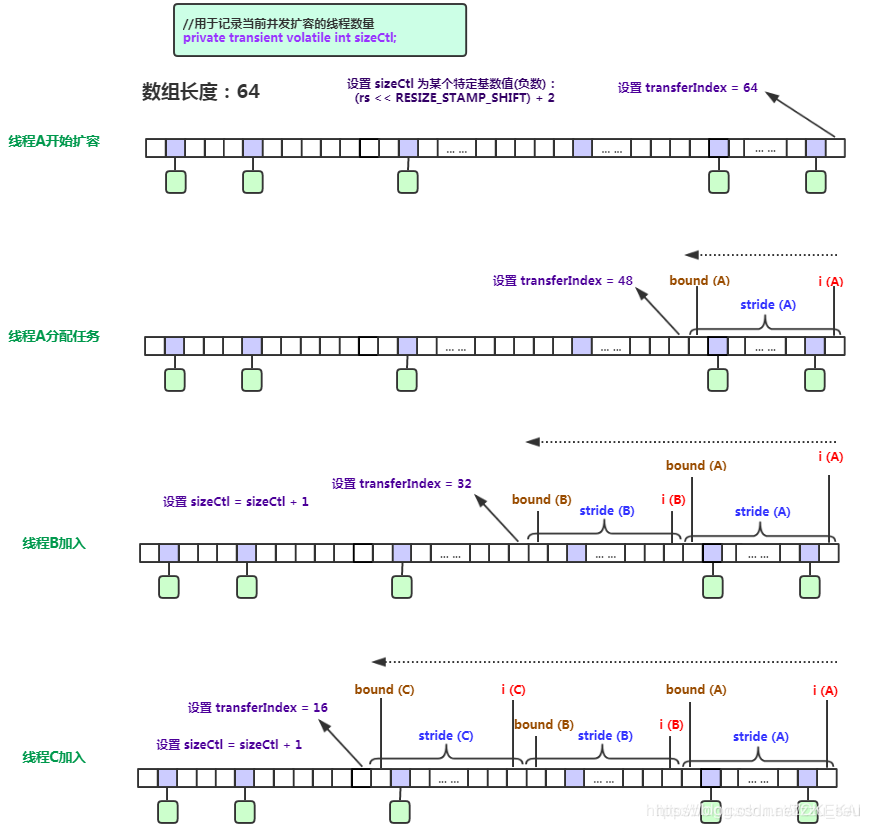

## 14.4 JDK1.7与JDK1.8中ConcurrentHashMap的区别

主要区别如下：

- 保证线程安全机制不同。JDK1.7中使用分段锁保证并发安全，即将`table`划分为一个个`Segment`（继承自`ReentrantLock`），对`segment`进行加锁。JDK1.8中取消了分段锁机制，采用CAS+`synchronized`保证并发安全，加锁也只是对单个结点进行加锁，提高了并发性能。
- 元素个数统计的实现不同。JDK1.8中增加了`CounterCell`来帮忙计数，而JDK1.7中是`put`的时候每个`Segment`内部计数，统计的时候遍历每个`Segment`对象加锁进行统计。
- 底层数据结构不同。JDK1.7使用数组+链表实现哈希表，而在JDK1.8中，使用数组+链表+红黑树实现哈希表。当链表元素个数大于8，且数组长度大于64时，将链表转换为红黑树。

**参考资料**：

[深入解析ConcurrentHashMap：感受并发编程智慧](https://juejin.cn/post/6904078580129464334)

[ConcurrentHashMap底层详解(图解扩容)（JDK1.8）](https://blog.csdn.net/zzu_seu/article/details/106698150