# 1 JVM内存结构？

<!--more-->

JVM的内存结构主要可分为如下五部分：程序计数器、虚拟机栈、本地方法栈、堆以及方法区。其中，前三个是**线程私有**的，后两个是**共享**的。

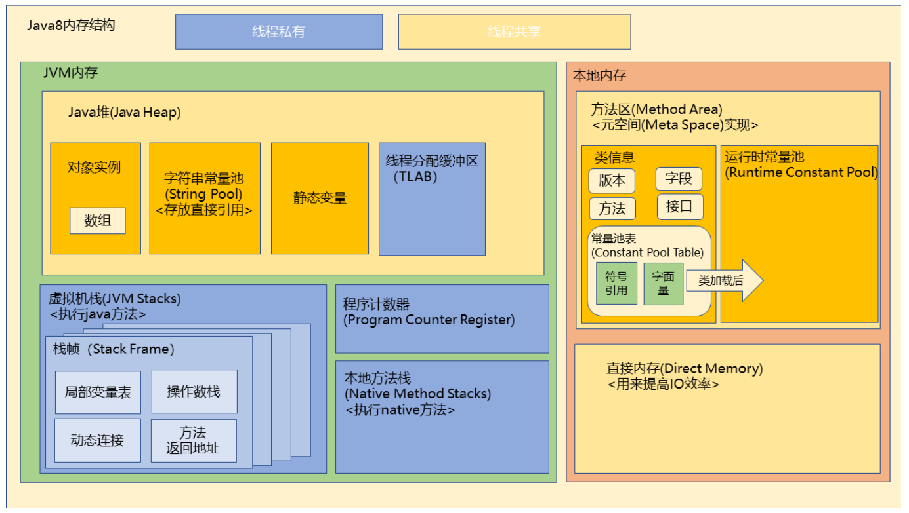

下面我们依次对这几个内存区域进行介绍。

## 1.1 程序计数器

**程序计数器（Program Counter Register）**作用：

- 如果线程正在执行的是一个Java方法，程序计数器记录的是正在执行的虚拟机字节码指令的地址。
- 如果正在执行的是本地（Native）方法，程序计数器则为空（Undefined）。

程序计数器是线程私有的，且是《Java虚拟机规范》中唯一一个没有规定`OutOfMemoryError`情况的区域。

## 1.2 虚拟机栈

**虚拟机栈（Java Virtual Machine Stack）**其实就是**线程运行需要的内存空间**，它描述了Java方法执行的线程内存模型：

- 每个方法被执行的时候，JVM都会同步创建一个栈帧（Stack Frame）用于存储局部变量表、操作数栈、动态连接、方法返回地址等信息。
- 当方法执行完毕时，栈帧就会从虚拟机栈中弹出。
- 每一个方法被调用直至执行完毕的过程，就对应着一个栈帧在虚拟机栈中从入栈到出栈的过程。

与程序计数器一样，Java虚拟机栈也是线程私有的。

在《Java虚拟机》规范中，对这个内存区域规定了两类异常状态：

- 如果线程请求的栈深度大于虚拟机所允许的深度，将抛出`StackOverflowError`异常。
- 如果Java虚拟机栈容量可以动态扩展，当栈扩展时无法申请到足够的内存就会抛出`OutOfMomoryError`异常。

## 1.3 本地方法栈

**本地方法栈（Native Method Stacks）**与虚拟机栈的作用十分相似，其区别在于虚拟机栈为虚拟机执行Java方法服务，而本地方法栈则是为虚拟机执行本地（Native）方法服务。

## 1.4 堆

**Java堆（Java Heap）**是虚拟机所管理的内存中最大的一块，由**所有线程共享**。此内存区域的唯一目的就是**存放对象实例**。

当堆中没有内存空间可分配给实例对象，也无法再扩展时，Java虚拟机将会抛出`OutOfMemoryError`异常。

## 1.5 方法区

**方法区（Method Area**）与Java堆一样，是各个**线程共享**的内存区域，它用于存储已被虚拟机加载的类型信息、常量、静态变量、即时编译器编译后的代码缓存等数据。

JDK8中废弃了永久代的概念，将方法区由堆中的永久代迁移到了本地内存中的**元空间**，而**静态变量和字符串常量池等被放入了堆中**。

根据《Java虚拟机规范》的规定，如果方法区无法满足新的内存分配需求时，将抛出`OutOfMemoryError`异常。

## 1.6 运行时常量池

**运行时常量池（Runtime Constant Pool）**是方法区的一部分。Class文件中除了有类的版本、字段、方法、接口等描述信息外，还有一项信息是**常量池表（Constant Pool Table）**，用于存放编译期生成的各种**字面量**与**符号引用**。这部分内容将在类加载后存放到方法区的运行时常量池中。

- **字面量**：基本数据类型、字符串类型常量。
- **符号引用**：类、字段、方法、接口等的符号引用。

一般来说，除了保存Class文件中描述的符号引用外，还会把由符号引用翻译出来的**直接引用**也存储在运行时常量池中。

运行时常量池是方法区的一部分，自然受到方法区内存的限制，当常量池无法再申请到内存中会抛出`OutOfMemoryError`异常。

# 2 Java对象的创建过程？

1. **检查对应的类是否已加载**。
   当Java虚拟机遇到一条字节码`new`指令时，首先先去检查这个指令的参数是否能在运行时常量池中定位到一个类的符号引用，并且检查这个符号引用代表的类是否已经被加载、解析和初始化过。如果没有，则必须先执行相应的类加载过程。

2. **类加载检查通过后，虚拟机将会为新生对象分配内存**。
   对象所需内存的大小在类加载完成后便可完全确定，为对象分配空间的任务实际上便等同于把一块确定大小的内存块从Java堆中划分出来。通常有以下两种内存分配方式：

   - 如果Java堆中内存规整，使用**指针碰撞（Bump The Pointer）**。所有被使用过的内存都被放在一边，空闲的内存被放在另一边，中间放着一个指针作为分界点的指示器。那么分配内存就仅仅是把那个指针向空闲空间方向挪动一段与对象大小相等的距离即可。
   - 如果Java堆中内存不规整，使用**空闲列表（Free List）**。由于内存并不规整，已被使用的内存和空闲的内存相互交错在一起，所以无法再使用指针碰撞进行内存分配。虚拟机维护了一个列表，记录哪些内存块是可用的，在分配的时候从列表中找到一块足够大的空间划分给对象实例，并更新列表上的记录。

   另外，由于Java堆是线程共享的，因此在分配内存的过程中可能会出现并发安全问题。对于这一问题，JVM为每个线程在Java堆中预先分配了一小块内存，称为**本地线程分配缓冲（Thread Local Allocation Buffer，TLAB）**。

   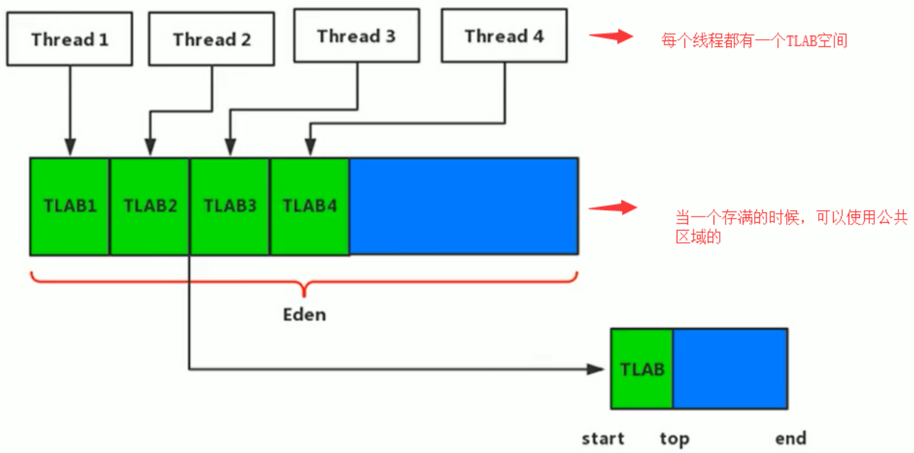
   哪个线程要分配内存，就在哪个线程的本地缓冲区中分配。当本地缓冲区用完了，JVM会为该线程分配新的本地缓冲区，并使用CAS配上失败重试的方式保证更新操作的原子性。

3. **内存分配完成后，虚拟机必须将分配到的内存空间（不包括对象头）都初始化为零值**。
   这步操作保证了对象实例字段在Java代码中可以不赋初始值就直接使用，使程序能访问到这些字段的数据类型所对应的零值。

4. **对对象头进行必要的设置**。

5. **执行构造函数对对象进行初始化**。

# 3 如何判断对象可以被回收？

常见的判断对象是否可以被回收的算法有两种：

- 引用计数算法
- 可达性分析算法

下面我们分别介绍一下这两种算法。

## 3.1 引用计数算法

**引用计数（Reference Counting）**算法通常在对象中添加一个引用计数器，每当有一个地方引用它时，计数器值就加一；当引用失效时，计数器值就减一；任何时刻计数器为零的对象就是不可能再被使用的。也就是说当计数器值为0时，该对象是可以被回收掉的。

但是单纯的引用计数很难解决对象之间相互循环引用的问题。比如A对象引用了B对象，B对象也引用了A对象，除此之外，这两个对象再无任何引用。实际上，这两个对象已经不可能再被访问，但是它们因为互相引用着对方，导致它们的引用计数都不为0，引用计数算法也就无法回收它们。

Java虚拟机并没有采用引用计数算法来判断哪些对象可以回收，而是使用了另外一种算法——可达性分析算法。

## 3.2 可达性分析算法

**可达性分析（Reachability Analysis）**算法的基本思路就是通过一系列称为"GC Roots"的根对象作为起始结点集，从这些结点开始，根据引用关系向下搜索，搜索过程所走过的路径称为**“引用链”（Reference Chain）**，如果某个对象到GC Roots间没有任何引用链相连，即GC Roots到这个对象是不可达的，则此对象不可能再被使用，应该被回收掉。

GC Roots对象主要包括以下几种：

- 虚拟机栈中引用的对象
- 本地方法栈中引用的对象
- 堆中类静态属性引用的对象
- 字符串常量池（String Table）中引用的对象
- 同步锁（`synchronized`关键字）持有的对象

# 4 Java中的引用？

Java中的引用分为强引用（Strongly Reference）、软引用（Soft Reference）、弱引用（Weak Reference）以及虚引用（Phantom Reference）4种，这4种引用强度依次逐渐减弱。

- **强引用（Strongly Reference）**：无论任何情况下，只要强引用关系还存在，垃圾收集器就永远不会回收掉被引用的对象。
- **软引用（Soft Reference）**：如果在垃圾回收后仍未释放出足够的内存，会进行二次垃圾回收，将软引用对象作为垃圾回收掉。
- **弱引用（Weak Reference）**：被弱引用关联的对象只能生存到下一次垃圾收集发生为止。当垃圾收集器开始工作，无论当前内存是否足够，都会回收掉只被弱引用关联的对象。
- **虚引用（Phantom Reference）**：虚引用是最弱的一种引用关系，一个对象是否有虚引用的存在，完全不会对其生存时间构成影响，也无法通过虚引用来取得一个对象实例。为一个对象设置虚引用关联的唯一目的只是为了能在这个对象被垃圾收集器回收时收到一个系统通知。

# 5 垃圾收集算法？

目前JVM中比较常见的三种垃圾收集算法有：

- 标记-清除（Mark-Sweep）算法
- 复制算法
- 标记-整理（Mark-Compact）算法

下面依次对这几个算法进行介绍。

## 5.1 标记-清除算法

标记-清除算法分为**标记**和**清除**两个阶段：首先标记出所有需要回收的对象，在标记完成后，统一回收掉所有被标记的对象。

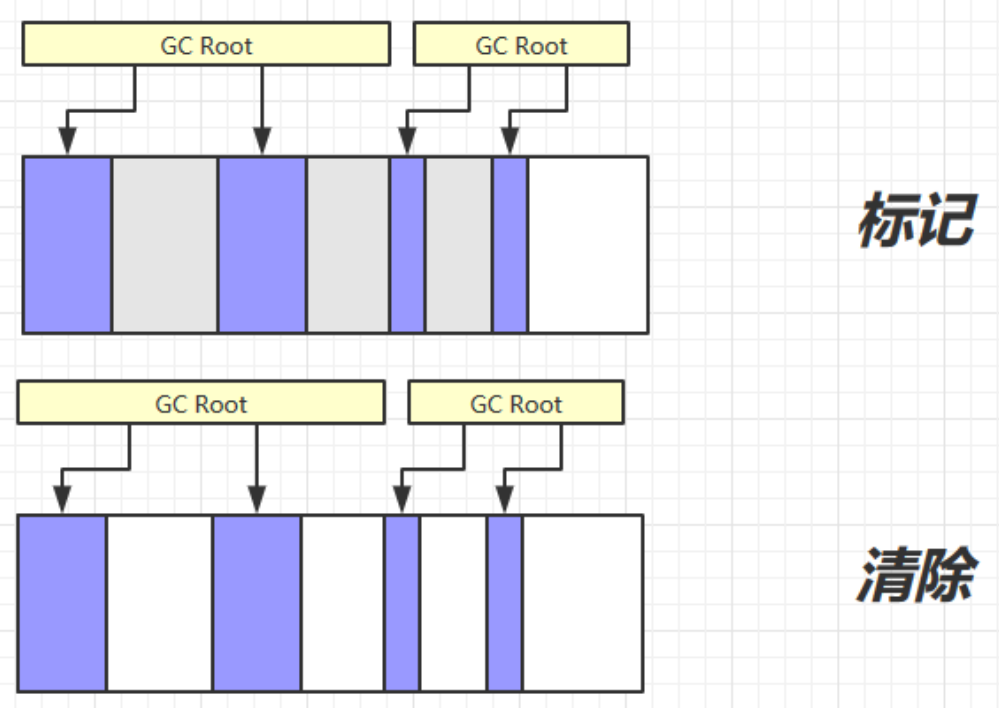

标记-清除算法的主要缺点有两个：

- **执行效率不稳定**，标记和清除两个过程的执行效率都随对象数量的增长而降低。
- **会产生大量不连续的内存碎片**，导致无法给大对象分配内存。

## 5.2 复制算法

复制算法将可用内存按容量划分为大小相等的两块，每次只使用其中的一块。当这一块的内存用完了，就将还存活着的对象复制到另外一块上面，然后清理该内存块的内存空间，并交换两块内存的角色。

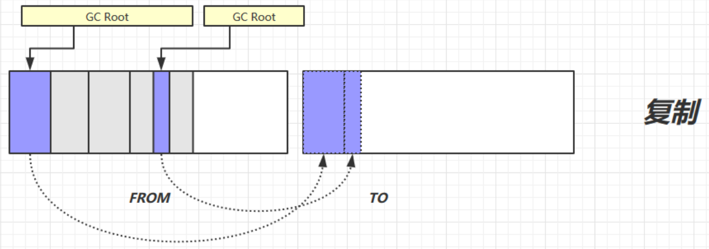

复制算法适用于存活对象较少的情况，如果内存中多数对象都是存活的，这种算法就会产生大量的内存间复制的开销。

优点：**不会产生内存碎片**。

缺点：**将可用内存缩小为了原来的一半**。

## 5.3 标记-整理算法

标记-整理算法的标记过程与标记-清除算法一样，但后续步骤不是直接对可回收对象进行清理，而是让所有存活的对象都向内存空间一端移动，然后直接清理掉边界以外的内存。

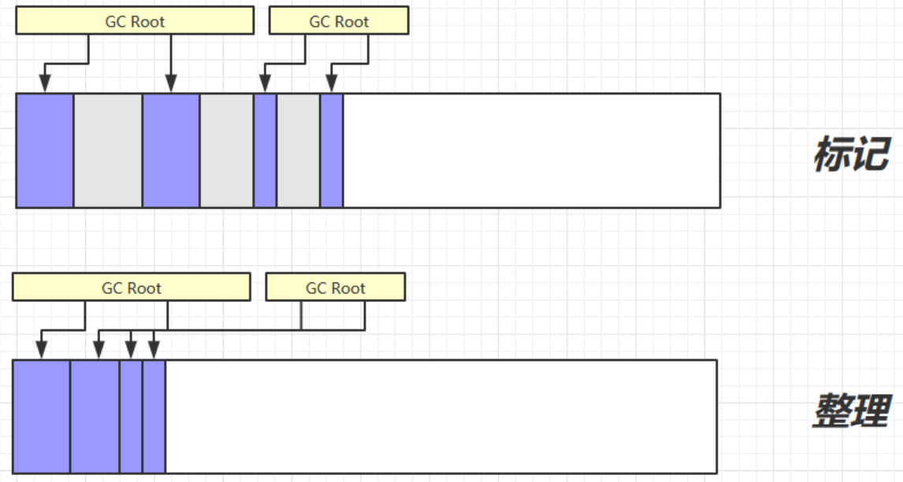

优点：不会产生内存碎片。

缺点：需要移动大量对象，处理效率比较低。

# 6 JVM分代？

在Java中，堆被划分为两个不同的区域：新生代（Young Generation）、老年代（Old Generation）。

新生代又被划分为三个区域：Eden、From Survivor、To Survivor。

新生代与老年代大小比例默认为$1:2$，该值可以通过参数`-XX:NewRatio`来指定（设置老年代与新生代的比例），例如默认`-XX:NewRatio=2`。

Eden和Survivor大小比例默认为$8:1:1$，该值可以通过参数`-XX:SurvivorRatio`来指定（设置Eden与一个Survivor的比例），例如默认`-XX:SurvivorRatio=8`。

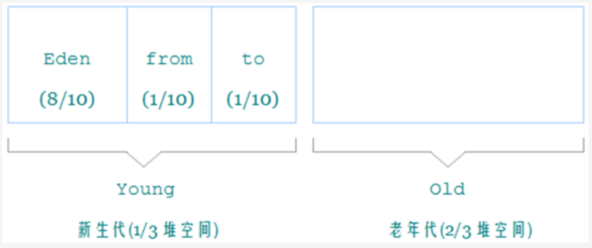

需要注意的是，虽然上述参数默认值是这么指定的，但是实际上不一定生效，堆中具体的内存划分还是要看使用的垃圾收集器。

新生代与老年代通常使用不同的垃圾收集算法：

- 新生代使用：标记-复制算法
- 老年代使用：标记-清除算法或者标记-整理算法

新生代中的大部分对象都是“朝生夕死”的，能够存活下来的对象很少，所以使用标记-复制算法并不会产生很大的内存间复制的开销。而在老年代中存放的大都是存活时间较长的对象，使用标记-复制算法会产生极大的内存间复制的开销，且标记-复制算法还会浪费一半的内存空间，因此不适合在老年代使用。

# 7 分代垃圾回收策略？

## 7.1 名词定义

在介绍分代垃圾回收之前，先统一定义一下相关名词：

- 部分收集（Partial GC）：指目标不是完整收集整个Java堆的垃圾收集，其中又分为：
  - 新生代收集（Minor GC）：指目标只是新生代的垃圾收集。
  - 老年代收集（Major GC）：指目标只是老年代的垃圾收集。目前只有CMS收集器会有单独收集老年代的行为。
  - 混合收集（Mixed GC）：指目标是收集整个新生代以及部分老年代的垃圾收集。目前只有G1收集器会有这种行为。
- 整堆收集（Full GC）：收集整个Java堆和方法区的垃圾收集。

## 7.2 回收策略

JVM中分代垃圾回收的大致策略如下：

- **对象优先分配在Eden**。
- Eden空间不足时，触发Minor GC，将Eden和from幸存区中存活的对象复制到to幸存区中，清空Eden和from幸存区的内存。令存活的对象年龄加1，并交换from幸存区和to幸存区。
- 当对象寿命超过阈值时，会晋升到老年代，最大寿命为15（Mark Word中存储对象寿命的字段只有4字节）。

## 7.3 晋升老年代情况

在以下几种情况下，对象会晋升到老年代：

- **长期存活的对象进入老年代**。对象在Eden出生并经过Minor GC仍然存活，将移动到幸存区中，年龄增加1岁，当对象年龄超过一定阈值之后将移动到老年代中。
  `-XX:MaxTenuringThreshold`：定义年龄的阈值，Mark Word中用4个字节存储，所以最大值为15，默认值也是15。

- **大对象直接进入老年代**。大对象指需要大量连续内存空间的Java对象，最典型的大对象就是很长的字符串，或者元素数量很庞大的数组。大对象出现在Eden有如下缺点：

  - 出现大对象容易导致内存还有不少空间时就提前触发垃圾收集，以获取足够的连续空间分配给大对象。
  - 大对象会带来巨大的内存复制开销。

  `-XX:PretenureSizeThreshold`：大于此值的对象直接在老年代分配。

- **动态对象年龄判定**。如果在幸存区中相同年龄所有对象大小的总和大于幸存区的一半，年龄大于或等于该年龄的对象就可以直接进入老年代，无需等到`-XX:MaxTenuringThreshold`中要求的年龄。

- **空间分配担保**。当幸存区的内存大小不足以装下一次Minor GC所有存活对象时，就会将幸存区放不下的对象放入老年代。

## 7.4 空间分配担保

空间分配担保：

- 在发生Minor GC之前，虚拟机必须先检查老年代最大可用的连续空间是否大于新生代所有对象总空间，如果这个条件成立，那这一次Minor GC可以确保是安全的。
- 如果不成立，则虚拟机会先查看`-XX:HandlePromotionFailure`参数的设置值是否允许担保失败（Handle Promotion Failure）。
  - 如果允许，那会继续检查老年代最大可用的连续空间是否大于历次晋升到老年代的对象大小，如果大于，将尝试进行一次Minor GC，尽管这次Minor GC是有风险的。
  - 如果小于，或者`-XX:HandlePromotionFailure`设置不允许冒险，那这时就要改为进行一次Full GC。

为什么要有空间分配担保？

当新生代中出现大量对象在Minor GC后仍然存活的情况，幸存区中无法容纳所有的存活对象，就需要将幸存区无法容纳的对象直接送入老年代。为了做到这一点，老年代就需要有足够的连续内存空间来容纳这些对象，这也就是为什么要有空间分配担保。

# 8 垃圾回收触发条件

Minor GC触发条件：

- Eden空间满时

Full GC触发条件：

- 调用`System.gc()`。系统建议执行Full GC，但是不必然执行。
- 老年代空间不足。
- 空间分配担保失败。

# 9 什么是OopMap、安全点、安全区域？

## 9.1 OopMap

使用可达性分析算法判断那些对象可以被回收，首先要找到可以作为GC Roots的结点，这一步叫做**根节点枚举**。

OopMap中记录了对象内什么偏移量上是什么类型的数据，以及栈上和寄存器中哪些位置是引用。通过OopMap能够避免根节点枚举时的全栈扫描，加快根节点枚举的速度。

## 9.2 安全点

可能导致引用关系变化，或者说导致OopMap内容变化的指令非常多，如果为每一条指令都生成对应的OopMap，将会需要大量的额外存储空间。因此，HotSpot只是在特定位置记录了这些信息，这些位置就被称为**安全点**。

## 9.3 安全区域

安全区域是指能够确保在某一段代码片段中，**引用关系不会发生变化**，因此，在这个区域中任意地方开始垃圾收集都是安全的。

**参考资料**：

[虚拟机OopMap](https://blog.csdn.net/dyingstarAAA/article/details/88559806)

[JVM-如何判断一段数据是真正的数据，还是对象的引用](https://www.cnblogs.com/plxx/p/4217812.html)

# 10 JVM如何解决跨代引用问题？

## 10.1 跨代引用问题

假如现在要进行一次只局限于新生代区域的垃圾收集（Minor GC），但新生代中的对象是完全有可能被老年代所引用的，为了找出该区域的存活对象，不得不在固定的GC Roots之外，再额外遍历整个老年代中所有对象来确保可达性分析结果的正确性。

遍历整个老年代所有对象的方案虽然理论上可行，但会带来很大的性能负担，为了解决这一问题，就有了记忆集与卡表。

## 10.2 记忆集与卡表

为解决对象跨代引用所带来的问题，垃圾收集器在新生代中建立了名为**记忆集（Remember Set）**的数据结构，用以避免在Minor GC的过程中把整个老年代加进GC Roots扫描范围的情况。

**记忆集**是一种用于记录从非收集区域指向收集区域的指针集合的**抽象数据结构**。而**卡表（Card Table）**则是记忆集的一种**具体实现**。

卡表最简单的形式可以是一个字节数组，**字节数组的每一个元素都对应着其标识的内存区域中一块特定大小的内存块**，这个内存块被称为**卡页（Card Page）**。

- 一个卡页的内存中通常包含不止一个对象，只要卡页内有一个（或更多）对象的字段存在着跨代指针，那就将对应卡表的数组元素的值标识为1，称为这个元素变脏（Dirty），没有则标识为0。
- 在垃圾收集发生时，只要筛选出卡表中变脏的元素，就能得出哪些卡页内存块中包含跨代指针，只需要把它们加入GC Roots的扫描即可，而不需要扫描整个老年代。

在HotSpot虚拟机中是通过**写屏障（Write Barrier）**（这里说的写屏障类似于Spring中的AOP）技术维护卡表状态的。每次在完成**引用字段赋值操作**后，写后屏障都会执行卡表状态更新操作。

[jvm 优化篇-（8）-跨代引用问题(RememberSet、CardTable、ModUnionTable、DirtyCard)](https://www.jianshu.com/p/f1ff4ab0fed7)

# 11 并发标记导致的问题？

## 11.1 三色标记

**三色标记（Tri-color Marking）**将遍历对象图过程中遇到的对象，按照是否访问过这个条件标记为以下三种颜色：

- **白色**：表示对象尚未被垃圾收集器访问过。
  - 在可达性分析刚刚开始的阶段，所有的对象都是白色的。
  - 若在分析结束的阶段，仍然是白色的对象，即代表不可达。
- **黑色**：表示对象已经被垃圾收集器访问过，且这个对象的所有引用都已经被扫描过。
  - 黑色的对象达标已经扫描过，它是安全存活的，如果有其他对象引用指向了黑色对象，无须重新扫描一遍。
  - 黑色对象不可能直接（不经过灰色对象）指向某个白色对象。
- **灰色**：表示对象已经被垃圾收集器访问过，但这个对象上至少存在一个引用还没有被扫描过。

## 11.2 并发标记导致的问题

当Stop The World（STW）时，引用关系是不会发生变化的，因此在标记过程中不会出现任何问题。而在并发标记时（即用户线程与垃圾收集器并发工作），引用关系可能发生改变，在这种情况下就可能出现两种后果：

- 把原本消亡的对象标记为存活。这种其实是可以容忍的，下次收集清理掉就好。
- 把原本存活的对象标记为已消亡。这种就非常致命了，程序会因此发生错误。

因此，只需要处理第二种情况，确保程序不会出现错误即可。

理论上已经证明，当且仅当以下两个条件同时满足时，会产生“对象消失”的问题，即原本应该是黑色的对象被误标为白色（把原本存活的对象标记为已消亡）。

- 赋值器插入了一条或多条从黑色对象到白色对象的新引用（被黑色对象引用的对象不会再被扫描）。
- 赋值器删除了全部从灰色对象到该白色对象的直接或间接引用。

因此，我们要解决并发标记时的对象消失问题，只需破坏这两个条件的任意一个即可。由此分别产生了两种解决方案：**增量更新（Incremental Update）**和**原始快照（Snapshot At The Beginning，SATB）**。下面分别介绍一下这两种解决方案。

## 11.3 增量更新

增量更新要破坏的是第一个条件，当黑色对象插入新的指向白色对象的引用关系时，就将这个新插入的引用记录下来。等并发标记结束之后，再以这些记录过的引用关系中的黑色对象为根，重新扫描一次。

这可以简化理解为，黑色对象一旦新插入了指向白色对象的引用之后，它就变回灰色对象了。

## 11.4 原始快照

原始快照要破坏的是第二个条件，当灰色对象要删除指向白色对象的引用关系时，就将这个要删除的引用记录下来，在并发标记结束之后，再以这些记录过的引用关系中的灰色对象为根，重新扫描一次。

这可以简化理解为，无论引用关系删除与否，都会按照刚刚开始扫描那一刻的对象图快照来进行搜索。

以上无论是对引用关系记录的插入还是删除，虚拟机的记录操作都是通过**写屏障**实现的。

## 11.5 总结

垃圾收集器解决并发标记下的垃圾消失问题：

- CMS收集器通过增量更新算法实现。
- G1收集器通过原始快照（SATB）算法实现。

# 12 JVM中有哪些垃圾收集器？

在介绍JVM中的垃圾收集器之前，有必要解释一下“并行”和“并发”两个名词。并行和并发都是并发编程中的专业名词，在谈论垃圾收集器的上下文语境中，他们可以理解为：

- **并行（Parallel）**：并行描述的是**多条垃圾收集器线程之间的关系**，说明同一时间有多条这样的线程在协同工作，**通常默认此时用户线程是处于等待状态**。
- **并发（Concurrent）**：并发描述的是**垃圾收集器线程与用户线程之间的关系**，说明**同一时间垃圾收集器线程与用户线程都在运行**。由于用户线程并未被冻结，所以程序仍然能响应服务请求，但由于垃圾收集器线程占用了一部分系统资源，此时应用程序的处理的吞吐量将受到一定影响。

## 12.1 Serial与Serial Old

Serial：新生代单线程收集器，它在进行垃圾收集时，必须暂停其他所有工作线程，直到它收集结束（Stop The World，STW）。采用**复制**算法。

Serial Old：Serial的老年代版本，采用**标记-整理**算法。

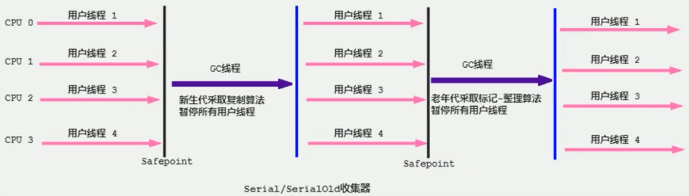

## 12.2 ParNew

ParNew用于新生代，是Serial的多线程版本（并行收集），并且在控制参数、收集算法、Stop The World、对象分配规则、回收策略等都与Serial收集器完全一致。

## 12.3 Parallel Scavenge与Parallel Old

Parallel Scavenge：新生代的收集器，与ParNew类似，也是复制算法，并行多线程收集。

Parallel Old：Parallel Scavenge收集器的老年代版本，支持多线程并发收集，标记-整理算法。

Parallel Scavenge收集器的特点是它的关注点与其他收集器不同，CMS等收集器的关注点是尽可能地缩短垃圾收集时用户线程的停顿时间，而Parallel Scavenge收集器的目标则是**达到一个可控制的吞吐量（Throughput）**，所以它也经常被称作“吞吐量优先收集器”。所谓吞吐量就是处理器用于运行用户代码的时间与处理器总消耗时间的比值。

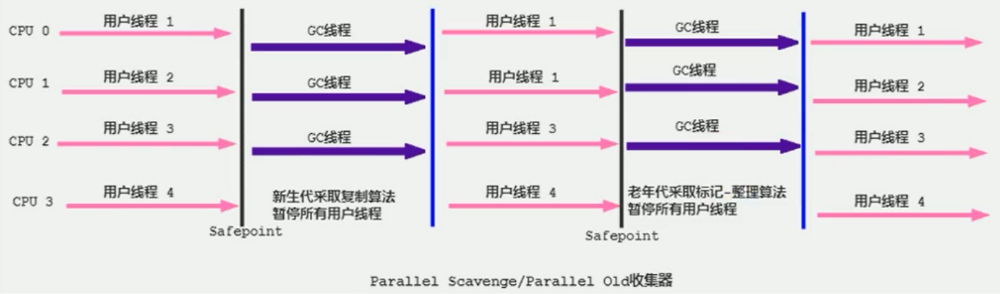

## 12.4 CMS

CMS（Concurrent Mark Sweep）工作在**老年代**，并发收集、使用**标记-清除**算法，其最大特点是让**垃圾收集线程与用户线程同时工作**。CMS的关注点是尽可能缩短垃圾收集时用户线程的停顿时间。

CMS的工作流程如下：

- **初始标记（CMS initial mark）**：需要STW，仅仅标记一下GC Roots能直接关联到的对象，速度很快。
- **并发标记（CMS concurrent mark）**：从GC Roots的直接关联对象开始遍历整个对象图，这个过程耗时较长但是不需要停顿用户线程。
- **重新标记（CMS remark）**：需要STW，修正并发标记期间，因用户程序继续运作而导致标记产生变动的那一部分对象的标记记录（使用**增量更新**解决并发标记下的对象消失问题）。
- **并发清除（CMS concurrent sweep）**：清除之前所标记的可回收对象，不需要移动存活对象，所以用户线程仍然可以正常工作，不需要停顿。

缺点：

- **吞吐量降低**。在并发阶段，CMS虽然不会导致用户线程停顿，但却会因为占用了一部分线程（或者说处理器的计算能力）而导致应用程序变慢，降低总吞吐量。
- **无法处理浮动垃圾**。由于CMS无法处理浮动垃圾（Floating Garbage），有可能出现Concurrent Mode Failure失败进而导致另一次完全Stop The World的Full GC产生。
- **标记-清除算法导致的内存碎片**。内存碎片过多时，往往会出现老年代还有很多剩余空间，但就是无法找到足够大的连续空间来分配给大对象，而不得不提前触发一次Full GC的情况。

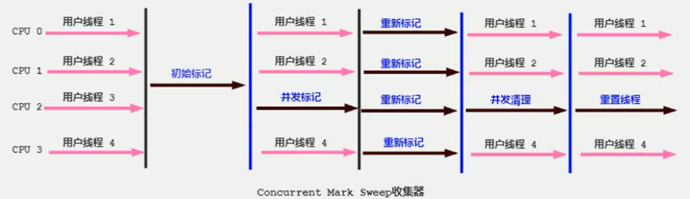

## 12.5 Garbage First

Garbage First（简称G1）应用于**新生代和老年代**，其垃圾收集算法从整体上看是标记-整理算法，两个区域之间是复制算法。Garbage First主要用于多处理器、大内存的场景。

G1开创了**基于Region的堆内存布局**，它不再坚持固定大小及固定数量的分代区域划分，而是把连续的Java堆划分为多个大小相等的独立区域（Region），每一个Region都可以根据需要，扮演新生代的Eden空间、Survivor空间，或者老年代空间。

有了基于Region的堆内存布局，G1可以面向堆内存任何部分来组成回收集（Collection Set，一般简称CSet）进行回收，衡量标准不再是它属于哪个分代，而是哪块内存中存放的垃圾数量最多，回收收益最大，这就是G1收集器的**Mixed GC**模式。

G1收集器的运作过程大致分为以下四个步骤：

- **初始标记（Initial Marking）**：需要STW，标记GC Roots能直接关联到的对象，借用进行Minor GC的时候同步完成，耗时很短。
- **并发标记（Concurrent Marking）**：不需要STW，从GC Roots的直接关联对象开始遍历整个对象图。
- **最终标记（Final Marking）**：需要STW，修正在并发标记期间因用户程序继续运作而导致标记产生变动的那一部分标记记录。
- **筛选回收（Live Data Counting and Evacuation）**：需要STW，指定回收计划进行垃圾回收。

## 12.6 总结

|      收集器       | 串行、并行、并发 | 新生代/老年代 |                      算法                       |     目标     |
| :---------------: | :--------------: | :-----------: | :---------------------------------------------: | :----------: |
|      Serial       |       串行       |    新生代     |                    复制算法                     | 响应速度优先 |
|    Serial Old     |       串行       |    老年代     |                  标记-整理算法                  | 响应速度优先 |
|      ParNew       |       并行       |    新生代     |                    复制算法                     | 响应速度优先 |
| Parallel Scavenge |       并行       |    新生代     |                    复制算法                     |  吞吐量优先  |
|   Parallel Old    |       并行       |    老年代     |                  标记-整理算法                  |  吞吐量优先  |
|        CMS        |       并发       |    老年代     |                  标记-清除算法                  | 响应速度优先 |
|        G1         |       并发       | 新生代+老年代 | 整体上看是标记-整理算法，两个区域之间是复制算法 | 响应速度优先 |

**参考资料**：

[一文了解JVM全部垃圾回收器，从Serial到ZGC](https://juejin.cn/post/6844903685374377998)

# 13 常见JVM调优参数？

|             参数             |               解释               |
| :--------------------------: | :------------------------------: |
|          `-XX:Xms`           |            初始堆大小            |
|          `-XX:Xmx`           |            最大堆大小            |
|          `-XX:Xss`           |       每个线程的栈空间大小       |
|        `-XX:NewRatio`        |   老年代与新生代内存大小的比值   |
|      `-XX:SurviorRatio`      |   Eden与单个Survivor空间的比值   |
|  `-XX:MaxTenuringThreshold`  | 年龄超过此值的对象将会进入老年代 |
| `-XX:PretenureSizeThreshold` |  大于此值的对象直接在老年代分配  |
| `-XX:HandlePromotionFailure` |     是否允许空间分配担保失败     |

# 14 类的生命周期？

一个类从被加载到虚拟机内存中开始，到卸载出内存为止，它的整个生命周期将会以下七个阶段：

- 加载（Loading），加载和连接是交叉进行的。
  - 通过类的全限定名获取定义此类的二进制字节流。
  - 根据字节流在方法区中创建类的元数据。内部采用C++的`instanceKlass`描述java类，它的重要属性有：
    - `_java_mirror`：即Java的类镜像，例如对`String`来说，就是`String.class`，作用是把`klass`暴露给java使用。
    - `_super`：父类
    - `_fields`：成员变量
    - `_methods`：方法
    - `_constants`：常量池
    - `_class_loader`：类加载器
    - `_vtable`：虚方法表
    - `_itable`：接口方法表
  - 在堆中创建一个`java.lang.Class`对象，作为方法区类的元数据的访问入口。
- 连接（Linking）
  - 验证（Verification）：验证载入的字节流是否符合JVM规范。
  - 准备（preparation）：为类的静态变量分配存储空间，并设置为零值。`final`类型的静态变量在这一步不是设置为零值，而是设置为其定义的初始值。
  - 解析（Resolution）：将运行时常量池中的符号引用解析为直接引用。
- 初始化（Initialization）
  - 初始化阶段就是执行类构造器`<clinit>()`方法的过程（这一步才是为非`final`的类静态变量赋初始值）。
  - `<clinit>()`方法是由编译器自动收集类中的所有静态变量的赋值动作和静态语句块（`static{}`块）中的语句合并产生的。顺序由语句在源文件中出现的顺序决定。
- 使用（Using）
- 卸载（Unloading）

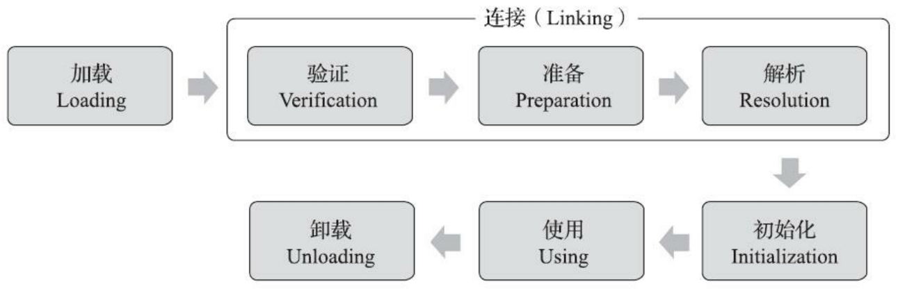

# 15 双亲委派模型

## 15.1 类加载器

类加载器的主要功能就是实现类加载，也就是上面提到的加载、连接以及初始化。JDK8中的类加载器主要有以下几种：

- **启动类加载器（Bootstrap Class Loader）**
  - 用于加载Java核心类库（`<JAVA_HOME>\lib`目录下，且Java虚拟机能够识别的类库）。
  - C/C++实现，无法直接访问。
- **扩展类加载器（Extension Class Loader）**
  - 用于加载`<JAVA_HOME>\lib\ext`目录中所有的类库。
  - 上级为启动类加载器，显示为`null`。
- **应用程序类加载器（Application Class Loader）**
  - 用于加载用户类路径（classpath）中所有的类库。
  - 上级为扩展类加载器
- **自定义类加载器（User Class Loader）**
  - 通过继承`java.lang.ClassLoader`实现。
  - 上级为应用程序类加载器。

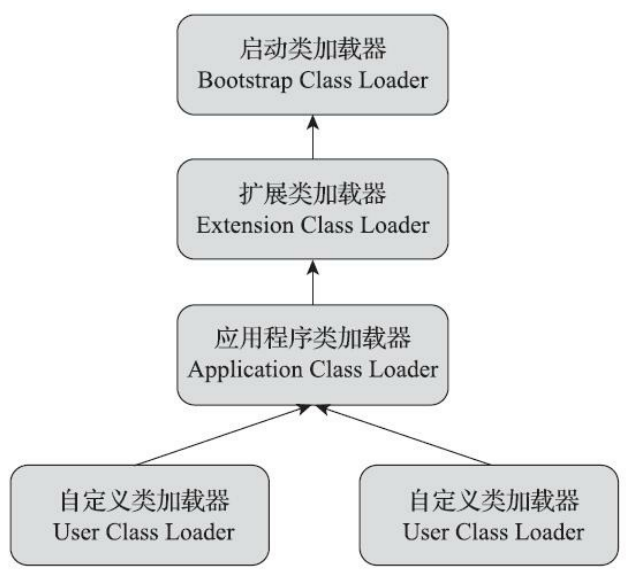

## 15.2 双亲委派模型

**双亲委派模型（Parents Delegation Model）**要求除了顶层的启动类加载器外，其余的类加载器都应有自己的父类加载器。

双亲委派模型的工作过程是：如果一个类加载器收到了类加载的请求，它首先不会自己去尝试加载这个类，而是把这个请求委派给父类加载器去完成，每一个层次的类加载器都是如此，因此所有的加载请求最终都应该传送到最顶层的启动类加载器中，只有当父加载器反馈自己无法完成这个加载请求时，子加载器才会尝试自己去完成加载。

## 15.3 破坏双亲委派模型

破坏双亲委派模型的方式：

- 自定义`ClassLoader`
  - 如果不想破坏双亲委派模型，只需要重写`findClass`方法。
  - 如果想要去破坏双亲委派模型，需要**重写`loadClass`**方法。该方法中实现了双亲委派模型，大致逻辑如下。
    - `loadClass`方法首先检查请求加载的类型是否已经被加载过，如果没有则调用父加载器的`loadClass`方法。
    - 假如父加载器加载失败，抛出`ClassNotFoundException`异常的话，再去调用自己的`findClass`方法。
- 线程上下文类加载器
  - 使用`Thread`类中的`setContextClassLoader`方法设置线程上下文类加载器。
  - 如果没有进行设置的话，线程将继承其父线程的上下文类加载器。
  - Java线程默认的上下文类加载器就是**系统类加载器**。

**参考资料**：

[JVM 线程上下文类加载器](https://juejin.cn/post/6998044832199344142)

# 16 逃逸分析

## 16.1 基本原理

**逃逸分析（Escape Analysis）**并不是直接优化代码的手段，而是为其他优化措施提供依据的分析技术。

逃逸分析的基本原理是：分析对象动态作用域，当一个对象在方法里面被定义后，它可能：

- 被外部方法引用。例如作为调用参数传递给其他方法，称为**方法逃逸**。
- 被外部线程访问到。譬如赋值给可以在其他线程中访问的实例变量，称为**线程逃逸**。

从不逃逸--》方法逃逸--》线程逃逸，称为对象由低到高的不同逃逸程度。

如果能证明一个对象不会逃逸到方法或线程外（即别的方法或线程无法通过任何途径访问到该对象），或逃逸程度比较低（只逃逸出方法而不会逃逸出线程），则可以为这个对象实例采取不同程度的优化。

## 16.2 栈上分配

**栈上分配（Stack Allocations）**：如果确定一个对象不会逃逸出线程之外，那么可以为这个对象在栈上分配内存，而不是在堆中。

使用栈上分配的话，对象所占用的内存空间就可以随栈帧出栈而销毁，而不用进行GC了，垃圾收集的压力将会下降很多。

栈上分配可以允许方法逃逸，但是不允许线程逃逸。

## 16.3 标量替换

**标量替换（Scalar Replacement）**：把一个对象拆散，将其用到的成员变量恢复为原始类型来访问。

- 标量：不可分解的数据，如`int`、`long`等数值类型及`Reference`类型（弱、软、虚等引用）等。
- 聚合量：可以继续分解的数据，如Java中的对象。

假如逃逸分析能够证明一个对象不会被方法外部访问，并且这个对象可以被拆散，那么程序真正执行的时候将可能不去创建这个对象，而改为创建该对象中若干个被这个方法使用的成员变量来代替。

标量替换不允许方法逃逸和线程逃逸。

## 16.4 同步消除

**同步消除（Synchronization Elimination）**：如果逃逸分析能够确定一个变量不会逃逸出线程，无法被其他线程访问，那么这个变量的读写肯定不会有竞争，那么对这个变量加的同步锁就可以安全地消除掉。

同步消除可以允许方法逃逸，但是不允许线程逃逸。

**参考资料**：

[JVM栈上分配对象内存与逃逸分析原理分析（Escape Analysis）](https://bbs.huaweicloud.com/blogs/274124)