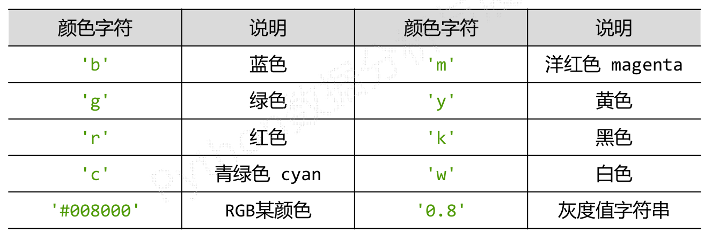

准备
======
<!--more-->
Anaconda的安装见下面的博客
[https://blog.csdn.net/lwplwf/article/details/79162470](https://blog.csdn.net/lwplwf/article/details/79162470)
安装好Anaconda后并没有Anaconda-navigator,按下面的教程进行操作后,就可以使用Anaconda-navigator了.
[https://www.jianshu.com/p/9343ff5de364](https://www.jianshu.com/p/9343ff5de364) 

下面介绍一些Ipython的使用方法


上图中的注意有点不不明白说的啥.
IPython有如下常用命令:


第一章 数据分析之表示
======

1.1 Numpy库入门
------
### 1.1.1 数据的维度
维度:一组数据的组织形式.

一维数据:一维数据由对等关系的有序或无序数据构成,采用线性方式组织.对应于列表、数组和集合等概念.
列表和数组区别:
列表数据类型**可以不同**.
数组数据类型**相同**.

二维数据:二维数据由多个一维数据构成,是一维数据的组合形式.表格是典型的二维数据.

多维数据:多维数据由一维或二维数据在新维度上扩展形成.

高维数据:高维数据仅利用最基本的二元关系展示数据间的复杂结构.
如:


数据维度的Python表示:


### 1.1.2 NumPy的数组对象ndarray
NumPy是一个开源的Python科学计算基础库,同时是Scipy、Pandas等数据处理或科学计算库的基础,包含:

1. 一个强大的N维数组对象 ndarray
2. 广播功能函数
3.  整合C/C++/Fortran代码的工具
4. 线性代数、傅里叶变换、随机数生成等功能

NumPy的引用方法如下:
```py
import numpy as np	#引入模块的别名,约定上使用np
```
Python已有列表类型,为什么还需要一个数组对象(类型)呢?
看下面的示例:

相较于列表,数组有如下优点:

1. 数组对象可以去掉元素间运算所需的循环,使一维向量更像单个数据
2. 设置专门的数组对象,经过优化,可以提升这类应用的运算速度
观察:科学计算中,一个维度所有数据的类型往往相同
3. 数组对象采用相同的数据类型,有助于节省运算和存储空间

下面是一个ndarry的实例:

这里有两个重要的概念.

> 轴(axis):保存数据的维度.从**0轴**开始.如0轴代表第一维度,1轴代表第二维度.
秩(rank):轴的数量,即维度.如上例中的数组秩为2,二维数组.

关于轴的理解可以看看下面的这篇文章
[https://blog.csdn.net/qq_42383041/article/details/86157702](https://blog.csdn.net/qq_42383041/article/details/86157702) 

ndarray对象有如下常用属性:

属性示例如下:
```py
In [1]: import numpy as np

In [2]: a = np.array([[0,1,2,3,4],
   ...:               [9,8,7,6,5]])

In [3]: a.ndim
Out[3]: 2

In [4]: a.shape
Out[4]: (2, 5)

In [5]: a.size
Out[5]: 10

In [6]: a.dtype
Out[6]: dtype('int64')

In [7]: a.itemsize
Out[7]: 8
```

下面介绍一下ndarray中的元素类型:

|数据类型 | 说明 |
| ------ | ------ |
| bool | 布尔类型,True或False | 
| intc | 与C语言中的int类型一致,一般是int32或int64 | 
| intp | 用于索引的整数,与C语言中ssize_t一致,int32或int64 | 
|int8|字节长度的整数,取值:[‐128, 127]|
|int16|16位长度的整数,取值:[‐32768, 32767]|
|int32|32位长度的整数,取值:[‐2<sup>31</sup> , 2<sup>31</sup> ‐1]|
|int64|64位长度的整数,取值:[‐2<sup>64</sup> , 2<sup>64</sup> ‐1]|
|uint8|8位无符号整数,取值:[0, 255]|
|uint16|16位无符号整数,取值:[0, 65535]|
|uint32|32位无符号整数,取值:[0, 2<sup>32</sup> ‐1]
|uint64|64位无符号整数,取值:[0, 2<sup>64</sup> ‐1]
|float16|16位半精度浮点数:1位符号位,5位指数,10位尾数	注:浮点数组成为(符号)尾数*10<sup>指数</sup>|
|float32|32位单精度浮点数:1位符号位,8位指数,23位尾数|
|foat64|64位双精度浮点数:1位符号位,11位指数,52位尾数|
|complex64|复数类型,实部和虚部都是32位浮点数	注:复数为实部(.real) + j虚部(.imag)|
|complex128|复数类型,实部和虚部都是64位浮点数|

下面看一个有趣的例子:
```py
In [9]: x = np.array([[0,1,2,3,4],
   ...:               [9,8,7,6]])

In [10]: x.shape
Out[10]: (2,)

In [11]: x.dtype
Out[11]: dtype('O')	#O代表对象类型

In [12]: x
Out[12]: array([list([0, 1, 2, 3, 4]), list([9, 8, 7, 6])], dtype=object)

In [13]: x.itemsize
Out[13]: 8

In [14]: x.size
Out[14]: 2

#---------------
In [20]: x = np.array([[[0,1],[2,3]],[[4,5]]])

In [21]: x
Out[21]: array([list([[0, 1], [2, 3]]), list([[4, 5]])], dtype=object)
```
关于上面的例子,嵩天老师的描述如下:ndarray数组可以由非同质对象构成,非同质ndarray元素为对象类型,非同质ndarray对象无法有效发挥NumPy优势,尽量避免使用.
上面对于同质的解释是元素类型相同,但是本例中的元素类型是相同的,只是第二维中的元素个数不同,所以我将上例中的不同质理解为各维度中的元素个数不同.

### 1.1.3 ndarray数组的创建和变换
ndarray数组的创建方法有如下四种:

+ 从Python中的列表、元组等类型创建ndarray数组
+ 使用NumPy中函数创建ndarray数组,如:arange, ones, zeros等
+ 从字节流(raw bytes)中创建ndarray数组
+ 从文件中读取特定格式,创建ndarray数组

下面介绍前两种方法:
(1). 从Python中的列表、元组等类型创建ndarray数组.形式如下:
```py
x = np.(list/tuple)
x = np.array(list/tuple,dtype=np.float32)
```
当np.array()不指定dtype时,NumPy将根据数据情况关联一个dtype类型.
示例如下:
```py
In [22]: x = np.array([0,1,2,3])	#从列表类型创建

In [23]: print(x)
[0 1 2 3]

In [24]: x = np.array((4,5,6,7))	#从元组类型创建

In [25]: print(x)
[4 5 6 7]

In [26]: x = np.array([[1,2],[9,8],(0.1,0.2)])	#从列表和元组混和类型创建

In [27]: print(x)
[[1.  2. ]
 [9.  8. ]
 [0.1 0.2]]
```

(2). 使用NumPy中函数创建ndarray数组,如:arange, ones, zeros等

|函数|说明|
|------|------|
|np.arange(n)|类似range()函数,返回ndarray类型,元素从0到n‐1|
|np.ones(shape)|根据shape生成一个全1数组,shape是元组类型|
|np.zeros(shape)|根据shape生成一个全0数组,shape是元组类型|
|np.full(shape,val)|根据shape生成一个数组,每个元素值都是val|
|np.eye(n)|创建一个正方的n*n单位矩阵,对角线为1,其余为0|
|np.ones_like(a)|根据数组a的形状生成一个全1数组|
|np.zeros_like(a)|根据数组a的形状生成一个全0数组|
|np.full_like(a,val)|根据数组a的形状生成一个数组,每个元素值都是val|

示例如下:
```py
In [28]: np.arange(10)
Out[28]: array([0, 1, 2, 3, 4, 5, 6, 7, 8, 9])

In [29]: np.ones((3,6))
Out[29]: 
array([[1., 1., 1., 1., 1., 1.],
       [1., 1., 1., 1., 1., 1.],
       [1., 1., 1., 1., 1., 1.]])

In [30]: np.zeros((3,6),dtype=np.int32)
    ...: 
Out[30]: 
array([[0, 0, 0, 0, 0, 0],
       [0, 0, 0, 0, 0, 0],
       [0, 0, 0, 0, 0, 0]], dtype=int32)

In [31]: np.eye(5)
Out[31]: 
array([[1., 0., 0., 0., 0.],
       [0., 1., 0., 0., 0.],
       [0., 0., 1., 0., 0.],
       [0., 0., 0., 1., 0.],
       [0., 0., 0., 0., 1.]])

In [32]: x = np.ones((2,3,4))

In [33]: print(x)
[[[1. 1. 1. 1.]
  [1. 1. 1. 1.]
  [1. 1. 1. 1.]]

 [[1. 1. 1. 1.]
  [1. 1. 1. 1.]
  [1. 1. 1. 1.]]]

In [34]: x.shape
Out[34]: (2, 3, 4)
```
从上例中可以看出,在不指定数据类型的情况下,ones、zeros与eye函数所生成的数组都为浮点数类型,只有arange函数生成的为整数类型.实际上,numpy中绝大多数函数默认的生成结果都为浮点型.这是因为在科学计算中,绝大多数的数据都为浮点类型.

(3). 使用NumPy中其他函数创建ndarray数组

|函数|说明|
|------|------|
|np.linspace()|根据起止数据等间距地填充数据,形成数组|
|np.concatenate()|将两个或多个数组合并成一个新的数组|

示例如下:
```py
In [36]: a = np.linspace(1,10,4)	#参数含义分别为起始元素、终止元素、生成元素个数

In [37]: a
Out[37]: array([ 1.,  4.,  7., 10.])

In [38]: b = np.linspace(1,10,4,endpoint=False)	#endpoint参数含义是生成元素的中是否包含终止元素,默认包含.

In [39]: b
Out[39]: array([1.  , 3.25, 5.5 , 7.75])

In [40]: c = np.concatenate((a,b))

In [41]: c
Out[41]: array([ 1.  ,  4.  ,  7.  , 10.  ,  1.  ,  3.25,  5.5 ,  7.75])
```

ndarray数组的变换
对于创建后的ndarray数组,可以对其进行维度变换和元素类型变换.

|方法|说明|
|------|------|
|.reshape(shape)|不改变数组元素,返回一个shape形状的数组,原数组不变|
|.resize(shape)|与.reshape()功能一致,但修改原数组|
|.swapaxes(ax1,ax2)|将数组n个维度中两个维度进行调换|
|.flatten()|对数组进行降维,返回折叠后的一维数组,原数组不变|
|.astype(new_type)|ndarray数组的类型变换.astype()方法一定会创建新的数组(原始数据的一个拷贝),即使两个类型一致|
|.tolist()|ndarray数组向列表的转换|

要注意体会上表中函数是否会导致原数组发生改变,这一点在使用中至关重要.
示例如下:
```py
In [42]: a = np.ones((2,3,4),dtype=np.int32)

In [43]: a
Out[43]: 
array([[[1, 1, 1, 1],
        [1, 1, 1, 1],
        [1, 1, 1, 1]],

       [[1, 1, 1, 1],
        [1, 1, 1, 1],
        [1, 1, 1, 1]]], dtype=int32)

In [44]: a.reshape((3,8))
Out[44]: 
array([[1, 1, 1, 1, 1, 1, 1, 1],
       [1, 1, 1, 1, 1, 1, 1, 1],
       [1, 1, 1, 1, 1, 1, 1, 1]], dtype=int32)

In [45]: a
Out[45]: 
array([[[1, 1, 1, 1],
        [1, 1, 1, 1],
        [1, 1, 1, 1]],

       [[1, 1, 1, 1],
        [1, 1, 1, 1],
        [1, 1, 1, 1]]], dtype=int32)

In [46]: a.resize((3,8))

In [47]: a
Out[47]: 
array([[1, 1, 1, 1, 1, 1, 1, 1],
       [1, 1, 1, 1, 1, 1, 1, 1],
       [1, 1, 1, 1, 1, 1, 1, 1]], dtype=int32)

In [48]: a.flatten()
Out[48]: 
array([1, 1, 1, 1, 1, 1, 1, 1, 1, 1, 1, 1, 1, 1, 1, 1, 1, 1, 1, 1, 1, 1,
       1, 1], dtype=int32)

In [49]: a
Out[49]: 
array([[1, 1, 1, 1, 1, 1, 1, 1],
       [1, 1, 1, 1, 1, 1, 1, 1],
       [1, 1, 1, 1, 1, 1, 1, 1]], dtype=int32)

In [50]: a.astype(np.float)
Out[50]: 
array([[1., 1., 1., 1., 1., 1., 1., 1.],
       [1., 1., 1., 1., 1., 1., 1., 1.],
       [1., 1., 1., 1., 1., 1., 1., 1.]])

In [51]: a
Out[51]: 
array([[1, 1, 1, 1, 1, 1, 1, 1],
       [1, 1, 1, 1, 1, 1, 1, 1],
       [1, 1, 1, 1, 1, 1, 1, 1]], dtype=int32)

In [52]: a.tolist()
Out[52]: [[1, 1, 1, 1, 1, 1, 1, 1], [1, 1, 1, 1, 1, 1, 1, 1], [1, 1, 1, 1, 1, 1, 1, 1]]
```

### 1.1.4 ndarray数组的操作(数组的索引和切片)
索引:获取数组中特定位置元素的过程
切片:获取数组元素子集的过程

一维数组的索引和切片:与Python的列表类似
```py
In [55]: a = np.array([9,8,7,6,5])

In [56]: a[2]
Out[56]: 7

In [58]: a[1:4:2]	#起始编号:终止编号:步长.编号0开始从左递增,或从-1开始从右递减.
Out[58]: array([8, 6])
```
多维数组的索引:
```py
In [59]: a = np.arange(24).reshape((2,3,4))

In [60]: a
Out[60]: 
array([[[ 0,  1,  2,  3],
        [ 4,  5,  6,  7],
        [ 8,  9, 10, 11]],

       [[12, 13, 14, 15],
        [16, 17, 18, 19],
        [20, 21, 22, 23]]])

In [61]: a[1,2,3]	#每个维度一个索引值,逗号分割
Out[61]: 23

In [62]: a[0,1,2]
Out[62]: 6

In [63]: a[-1,-2,-3]
Out[63]: 17
```
多维数组的切片:
```py
In [59]: a = np.arange(24).reshape((2,3,4))

In [60]: a
Out[60]: 
array([[[ 0,  1,  2,  3],
        [ 4,  5,  6,  7],
        [ 8,  9, 10, 11]],

       [[12, 13, 14, 15],
        [16, 17, 18, 19],
        [20, 21, 22, 23]]])

In [64]: a[:,1,-3]
Out[64]: array([ 5, 17])

In [65]: a[:,1:3,:]
Out[65]: 
array([[[ 4,  5,  6,  7],
        [ 8,  9, 10, 11]],

       [[16, 17, 18, 19],
        [20, 21, 22, 23]]])

In [66]: a[:,:,::2]
Out[66]: 
array([[[ 0,  2],
        [ 4,  6],
        [ 8, 10]],

       [[12, 14],
        [16, 18],
        [20, 22]]])
```

### 1.1.5 ndarray数组的运算
数组与标量之间的运算:数组与标量之间的运算作用于数组的每一个元素
```py
In [59]: a = np.arange(24).reshape((2,3,4))

In [60]: a
Out[60]: 
array([[[ 0,  1,  2,  3],
        [ 4,  5,  6,  7],
        [ 8,  9, 10, 11]],

       [[12, 13, 14, 15],
        [16, 17, 18, 19],
        [20, 21, 22, 23]]])
        
In [67]: a / 11.5
Out[67]: 
array([[[0.        , 0.08695652, 0.17391304, 0.26086957],
        [0.34782609, 0.43478261, 0.52173913, 0.60869565],
        [0.69565217, 0.7826087 , 0.86956522, 0.95652174]],

       [[1.04347826, 1.13043478, 1.2173913 , 1.30434783],
        [1.39130435, 1.47826087, 1.56521739, 1.65217391],
        [1.73913043, 1.82608696, 1.91304348, 2.        ]]])
```

Numpy中有许多一元函数(对数组进行一元运算的函数),对ndarray中的数据执行元素级运算.


示例如下:
```py
In [68]: a = np.arange(24).reshape((2,3,4))

In [69]: np.square(a)
Out[69]: 
array([[[  0,   1,   4,   9],
        [ 16,  25,  36,  49],
        [ 64,  81, 100, 121]],

       [[144, 169, 196, 225],
        [256, 289, 324, 361],
        [400, 441, 484, 529]]])

In [70]: a = sqrt(a)

In [71]: a
Out[71]: 
array([[[0.        , 1.        , 1.41421356, 1.73205081],
        [2.        , 2.23606798, 2.44948974, 2.64575131],
        [2.82842712, 3.        , 3.16227766, 3.31662479]],

       [[3.46410162, 3.60555128, 3.74165739, 3.87298335],
        [4.        , 4.12310563, 4.24264069, 4.35889894],
        [4.47213595, 4.58257569, 4.69041576, 4.79583152]]])

In [72]: np.modf(a)
Out[72]: 
(array([[[0.        , 0.        , 0.41421356, 0.73205081],
         [0.        , 0.23606798, 0.44948974, 0.64575131],
         [0.82842712, 0.        , 0.16227766, 0.31662479]],
 
        [[0.46410162, 0.60555128, 0.74165739, 0.87298335],
         [0.        , 0.12310563, 0.24264069, 0.35889894],
         [0.47213595, 0.58257569, 0.69041576, 0.79583152]]]),
 array([[[0., 1., 1., 1.],
         [2., 2., 2., 2.],
         [2., 3., 3., 3.]],
 
        [[3., 3., 3., 3.],
         [4., 4., 4., 4.],
         [4., 4., 4., 4.]]]))
```
几乎所有的一元函数都是新生成数组,**原有数组并未被改变**.

二元函数(对数组进行二元运算)如下:

示例如下:
```py
In [73]: a = np.arange(24).reshape(2,3,4)

In [74]: b = np.sqrt(a)

In [75]: a
Out[75]: 
array([[[ 0,  1,  2,  3],
        [ 4,  5,  6,  7],
        [ 8,  9, 10, 11]],

       [[12, 13, 14, 15],
        [16, 17, 18, 19],
        [20, 21, 22, 23]]])

In [76]: b
Out[76]: 
array([[[0.        , 1.        , 1.41421356, 1.73205081],
        [2.        , 2.23606798, 2.44948974, 2.64575131],
        [2.82842712, 3.        , 3.16227766, 3.31662479]],

       [[3.46410162, 3.60555128, 3.74165739, 3.87298335],
        [4.        , 4.12310563, 4.24264069, 4.35889894],
        [4.47213595, 4.58257569, 4.69041576, 4.79583152]]])
        
 In [78]: np.maximum(a,b)	#运算结果为浮点数
Out[78]: 
array([[[ 0.,  1.,  2.,  3.],
        [ 4.,  5.,  6.,  7.],
        [ 8.,  9., 10., 11.]],

       [[12., 13., 14., 15.],
        [16., 17., 18., 19.],
        [20., 21., 22., 23.]]])

In [79]: a > b
Out[79]: 
array([[[False, False,  True,  True],
        [ True,  True,  True,  True],
        [ True,  True,  True,  True]],

       [[ True,  True,  True,  True],
        [ True,  True,  True,  True],
        [ True,  True,  True,  True]]])
```

1.2 NumPy数据存取与函数
------
### 1.2.1 数据的CSV文件存取
CSV(Comma‐Separated Value, 逗号分隔值),CSV是一种常见的文件格式,用来存储批量数据.
下面是CSV文件的一个示例:


下面介绍将数据存为文件和读取文件的函数.
将数据存储为文件:

示例:


读取文件内容:

示例:

CSV文件的局限性:CSV只能有效存储一维和二维数组
np.savetxt() np.loadtxt()只能有效存取一维和二维数组.

### 1.2.2 多维数据的存取
多维数据的存取有两种方式,下面一一介绍.

(1).tofile和fromfile函数
存储数据:

示例:


读取数据:

示例:


需要注意:该方法需要读取时知道存入文件时**数组的维度和元素类型**,a.tofile()和np.fromfile()需要配合使用.可以通过元数据文件来存储额外信息.
这种方法本质上就是将数组存储为一维,读取时再将其变为原来的维度.

(2).NumPy自带的便捷文件存取
函数如下:

其中.savez函数是以压缩文件的格式进行存储(即.npz文件)
示例:


### 1.2.3 NumPy的随机数函数
NumPy的随机数函数子库:

下面对其中常用的一些函数进行介绍:

|函数|说明|
|------|------|
|rand(d0,d1,..,dn)|根据d0~dn创建随机数数组,浮点数,[0,1),均匀分布|
|randn(d0,d1,..,dn)|根据d0~dn创建随机数数组,标准正态分布|
|randint(low[,high,shape])|根据shape创建随机整数或整数数组,默认high是None.如果只有low,那范围就是[0,low).如果有high,范围就是[low,high))|
|seed(s)|随机数种子,s是给定的种子值|

d0的含义是0轴(即第一维)的元素个数,以此类推.其实d0 ~ dn就相当于shape.
示例:
```py
In [80]: a = np.random.rand(3,4,5)

In [81]: a
Out[81]: 
array([[[0.22662045, 0.25631831, 0.30790356, 0.51932004, 0.64856035],
        [0.82989973, 0.61051739, 0.40360202, 0.59764637, 0.87501301],
        [0.8417    , 0.80748835, 0.6747295 , 0.63648347, 0.42931226],
        [0.89915768, 0.18723354, 0.68380006, 0.07626781, 0.84443353]],

       [[0.16311298, 0.86332729, 0.38138595, 0.055526  , 0.79506978],
        [0.11545477, 0.86546936, 0.42165681, 0.56357232, 0.85996555],
        [0.20605459, 0.37012006, 0.31962124, 0.40096934, 0.97501276],
        [0.062199  , 0.50420916, 0.34670515, 0.06486468, 0.46100968]],

       [[0.65423291, 0.81574736, 0.05534948, 0.33177916, 0.77337254],
        [0.46219691, 0.40165095, 0.84071239, 0.5813838 , 0.43413254],
        [0.3870097 , 0.53683081, 0.16817656, 0.92011107, 0.1542574 ],
        [0.97988054, 0.62259954, 0.95180065, 0.61054688, 0.81638157]]])

In [82]: sn = np.random.randn(3,4,5)

In [83]: sn
Out[83]: 
array([[[ 0.73372806,  0.13515669, -0.01620027,  0.85302026,
         -1.4931864 ],
        [ 0.4055326 , -0.63034154, -1.18347299,  0.61070359,
          0.26150965],
        [ 0.06050631, -0.01997448,  1.10764179,  0.84644396,
          0.05650237],
        [ 1.08598832, -0.79604911, -0.73543501, -1.54048532,
         -0.77160571]],

       [[ 0.13706603, -1.31748621,  0.45394846, -1.7014542 ,
         -0.41796209],
        [-1.17817069,  0.17228767, -0.67916395, -1.0091917 ,
         -1.94531352],
        [ 0.90705826,  0.7482295 ,  1.76151093, -0.77923685,
          0.49743821],
        [ 1.5549836 , -0.28256153, -0.2191277 , -0.8942312 ,
         -0.6842405 ]],

       [[ 0.74422174, -0.253692  ,  0.29204143, -1.19581289,
          0.40765978],
        [ 0.94526747,  0.29393822,  0.55004467,  0.07149832,
          0.74824021],
        [ 0.11367535,  0.56535408,  0.54214775,  0.13021652,
          0.218538  ],
        [ 0.24047369, -0.5632706 ,  0.5942279 , -1.0630008 ,
         -0.67039578]]])

In [84]: b = np.random.randint(100,200,(3,4))

In [85]: b
Out[85]: 
array([[128, 157, 162, 185],
       [112, 125, 178, 115],
       [131, 190, 138, 121]])
       
In [86]: np.random.seed(10)

In [87]: np.random.randint(100,200,(3,4))
Out[87]: 
array([[109, 115, 164, 128],
       [189, 193, 129, 108],
       [173, 100, 140, 136]])

In [88]: np.random.seed(10)

In [89]: np.random.randint(100,200,(3,4))
Out[89]: 
array([[109, 115, 164, 128],
       [189, 193, 129, 108],
       [173, 100, 140, 136]])
```

|函数|说明|
|------|------|
|shuffle(a)|根据数组a的第0轴进行随排列,改变数组x|
|permutation(a)|根据数组a的第0轴产生一个新的乱序数组,不改变数组x|
|choice(a[,size,replace,p])|从一维数组a中以概率p抽取元素,形成size形状新数组,replace表示是否可以重用元素,默认为True|

示例:
```py
In [91]: a = np.random.randint(100,200,(3,4))

In [92]: a
Out[92]: 
array([[169, 113, 125, 113],
       [192, 186, 130, 130],
       [189, 112, 165, 131]])

In [93]: np.random.permutation(a)
Out[93]: 
array([[189, 112, 165, 131],
       [169, 113, 125, 113],
       [192, 186, 130, 130]])

In [94]: a
Out[94]: 
array([[169, 113, 125, 113],
       [192, 186, 130, 130],
       [189, 112, 165, 131]])

In [97]: np.random.shuffle(a)

In [98]: a
Out[98]: 
array([[189, 112, 165, 131],
       [169, 113, 125, 113],
       [192, 186, 130, 130]])
       
#---------------------------
In [99]: b = np.random.randint(100,200,(8,))

In [100]: b
Out[100]: array([123, 194, 111, 128, 174, 188, 109, 115])

In [101]: np.random.choice(b,(3,2))
Out[101]: 
array([[111, 123],
       [109, 115],
       [123, 128]])

In [102]: np.random.choice(b,(3,2),replace=False)
Out[102]: 
array([[188, 111],
       [123, 115],
       [174, 128]])

In [103]: np.random.choice(b,(3,2),p=b/np.sum(b))	#数值越大,被选中的概率就越高
Out[103]: 
array([[194, 188],
       [109, 111],
       [174, 109]])
```

|函数|说明|
|------|------|
|uniform(low,high,size)|产生具有均匀分布的数组,low起始值,high结束值,size形状|
|normal(loc,scale,size)|产生具有正态分布的数组,loc均值,scale标准差,size形状|
|poisson(lam,size)|产生具有泊松分布的数组,lam随机事件发生率,size形状|

示例:
```py
In [104]: u = np.random.uniform(0,10,(3,4))

In [105]: u
Out[105]: 
array([[9.83020867, 4.67403279, 8.75744495, 2.96068699],
       [1.31291053, 8.42817933, 6.59036304, 5.95439605],
       [4.36353698, 3.56250327, 5.87130925, 1.49471337]])
       
In [107]: n = np.random.normal(10,5,(3,4))

In [108]: n
Out[108]: 
array([[ 8.17771928,  4.17423265,  3.28465058, 17.2669643 ],
       [10.00584724,  9.94039808, 13.57941572,  4.07115727],
       [ 6.81836048,  6.94593078,  3.40304302,  7.19135792]])
```

### 1.2.4 NumPy的统计函数

|函数|说明|
|------|------|
|sum(a, axis=None)|根据给定轴axis计算数组a相关元素之和,axis整数或元组|
|mean(a, axis=None)|根据给定轴axis计算数组a相关元素的期望,axis整数或元组|
|average(a,axis=None,weights=None)|根据给定轴axis计算数组a相关元素的加权平均值|
|std(a, axis=None)|根据给定轴axis计算数组a相关元素的标准差|
|var(a, axis=None)|根据给定轴axis计算数组a相关元素的方差|

**axis=None 是统计函数的标配参数**.关于axis(轴)对于统计函数运算的影响,可以参考下面的这篇博客.[https://blog.csdn.net/sky_kkk/article/details/79725646](https://blog.csdn.net/sky_kkk/article/details/79725646) 
示例:
```py
In [109]: a = np.arange(15).reshape(3,5)

In [110]: a
Out[110]: 
array([[ 0,  1,  2,  3,  4],
       [ 5,  6,  7,  8,  9],
       [10, 11, 12, 13, 14]])

In [111]: np.sum(a)
Out[111]: 105

In [112]: np.mean(a,axis=1)
Out[112]: array([ 2.,  7., 12.])	

In [113]: np.mean(a,axis=0)
Out[113]: array([5., 6., 7., 8., 9.])	

In [116]: np.average(a,axis=0,weights=[10,5,1])
Out[116]: array([2.1875, 3.1875, 4.1875, 5.1875, 6.1875])	#4.1875 = 2*10+7*5+1*12/(10+5+1)=4.1875

In [117]: np.std(a)
Out[117]: 4.320493798938574

In [118]: np.var(a)
Out[118]: 18.666666666666668

In [119]: a = np.arange(20).reshape(2,2,5)

In [120]: a
Out[120]: 
array([[[ 0,  1,  2,  3,  4],
        [ 5,  6,  7,  8,  9]],

       [[10, 11, 12, 13, 14],
        [15, 16, 17, 18, 19]]])

In [121]: np.sum(a,axis=0)
Out[121]: 
array([[10, 12, 14, 16, 18],
       [20, 22, 24, 26, 28]])
```

|函数|说明|
|------|------|
|min(a)  max(a)|计算数组a中元素的最小值、最大值|
|argmin(a)  argmax(a)|计算数组a中元素最小值、最大值的降为一维后的下标|
|unravel_index(index, shape)|根据shape将一维下标index转换成多维下标|
|ptp(a)|计算数组a中元素最大值与最小值的差|
|median(a)|计算数组a中元素的中位数(中值)|

示例:
```py
In [123]: b = np.arange(15,0,-1).reshape(3,5)

In [124]: b
Out[124]: 
array([[15, 14, 13, 12, 11],
       [10,  9,  8,  7,  6],
       [ 5,  4,  3,  2,  1]])

In [125]: np.max(b)
Out[125]: 15

In [126]: np.argmax(b)
Out[126]: 0

In [127]: np.unravel_index(np.argmax(b),b.shape)
Out[127]: (0, 0)

In [128]: np.ptp(b)
Out[128]: 14

In [129]: np.median(b)
Out[129]: 8.0
```

### 1.2.5 NumPy的梯度函数

|函数|说明|
|------|------|
|np.gradient(f)|计算数组f中元素的梯度,当f为多维时,返回每个维度梯度|

梯度:连续值之间的变化率,即斜率.
XY坐标轴连续三个X坐标对应的Y轴值:a, b, c,其中,b的梯度是: (c‐a)/2.
示例:


第二章 数据分析之展示
======
2.1 Matplotlib库入门
------
Matplotlib库由各种可视化类构成,内部结构复杂,受Matlab启发
matplotlib.pyplot是绘制各类可视化图形的命令子库,相当于快捷方式,matplotlib.pyplot模块的导入如下所示:
```py
import matplotlib.pyplot as plt	#plt是约定的别名
```
下面通过一些例子来学习Matplotlib库的使用
```py
import matplotlib.pyplot as plt

plt.plot([3,1,4,5,2])
plt.ylabel("Grade")	#Y轴名
plt.show()				#绘图
```
上述代码所绘图形如下:

plt.plot()只有一个输入列表或数组时,参数被当作Y轴,X轴以**索引**自动生成.

```py
import matplotlib.pyplot as plt

plt.plot([3,1,4,5,2])
plt.ylabel("Grade")
plt.savefig('test',dpi=600)	#PNG文件
plt.show()
```
plt.savefig()将输出图形存储为文件,默认PNG格式,可以通过dpi修改输出质量.

```py
import matplotlib.pyplot as plt

plt.plot([0,2,4,6,8],[3,1,4,5,2])	#x,y
plt.ylabel("Grade")
plt.axis([-1,10,0,6])	#列表内由左到右分别是X轴起点、终点,Y轴起点、终点.
plt.show()
```
上述代码所绘图形如下:

plt.plot(x,y)当有两个以上参数时,按照X轴和Y轴顺序绘制数据点.

pyplot的绘图区域

其中,nrows为行的数量,ncols为列的数量,plot_number为要定位区域的编号.这三个变量之间逗号可省略,如上图.
示例如下:


### 2.1.1 pyplot的plot()函数
plot()函数的参数如下:

而plot()函数的原型是下面这样的：
```py
def plot(*args, scalex=True, scaley=True, data=None, **kwargs)
```
**\*args接收(x,y,format_string)**，可以接受一组或多组，**上图中\*\*kwargs接受第二组或更多(x,y,format_string)的表述有误**。

format_string: 控制曲线的格式字符串,可选.由**颜色字符(点线的颜色)**、**风格字符(线的样式)**和**标记字符(点的样式)**组成.
三者可以以**任意顺序**组合使用.



示例代码如下:
```py
import matplotlib.pyplot as plt
import numpy as np

a = np.arange(10)
plt.plot(a,a*1.5,'go-',a,a*2.5,'rx',a,a*3.5,'*',a,a*4.5,'b-.')
plt.show()
```
绘制图形如下：


此外，还可以使用\*\*kwargs接收其他的一些参数来实现对图形的更精确的控制，下图中所说\*\*kwargs接受第二组或更多(x,y,format_string)同样表述有误。


### 2.1.2 pyplot的中文显示
pyplot并不默认支持中文显示,因此需要我们采取一些方法.

(1).rcParams修改字体实现
rcParams有如下属性:

中文字体的种类:


示例如下:

rcParams参数储存在字典变量中,通过字典的方式进行访问.

(2). 在有中文输出的地方,增加一个属性:fontproperties
示例:


### 2.1.3 pyplot的文本显示
pyplot的文本显示函数如下:

|函数|说明|
|------|------|
|plt.xlabel()|对X轴增加文本标签|
|plt.ylabel()|对Y轴增加文本标签|
|plt.title()|对图形整体增加文本标签|
|plt.text()|在任意位置增加文本|
|plt.annotate()|在图形中增加带箭头的注解|

示例:
```py
import matplotlib.pyplot as plt
import numpy as np

a = np.arange(0.0,5.0,0.02)
plt.plot(a,np.cos(2*np.pi*a),'r--')

plt.xlabel('横轴: 时间',fontproperties='SimHei',fontsize=15,color='green')
plt.ylabel('纵波: 振幅',fontproperties='SimHei',fontsize=15)
plt.title(r'正弦波实例 $y=cos(2\pi x)$',fontproperties='SimHei',fontsize=15)
plt.text(2,1,r'$\mu=100$',fontsize=15)  #$内为latex表达式

plt.axis([-1,6,-2,2])
plt.grid(True)  #是否显示网格,True表示显示
plt.show()
```
绘制图像如下:


```py
import matplotlib.pyplot as plt
import numpy as np

a = np.arange(0.0,5.0,0.02)
plt.plot(a,np.cos(2*np.pi*a),'r--')

plt.xlabel('横轴: 时间',fontproperties='SimHei',fontsize=15,color='green')
plt.ylabel('纵波: 振幅',fontproperties='SimHei',fontsize=15)
plt.title(r'正弦波实例 $y=cos(2\pi x)$',fontproperties='SimHei',fontsize=15)
#xy表示箭头的起点,xytext表示文字的起点,均为元组形式.shrink参数表示箭头与前后两端的距离
plt.annotate(r'$\mu=100$',xy=(2,1),xytext=(3,1.5),arrowprops=dict(facecolor='black',shrink=0.1,width=2))

plt.axis([-1,6,-2,2])
plt.grid(True)  #是否显示网格
plt.show()
```
绘制图像如下:


### 2.1.4 pyplot的子绘图区域

上面图像外面的小刻度什么都不是,下面的那个ax4才是一个网格的大小.
示例:

此外还可以使用GridSpec类


第三章 数据分析之概要
======
3.1 Pandas库入门
------
### 3.1.1 Pandas库的介绍
Pandas是Python第三方库，提供高性能易用数据类型和分析工具。
导入方法如下：
```py
import pandas as pd
```
**Pandas基于Numpy实现**，常与Numpy和Matplotlib一同使用。

Pandas库中有来两个数据类型：**Series**，**DataFrame**。
此外，还有基于上述类型的各类操作：基本操作、运算操作、特征类操作、关联类操作。
下面我们对NumPy库和Pandas做一个对比：

|Numpy|Pandas|
|------|------|
|基础数据类型|扩展数据类型|
|关注数据的结构表达|关注数据的应用表达|
|维度：数据间关系|数据与索引间关系|

### 3.1.2 Pandas库的Series类型
Series类型由**一组数据**及与之相关的**数据索引**组成。如下：

代码示例如下：
```py
In [1]: import pandas as pd

In [2]: a = pd.Series([9,8,7,6])

In [3]: a
Out[3]: 	# 自动索引
0    9
1    8
2    7
3    6
dtype: int64	# Numpy中数据类型
```
由于Pandas库是基于Numpy库实现的，所以Pandas库中的数据类型实际上就是Numpy中的数据类型，比如上面代码中的int64实际上就是np.int64。
由上面的代码可以看出，在创建Series对象时，会生成一个由0开始的**自动索引**。此外，我们也可以通过下面的方式创建**自定义索引**：
```py
# 通过index参数来自定义索引
In [5]: b = pd.Series([9,8,7,6],index=['a','b','c','d'])

In [6]: b
Out[6]: 	# 自定义索引
a    9
b    8
c    7
d    6
dtype: int64
```
当用**Python列表**创建Series类型时，自定义索引与列表值一一对应，因此，**索引与值的个数应当相同**，否则会报错。
当index参数放在第二位时，可省略index=。

Series类型可以由以下类型创建：
+ Python列表
+ 标量值
+ Python字典
+ ndarray
+ 其他函数

用Python列表创建在前面已经举过例子了，在这里不再多说了，下面举一些其他的例子。

从标量值创建：
```py
In [9]: s = pd.Series(25,index=['a','b','c'])

In [10]: s
Out[10]: 
a    25
b    25
c    25
dtype: int64
```
从**标量值**创建Series类型时，**索引的长度即为Series类型的长度**。
**不能省略index=**。

从字典类型创建：
```py
In [11]: d = pd.Series({'a':9,'b':8,'c':7})

In [12]: d
Out[12]: 
a    9
b    8
c    7
dtype: int64

In [13]: e = pd.Series({'a':9,'b':8,'c':7},index=['c','a','b','d'])

In [14]: e
Out[14]: 
c    7.0
a    9.0
b    8.0
d    NaN
dtype: float64
```
从**字典类型**创建Series类型时，**index从字典中进行选择操作**，对于不存在的补NaN。

从ndarray类型创建：
```py
In [16]: n = pd.Series(np.arange(5))

In [17]: n
Out[17]: 
0    0
1    1
2    2
3    3
4    4
dtype: int64

In [19]: m = pd.Series(np.arange(5),index=np.arange(9,4,-1))

In [20]: m
Out[20]: 
9    0
8    1
7    2
6    3
5    4
dtype: int64
```

综上，Series类型可以由一下类型创建：
+ **Python列表**，index与列表元素**个数一致**
+ **标量值**，index表达Series类型的**尺寸**
+ **Python字典**，键值对中的**“键”是索引**，index从字典中进行**选择操作**
+ **ndarray**，**索引和数据**都可以通过ndarray类型创建。
+ 其他函数，range()函数等。

Series类型包括**index**和**values**两部分，Series类型的操作**类似ndarray类型**,又类似于**Python字典类型**。
示例如下：
```py
In [21]: b = pd.Series([9,8,7,6],['a','b','c','d'])

In [22]: b
Out[22]: 
a    9
b    8
c    7
d    6
dtype: int64

In [23]: b.index	# .index获得索引，索引为Index对象
Out[23]: Index(['a', 'b', 'c', 'd'], dtype='object')

In [24]: b.values	# .values获得数据，数据为ndarray类型
Out[24]: array([9, 8, 7, 6])

In [25]: b['b']	# 自动索引和自定义索引并存
Out[25]: 8

In [26]: b[1]
Out[26]: 8

In [28]: b[['c','d',0]]	# 两套索引并存，但不能混用
Out[28]: 
c    7.0
d    6.0
0    NaN
dtype: float64

In [30]: b[['c','d','a']]
Out[30]: 
c    7
d    6
a    9
dtype: int64
```
从上面的代码可以看出，Series由**index**和**values**两部分组成，index为Index对象，values为ndarray类型。可以理解为Series类型为在ndarray的基础上加了一套索引。
Series类型中**自动索引和自定义索引并存，但不能混用**。

Series类型的**操作类似ndarray类型**：
+ 索引方法相同，采用[]
+ NumPy运算和操作可用于Series类型
+ 可以通过**自定义索引的列表**进行切片，注意是列表
+ 可以通过**自动索引**进行切片，如果存在自定义索引，则一同被切片

示例代码如下：
```py
In [31]: b = pd.Series([9,8,7,6],['a','b','c','d'])

In [32]: b
Out[32]: 
a    9
b    8
c    7
d    6
dtype: int64

In [33]: b[3]	# 利用单个索引取值
Out[33]: 6

In [34]: b[:3]	# 利用自动索引进行切片
Out[34]: 
a    9
b    8
c    7
dtype: int64

In [35]: b[['a','b']]	# 利用自定义索引的列表进行切片
Out[35]: 
a    9
b    8
dtype: int64

In [36]: b[b > b.median()]	#取b中大于中位数的切片
Out[36]: 
a    9
b    8
dtype: int64
```

Series类型的**操作类似Python字典类型**：
+ 通过**自定义索引**访问
+ 保留字**in**操作
+ 使用**.get()**操作

示例代码如下：
```py
In [37]: b = pd.Series([9,8,7,6],['a','b','c','d'])

In [38]: b['b']	# 通过自定义索引访问
Out[38]: 8

In [39]: 'c' in b	# Series类型保留字in只会判断自定义索引，不会判断自动索引。
Out[39]: True

In [40]: 0 in b
Out[40]: False

In [41]: b.get('f',100)	# 返回索引'f'对应的值，如果没有，则返回100
Out[41]: 100
```
可以看出，**Series类型保留字in只会判断自定义索引，不会判断自动索引**。

Series类型**在运算中会自动对齐不同索引的数据**。
示例如下：
```py
In [42]: a = pd.Series([1,2,3],['c','d','e'])

In [44]: b = pd.Series([9,8,7,6],['a','b','c','d'])

In [45]: a + b
Out[45]: 
a    NaN
b    NaN
c    8.0
d    8.0
e    NaN
dtype: float64
```

Series对象和索引都可以有一个名字，存储在属性.name中。
示例如下：
```py
In [46]: b = pd.Series([9,8,7,6],['a','b','c','d'])

In [47]: b.name	# 此时name属性为空

In [48]: b.name = 'Series对象'

In [49]: b.index.name = '索引列'

In [50]: b
Out[50]: 
索引列
a    9
b    8
c    7
d    6
Name: Series对象, dtype: int64
```

Series类型可以**随时修改并即刻生效**。
示例如下：
```py
In [52]: b = pd.Series([9,8,7,6],['a','b','c','d'])

In [53]: b['a'] = 15

In [54]: b.name = 'Series'

In [55]: b
Out[55]: 
a    15
b     8
c     7
d     6
Name: Series, dtype: int64

In [56]: b.name = 'New Series'

In [58]: b['b','c'] = 20	# 不能通过这种方式切片，却能通过这种方式赋值，有趣

In [59]: b
Out[59]: 
a    15
b    20
c    20
d     6
Name: New Series, dtype: int64
```

综上，Series是**一维带“标签”数组**。Series**基本操作类似ndarray和字典，根据索引对齐**。

### 3.1.3 Pandas库的DataFrame类型
DataFrame类型由**共用相同索引的一组列**组成。如下图所示：

上图中的column应该改为columns。
DataFrame是一个表格型的数据类型，每列值类型可以不同。
DataFrame既有**行索引（index）**、也有**列索引（columns）**。行索引的**轴（axis）**为0，列索引的为1。
DaraFrame常用于表达二维数据，但也可以表示多维数据。

DataFrame类型可以由以下类型创建：
+ 二维ndarray对象
+ 由一维ndarray、列表、字典、元组或Series构成的字典
+ Series类型
+ 其他的DataFrame类型

从**二维ndarray对象**创建：
```py
In [60]: d = pd.DataFrame(np.arange(10).reshape(2,5))

In [61]: d	# 自动行索引与自动列索引
Out[61]: 
   0  1  2  3  4
0  0  1  2  3  4
1  5  6  7  8  9
```

从**一维ndarray对象字典**创建：
```py
In [62]: dt = {'one':pd.Series([1,2,3],index=['a','b','c']),
    ...: 'two':pd.Series([9,8,7,6],index=['a','b','c','d'])}

In [63]: d = pd.DataFrame(dt)

In [64]: d	# 自定义行索引与自定义列索引
Out[64]: 
   one  two
a  1.0    9
b  2.0    8
c  3.0    7
d  NaN    6

In [66]: pd.DataFrame(dt,index=['b','c','d'],columns=['two','three'])
Out[66]: 	# 数据根据行列索引自动补齐
   two three
b    8   NaN
c    7   NaN
d    6   NaN
```
之前说过，DataFrame类型由**共用相同索引的一组列**组成。因此采用**Series类型的字典**构建DataFrame类型时，**字典中的Series中作为DataFrame中的列**。

从**列表类型的字典**创建：
```py
In [67]: dl = {'one':[1,2,3,4],'two':[9,8,7,6]}

In [68]: d = pd.DataFrame(dl,index=['a','b','c','d'])

In [69]: d	# 同理，列表也是作为DataFrame中的列
Out[69]: 
   one  two
a    1    9
b    2    8
c    3    7
d    4    6
```

看下面一段代码示例：
```py
In [72]: dl = {'城市':['北京','上海','广州','深圳','沈阳'],
    ...: '环比':[101.5,101.2,101.3,102.0,100.1],
    ...: '同比':[120.7,127.3,119.4,140.9,101.4],
    ...: '定基':[121.4,127.8,120.0,145.5,101.6]}

In [73]: d = pd.DataFrame(dl,index=['c1','c2','c3','c4','c5'])

In [74]: d
Out[74]: 
    城市     环比     同比     定基
c1  北京  101.5  120.7  121.4
c2  上海  101.2  127.3  127.8
c3  广州  101.3  119.4  120.0
c4  深圳  102.0  140.9  145.5
c5  沈阳  100.1  101.4  101.6

In [75]: d.index	# 行索引，Index类型
Out[75]: Index(['c1', 'c2', 'c3', 'c4', 'c5'], dtype='object')

In [76]: d.columns	# 列索引，Index类型
Out[76]: Index(['城市', '环比', '同比', '定基'], dtype='object')

In [77]: d.values	# ndarray类型
Out[77]: 
array([['北京', 101.5, 120.7, 121.4],
       ['上海', 101.2, 127.3, 127.8],
       ['广州', 101.3, 119.4, 120.0],
       ['深圳', 102.0, 140.9, 145.5],
       ['沈阳', 100.1, 101.4, 101.6]], dtype=object)

In [78]: d['同比']	# 取一列，Series类型
Out[78]: 
c1    120.7
c2    127.3
c3    119.4
c4    140.9
c5    101.4
Name: 同比, dtype: float64

In [79]: d.loc['c2']	# 取一行，Series类型
Out[79]: 
城市       上海
环比    101.2
同比    127.3
定基    127.8
Name: c2, dtype: object

In [80]: d['同比']['c2']	# 取单个值
Out[80]: 127.3
```
由上面的代码可以看出，**DataFrame的每一行或每一列均为Series对象**。
并且采用类似d['同比']这种方式来访问DataFrame对象时，所获得的是索引为'同比'的**一列**。如果我们想要获取某行的话该怎么做呢？可以使用.loc或.iloc。下面对其进行介绍。
**.loc**在**自定义索引**的基础上工作。
**.iloc**在**自动索引**上进行工作，因此只能是整数。这里的i就是integer的意思。
下面请看看示例代码：
```py
In [84]: dl = {'城市':['北京','上海','广州','深圳','沈阳'],
    ...: '环比':[101.5,101.2,101.3,102.0,100.1],
    ...: '同比':[120.7,127.3,119.4,140.9,101.4],
    ...: '定基':[121.4,127.8,120.0,145.5,101.6]}
    
In [85]: c = pd.DataFrame(dl,index=[1,2,3,4,5])

In [86]: c
    ...: 
Out[86]: 	# 因为字典中的数据是没有顺序的，所以这里的顺序可能跟字典中的不一样
   城市     环比     同比     定基
1  北京  101.5  120.7  121.4
2  上海  101.2  127.3  127.8
3  广州  101.3  119.4  120.0
4  深圳  102.0  140.9  145.5
5  沈阳  100.1  101.4  101.6

In [87]: c.loc[1]	# 根据自定义索引获取一行
Out[87]: 
城市       北京
环比    101.5
同比    120.7
定基    121.4
Name: 1, dtype: object

In [88]: c.iloc[1]	# 根据自动索引获取一行
Out[88]: 
城市       上海
环比    101.2
同比    127.3
定基    127.8
Name: 2, dtype: object
```

综上，DataFrame是**二维带“标签”数组**。DataFrame基本操作类似Series，依据行列索引。

### 3.1.4 Pandas库的数据类型操作
下面介绍一些改变Series和DataFrame对象的方法：
+ 增加或重排：重新索引
+ 删除：drop

**.reindex()**能够改变或重排Series和DataFrame索引。
示例代码如下：
```py
In [93]: dl = {'城市':['北京','上海','广州','深圳','沈阳'],
    ...: '环比':[101.5,101.2,101.3,102.0,100.1],
    ...: '同比':[120.7,127.3,119.4,140.9,101.4],
    ...: '定基':[121.4,127.8,120.0,145.5,101.6]}

In [94]: d = pd.DataFrame(dl,index=['c1','c2','c3','c4','c5'])

In [95]: d
Out[95]: 
    城市     环比     同比     定基
c1  北京  101.5  120.7  121.4
c2  上海  101.2  127.3  127.8
c3  广州  101.3  119.4  120.0
c4  深圳  102.0  140.9  145.5
c5  沈阳  100.1  101.4  101.6

# 通过指定index来重排
In [98]: d = d.reindex(index=['c5','c4','c3','c2','c1'])

In [99]: d
Out[99]: 
    城市     环比     同比     定基
c5  沈阳  100.1  101.4  101.6
c4  深圳  102.0  140.9  145.5
c3  广州  101.3  119.4  120.0
c2  上海  101.2  127.3  127.8
c1  北京  101.5  120.7  121.4

# 通过指定columns来重排
In [101]: d = d.reindex(columns=['城市','同比','环比','定基'])

In [102]: d
Out[102]: 
    城市     同比     环比     定基
c5  沈阳  101.4  100.1  101.6
c4  深圳  140.9  102.0  145.5
c3  广州  119.4  101.3  120.0
c2  上海  127.3  101.2  127.8
c1  北京  120.7  101.5  121.4
```

.reindex()函数有如下参数：

|参数|说明|
|------|------|
|index, columns|新的行列自定义索引|
|fill_value|重新索引中,用于填充缺失位置的值|
|method|填充方法, 'ffill'前向填充（利用前面的值填充当前值）,'bfill'后向填充（利用后面的值填充当前值）|
|limit|最大填充量|
|copy|默认True,生成新的对象,False时,新旧相等不复制|

下面通过一些例子来看看这些参数的用法：
```py
In [103]: d
Out[103]: 
    城市     同比     环比     定基
c5  沈阳  101.4  100.1  101.6
c4  深圳  140.9  102.0  145.5
c3  广州  119.4  101.3  120.0
c2  上海  127.3  101.2  127.8
c1  北京  120.7  101.5  121.4

# 在列索引的位置4上插入一个'新增'
In [104]: newc = d.columns.insert(4,'新增')

# 置填充值为200
In [105]: newd = d.reindex(columns=newc,fill_value=200)

In [106]: newd
Out[106]: 
    城市     同比     环比     定基   新增
c5  沈阳  101.4  100.1  101.6  200
c4  深圳  140.9  102.0  145.5  200
c3  广州  119.4  101.3  120.0  200
c2  上海  127.3  101.2  127.8  200
c1  北京  120.7  101.5  121.4  200
```

Series和DataFrame的索引是Index类型。**Index对象是不可修改类型**。
Index类型的常用方法如下：

|方法|说明|
|------|------|
|.append(idx)|连接另一个Index对象,产生新的Index对象|
|.diff(idx) |计算差集,产生新的Index对象|
|.intersection(idx) |计算交集,产生新的Index对象|
|.union(idx) |计算并集,产生新的Index对象|
|.delete(loc) |删除loc位置处的元素,产生新的Index对象|
|.insert(loc,e) |在loc位置增加一个元素e,产生新的Index对象|

上面的这些方法均不改变原Index对象的值，而是产生新的Index对象。

示例代码如下：
```py
In [128]: d
Out[128]: 
    城市     同比     环比     定基
c5  沈阳  101.4  100.1  101.6
c4  深圳  140.9  102.0  145.5
c3  广州  119.4  101.3  120.0
c2  上海  127.3  101.2  127.8
c1  北京  120.7  101.5  121.4

In [129]: nc = d.columns.delete(2)	# 删除位置2处的列索引

In [130]: ni = d.index.insert(5,'c0')	# 在行索引的位置5处插入'c0'

In [131]: nd = d.reindex(index=ni,columns=nc).ffill()	# 重新索引，也有.bfill()

In [132]: nd
Out[132]: 
    城市     同比     定基
c5  沈阳  101.4  101.6
c4  深圳  140.9  145.5
c3  广州  119.4  120.0
c2  上海  127.3  127.8
c1  北京  120.7  121.4
c0  北京  120.7  121.4
```
在这里有一个问题，上面In[131]的那句代码，嵩老师是向下面这样写的：
```py
nd = d.reindex(index=ni,columns=nc,method='ffill')
```
这样的话会报下面的错误。ValueError: index must be monotonic increasing or decreasing。具体原因我也不清楚，也没理解这句话的意思。但是只要改为In[131]处的那样就能够正常运行了。
下面还有一段示例代码：
```py
In [133]: d.reindex(index=ni,method='ffill')
Out[133]: 
    城市     同比     环比     定基
c5  沈阳  101.4  100.1  101.6
c4  深圳  140.9  102.0  145.5
c3  广州  119.4  101.3  120.0
c2  上海  127.3  101.2  127.8
c1  北京  120.7  101.5  121.4
c0  北京  120.7  101.5  121.4

# 报错，改为nd = d.reindex(columns=nc).ffill()后正常运行
In [134]: nd = d.reindex(columns=nc,method='ffill')
```
用method参数的话时不时会报错，以后还是不用method参数，用**.ffill()**或**.bfill()**的形式吧。

**.drop()**能够删除Series和DataFrame指定行或列索引。
示例代码如下：
```py
In [136]: d
Out[136]: 
    城市     同比     环比     定基
c5  沈阳  101.4  100.1  101.6
c4  深圳  140.9  102.0  145.5
c3  广州  119.4  101.3  120.0
c2  上海  127.3  101.2  127.8
c1  北京  120.7  101.5  121.4

In [137]: d.drop('c5')	# DataFrame，默认在0轴进行操作
Out[137]: 
    城市     同比     环比     定基
c4  深圳  140.9  102.0  145.5
c3  广州  119.4  101.3  120.0
c2  上海  127.3  101.2  127.8
c1  北京  120.7  101.5  121.4

In [138]: d.drop('同比',axis=1)	# 如果要在1轴上进行操作，须指定axis参数为1
Out[138]: 
    城市     环比     定基
c5  沈阳  100.1  101.6
c4  深圳  102.0  145.5
c3  广州  101.3  120.0
c2  上海  101.2  127.8
c1  北京  101.5  121.4
```
值得注意的是，**DataFrame上的大多数操作都是默认在0轴上进行的**，如果想要对1轴进行操作，需要**指定axis参数为1**。这一点在3.2中表现的尤为明显。
另外，要区分开前面的Index.delete()与这里的.drop()。.delete()方法作用对象为Index对象，而.drop()方法作用于Series和DataFrame对象。

### 3.1.5 Pandas库的数据类型运算
Pandas库有如下的**算术运算法则**：
+ 算术运算**根据行列索引，补齐后运算**，运算**默认产生浮点数**
+ 补齐后缺项填充**NaN（空值）**
+ 二维和一维、一维和零维间为**广播运算**。
+ 采用+  -  \*  /  符号进行的二元运算**产生新的对象**

示例代码如下：
```py
In [3]: a = pd.DataFrame(np.arange(12).reshape(3,4))

In [4]: a
Out[4]: 
   0  1   2   3
0  0  1   2   3
1  4  5   6   7
2  8  9  10  11

In [5]: b = pd.DataFrame(np.arange(20).reshape(4,5))

In [6]: b
Out[6]: 
    0   1   2   3   4
0   0   1   2   3   4
1   5   6   7   8   9
2  10  11  12  13  14
3  15  16  17  18  19

# 自动补齐，缺项补NaN
In [7]: a + b
Out[7]: 
      0     1     2     3   4
0   0.0   2.0   4.0   6.0 NaN
1   9.0  11.0  13.0  15.0 NaN
2  18.0  20.0  22.0  24.0 NaN
3   NaN   NaN   NaN   NaN NaN

In [8]: a * b
Out[8]: 
      0     1      2      3   4
0   0.0   1.0    4.0    9.0 NaN
1  20.0  30.0   42.0   56.0 NaN
2  80.0  99.0  120.0  143.0 NaN
3   NaN   NaN    NaN    NaN NaN
```

此外，在Pandas中还提供了如下的方法形式的运算：

|方法|说明|
|------|------|
|.add(d, **argws) |类型间加法运算,可选参数|
|.sub(d, **argws) |类型间减法运算,可选参数|
|.mul(d, **argws) |类型间乘法运算,可选参数|
|.div(d, **argws) |类型间除法运算,可选参数|

既然能够使用二元运算符进行计算，为什么Pandas还要提供方法形式的运算呢?
这是因为方法形式的运算有一些可选参数，能够满足用户一些特别的需要。
下面看示例代码：
```py
In [9]: a
Out[9]: 
   0  1   2   3
0  0  1   2   3
1  4  5   6   7
2  8  9  10  11

In [10]: b
Out[10]: 
    0   1   2   3   4
0   0   1   2   3   4
1   5   6   7   8   9
2  10  11  12  13  14
3  15  16  17  18  19

# fill_value参数替代NaN，替代后参与运算
In [11]: b.add(a,fill_value=100)
Out[11]: 
       0      1      2      3      4
0    0.0    2.0    4.0    6.0  104.0
1    9.0   11.0   13.0   15.0  109.0
2   18.0   20.0   22.0   24.0  114.0
3  115.0  116.0  117.0  118.0  119.0

In [12]: a.mul(b,fill_value=0)
Out[12]: 
      0     1      2      3    4
0   0.0   1.0    4.0    9.0  0.0
1  20.0  30.0   42.0   56.0  0.0
2  80.0  99.0  120.0  143.0  0.0
3   0.0   0.0    0.0    0.0  0.0
```

不同维度间为**广播运算**，一维Series与DataFrame进行运算时**默认在轴1进行匹配，即按照列匹配，在每一行上进行运算**。
代码示例如下：
```py
In [13]: b = pd.DataFrame(np.arange(20).reshape(4,5))

In [14]: b
Out[14]: 
    0   1   2   3   4
0   0   1   2   3   4
1   5   6   7   8   9
2  10  11  12  13  14
3  15  16  17  18  19

In [15]: c = pd.Series(np.arange(4))

In [16]: c
Out[16]: 
0    0
1    1
2    2
3    3
dtype: int64

# 广播运算
In [17]: c - 10
Out[17]: 
0   -10
1    -9
2    -8
3    -7
dtype: int64

# 广播运算，在轴1上进行匹配
In [18]: b - c
Out[18]: 
      0     1     2     3   4
0   0.0   0.0   0.0   0.0 NaN
1   5.0   5.0   5.0   5.0 NaN
2  10.0  10.0  10.0  10.0 NaN
3  15.0  15.0  15.0  15.0 NaN
```

使用运算方法可以令一维Series参与轴0运算。
示例代码如下：
```py
In [19]: b
Out[19]: 
    0   1   2   3   4
0   0   1   2   3   4
1   5   6   7   8   9
2  10  11  12  13  14
3  15  16  17  18  19

In [20]: c
Out[20]: 
0    0
1    1
2    2
3    3
dtype: int64

# 指定匹配的轴为0,即按照行匹配，在每一列上进行计算
In [21]: b.sub(c,axis=0)
Out[21]: 
    0   1   2   3   4
0   0   1   2   3   4
1   4   5   6   7   8
2   8   9  10  11  12
3  12  13  14  15  16

In [22]: b.sub(c,axis=1)
```

除了算术运算法则外，Pandas库还有如下的**比较运算法则**：
+ 比较运算只能比较相同索引的元素，**不进行补齐**
+ 二维和一维、一维和零维（即常数）间为**广播运算**
+ 采用&gt;    &lt;   &gt;=    &lt;=    ==    !=等符号进行的二元运算符**产生布尔对象**

由于比较运算不进行补齐，因此进行运算的必须是**相同尺寸**,否则会报错。
示例代码如下：
```py
In [23]: a = pd.DataFrame(np.arange(12).reshape(3,4))

In [24]: a
Out[24]: 
   0  1   2   3
0  0  1   2   3
1  4  5   6   7
2  8  9  10  11

In [25]: d = pd.DataFrame(np.arange(12,0,-1).reshape(3,4))

In [26]: d
Out[26]: 
    0   1   2  3
0  12  11  10  9
1   8   7   6  5
2   4   3   2  1

# 同维度运算，尺寸一致
In [27]: a > d
Out[27]: 
       0      1      2      3
0  False  False  False  False
1  False  False  False   True
2   True   True   True   True

In [28]: a == d
Out[28]: 
       0      1      2      3
0  False  False  False  False
1  False  False   True  False
2  False  False  False  False
```

如果是不同维度之间的比较运算，广播运算，对DataFrame类型来说，**默认在1轴进行匹配，即按列匹配，对每行进行运算**。
示例代码如下：
```py
In [31]: a
Out[31]: 
   0  1   2   3
0  0  1   2   3
1  4  5   6   7
2  8  9  10  11

In [32]: c = pd.Series(np.arange(4))

In [33]: c
Out[33]: 
0    0
1    1
2    2
3    3
dtype: int64

# 广播运算，默认按轴1进行匹配
In [34]: a > c
Out[34]: 
       0      1      2      3
0  False  False  False  False
1   True   True   True   True
2   True   True   True   True

# 广播运算
In [35]: c > 0
Out[35]: 
0    False
1     True
2     True
3     True
dtype: bool
```

对于Pandas库，要理解数据类型与索引的关系，**操作索引即操作数据**。对于Pandas上的操作与运算，主要讲了如下几种：重新索引、数据删除、算术运算、比较运算。

3.2 Pandas数据特征分析
------
### 3.2.1 数据的排序
一组数据可以表达一个或多个含义，因此对一组数据的理解也多种多样。如下：

**.sort_index()**方法在指定轴上根据**索引**进行排序，默认升序。该函数的参数如下：
```py
# 默认轴为0,升序
.sort_index(axis=0,ascending=True)
```
示例代码如下：
```py
In [36]: b = pd.DataFrame(np.arange(20).reshape(4,5),index=['c','a','d','b'])

In [37]: b
Out[37]: 
    0   1   2   3   4
c   0   1   2   3   4
a   5   6   7   8   9
d  10  11  12  13  14
b  15  16  17  18  19

In [38]: b.sort_index()
Out[38]: 
    0   1   2   3   4
a   5   6   7   8   9
b  15  16  17  18  19
c   0   1   2   3   4
d  10  11  12  13  14

In [39]: b.sort_index(ascending=False)
Out[39]: 
    0   1   2   3   4
d  10  11  12  13  14
c   0   1   2   3   4
b  15  16  17  18  19
a   5   6   7   8   9

In [40]: c = pd.Series(np.arange(4),index=['c','a','d','b'])

In [41]: c
Out[41]: 
c    0
a    1
d    2
b    3
dtype: int64

In [42]: c.sort_index()
Out[42]: 
a    1
b    3
c    0
d    2
dtype: int64
```

**.sort_values()**方法在指定轴上根据**数值**进行排序，默认升序。
Series与DataFrame中的.sort_values()方法略有不同。如下：
```py
Series.sort_values(axis=0,  ascending=True)

# by为axis轴上的某个索引或索引列表
DataFrame.sort_values(by,  axis=0,  ascending=True)
```
by与axis的关系可能会让人比较迷惑，我在这里说一下。
当axis=0时，**对0轴进行排序，即对行进行排序**，这时需要指定**一个或多个列**，通过该列中的数据大小来对行进行排序。
当axis=1时，**对1轴进行排序，即对列进行排序**，这时需要指定**一个或多个行**，通过该行中的数据大小来对列进行排序
代码如下：
```py
In [44]: b
Out[44]: 
    0   1   2   3   4
c   0   1   2   3   4
a   5   6   7   8   9
d  10  11  12  13  14
b  15  16  17  18  19

# 对0轴排序，指定一列
In [45]: b.sort_values(2,ascending = False)
Out[45]: 
    0   1   2   3   4
b  15  16  17  18  19
d  10  11  12  13  14
a   5   6   7   8   9
c   0   1   2   3   4

# 对1轴排序，指定一行
In [46]: b.sort_values('a',axis=1,ascending=False)
Out[46]: 
    4   3   2   1   0
c   4   3   2   1   0
a   9   8   7   6   5
d  14  13  12  11  10
b  19  18  17  16  15
```

在Pandas库的数据排序中，**NaN统一放到排序末尾**。
示例代码如下：
```py
In [51]: a = pd.DataFrame(np.arange(12).reshape(3,4))

In [52]: b = pd.DataFrame(np.arange(20).reshape(4,5))

In [53]: c = a + b

In [54]: c
Out[54]: 
      0     1     2     3   4
0   0.0   2.0   4.0   6.0 NaN
1   9.0  11.0  13.0  15.0 NaN
2  18.0  20.0  22.0  24.0 NaN
3   NaN   NaN   NaN   NaN NaN

# 降序
In [55]: c.sort_values(2,ascending=False)
Out[55]: 
      0     1     2     3   4
2  18.0  20.0  22.0  24.0 NaN
1   9.0  11.0  13.0  15.0 NaN
0   0.0   2.0   4.0   6.0 NaN
3   NaN   NaN   NaN   NaN NaN

# 升序
In [56]: c.sort_values(2,ascending=True)
Out[56]: 
      0     1     2     3   4
0   0.0   2.0   4.0   6.0 NaN
1   9.0  11.0  13.0  15.0 NaN
2  18.0  20.0  22.0  24.0 NaN
3   NaN   NaN   NaN   NaN NaN
```
可以看到，不管是升序还是降序，NaN均排在最后。

### 3.2.2 数据的基本统计分析
Pandas库中有许多基本的统计分析函数，下面这些均**适用于Series和DataFrame类型**：

|方法|说明|
|------|------|
|.sum() |计算数据的总和,**按0轴计算，下同**|
|.count() |非NaN值的数量|
|.mean() .median()  |计算数据的算术平均值、算术中位数|
|.var()  .std() |计算数据的方差、标准差|
|.min()  .max()  |计算数据的最小值、最大值|
|.describe() |针对0轴(各列)的统计汇总|

此外，还有一些仅适用于Series类型的基本统计分析函数。如下：

|方法|说明|
|------|------|
|.argmin()  .argmax() |计算数据最大值、最小值所在位置的索引位置(自动索引)|
|.idxmin()  .idxmax() |计算数据最大值、最小值所在位置的索引(自定义索引)|

下面重点介绍一下**.describe()**函数。先从Series类型的开始。
**Series类型调用.describe()函数后返回的结果也是Series类型**,因此可以用访问Series对象的方式对其进行访问。
示例代码如下：
```py
In [57]: a = pd.Series([9,8,7,6],index=['a','b','c','d'])

In [58]: a
Out[58]: 
a    9
b    8
c    7
d    6
dtype: int64

In [59]: a.describe()
Out[59]: 
count    4.000000
mean     7.500000
std      1.290994
min      6.000000
25%      6.750000
50%      7.500000
75%      8.250000
max      9.000000
dtype: float64

# 可以看到，Series类型调用.describe()函数后返回的结果也是Series类型
In [60]: type(a.describe())
Out[60]: pandas.core.series.Series

# 由于是Series类型，所以可以用访问Series对象的方式对其进行访问
In [61]: a.describe()['count']
Out[61]: 4.0

In [62]: a.describe()['max']
Out[62]: 9.0
```

DataFrame的.describe()函数：
**DataFrame类型调用.describe()函数后返回的结果也是DataFrame类型**,因此可以用访问DataFrame对象的方式对其进行访问。
示例代码如下：
```py
In [63]: b = pd.DataFrame(np.arange(20).reshape(4,5),index=['c','a','d','b'])

In [64]: b.describe()
Out[64]: 
               0          1          2          3          4
count   4.000000   4.000000   4.000000   4.000000   4.000000
mean    7.500000   8.500000   9.500000  10.500000  11.500000
std     6.454972   6.454972   6.454972   6.454972   6.454972
min     0.000000   1.000000   2.000000   3.000000   4.000000
25%     3.750000   4.750000   5.750000   6.750000   7.750000
50%     7.500000   8.500000   9.500000  10.500000  11.500000
75%    11.250000  12.250000  13.250000  14.250000  15.250000
max    15.000000  16.000000  17.000000  18.000000  19.000000

# DataFrame类型
In [65]: type(b.describe())
Out[65]: pandas.core.frame.DataFrame

# 用操作DataFrame的方式对其进行操作
In [66]: b.describe().loc['max']
Out[66]: 
0    15.0
1    16.0
2    17.0
3    18.0
4    19.0
Name: max, dtype: float64

In [67]: b.describe()[2]
Out[67]: 
count     4.000000
mean      9.500000
std       6.454972
min       2.000000
25%       5.750000
50%       9.500000
75%      13.250000
max      17.000000
Name: 2, dtype: float64
```

### 3.2.3 数据的累计分析
Pandas库中也有许多累计统计分析函数，下面这些均适用于Series和DataFrame类型，**累计计算**：

|方法|说明|
|------|------|
|.cumsum() |依次给出前1、2、...、n个数的和，**按0轴计算，下同**|
|.cumprod() |依次给出前1、2、...、n个数的积|
|.cummax() |依次给出前1、2、...、n个数的最大值|
|.cummin() |依次给出前1、2、...、n个数的最小值|

示例代码如下：
```py
In [68]: b = pd.DataFrame(np.arange(20).reshape(4,5),index=['c','a','d','b'])

In [69]: b
Out[69]: 
    0   1   2   3   4
c   0   1   2   3   4
a   5   6   7   8   9
d  10  11  12  13  14
b  15  16  17  18  19

In [70]: b.cumsum()    # 依次给出前n个数的和
Out[70]: 
    0   1   2   3   4
c   0   1   2   3   4
a   5   7   9  11  13
d  15  18  21  24  27
b  30  34  38  42  46

In [71]: b.cumprod()    # 依次给出前n个数的积
Out[71]: 
   0     1     2     3     4
c  0     1     2     3     4
a  0     6    14    24    36
d  0    66   168   312   504
b  0  1056  2856  5616  9576

In [72]: b.cummax()    # 依次给出前n个数的最大值
Out[72]: 
    0   1   2   3   4
c   0   1   2   3   4
a   5   6   7   8   9
d  10  11  12  13  14
b  15  16  17  18  19

In [73]: b.cummin()    # 依次给出前n个数的最小值
Out[73]: 
   0  1  2  3  4
c  0  1  2  3  4
a  0  1  2  3  4
d  0  1  2  3  4
b  0  1  2  3  4
```

此外，Pandas库中还有一些其他的累计统计分析函数，下面这些均适用于Series和DataFrame类型，**滚动计算（窗口计算）**：

|方法|说明|
|------|------|
|.rolling(w).sum() |依次计算相邻w个元素的和|
|.rolling(w).mean() |依次计算相邻w个元素的算术平均值|
|.rolling(w).var() |依次计算相邻w个元素的方差|
|.rolling(w).std() |依次计算相邻w个元素的标准差|
|.rolling(w).min() .max() |依次计算相邻w个元素的最小值和最大值|

示例代码如下：
```py
In [74]: b
Out[74]: 
    0   1   2   3   4
c   0   1   2   3   4
a   5   6   7   8   9
d  10  11  12  13  14
b  15  16  17  18  19

# 计算相邻2个元素的和，默认在0轴
In [75]: b.rolling(2).sum()
Out[75]: 
      0     1     2     3     4
c   NaN   NaN   NaN   NaN   NaN
a   5.0   7.0   9.0  11.0  13.0
d  15.0  17.0  19.0  21.0  23.0
b  25.0  27.0  29.0  31.0  33.0

# 计算相邻3个元素的和，默认在0轴
In [76]: b.rolling(3).sum()
Out[76]: 
      0     1     2     3     4
c   NaN   NaN   NaN   NaN   NaN
a   NaN   NaN   NaN   NaN   NaN
d  15.0  18.0  21.0  24.0  27.0
b  30.0  33.0  36.0  39.0  42.0
```

### 3.3.4 数据的相关分析
两个事物，表示为X和Y，如何判断它们之间的存在相关性？
相关性：
+ X增大，Y增大，两个变量**正相关**
+ X增大，Y减小，两个变量**负相关**
+ X增大，Y无视，两个变量**不相关**

那么这种相关性又该如何表示出来呢？有下面两种方法。

**协方差**，公式如下：

+ 协方差&gt;0，X和Y正相关
+ 协方差&lt;0， X和Y负相关
+ 协方差=0，X和Y无关

**Pearson相关系数**，公式如下：

r的取值范围为[-1,1]，其取绝对值后的值与相关性有如下的对应关系：
+ 0.8‐1.0 极强相关
+ 0.6‐0.8 强相关
+ 0.4‐0.6 中等程度相关
+ 0.2‐0.4 弱相关
+ 0.0‐0.2 极弱相关或无相关

Pandas库中适用于Series和DataFrame类型的相关分析函数如下：

|方法|说明|
|------|-----|
|.cov() |计算协方差矩阵|
|.corr() |计算相关系数矩阵, Pearson、Spearman、Kendall等系数|

示例代码如下：
```py
In [77]: hprice = pd.Series([3.04,22.93,12.75,22.6,12.33],index=['2008','2009','2010','2011','2012'])

In [78]: m2 = pd.Series([8.18,18.38,9.13,7.82,6.69],index=['2008','2009','2010','2011','2012'])

# 计算相关系数
In [80]: hprice.corr(m2)
Out[80]: 0.5239439145220387
```
3.2节小结：

