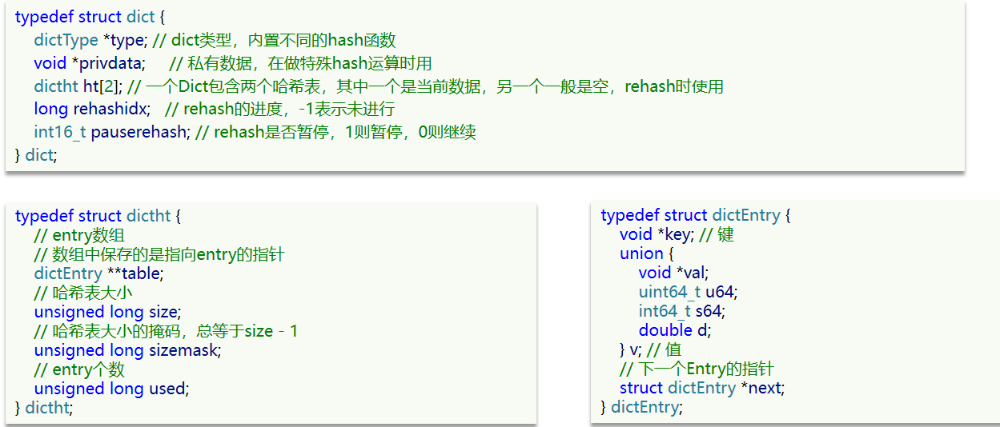
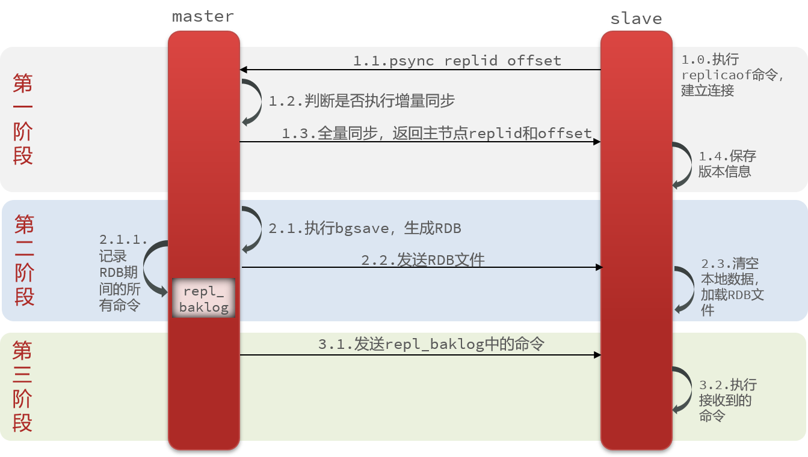

# 1 Redis底层数据结构

<!--more-->

## 1.1 SDS

Redis没有直接使用C语言中的字符串，而是自己构建了一种新的字符串结构，称为**简单动态字符串（Simple Dynamic String，SDS）**。

### 1.1.1 SDS定义

SDS的结构定义如下：


- `len`：记录`buf`中已使用字节的数量，等于SDS所保存字符串的长度，不包含结束标识`\0`。
- `alloc`：记录`buf`申请的总的字节数，不包含结束标识`\0`。
- `flags`：不同SDS的头类型，用来控制SDS的头大小。
  - 比如，`flags`取值为`SDS_TYPE_8`时，`len`与`alloc`的数据类型为`uint8_t`，即占8位。
  - 同理，`flags`取值为`SDS_TYPE_16`时，`len`与`alloc`的数据类型为`unit_16`，即占16位。
  - `SDS_TYPE_5`这一类型已被弃用。
- `buf`：`char`类型的数组，用于保存字符串。

例如，一个包含字符串"name"的SDS结构如下：


### 1.1.2 使用SDS的好处

- **$O(1)$时间复杂度获取字符串长度**。
  - C语言字符串不记录自身的长度信息，因此要想获取字符串长度，需要先遍历一遍，对遇到的每个字符进行计数，直到遇到`\n`为止。这一操作的时间复杂度为$O(n)$。
  - SDS中的`len`属性记录了字符串长度，因此程序只需要访问SDS的`len`属性，就可以立即知道字符串的长度。这一操作的时间复杂度为$O(1)$。
- **减少修改字符串时带来的内存重分配次数**（下一部分细讲）。
- **二进制安全**。当字符串中含有`\0`时，C语言会将其错认为字符串的结束标识，从而忽略后面的字符。而SDS则没有这种问题。

### 1.1.3 SDS的空间预分配与惰性空间释放

每次增长或者缩短一个C字符串时，程序都总要对保存这个C字符串的数组进行一次内存重分配操作：

- 如果程序执行的是增长字符串的操作，比如拼接操作，那么在执行这个操作之前，程序需要先通过内存重分配来扩展底层数组的空间大小——如果忘了这一步就会产生缓冲区溢出。
- 如果程序执行的是缩短字符串的操作，比如截断操作，那么在执行这个操作之后，程序需要通过内存重分配来释放字符串不再使用的那部分空间——如果忘了这一步就会产生内存泄露。

内存重分配通常是一个比较耗时的操作，为了避免C字符串的这种缺陷，SDS实现了空间预分配和惰性空间释放两种优化策略。

- **空间预分配**。空间预分配用于优化SDS的字符串增长操作。当SDS的API对一个SDS进行修改，并且需要对SDS进行空间扩展的时候，程序不仅会对SDS分配修改所必须要的空间，还会为SDS分配额外的未使用空间。
- **惰性空间释放**。惰性空间释放用于优化SDS的字符串缩短操作。当SDS的API需要缩短SDS保存的字符串时，程序并不立即使用内存重分配来回收缩短后多出来的字节，而是使用`len`来记录缩短后的字符串长度，多出来的字节等待将来使用。

## 1.2 字典Dict

### 1.2.1 字典定义

与字典（Dict）有关的有三个数据结构：字典（dict）、哈希表（dictht）、哈希结点（dictEntry）。



一个字典中含有两个哈希表（`ht[0]`和`ht[1]`）。一般情况下，字典只使用`ht[0]`哈希表，`ht[1]`哈希表只会在rehash的时候使用。

Redis中的字典使用**链地址法（separate chaining）**来解决哈希冲突。

字典的示例图如下：


### 1.2.2 字典的扩容

当以下条件中的任意一个被满足时，程序会自动开始对哈希表执行扩展操作：

- 服务器目前没有在执行`BGSAVE`命令或者`BGREWRITEAOP`命令，并且哈希表的负载因子大于等于1。
- 服务器目前正在执行`BGSAVE`命令或者`BFREWRITEAOF`命令，并且哈希表的负载因子大于等于5。

另外，当哈希表的负载因子小于0.1时，Redis自动开始对哈希表执行收缩操作。

### 1.2.3 渐进式rehash

为了避免rehash对服务器性能造成影响，服务器不是一次性将`ht[0]`里面的所有键值对全部rehash到`ht[1]`，而是分多次、渐进式地将`ht[0]`里面的键值对慢慢地rehash到`ht[1]`。

以下是哈希表渐进式rehash的详细步骤：

1. 为`ht[1]`分配空间，这个哈希表的空间大小取决于要执行的操作，以及`ht[0]`当前包含的键值对数量（`ht[0].used`属性的值）：

   - 如果执行的是扩展操作，那么`ht[1]`的大小为第一个大于等于`ht[0].used * 2`的$2^{n}$。
   - 如果执行的是收缩操作，那么`ht[1]`的大小为第一个大于等于`ht[0].used`的$2^{n}$。

   此时，字典同时持有`ht[0]`和`ht[1]`两个哈希表。

2. 在字典中维持一个索引计数器变量`rehashidx`，并将它的值设置为`0`，表示rehash工作正式开始。

3. 在rehash进行期间，每次对字典执行添加、删除、查找或者更新操作时，程序除了执行指定的操作以外，还会顺带将`ht[0]`哈希表在`rehashidx`索引上的所有键值对`rehash`到`ht[1]`，并将`rehashidx`属性的值加1。

4. 当`ht[0]`的所有键值对都被rehash至`ht[1]`后（`ht[0]`变为空表），释放`ht[0]`，将`ht[1]`设置为`ht[0]`，并在`ht[1]`新创建一个空白哈希表，为下一次rehash做准备。

5. 将`rehashidx`属性的值设为-1，表示`rehash`操作已完成。

在渐进式rehash进行期间，字典的删除、查找、更新等操作会在两个哈希表上进行。例如，要在字典里面查找一个键的话，程序会先在`ht[0]`里面进行查找，如果没找到的话，就会继续到`ht[1]`里面进行查找。

另外，在渐进式rehash执行期间，新添加到字典的键值对一律会被保存到`ht[1]`里面，而`ht[0]`则不再进行任何添加操作，这一措施保证了`ht[0]`包含的键值对数量会只减不增，并随着rehash操作的执行而最终变为空表。

## 1.3 跳表SkipList

跳表（SkipList）首先是**双向链表**，其主要特点如下：

- 跳跃表中每个结点都包含`score`（`double`类型的浮点数）和`ele`（字符串对象）。
- 结点按照`socre`由小到大排序，当`score`值相同时，按照`ele`的字典序进行排序。
- 每个结点都可以包含多层指针，层数是1到32之间的随机数。
- 不同层指针到下一个结点的跨度（span）不同，层级越高、跨度越大。

Redis中SkipList的结构定义如下：


SkipList的示意图如下：


层级中的跨度（`span`）实际上是用来计算排位（rank）的。在查找某个结点的过程中，将沿途访问过的所有层的跨度累计起来，得到的结果就是目标结点在跳跃表中的排位（也就是第几个元素）。

## 1.4 整数集合IntSet

### 1.4.1 整数集合定义

IntSet是Redis中Set集合的底层实现之一，当一个Set只包含整数值元素，并且这个Set的元素数量不多时，Redis就会使用IntSet作为集合的底层实现。

IntSet结构定义如下：


其中，`contents`数组是整数集合的底层实现：整数集合的每个元素都是`contents`数组的一个数组项，各个项在数组中按值的大小**从小到大有序排列**，并且数组中**不包含任何重复项**。

另外，由于IntSet是有序的，所以底层可采用二分查找进行查询。

虽然IntSet结构将`contents`属性声明为`int8_t`类型的数组，但实际上`contents`数组并不保存任何`int8_t`类型的值，**contents**数组的真正类型取决于`enconding`属性的值。其中`enconding`包含以下三种模式：


如果`encoding`属性的值为`INTSET_ENC_INT16`，那么`contents`就是一个`int16_t`类型的数组，数组里的每个项都是一个`int16_t`类型的整数值。另外两种模式同理。

IntSet的示例如下：


数组中每个数字都在`int16_t`的范围内，因此采用的编码方式是`INTSET_ENC_INT16`。

### 1.4.2 IntSet升级

当我们要将一个新元素添加到IntSet中，并且新元素超出了IntSet当前数据类型的表示范围时，我们需要先对IntSet进行升级，然后再将新元素添加到整数集合。

升级整数集合并添加新元素主要有以下几步：

- 根据新元素的类型，以及集合元素的数量，对底层数组进行空间重分配。
- 将底层数组现有的所有元素都转换成与新元素相同的类型，并将类型转换后的元素放置到正确的位置上，并且在放置元素的过程中，需要继续维持底层数组的有序性质不变。
- 将新元素添加到底层数组里面，并修改`encoding`为新元素的类型，`length`加一。

例如，向上一节的IntSet中添加`5000`这一元素值，由于超出了`int16_t`的取值范围，因此要对IntSet进行升级，将`int16_t`升级为`int32_t`。升级后的IntSet如下：


需要注意的是，**IntSet不支持降级操作**。

## 1.5 压缩列表ZipList

### 1.5.1 压缩列表定义

ZipList是Redis为了节约内存而开发的，由一系列特殊编码的**连续内存块**组成，可以看作一种连续内存空间的双向链表。一个压缩列表可以包含任意多个节点，每个结点可以保存一个**字节数组（字符串）**或者一个**整数值**。

ZipList结构如下：


| **属性**  |  **类型**  | **长度** |                           **用途**                           |
| :-------: | :--------: | :------: | :----------------------------------------------------------: |
| `zlbytes` | `uint32_t` |  4字节   |              记录整个压缩列表占用的内存字节数。              |
| `zltail`  | `uint32_t` |  4字节   | 记录压缩列表表尾结点距离压缩列表的其实地址有多少字节。通过这个偏移量，程序无须遍历整个压缩列表就可以确定表尾结点的地址。 |
|  `zllen`  | `uint16_t` |  2字节   | 记录了压缩列表包含的结点数量。当该属性值小于`UINT16_MAX`（65535）时，这个属性的值就是压缩列表包含结点的数量。当这个值等于`UINT16_MAX`时，结点的真实数量需要遍历整个压缩列表才能计算得出。 |
|  `entry`  |  列表结点  |   不定   |   压缩列表包含的各个结点，结点的长度由结点保存的内容决定。   |
|  `zlend`  | `uint8_t`  |  1字节   |     特殊值`0xff`（十进制255），用于标记压缩列表的末端。      |

### 1.5.2 压缩列表结点的构成

ZipList中的Entry并不像普通链表那样记录前后结点的指针，因为记录两个指针就要占用16个字节，浪费内存。而是采用了下面的结构：


- `previous_entry_length`：前一结点的长度，占1个或5个字节。
  - 如果前一结点的长度小于254字节，则采用1个字节来保存这个长度值。
  - 如果前一结点的长度大于等于254字节，则用5个字节来保存这个长度值，第一个字节为`0xfe`（`0xff`已被作为压缩列表结尾标记，因此不能使用，且`0xfe`的十进制表示就是254），后四个字节才是真实长度数据。
- `encoding`：记录了结点的`content`属性所保存数据的类型（字符串还是整数）以及长度。
- `content`：负责保存结点的数据，可以是字符串或整数。

由于Entry中即记录了前一个Entry的长度（`previous_entry_length`），又记录了当前结点存储的数据的长度（`encoding`），因此ZipList类似于双向链表，**即可以从前往后遍历，也可以从后往前遍历**。

`encoding`编码分为字符串和整数两种：

- 字符串：如果`encoding`是以`00`、`01`或者`10`开头，则说明`content`是字符串。
  
  例如，我们要保存字符串“ab”和“bc”。
  
- 整数：如果`encoding`是以`11`开始，则说明`content`是整数，且`encoding`固定只占用1个字节。
  
  例如，我们要保存两个整数值`2`和`5`。
  

### 1.5.3 连锁更新

ZipList的每个Entry都包含`previous_entry_length`来记录上一个结点的大小，长度是1个或5个字节：

- 如果前一结点的长度小于254字节，则采用1个字节来保存这个长度值
- 如果前一结点的长度大于等于254字节，则采用5个字节来保存这个长度值，第一个字节为`0xfe`，后四个字节才是真实长度数据。

现在，假设我们有N个**连续的，长度为250~253之间**的Entry，因此Entry的`previous_entry_length`属性用1个字节即可表示，如图所示：


这时，如果我们将一个长度大于等于254字节的新结点设置为压缩列表的表头结点，由于其后继结点$e_{1}$的`previous_entry_length`属性仅长1字节，无法保存新结点的长度，因此程序会对压缩列表执行空间重分配操作，将$e_{1}$的`previous_entry_length`属性由1个字节扩展为5个字节。

由于`previous_entry_length`属性由1字节变为5字节，使得$e_{1}$长度也变得大于等于254字节，因此程序又会会压缩列表执行空间重分配操作，将$e_{1}$后继结点$e_{2}$的`previous_entry_length`属性由1个字节扩展为5个字节。

正如扩展$e_{1}$引发了对$e_{2}$的扩展一样，扩展$e_{2}$也会引发对$e_{3}$的扩展，而扩展$e_{3}$又会引发对$e_{4}$的扩展……为此，程序需要不断地对压缩列表执行空间重分配操作，直到$e_{n}$为止。


ZipList这种特殊情况下产生的连续多次空间扩展操作称之为**连锁更新（Cascade Update）**。新增、删除都可能导致连锁更新的发生。

## 1.6 QuickList

QuickList是一个结点为**ZipList的双向链表**。其主要具有以下特点：

- 结点采用ZipList，解决了传统链表的内存占用问题。
- 控制了ZipList的大小，解决了连续内存空间申请效率的问题。
- 中间结点可以压缩，进一步节省了内存。

QuickList的结构示意图如下：


# 2 Redis中的基本数据类型

## 2.1 RedisObject

Redis中的任意数据类型的键和值都会被封装为一个`RedisObject`，也叫做Redis对象，源码如下：


Redis中key是`String`类型，而value可以是多种数据类型，比如`String`、`List`、`Hash`、`Set`、`SortedSet`等。

Redis使用`RedisObject`中的`type`字段指明当前对象的数据类型，并且使用`encoding`字段指明当前对象的编码方式（也就是底层存储的数据结构）。Redis会根据存储的数据类型不同，选择不同的编码方式，共包含11种不同类型：

| **编号** | **编码方式**            | **说明**               |
| -------- | ----------------------- | ---------------------- |
| 0        | OBJ_ENCODING_RAW        | raw编码动态字符串      |
| 1        | OBJ_ENCODING_INT        | long类型的整数的字符串 |
| 2        | OBJ_ENCODING_HT         | hash表（字典dict）     |
| 3        | OBJ_ENCODING_ZIPMAP     | 已废弃                 |
| 4        | OBJ_ENCODING_LINKEDLIST | 双端链表               |
| 5        | OBJ_ENCODING_ZIPLIST    | 压缩列表               |
| 6        | OBJ_ENCODING_INTSET     | 整数集合               |
| 7        | OBJ_ENCODING_SKIPLIST   | 跳表                   |
| 8        | OBJ_ENCODING_EMBSTR     | embstr的动态字符串     |
| 9        | OBJ_ENCODING_QUICKLIST  | 快速列表               |
| 10       | OBJ_ENCODING_STREAM     | Stream流               |

## 2.2 String

`String`对象的编码可以是`int`（虽然编码是`int`，但实际上是64位的`long`类型的整数）、`raw`或者`embstr`。

- 如果字符串对象保存的是整数值，并且这个整数值可以用`long`类型表示，那么字符串对象会将整数值保存在`redisObject`中的`ptr`属性中（将`void*`转换成`long`），并将字符串对象的编码设置为`int`。
  
- 如果字符串对象保存的是一个字符串，并且字符串值的长度大于44字节，字符串对象的编码为`raw`。
  
  - `raw`编码**调用两次内存分配函数**分别创建`redisObject`结构和`sdshdr`结构。
- 如果字符串对象保存的是一个字符串，并且字符串的长度小于等于44字节，字符串对象的编码为`embstr`。
  
  - `embstr`编码通过调用一次内存分配函数来分配一块连续的空间，空间中依次包含`redisObject`和`sdshdr`两个结构。

使用`embstr`编码的字符串对象来保存短字符串值有以下好处：

- `embstr`编码将创建字符串对象所需的内存分配次数从`raw`编码的两次降低为一次。
- 释放`embstr`编码的字符串对象只需要调用一次内存释放函数，而释放`raw`编码的字符串对象需要调用两次内存释放函数。

## 2.3 List

Redis中的List对象类似一个双端队列，可以从首、尾操作列表中的元素：

- 在3.2版本之前，Redis采用ZipList和LinkedList来实现List，编码为`ziplist`或`linkedlist`。
  - 当元素数量小于512并且元素大小小于64字节时采用ZipList编码。
  - 超过则采用LinkedList编码。
- 在3.2版本之后，Redis统一采用QuickList来实现List，编码为`quicklist`。


## 2.4 Hash

Hash对象的编码可以是`ziplist`或者`ht`（hashtable，即使用Dict结构实现）。

- Hash对象默认使用`ziplist`编码，以节省内存。ZipList中相邻的两个Entry分别保存field（即key）和value。
  
  - 当满足以下条件中的任意一个时，Hash对象的编码会由`ziplist`转为`ht`：
    - ZipList中的元素数量超过了`hash-max-ziplist-entries`（默认512）。
    - ZipList中的任意Entry大小超过了`hash-max-ziplist-value`（默认64，单位为字节）。
- `ht`编码的Hash对象示意图如下：
  

## 2.5 Set

Set对象的编码可以是`intset`或者`ht`。

- 当存储的所有数据都是整数，并且元素数量不超过`set-max-intset-entries`（默认512，单位为字节）时，Set对象会使用`intset`编码，以节省内存。
  
- 上述两个条件中有一个不满足时，Set集合的编码会由`intset`转为`ht`（Dict结构）。Dict中的key用来存储元素，value统一为`null`。
  

## 2.6 SortedSet

### 2.6.1 底层实现

SortedSet对象的编码可以是`ziplist`或者`skiplist`。

- `ziplist`编码的SortedSet对象使用压缩列表ZipList作为底层实现。
  
  - ZipList本身没有排序功能，因此需要由SortedSet通过编程实现：
    - ZipList是连续内存，因此`score`和`element`是紧挨在一起的两个Entry，`element`在前，`score`在后。
    - `score`越小越接近表头，`score`越大越接近表尾，按照`score`值升序排列。
  - 当以下条件有一个不满足时，SortedSet的编码就会由`ziplist`变为`skiplist`：
    - 元素数量小于`zset-max-ziplist-entries`（默认值128）。
    - 每个元素都小于`zset-max-ziplist-value`（默认值64，单位为字节）
- `skiplist`编码的SortedSet对象使用`zset`结构作为底层实现，一个`zset`结构同时包含一个Dict字典和一个SkipList跳跃表。
  
  - SkipList按分值从小到大保存了所有集合元素，每个跳跃表结点都保存了一个集合元素。
  - Dict中的每个键值对都保存了一个集合元素，Dict的键保存了元素的`element`，值保存了元素的`score`。

值得一提的是，虽然`zset`结构同时使用跳跃表和字典来保存有序集合元素，但这两种数据结构都会通过指针来共享相同元素的成员和分值，所以同时使用SkipList和Dict来保存集合元素不会产生任何重复成员或者分值，也不会因此而浪费额外的内存。

### 2.6.2 为什么SortedSet要同时使用跳表和字典来实现？

主要是为了性能考虑：

- 使用**字典能够实现以$O(1)$的时间复杂度查找`element`对应的`score`**，但无法高效的执行范围查询。
- 使用**跳表能够高效的实现范围查询**，但是因为没有了字典，所以根据`element`查找`score`这一操作的时间复杂度将从$O(1)$上升为$O(logN)$。

基于上述考虑，Redis中的SortedSet同时使用跳表和字典来实现。

## 2.7 总结

| **数据类型** |                     **编码方式**                     |
| :----------: | :--------------------------------------------------: |
|  OBJ_STRING  |                   int、embstr、raw                   |
|   OBJ_LIST   | ZipList、LinkedList（3.2以前）；QuickList（3.2以后） |
|   OBJ_SET    |                      intset、HT                      |
|   OBJ_ZSET   |               ZipList、HT组合SkipList                |
|   OBJ_HASH   |                     ZipList、HT                      |

# 3 Redis持久化

Redis有两种持久化方案：

- RDB持久化
- AOF持久化

下面一一对其进行介绍。

## 3.1 RDB持久化

RDB全称Redis Database Backup file，简单来说就是将内存中Redis存储的数据都保存到磁盘中，当Redis实例故障重启后，能够从磁盘中读取RDB文件，恢复数据。

RDB持久化在以下四种情况下会执行：

- **执行`save`命令**。`save`命令会阻塞Redis服务器进程，直到RDB文件创建完毕为止，在服务器进程阻塞期间，服务器不能处理任何命令请求。

- **执行`bgsave`命令**。`bgsave`命令会派生出一个子进程，然后由子进程负责创建RDB文件，服务器进程（父进程）继续处理命令请求。

- **Redis正常停机时**。Redis正常停机时会执行一次`save`命令，实现RDB持久化（注意是正常停机，宕机时不会执行）。

- **触发RDB条件**。Redis内部有触发RDB的机制，可以在redis.conf文件中找到：

  ```properties
  # 900秒内，如果至少有1个key被修改，则执行bgsave，下面几个配置同理
  # 如果是save "" 则表示禁用RDB
  save 900 1  
  save 300 10  
  save 60 10000 
  ```

## 3.2 AOF持久化

### 3.2.1 介绍

RDB持久化保存Redis中存储的全部数据，当Redis中存储的数据量很大时，执行RDB持久化会非常耗时。所以Redis提供了另外一种持久化机制——AOF持久化。

**AOF（Append Only File）持久化**通过**保存Redis所执行的写命令**来实现持久化的，可以看做是命令日志文件。

### 3.2.2 AOF配置

AOF默认是关闭的，需要修改redis.conf配置文件来开启AOF：

```properties
# 是否开启AOF功能，默认是no
appendonly yes
# AOF文件的名称
appendfilename "appendonly.aof"
```

AOF的命令记录的频率也可以通过redis.conf文件来配置：

```properties
# 表示每执行一次写命令，立即记录到AOF文件（这里以及下面说的AOF文件都是存储在磁盘中的）
appendfsync always
# 写命令执行完先放入AOF缓冲区，然后表示每隔1秒将缓冲区数据写到AOF文件，是默认方案
appendfsync everysec
# 写命令执行完先放入AOF缓冲区，由操作系统决定何时将缓冲区内容写回磁盘
appendfsync no
```

三种策略对比：


### 3.2.3 AOF文件重写

因为是记录命令，AOF文件比RDB文件大得多。而且AOF会记录对同一个key的多次写操作，但只有最后一次写操作才有意义。通过执行`bgrewriteaof`命令，可以让AOF文件执行重写功能，用最少的命令达到相同效果。


如图，AOF原本有三个命令，但是`set num 123`和`set num 666`都是对`num`的操作，第二次操作会覆盖掉第一次的值，因此第一个命令记录下来没有意义。而且对`num`和`name`的操作也可以简化为一条命令。

所以重写命令后，AOF文件内容就是`mset name jack num 666`。

Redis也会在触发阈值时自动重写AOF文件，阈值可以在`redis.conf`中配置：

```properties
# AOF文件比上次文件增长超过多少百分比则重写
# 此处配置当AOF文件比上次重写后的文件大100%时进行重写
auto-aof-rewrite-percentage 100
# AOF文件体积小于多少时不进行重写，此处配置当文件小于64M时不进行重写
auto-aof-rewrite-min-size 64mb
```

## 3.3 RDB与AOF对比

总的来说，Redis提供两种持久化机制：

- RDB：将数据库的快照以二进制的方式保存到磁盘。
- AOF：将所有写入命令及相关参数以协议文本的方式写入文件并持久保存磁盘。

RDB和AOF各有自己的优缺点，实际开发中往往会结合两者来使用。


**参考资料**：

[【Redis 干货领域】从底层彻底吃透 AOF 重写 (原理篇)](https://xie.infoq.cn/article/a078e5d692fd7c1cbb2723f5a)

# 4 Redis主从复制

Redis主从复制大体可以分为两个阶段：**数据同步阶段**与**命令传播阶段**。

## 4.1 数据同步阶段

在2.8版本以前，Redis只能进行全量同步，使用`sync`命令实现。在2.8版本之后，引入了增量同步的概念，使用`psync`命令实现，即`psync`具有**全量同步**和**增量同步**两种模式。

- 全量同步用于处理初次复制的情况。
- 增量同步用于处理断开连接后重连进行复制的情况。

### 4.1.1 同步原理

在主从复制模式下，**Redis使用`replication id, offset`对来唯一识别master节点数据集的版本**，下面先介绍一下其中的几个关键概念：

- **replication id（复制ID）**：每个Redis的主节点都用一个随机生成的字符串来**表示在某一时刻其内部存储数据的状态**，“某一时刻”可以理解为其称为master的那一刻，即在第一个从结点加入时，Redis初始化了replication id（下文中的replid就是这里的复制ID）。

- **offset（复制偏移量）**：主从模式下，主节点会持续不断的向从结点传播引起数据集更改的命令，**offset所表示的是主节点向从节点传递命令的字节总数**。

- **replication backlog（复制积压缓冲区）**：它是一个环形缓冲区，用于存储主节点向从节点传递的命令。
  

  - 复制积压缓冲区会**为其中的每个字节记录相应的复制偏移量**，如上图。

  - 它的大小是固定的，可存储的命令有限，超出部分将会覆盖旧的数据。
  - 它即可用于增量同步，也可用于命令传播阶段的命令重推。

以上内容是master存储维护的，在slave中也有复制ID、复制偏移量的概念。

- 复制ID：
  - 如果slave从未与任何master进行过主从复制，那就不存在。
  - 如果slave与master连接正常，复制ID存储在`server.master`中。
  - 如果slave与master连接断开，Redis会将复制ID存储在`server.cache_master`中。
- 复制偏移量：**从结点收到主节点传递命令的字节总数**。
  - 如果主节点和从节点处于一致状态，那么二者的偏移量总是相同的。
  - 相反，如果主节点和从结点的偏移量并不相同，那么说明主从结点并未处于一致状态。

`server.master`代表的是正在进行主从复制且正常工作的主节点信息；`server.cache_master`是曾经正常进行主从复制工作的主节点信息，它是为增量同步做准备的。

介绍了这么多概念，下面说一下数据同步的大致流程：

- 从结点与主节点建立连接后，需要从结点使用命令`psync <replid> <offset>`向主节点发起同步请求，从结点会从`server.cache_master`中取出这两个参数构建命令，然后发给主节点。需要注意的是，如果该从结点从未与任何主节点进行主从复制，那么会使用特殊的命令`psync ? -1`。
- 主节点接收到命令，解析请求中的复制ID和offset，然后去判断当前请求是否可以进行增量同步。
- 能够使用增量同步需要满足以下两个条件：
  - 从节点的复制ID与主节点的复制ID一致。
  - 复制偏移量offset之后的数据（即offset+1开始的数据）仍然存在于复制积压缓冲区中。
- 如果无法进行增量同步，则执行全量同步。

### 4.1.2 全量同步

执行全量同步的大致流程如下：



1. 从服务器向主服务器发送`psync <replid> <offset>`命令
2. 主节点接收到命令，解析请求中的复制ID和offset，然后去判断当前请求是否可以进行增量同步。
3. 如果不满足执行增量同步的条件，主节点向从节点返回`+FULLRESYNC <replid> <offset>`回复，表示执行全量同步。其中：
   - `<replid>`是主节点的复制ID，从节点会将该ID保存起来。
   - `<offset>`则是主节点当前的复制偏移量，从节点会将这个值作为自己的初始化偏移量。
4. 主节点执行`bgsave`命令，在后台生成一个RDB文件，并使用缓冲区（复制积压缓冲区）记录从现在开始执行的所有写命令。
5. 当主节点的`bgsave`执行完毕时，主节点会将生成的RDB文件发送给从节点，从节点接收并载入这个RDB文件，将自己的数据库状态更新至主节点执行`bgsave`命令时的数据库状态。
6. 主节点将记录在缓冲区里面的所有写命令发送给从节点，从节点执行这些写命令，将自己的数据库状态更新至主节点服务器当前所处的状态。

### 4.1.3 增量同步

执行增量同步的大致流程如下：


1. 从服务器向主服务器发送`psync <replid> <offset>`命令
2. 主节点接收到命令，解析请求中的复制ID和offset，然后去判断当前请求是否可以进行增量同步。
3. 满足执行增量同步的条件，主节点向从结点返回`+CONTINUE`回复，表示执行增量同步。
4. 主节点按照从结点发送的offset，从复制积压缓冲区中读取offset之后的所有命令发送至从结点，从结点执行这些写命令，主从结点再次回到一致状态。

## 4.2 命令传播阶段

### 4.2.1 介绍

当完成数据同步之后，主从结点之间就会进入命令传播阶段，此时主从结点的数据是一致的。

当主节点执行完新的写命令后，会将该命令追加至复制积压缓冲区，然后异步地发送给从结点。从结点接收命令并执行，同时更新从结点维护的复制偏移量offset。命令传播如下图所示：


### 4.2.2 心跳检测

在命令传播阶段，每隔一秒，**从节点向主节点发送**一次心跳信息，命令格式：

```
REPLCONF ACK <offset>
```

其中`<offset>`是从结点当前的复制偏移量。

心跳检测主要有以下两个作用：

- **检测主从结点的网络连接状态是否正常**。如果主节点超过一秒钟没有收到从节点发来的`REPLCONF ACK`命令，那么就说明主从结点之间的网络连接出现问题了（可能是网络问题，也可能是从节点本身的问题）。
- **检测命令丢失**。命令中的`<offset>`是从节点当前的复制偏移量，主节点收到后会与自己的复制偏移量对比，如果不一致，说明命令在传输过程中丢失，主节点会重新推送丢失的命令。

**参考资料**：

[Redis专题：一文搞懂主从复制原理！](https://segmentfault.com/a/1190000039242024)

# 5 Redis哨兵

## 5.1 介绍

Redis**哨兵（Sentinel）**是运行在特殊模式下的Redis服务器，不支持读写操作，它的作用是配合Redis的复制功能，实现对主从结点的监控，对下线的主节点进行故障转移和通知。

哨兵不是一个单独的进程，而是有多个哨兵服务组成的分布式系统。哨兵集群独立于Redis集群，哨兵之间彼此建立连接，共同监控、管理所有的Redis结点。哨兵主要有以下几个作用：

- **监控**：监控所有Redis结点（包括主节点与从结点）的状态。
- **故障转移**：如果主节点故障，哨兵会选取一个从结点作为新的主节点。
- **通知**：当集群发生故障转移时，哨兵可以通过API通知Redis客户端。

哨兵的配置文件示例如下：

```properties
# sentinel-26379.conf
port 26379
daemonize yes
dir "/Users/eleme/raysonxin/docker/redis-docker/log"
logfile "26379.log"
# 配置监听的主服务器，这里sentinel monitor代表监控，mymaster代表服务器的名称，可以自定义，192.168.11.128代表监控的主服务器，6379代表端口，2代表只有两个或两个以上的哨兵认为主服务器不可用的时候，才会进行failover操作。
sentinel monitor mymaster 127.0.0.1 6379 2   
# 判断主节点时间
sentinel down-after-milliseconds mymaster 10000
sentinel parallel-syncs mymaster 1    
sentinel failover-timeout mymaster 180000
```

## 5.2 节点自动发现

首先说明一下，这里的 节点指的是其他哨兵节点及从节点。

我们可以看到在哨兵的配置文件中，仅配置了主节点的相关信息，并没有配置从节点和其他哨兵节点的信息。那么哨兵是如何发现从结点与其他哨兵节点的呢？这一功能是由哨兵的自动发现机制实现的，下面我们来看一下。

### 5.2.1 从结点自动发现

一般情况下，哨兵节点每隔10秒向**主从节点**（注意是主节点和从节点）发送`INFO`命令，以此获取主从结点的信息。

第一次执行时，哨兵仅知道我们给出的主节点信息，通过对主节点执行`INFO`命令就可以获取其从节点列表，再以此与其从结点建立连接进行监控。此后，如果有新结点加入，哨兵也可以自动发现，并与新结点建立连接进行监控。


对主节点执行`INFO`命令获得的回复，其中的Replication信息示例如下：

```properties
# Replication
role:master
connected_slaves:2
slave0:ip=172.25.0.102,port=6379,state=online,offset=258369,lag=1
slave1:ip=172.25.0.103,port=6379,state=online,offset=258508,lag=0
master_failover_state:no-failover
master_replid:a4a6a7f3b2e15d9a43c01d4ba6c842539e582d6a
master_replid2:0000000000000000000000000000000000000000
master_repl_offset:258508
...
```

对从结点执行`INFO`命令获得的回复，其中的Replication信息示例如下：

```properties
# Replication
role:slave
master_host:172.25.0.102
master_port:6379
master_link_status:up
slave_repl_offet:258369
slave_priority:100
```

### 5.2.2 其他哨兵节点自动发现

哨兵们在连接同一个主节点之后，是通过**发布/订阅（pub/sub）**模式来发现彼此的存在的。

在哨兵模式下，哨兵们会在**每个Redis节点**上创建并订阅一个名为`__sentinel__:hello`的频道，哨兵们就是通过它来相互发现，实现相互通信的。


订阅后，每个哨兵每隔2秒都会向`__sentinel__:hello`频道发布一条携带自身信息的hello消息，这样每个哨兵发布的消息都会被其他哨兵接收到，从而达到信息交换的目的。

### 5.2.3 补充

对于每个被哨兵监视的节点（主节点或从结点）来说，哨兵会创建两个连向节点的异步网络连接：

- 命令连接，这个连接专门用于向主服务器发送命令，并接收命令回复。
- 订阅连接，这个连接专门用于订阅节点的`__sentinel__:hello`频道。

需要注意的是，客户端执行订阅命令后，就会进入订阅状态，此状态下的客户端只能使用`subscribe`、`psubscribe`、`unsubscribe`、`punsubscribe`这四个命令。这应该是为什么要建立两个连接的原因。

**参考资料**

[【Redis】哨兵（Sentinel）介绍及其工作原理](https://juejin.cn/post/6998564627525140494)

[Redis专题：深入解读哨兵模式](https://juejin.cn/post/6934984432273063967#heading-0)