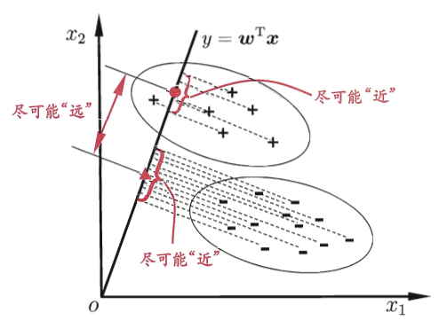
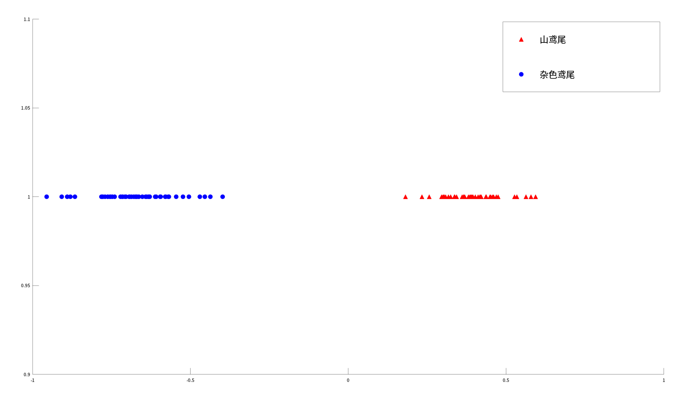

## 1.  LDA介绍与推导
<!--more-->
线性判别分析（Linear Discriminant Analysis，简称LDA）是一种经典的线性分类方法。其主要思想是：给定训练样例集，设法将样例投影到一条直线上，使得同类样例的投影点尽可能接近，异类样例的投影点尽可能远离；在对新样本进行分类时，将其投影到同样的这条直线上，再根据投影点的位置来确定新样本的类别。



下面我们将以二分类问题对LDA进行讨论。
假设数据集$D = \{(x_{i},y_{i})\}_{i = 1}^{N}$，其中任意样本$x_i$为$p$维向量，$y_i \in \{0,1\}$。我们定义$N_{j}(j = 0,1)$为第j类样本的个数，$X_j$为第$j$类样本的集合，$\mu_{j}(j = 0, 1)$ 为第$j$类样本的均值向量，定义$\Sigma_{j}(j = 0, 1)$为第$j$类样本的协方差矩阵（严格来说是缺少分母部分的协方差矩阵）。

$\mu_{j}$的表达式为：
$$
\mu_{j} = \frac{1}{N} \sum\limits_{x \in X_{j}}x \quad (j = 0, 1) \tag{1.1}
$$

$\Sigma_{j}$的表达式为：
$$
\Sigma_{j} = \sum_{x \in X_{j}} (x - \mu_{j})(x - \mu_{j})^T \quad (j = 0, 1) \tag{1.2}
$$
假设我们的投影直线是向量$w$，则对任意一个样本$x$，其在直线$w$上的投影为$w^{T}x$（严格来说是缩放后的投影），对于我们的两个类别的中心点$\mu_{0}$，$\mu_{1}$，在直线$w$上的投影为$w^{T}\mu_{0}$和$w^{T}\mu_{1}$。想要使同类样例的投影点尽可能的接近，可以让**同类样本投影点的协方差尽可能小**，即最小化$w^{T}\Sigma_{0}w + w^{T}\Sigma_{1}w$；而想要使异类样例的投影点尽可能远离，可以让**异类样本投影点类中心的距离尽可能大**，即最大化$\Vert w^{T}\mu_{0} - w^{T}\mu_{1}\Vert_{2}^{2}$。综合考虑二者，即可得到我们的优化目标为：
$$
\mathop{arg \ max}\limits_{w} \quad J(w) = \frac{\Vert w^{T}\mu_{0} - w^{T}\mu_{1}\Vert_{2}^{2}}{w^{T}\Sigma_{0}w + w^{T}\Sigma_{1}w} \tag{1.3}
$$

对于$J(w)$，我们有：
$$
\begin{align}
J(w) &= \frac{\Vert w^{T}\mu_{0} - w^{T}\mu_{1}\Vert_{2}^{2}}{w^{T}\Sigma_{0}w + w^{T}\Sigma_{1}w} \\
&= \frac{\Vert w^{T}(\mu_{0} - \mu_{1})\Vert_{2}^{2}}{w^{T}(\Sigma_{0} + \Sigma_{1})w} \\
&= \frac{[w^{T}(\mu_{0} - \mu_{1})][w^{T}(\mu_{0} - \mu_{1})]^{T}}{w^{T}(\Sigma_{0} + \Sigma_{1})w} \\
&= \frac{w^{T}(\mu_{0} - \mu_{1})(\mu_{0} - \mu_{1})^{T}w}{w^{T}(\Sigma_{0} + \Sigma_{1})w} \tag{1.4}
\end{align}
$$
我们定义**“类内散度矩阵”**（within-class scatter matrix）$S_{w}$为：
$$
\begin{align}
S_{w} &= \Sigma_{0} + \Sigma_{1} \\
&= \sum_{x \in X_{0}}(x - \mu_{0})(x - \mu_{0})^T + \sum_{x \in X_{1}}(x - \mu_{1})(x - \mu_{1})^T \tag{1.5}
\end{align}
$$
同时定义**“类间散度矩阵”**（between-class scatter matrix）$S_{b}$为：
$$
S_{b} = (\mu_{0} - \mu_{1})(\mu_{0} - \mu_{1})^{T} \tag{1.6}
$$
这样可将我们的优化目标重写为：
$$
\mathop{arg \ max}\limits_{w} \quad J(w) = \frac{w^{T}S_{b}w}{w^{T}S_{w}w} \tag{1.7}
$$
这就是LDA欲最大化的目标，也是**“广义瑞利商”**（generalized Rayleigh quotient）。

因为向量$w$的长度成比例改变不影响$J$的取值，所以我们令$w^{T}S_{w}w = 1$，则式(1.7)等价于：
$$
\mathop{arg \ min}_{w} \quad -w^{T}S_{b}w \tag{1.8} \\
s.t. \quad w^{T}S_{w}w = 1
$$

下面对该优化目标使用拉格朗日乘数法进行求解。
由式(1.8)可得拉格朗日函数为：
$$
L(w,\lambda) = -w^{T}S_{b}w + \lambda(w^{T}S_{w}w - 1)
$$
对$w$求偏导可得：
$$
\begin{align}
\frac{\partial L(w,\lambda)}{\partial w} &= -\frac{\partial (w^{T}S_{b}w)}{\partial w} + \lambda \frac{\partial (w^{T}S_{w}w - 1)}{\partial w} \\
&= -(S_{b} + S_{b}^{T})w + \lambda (S_{w} + S_{w}^{T})w \\
& = -2S_{b}w + 2\lambda S_{w}w
\end{align}
$$
令上式等于0即可解得：
$$
S_{w}^{-1}S_{b}w = \lambda w \tag{1.9}
$$
对矩阵$S_{w}^{-1}S_{b}$进行特征值分解或者奇异值分解就可以得到$w$。但是其实还有更简单的解法。式(1.9)可以写为如下的形式：
$$
S_{w}^{-1}(\mu_{0} - \mu_{1})(\mu_{0} - \mu_{1})^{T}w = \lambda w
$$
其中，$(\mu_{0} - \mu_{1})^{T}w$是一个标量，所以$S_{w}^{-1}(\mu_{0} - \mu_{1})$和$\lambda w$共线，得到：
$$
w \propto S_{w}^{-1}(\mu_{0} - \mu_{1}) \tag{1.10}
$$
至此，求解完毕。

## 2. 算法实现

由于一些原因，我电脑上面没有安装MATLAB，因此本文中的代码都是在与MATLAB类似的Octave上面编写以及运行的。

下面是LDA的算法实现：

```matlab
function [w] = LDA(X0, X1)
    n0 = size(X0,1);        % 样本数
    n1 = size(X1,1);
    mean0 = (sum(X0) / n0)'; % 均值向量
    mean1 = (sum(X1) / n1)';
    
    % 计算类内散度矩阵
    Sigma0 = (X0' - mean0) * (X0 - mean0');
    Sigma1 = (X1' - mean1) * (X1 - mean1');
    Sw = Sigma0 + Sigma1;
    
    % 得出投影方向w
    w = pinv(Sw) * (mean0 - mean1);
end
```
采用UCI数据集中的鸢尾花数据集对该算法实现进行测试。由于鸢尾花数据集中有三类花，因此我删除了其中的一类，使其变为二分类问题。修改后的数据集中包含山鸢尾（Iris Setosa）和杂色鸢尾（Iris Versicolour）两类花，共100组样本数据，每组样本数据中包含花萼长度、花萼宽度、花瓣长度以及花瓣宽度等四个特征（单位均为cm）。

下面是测试代码：

```matlab
% 导入数据
data = load("iris.txt");
X = data(:,2:end);
X0 = X(1:50,:);
X1 = X(51:100,:);

% 计算投影方向w
w = LDA(X0,X1);

% 进行投影
X0_prejection = X0 * w;
X1_prejection = X1 * w;

% 绘图
Y = ones(size(X0_prejection));
scatter(X0_prejection,Y,100,'r','filled','^');
hold on;
scatter(X1_prejection,Y,100,'b','filled','o');
l1 = legend('山鸢尾','杂色鸢尾');
set(l1,'FontSize',20);
```

测试结果如图：



**参考资料**：
[南瓜书](https://datawhalechina.github.io/pumpkin-book/#/chapter3/chapter3?id=_339)
[线性判别分析LDA原理总结](https://www.cnblogs.com/pinard/p/6244265.html)
[教科书上的LDA为什么长这样？](https://www.jiqizhixin.com/articles/2018-08-30-12)
[机器学习笔记(六)两种降维方法：LDA和PCA](https://www.zybuluo.com/gump88/note/402479)
[白板推导：线性判别分析](https://www.bilibili.com/video/BV1aE411o7qd?p=15)
[LDA和GDA](https://www.bilibili.com/video/BV1ex41157ts/?spm_id_from=333.788.videocard.17)
周志华《机器学习》