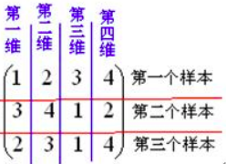

网络上关于PCA的介绍可以说是各式各样，但是很多都是从直觉上入手，并没有一个比较严谨的数学推导。有数学推导的又太过于简练，对我来说看起来太过吃力。于是就想写了这篇博客。这篇博客是我在[此视频](https://www.bilibili.com/video/av32709936) 的基础上，参考了一些其他的资料写出来的。
<!--more-->

一、背景介绍
======
我们知道，当我们的模型特征过多，而训练数据过少时，会产生过拟合问题，而解决办法可以是**增大训练数据集**，**正则化**或者**降维**。而降维的一个比较常用的方法就是**PCA（Principal component analysis，主成分分析）**。

此外，维度过高还会引起**维度灾难（curse of dimension）**，关于维度灾难的具体介绍，可以参考[https://zhuanlan.zhihu.com/p/27488363](https://zhuanlan.zhihu.com/p/27488363) 。而解决维度灾难的一个比较好的方法也是降维。

二、样本均值与方差的矩阵表示
======
2.1 预备知识
------

$\begin{aligned} &X = \left[ \begin{matrix} x_1 & x_2 & \cdots & x_N \end{matrix} \right]^{T} = \left[ \begin{matrix} x_{1}^{T}\\ x_{2}^{T} \\ \vdots \\ x_{N}^{T} \end{matrix} \right] = \left[ \begin{matrix} x_{11} & x_{12} & \cdots & x_{1p} \\ x_{21} & x_{22} & \cdots & x_{2p} \\ \vdots & \vdots & \cdots & \vdots \\ x_{N1} & x_{N2} & \cdots & x_{Np} \end{matrix} \right]_{N\times{p}} \\ &x_{i}\in{\mathbb{R}^{p}}, \quad i = 1,2,\cdots,N \end{aligned}$

其中：

+ $X$为样本数据，是$N\times{p}$的矩阵
+ $x_i$为单个样本，是$p$维的列向量
+ 共有$N$个样本，每个样本有$p$个特征

2.2均值与协方差矩阵
------

先放结论。

**样本均值**：$\bar{X}_{p\times{1}} = \frac{1}{N} \sum\limits_{i=1}^{N} x_i = \frac{1}{N}X^{T}1_{N}$

**样本协方差**：$S_{p\times{p}} = \frac{1}{N} \sum\limits_{i=1}^{N} (x_i - \bar{x}_i)(x_i - \bar{x}_i)^T = \frac{1}{N}X^{T}HX$

其中：$1_N = \begin{bmatrix} 1 \\ 1\\ \vdots \\1 \end{bmatrix}_{N\times{1}} \qquad H = I_N - \frac{1}{N}1_{N}1_{N}^{T} \qquad \qquad \qquad I_{N}即为E_{N},N阶单位矩阵$

$H$为中心矩阵（centering  matrix），中心矩阵将X每一维都减去均值，实现中心化。如果X为经过中心化处理的数据，那么协方差矩阵可以写为$\frac{1}{N}X^{T}X$的形式。

此外，中心矩阵还有一些比较好的性质，下面列举一会要用到的两个性质：

+ $H^{T} = H$
+ $H^{n} = H$

这两个性质的证明比较简单，这里就不再给出证明了。

样本均值推导：
$$\bar{x} = \frac{1}{N} \sum\limits_{i=1}^{N}x_i = \frac{1}{N} \begin{bmatrix} x_1 & x_2 & \cdots & x_N \end{bmatrix} \begin{bmatrix} 1 \\ 1\\ \vdots \\1 \end{bmatrix}_{N\times{1}} = \frac{1}{N}X^{T}1_{N}$$

样本协方差推导：
$$\begin{aligned} 
S &= \frac{1}{N} \sum\limits_{i=1}^{N}(x_i - \bar{x})(x_i - \bar{x})^T \\ 
&= \frac{1}{N} \begin{bmatrix} x_{1}-\bar{x} & x_{2}-\bar{x} & \cdots & x_{N}-\bar{x} \end{bmatrix} \begin{bmatrix} (x_{1}-\bar{x})^{T} \\ (x_{2}-\bar{x})^{T} \\ \vdots \\ (x_{N}-\bar{x})^{T} \end{bmatrix} 
\end{aligned}$$

其中：
$$\begin{aligned} 
&\begin{bmatrix} x_{1}-\bar{x} & x_{2}-\bar{x} & \cdots & x_{N}-\bar{x} \end{bmatrix} \\ 
&= \begin{bmatrix} x_{1} & x_{2} & \cdots & x_{N} \end{bmatrix} - \begin{bmatrix} \bar{x} & \bar{x} & \cdots & \bar{x} \end{bmatrix} \\
&= X^{T} - \bar{x}\begin{bmatrix} 1 & 1 & \cdots & 1 \end{bmatrix} \\
&= X^{T} - \bar{x}1_{N}^{T} \qquad \qquad \qquad 代入\bar{x}\\
&= X^{T} - \frac{1}{N}X^{T}1_{N}1_{N}^{T} \\
&= X^{T} (I_{N} - \frac{1}{N}1_{N}1_{N}^{T}) \\
&= X^{T}H
\end{aligned}$$

$$\begin{aligned}
&\begin{bmatrix} (x_{1}-\bar{x})^{T} \\ (x_{2}-\bar{x})^{T} \\ \vdots \\ (x_{N}-\bar{x})^{T} \end{bmatrix} \\
&= \begin{bmatrix} x_{1}-\bar{x} & x_{2}-\bar{x} & \cdots & x_{N}-\bar{x} \end{bmatrix}^{T} \\
&= H^{T}X
\end{aligned}$$

所以：
$$\begin{aligned}
S &= \frac{1}{N}X^{T}HH^{T}X \qquad \qquad \qquad 利用H的性质 \\
&= \frac{1}{N}X^{T}HX
\end{aligned}$$

至此，推导完毕。

三、PCA——最大投影方差角度
======
3.1 预备知识
------

**PCA**核心的一个思想就是将一组可能**线性相关**的变量，通过**正交变换**变换成一组**线性无关**的变量。
关于PCA，可以简单的概括为一个中心，两个基本点。
一个中心：原始特征空间的重构（线性相关-->线性无关）
两个基本点：

+ 最大投影方差：样本点投影到某方向上分布尽量分散（投影方差最大），该方向就是主成分。
+ 最小重构距离：样本点投影后重构回去所花的代价要最小。投影分布越分散（投影方差最大），则重构所需的代价越小。所以，这两个方法其实是等价的，只不过是从不同的角度来看待问题。

本节我们从最大投影方差角度来推导PCA。

在进行推导之前，先介绍一下向量投影与向量内积的关系。
为了简单起见，我们用二维向量来讲解。假设有向量$\boldsymbol{a} = \begin{bmatrix} x_1 \\ y_1 \end{bmatrix}$，$\boldsymbol{b} = \begin{bmatrix} x_2 \\ y_2 \end{bmatrix}$。

$\boldsymbol{a}$在$\boldsymbol{b}$上的投影为：
$projection = |\boldsymbol{a}|cos<\boldsymbol{a},\boldsymbol{b}>$
需要注意的是，向量的投影长度可正可负。两向量夹角为锐角时为投影长度为正，为钝角时投影长度为负。

$\boldsymbol{a}$与$\boldsymbol{b}$的内积：
$\boldsymbol{a}^{T}\boldsymbol{b} = x_{1}x_{2} + y_{1}y_{2} = |\boldsymbol{a}||\boldsymbol{b}|cos<\boldsymbol{a},\boldsymbol{b}> = |\boldsymbol{b}|projection$

可以看到，向量内积是一个向量在另一个向量上的投影长度乘以另一个向量的长度。比如本例中，$\boldsymbol{a}^{T}\boldsymbol{b}$即为$\boldsymbol{a}$在$\boldsymbol{b}$上的投影长度乘上$|\boldsymbol{b}|$。
**当$|\boldsymbol{b}|$为1时，$\boldsymbol{a}^{T}\boldsymbol{b}$即为$\boldsymbol{a}$在$\boldsymbol{b}$上的投影长度**。
更详细的投影以及基变换的介绍，可以看看[这篇文章](https://mp.weixin.qq.com/s?__biz=MzA5ODUxOTA5Mg==&mid=2652551576&idx=1&sn=17a125bb29001b3d8d5e3964dcc599a3&chksm=8b7e48c3bc09c1d55dbab168011cba2a853af5623a24a499a2ae110a4facb07c2a4bd033da36&mpshare=1&scene=2&srcid=0123V8FT7YEhcDXZco9gT4Vf&from=timeline&key=e4aa053ffd46a2720096fdf7de2840d48e8716d03c5dd165e9247c7dcd05d35f32c5a56481c26829d4d3e5dbef395c4877e96528fe3a518bd34d91906f6403e0d63776163f6d172ca17cfb6ba5ea8ad2&ascene=2&uin=MTgwOTU2NjU0MQ%3D%3D&devicetype=android-24&version=26050430&nettype=WIFI&abtest_cookie=AQABAAgAAQBChh4AAAA%3D&pass_ticket=sNCtedDpTEPBC88xUKXM3tzXl%2F606nFOdOXtXdJOeRZjV7St1JAOwsumIcivZwOd&wx_header=1)。

下面正式开始PCA的推导。

## 3.2 最大投影方差角度

中心化：$x_{i} - \bar{x}$
假设所取方向为$u_1$，$u_1$为**$p$维列向量**，并且$||u_{1}|| = 1$。
则$x_{i} - \bar{x}$在$u_1$方向上的投影为$(x_i - \bar{x})^{T}u_1$，其实该投影就是$x_{i} - \bar{x}$在$u_1$轴上的坐标，为**标量**。

由于投影前的数据均值为0，所以该投影的均值也为0。
由此我们可以得到$N$个点在$u_1$方向上的投影方差为：
$$\begin{aligned}
J &= \frac{1}{N}\sum\limits_{i=1}^{N}((x_i - \bar{x})^{T}u_{1})^{2} \qquad \qquad \qquad s.t. \ u_{1}^{T}u_{1} = 1  \\
&= \frac{1}{N}\sum\limits_{i=1}^{N}u_{1}^{T}(x_i - \bar{x})(x_i - \bar{x})^{T}u_1 \\
&= u_{1}^{T}(\frac{1}{N}\sum\limits_{i=1}^{N}(x_i - \bar{x})(x_i - \bar{x})^{T})u_1 \\
&= u_{1}^{T}Su_1
\end{aligned}$$

上式中的$S$为协方差矩阵。

至此，我们得到了投影方差的表达式。而最大化投影方差就变成了如下的最优化问题：
$最大化投影方差J \iff \begin{cases} 
\hat{u}_{1} = argmax \ u_{1}^{T}Su_1 \\ 
s.t. \ u_{1}^{T}u_1  = 1
\end{cases}$

这不就是带约束的函数最值问题吗？可以用拉格朗日乘数法解决。

构造拉格朗日函数：
$\mathcal{L}(u_1,\lambda) = u_{1}^{T}Su_{1} + \lambda(1 - u_{1}^{T}u_{1})$

 对$u_1$求导：
$\frac{\partial \mathcal{L}}{\partial u_1} = 2Su_1 - 2\lambda u_1$

令导数为0：
$2Su_1 - 2\lambda u_1 = 0 \Rightarrow Su_1 = \lambda u_1$

此时$u_1$、$\lambda$分别为协方差矩阵$S$的特征向量、特征值。

代入原式中得：
$\hat{u}_{1} = argmax \ u_{1}^{T}Su_1 = argmax \ u_{1}^{T}\lambda u_{1} = argmax \ \lambda$

所以要求解$u_1$，就是要最大化$\lambda$。即$u_1$为S的最大特征值所对应的单位特征向量。
后续求解$u_2,u_3,\cdots,u_{k}$的步骤跟上面的步骤差不多，只不过对于$u_{k}$来说，还要满足与前$k - 1$个主成分正交的条件。

最后可以得出结论，**投影正交基$\begin{bmatrix} u_1,u_2,\cdots,u_k \end{bmatrix}$为协方差矩阵S的前$k$个最大特征值对应的单位特征向量**。

求解此最优化问题时，也可以构造瑞利熵，利用瑞利熵的性质求解。

## 3.3 协方差矩阵与PCA

关于协方差矩阵公式的推导，可以看这篇博客：[协方差矩阵的向量表示推导](https://blog.csdn.net/zhengjihao/article/details/78030918)。

我一直不太理解协方差矩阵，以及协方差矩阵是怎么跟PCA联系到一块去的。后来看到下面这张图，我才明白了。

样本数据矩阵$X$的**每一列都是一个特征，也可以看成是一个维度**。而协方差矩阵中的每个元素都代表了**两个特征（维度）之间的协方差**。其对角线上是特征的**方差**，因为两个相同特征的协方差就是其方差。

我们来看一个计算协方差矩阵的例子：
我们有如下的样本数据矩阵，其中共有2个样本，每个样本都有$a,b,c$这3个特征。并且已经减去了均值，完成了中心化。
$$X = \begin{bmatrix} a_1 & b_1 & c_1 \\
a_2 & b_2 & c_2
\end{bmatrix}$$

则协方差矩阵$S$为：
$$\begin{aligned} 
S &= \frac{1}{2}X^{T}X \\ 
&= \frac{1}{2}\begin{bmatrix} a_{1}^{2} + a_{2}^{2} & a_1b_1 + a_2b_2 & a_1c_1 + a_2c_2 \\
a_{1}b_{1} + a_{2}b_{2} & b_{1}^{2} + b_{2}^{2} & b_{1}c_{1} + b_{2}c_{2} \\
a_{1}c_{1} + a_{2}c_{2} & b_{1}c_{1} + b_{2}c_{2} & c_{1}^{2} + c_{2}^{2}
\end{bmatrix}
\end{aligned}$$

可以看到协方差矩阵的对角线为方差，非对角线为两个不同维度之间的协方差。

下面我们来看一下经过正交变换后数据的协方差矩阵。
设投影正交基为$U$，$U$为$p\times{p}$的矩阵，即只对原数据做正交变换，而不进行降维：
$$U_{p\times{p}} = \begin{bmatrix} u_1 & u_2 & \cdots & u_p \end{bmatrix}$$

$u_1$为原始数据协方差矩阵S的最大特征值对应的单位特征向量，$u_2$为第二大特征值对应的单位特征向量，以此类推。

则$x_i$在该正交基上的投影为$U^{T}(x_i - \bar{x})$，$X$在该正交基上的投影为$HXU$。$HX$是对$X$做中心化。
设变换后的数据为$Y$，即$Y = HXU$，$\Lambda$为Y的协方差矩阵。
$$\begin{aligned} 
\Lambda &= \frac{1}{N}Y^{T}HY \\
&= \frac{1}{N}(HXU)^{T}(HXU) \\
&= U^{T}(\frac{1}{N}X^{T}HX)U \\
& = U^{T}SU
\end{aligned}$$

$U^{T}SU$的形式是不是很熟悉呢？这不就是实对称矩阵对角化嘛。而$\Lambda$即为对角矩阵，并且对角线上的元素是由大到小排列的矩阵S的特征值。

不要忘了，$\Lambda$是$Y$的协方差矩阵。$\Lambda$中除对角线外，其余元素都为0，说明$Y$中两个不同维度之间的协方差为0，即不同维度之间不相关。而对角线上元素由大到小排列，说明投影方差尽可能的大。

反过来看：
$$\begin{aligned} 
S &= U\Lambda U^{T} \\
&= \begin{bmatrix} u_1 & u_2 & \cdots & u_p \end{bmatrix} \begin{bmatrix} \lambda_1 & & & \\ & \lambda_2 & & \\ & & & \ddots & \\ & & & & \lambda_p \end{bmatrix} \begin{bmatrix} u_{1}^{T} \\ u_{2}^{T} \\ \vdots \\ u_{p}^{T} \end{bmatrix} \\
&= \begin{bmatrix} \lambda_{1}u_{1} & \lambda_{2}u_{2} & \cdots & \lambda_{p}u_{p} \end{bmatrix} \begin{bmatrix} u_{1}^{T} \\ u_{2}^{T} \\ \vdots \\ u_{p}^{T} \end{bmatrix} \\ 
&= \sum\limits_{i = 1}^{p}\lambda_{i}u_{i}u_{i}^{T}
\end{aligned}$$

由上面的式子可以看出，$\lambda_i$的值越大，对原数据的协方差矩阵影响越大，从而对原数据的影响越大；$\lambda_i$的值越小，对原数据的协方差矩阵影响越大，从而对原数据的影响越大。当$\lambda_i$的值非常小时，其对原数据的影响甚至可以忽略不计。

由此，我们可以取前$ k(k < p)$大的特征值及其对应的特征向量来实现降维，并且只会损失很少的一部分数据。

关于主成分数量$k$的选取可以看看[这篇文章](https://www.cnblogs.com/cloud-ken/p/9614840.html)。需要注意的一点是，这篇文章中的原始数据是默认经过中心化处理的。

# 四、奇异值分解（SVD）

关于特征值分解与特征值分解，可以看[这篇博客](https://www.cnblogs.com/endlesscoding/p/10033527.html)，可以说是写的很详尽了。

另外，我在这里对上面博客的内容有一些补充。
奇异值分解中的$\Sigma$更具体的表示如下：
$$\Sigma = \begin{bmatrix} \Lambda_{p} & \boldsymbol{0} \\ \boldsymbol{0} & \boldsymbol{0} \end{bmatrix}$$

其中：
$$\Lambda_{p} = diag(\sigma_1,\sigma_2,\cdots,\sigma_p) \qquad \qquad \qquad 其中\sigma_1>\sigma_2>\cdots>\sigma_p \\ p = min\{m,n\}$$

此外：

+ $AA^{T}$与$A^{T}A$的非0特征值均为奇异值的平方
+ 对于实对称矩阵，特征值分解与奇异值分解得到的结果相同

在PCA中，一般是使用奇异值分解，而不是特征值分解。

# 五、PCA算法过程

PCA算法大致过程如下：

1. 对$X$进行中心化，即对每个$x_i$,使$x_i = x_i - \bar{x}_i$。如果不同特征之间的数据范围相差太大的话，还可以进行特征缩放（feature scaling）。
2. 计算$X$的协方差矩阵$S$。
3. 对$S$进行奇异值分解，$U$（实际上对实对称矩阵进行SVD时，$U$和$V$相同）即为投影正交基，$\Sigma$为特征值矩阵（已从小到大排序）。
4. 取$U$中的前$k(k < p) $个列向量，令其为$U_{reduce}$。
5. 令$Z = XU_{reduce}$，则$Z$即为降维后的数据。

参考资料：
[详细推导PCA算法（包括算法推导必备的知识）](https://blog.csdn.net/QQ2627866800/article/details/86656237?depth_1-utm_source=distribute.pc_relevant.none-task&utm_source=distribute.pc_relevant.none-task)
[PCA的数学原理](https://mp.weixin.qq.com/s?__biz=MzA5ODUxOTA5Mg==&mid=2652551576&idx=1&sn=17a125bb29001b3d8d5e3964dcc599a3&chksm=8b7e48c3bc09c1d55dbab168011cba2a853af5623a24a499a2ae110a4facb07c2a4bd033da36&mpshare=1&scene=2&srcid=0123V8FT7YEhcDXZco9gT4Vf&from=timeline&key=e4aa053ffd46a2720096fdf7de2840d48e8716d03c5dd165e9247c7dcd05d35f32c5a56481c26829d4d3e5dbef395c4877e96528fe3a518bd34d91906f6403e0d63776163f6d172ca17cfb6ba5ea8ad2&ascene=2&uin=MTgwOTU2NjU0MQ%3D%3D&devicetype=android-24&version=26050430&nettype=WIFI&abtest_cookie=AQABAAgAAQBChh4AAAA%3D&pass_ticket=sNCtedDpTEPBC88xUKXM3tzXl%2F606nFOdOXtXdJOeRZjV7St1JAOwsumIcivZwOd&wx_header=1)
[深入了解PCA](https://zhuanlan.zhihu.com/p/47858230)
[详解协方差与协方差矩阵](https://blog.csdn.net/ybdesire/article/details/6270328)
[协方差矩阵的向量表示推导](https://blog.csdn.net/zhengjihao/article/details/78030918)