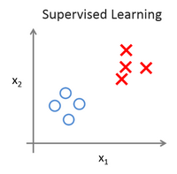

不得不说，吴恩达大牛的课讲的真是太棒了，听起来酣畅淋漓，很是舒服。这么好的课不做笔记实在是对不起自己。废话不多说，下面进入正题。
<!--more-->

第一周
======
1、引言(Introduction)
------
### 1.1 机器学习是什么？
关于机器学习，并没有一个明确的定义。
一个比较久远的是**Arthur Samuel**提出的定义：
> Field of study that gives computers the ability to learn without being explicitly programmed.

另一个是比较新的，由**Tom Mitchell**提出的定义：
> A computer program is said to learn from experience E with respect to some task T and some performance measure P, if its performance on T, as measured by P, improves with experience E. 
假设用P来评估计算机程序在某任务类T上的性能，若一个程序通过利用经验E在T中任务上获得了性能改善，则我们就说关于T和P，该程序对E进行了学习。

目前有各种类型的学习算法， 最主要的两类是**监督学习（Supervised learning）**和**无监督学习（Unsupervised learning）**。这也是我们以后将要学习的。
此外常见的还有**强化学习（Reinforcement learning）**和**半监督学习（Semi-Supervised Learning）**。

### 1.2 监督学习
**监督学习（Supervised learning）**指的是我们给学习算法一个数据集，这个数据集包含了“正确答案”。
监督学习中又有着两种常见的问题：**回归（Regression）**问题和**分类（Classification）**问题。

**回归（Regression）**指的是，我们试着推测出**连续**的输出值。比如下面的预测房价的例子。

**分类（Classification）**指的是，我们试着推测出**离散**的输出值。比如下面的推测乳腺癌肿瘤是否是良性的例子。

### 1.3 无监督学习
**无监督学习（Unsupervised learning）**是指给学习算法的数据集中，没有任何的标签。
看看下面的例子：

第一个图用“O”表示良性肿瘤，“×”表示恶性肿瘤。属于监督学习中的分类问题。
而第二个图中只给了一个数据集，其他的什么都没有。针对这个数据集，无监督学习可能判定该数据集有两个不同的**簇（cluster）**，并将它们分离开来。这就是**聚类算法（clustering algorithm）**。

2、单变量线性回归
------
### 2.1 模型表示
我们以预测房价的例子来说明。假设我们回归问题的**训练集（Training Set）**如下表所示：

一些以后会用到的符号的含义：
+ $m$代表训练集中实例的数量
+ $x$代表特征/输入变量
+ $y$代表目标变量/输出变量
+ $\left( x,y \right)$代表训练集中的实例
+ $(x^{(i)},y^{(i)})$代表第$i$ 个观察实例
+ $h$为将$x$映射到$y$的函数，称为**假设函数（hypothesis）**

下面看一下监督学习算法是怎样工作的：

我们向学习算法提供训练集，例如我们的房价训练集。学习算法的任务是输出一个函数（通常用小写h表示），该函数被称为**假设函数（hypothesis）**。假设函数的作用是将房子的大小作为输入变量$x$ ，并且输出该该房子的预测价格$y$。

$h$的一种可能的表达方式如下：
$$h_\theta \left( x \right)=\theta_{0} + \theta_{1}x$$
有时为了方便，我们会省略$h$的$\theta$下标。
因为只含有一个特征/输入变量，因此这样的问题叫作**单变量线性回归（Univariate linear regression）**问题。

### 2.2 代价函数
