第一章 深度学习简介及开发环境搭建
======
<!--more-->

1.1 人工智能与机器学习
------
**人工智能**是要让机器的行为看起来像人所表现出的智能行为一样.
人工智能包括**计算智能**、**感知智能**和**认知智能**等层次,目前人工智能还介于前两者之间.
目前人工智能所处的阶段还在**“弱人工智能”(Narrow AI)**阶段,距离**“强人工智能”(General AI)**还有较长的路要走.

**机器学习**是人工智能的一个分支,它是实现人工智能的一个核心技术,即以机器学习为手段解决人工智能中的问题.
**机器学习**是通过一些让计算机可以自动"学习"的算法并从数据中分析获得规律,然后利用规律对新样本进行预测.
**机器学习**的形式化的描述:对于某类任务**T**和性能度量**P**,如果一个计算机程序在**T**上一**P**衡量的性能随着经验**E**而自我完善,那么就称这个计算机程序在从经验**E**学习.
其实机器学习的过程与人类学习很相似,如下图:
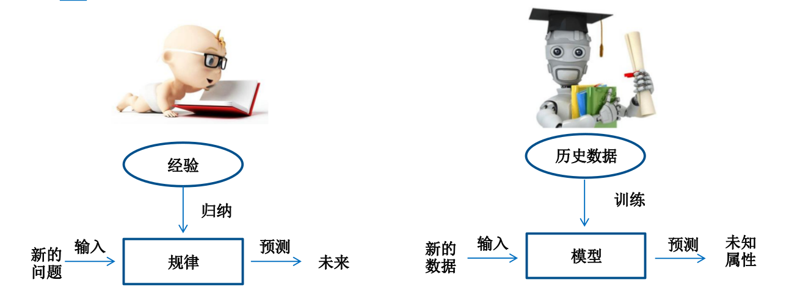

1.2 机器学习分类与算法简介
------
机器学习可分为如下几类:
+ 有监督学习
+ 无监督学习
+ 半监督学习
+ 强化学习

下面对其一一进行介绍:
**有监督学习(supervised learning)**:指的是事先需要准备好输入与正确的输出(区分方法)相配套的训练数据,让计算机进行学习,以便当它被输入某个数据时能够得到正确的输出(区分方法).

**无监督学习(unsupervised learning)**的目的是让计算机自己去学习怎样去做一些事情,所有数据只有特征而没有标记.
**无监督学习**被运用于仅提供输入用数据、需要计算机自己找出数据内在结构的场合.其目的是让计算机从数据中抽取其中所包含的模式和规则.

二者的中间地带是**半监督学习(semi-supervised learning)**.
对于半监督学习,其训练数据一部分有标记,另一部分沒有标记,而沒有标记数据的数量常常极大于有标记数据的数量.
它的基本规律是:数据的分布必然不是完全随机的,通过结合有标记数据的局部特征,以及大量没标记数据的整体分布,可以得到比较好的分类结果.

**强化学习(reinforcement learning,RL)**,是解决计算机从感知到决策控制的问题,从而实现通用人工智能.
强化学习是目标导向的,从白纸一张的状态开始,经由许多个步骤来实现某一维度上的目标最大化。最简单的理解是在训练过程中,不断去尝试,错误就惩罚,正确就奖励,由此训练得到的模型在各个状态环境中都最好.
对强化学习来说,它虽然没有标记,但有一个延迟奖励与训练相关,通过学习过程中的某种激励函数获得某种从状态到行动的映射.强化学习强调如何基于环境而行动,以取得最大化的预期利益.
强化学习一般应用于游戏、下棋等需要连续决策的领域.
无监督学习的典型应用模式有**聚类**.如下图:
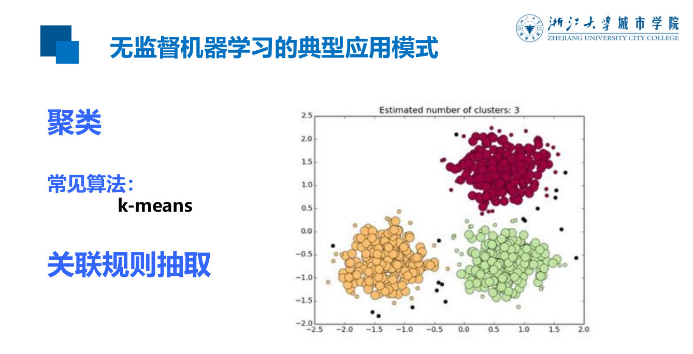
有监督学习的典型应用模式有**预测(针对连续数据)**和**分类(针对离散数据)**,如下图:
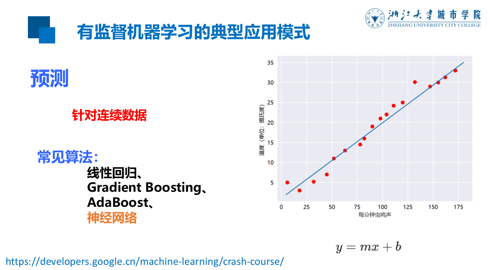
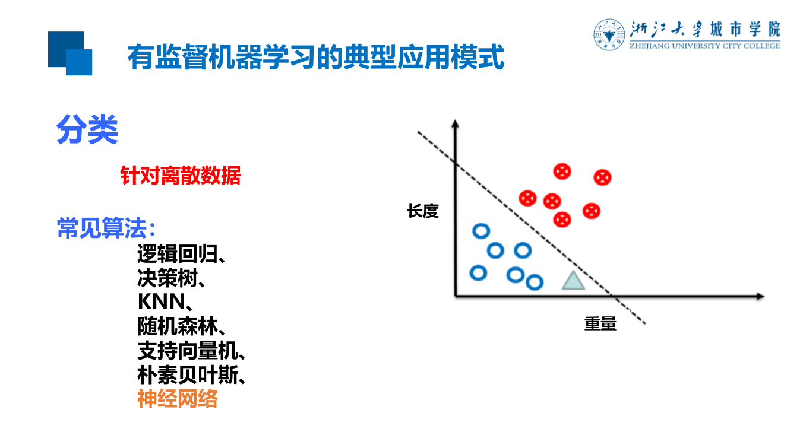

1.3 神经网络与深度学习
------
要介绍神经网络,首先要介绍神经元,生物神经元与神经元的数学模型对比如下图:
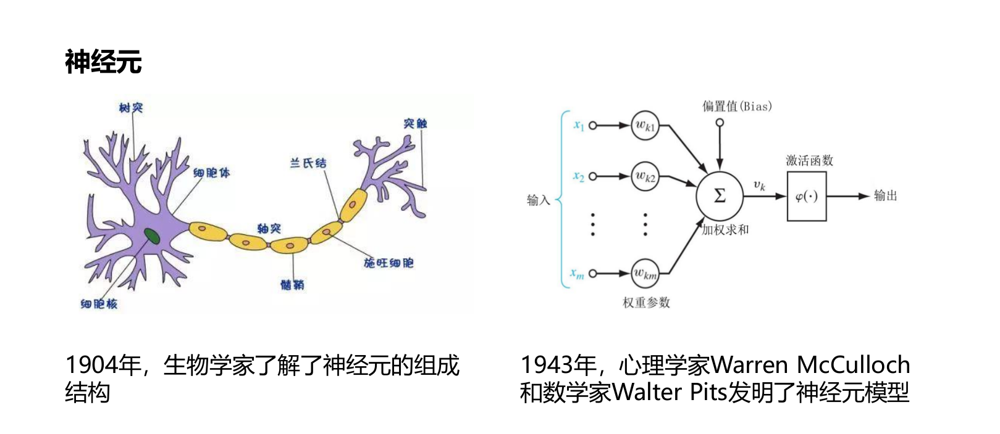
从上图来看,神经元的数学模型算是比较简单的,其有多个带权的输入和一个偏置值,对其进行加权求和后,再进行激活函数的运算,最后输出.
神经网络是由多个神经元相互连接而成,由一些神经元的输出作为另一些神经元的输入,如下图:
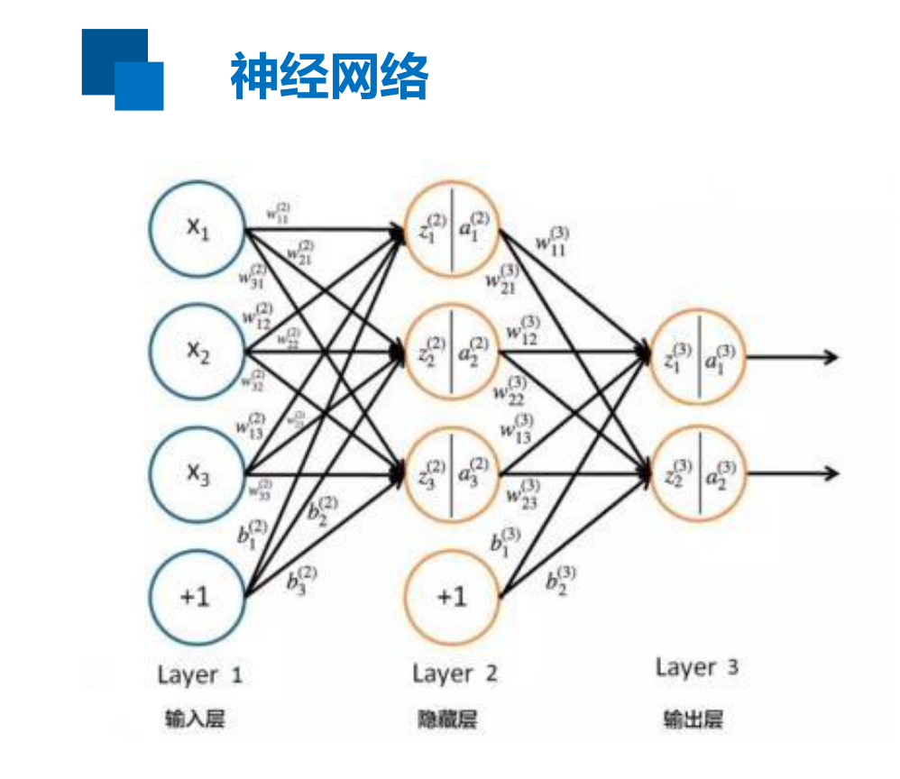
神经网络可分为**输入层**、**隐藏层**和**输出层**,**输入层**是接受输入数据的层,最后输出结果的层叫做**输出层**,中间的神经元组成的中间层叫做**隐藏层**.
我们通常所说的几层的神经网络通常是指的**隐藏层**的数目,比如上面的神经网络即为单层神经网络.
在大多数情况下,在设计神经网络时,根据具体要解决的问题,**输入层**和**输出层**往往是固定的,中间的**隐藏层**是需要重点设计的.
上图所示的神经网络为**全连接网络**,即后面的节点与前面所有节点均相连.
上图中神经网络的计算如下:
> z<sub>1</sub> = w<sub>11</sub>\*x<sub>1</sub> + w<sub>12</sub>\*x<sub>2</sub> + w<sub>13</sub>\*x<sub>3</sub> + b<sub>1</sub>
z<sub>2</sub> = w<sub>21</sub>\*x<sub>1</sub> + w<sub>22</sub>\*x<sub>2</sub> + w<sub>23</sub>\*x<sub>3</sub> + b<sub>2</sub>
z<sub>2</sub> = w<sub>21</sub>\*x<sub>1</sub> + w<sub>22</sub>\*x<sub>2</sub> + w<sub>33</sub>\*x<sub>3</sub> + b<sub>3</sub>
a<sub>1</sub> = *f*(z<sub>1</sub>)
a<sub>2</sub> = *f*(z<sub>2</sub>)
a<sub>3</sub> = *f*(z<sub>3</sub>)

上面公式中的b实际上就是偏置项,即图中最下方的标注着+1的节点.函数*f*(x)为激活函数,是非线性的.由激活函数得到一个**介于0到1之间**的**激活值**,以激活值作为神经元的输出.
下面介绍两种常见的激活函数:
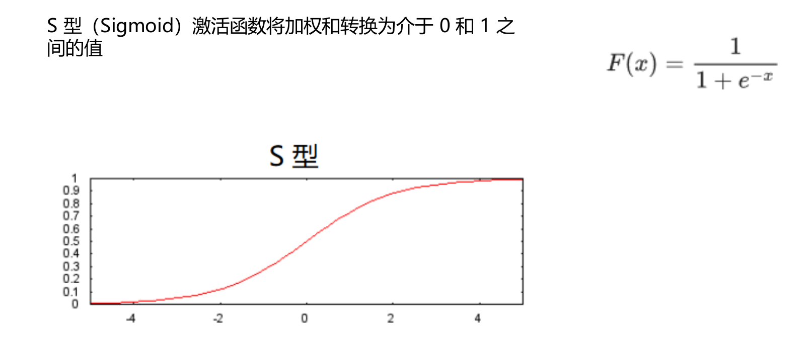
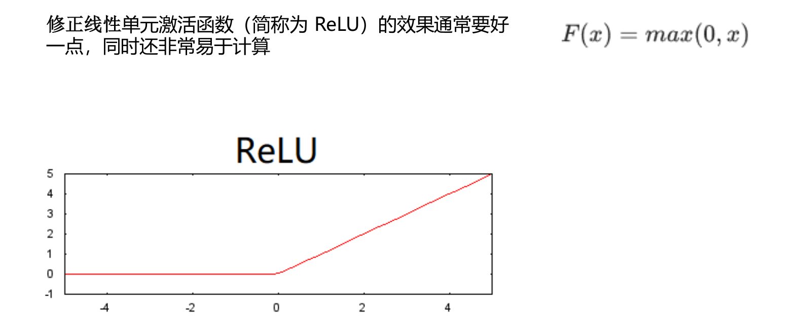

1.4 Anaconda和TensorFlow开发环境搭建
--------
环境的安装选择Anaconda,在这里不多进行介绍.
conda命令是Anaconda中管理包与环境的命令,tensorflow采用conda命令来安装,如下:
```
conda install tensorflow
```
这个命令将默认安装tensorflow2.0,并且将其安装到默认的base环境中.
但是tensorflow2.0与tensorflow1.x是不兼容的,而本次学习使用的是tensorflow1.x,所以我又安装了tensorflow1.15.0,不过这个放在了另一个环境中,如下:
```
conda env list	#列出所有环境
conda create -n tensorflow1 python=3.7	#新建一个名为tensorflow1的环境,并且指明python版本为3.7
conda activate tensorflow1	#激活环境
conda search tensorflow	#在该环境下查找并显示所有tensorflow包的信息
conda install tensorflow==1.15.0	#在该环境下安装1.15.0版本的tensorflow
conda deactivate	#退出该环境
```
下面再列出几个比较有用的conda命令:
```
conda env remove -n env_name	#删除名为env_name的环境
conda list -n env_name	#查看名为env_name的环境中的所有包,也可以直接在该环境中使用conda list命令
conda remove -n env_name package_name	#删除名为env_name的环境中的名为package_name的包,也可以在该环境中直接使用conda remove package_name命令
conda update conda	#更新conda
conda update anaconda	#更新anaconda
conda update package_name	#更新名为package_name的包
conda update --all	#更新所有库
```

第二章 TensorFlow编程基础
======
再次说明,下面所讲的都是基于TensorFlow1.x的,并不是TensorFlow2.0,下面正式开始.
先由一个Hello World示例开始:
```py
import tensorflow as tf

# 创建一个常数运算,将作为一个节点加入到默认计算图中
hello = tf.constant("Hello,World")

# 创建一个TF会话
sess = tf.Session()

# 运行并获得结果
print(sess.run(hello))
```
输出为:
```py
b'Hello,World'
```
输出前面的'b'表示Bytes literals(字节文字)

2.1 TensorFlow的基本概念
------
### 2.1.1 TensorFlow的计算模型:计算图
TensorFlow = Tensor + Flow
Tensor	张量
+ 数据结构:多维数组

Flow	流
+ 计算模型:张量之间通过计算而转换的过程

TensorFlow是一个通过**计算图**的形式表述计算的编程系统,每一个计算都是计算图上的一个节点,节点之间的边描述了计算之间的关系.
**计算图**是一种有向图,由以下内容构成:
+ 一组节点,每个**节点**都代表一个**操作**,是一种**运算**.
+ 一组有向边,每条**边**代表节点之间的**关系**(**数据传递**和**数据依赖**.

TensorFlow有两种边:
+ **常规边(实线)**:代表数据依赖关系.一个节点的运算输出成另一个节点的输入,两个节点之间有tensor流动**(值传递)**
+ **特殊边(虚线)**:不携带值,表示两个节点之间的**控制**相关性.比如,happens-before关系,源节点必须在目的节点执行完前完成执行

计算图的一个实例如下:
```py
#一个简单计算图
node1 = tf.constant(3.0,tf.float32,name="node1")
node2 = tf.constant(4.0,tf.float32,name="node2")
node3 = tf.add(node1,node2);

print(node3)
```
输出为:
```py
Tensor("Add:0", shape=(), dtype=float32)
```
输出的结果并不是一个数字,而是一个张量的结构.
上述代码的计算图在TensorBoard中的图形如下图:
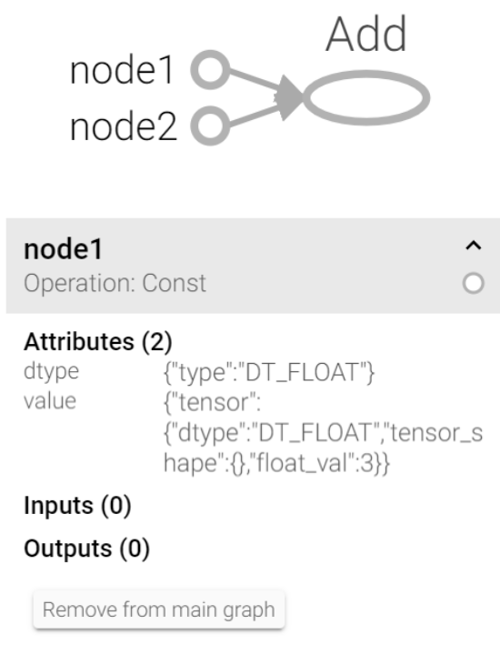
上例中输出node3并没有得到预想中的7.0,而是输出了一个张量的结构,这是因为**创建静态图只是建立静态计算模型,执行会话才能提供数据并获得结果**.如下:
```py
# 建立对话并显示运行结果
sess = tf.Session()
print("运行sess.run(node1)的结果: ",sess.run(node1))
print("运行sess.run(node3)的结果: ",sess.run(node3))

# 关闭会话
sess.close()
```
运行结果为:
```py
运行sess.run(node1)的结果:  3.0
运行sess.run(node3)的结果:  7.0
```
在Python3中print函数是自动换行的,如果想要其不换行,应写成如下形式:
```py
#设置分隔符参数 end
print(i, end = '' )
```

### 2.1.2 张量
在TensorFlow中,所有的数据都通过张量的形式来表示.上一节计算图的实例中所输出的就是张量.
从功能的角度,张量可以简单理解为多维数组:
+ **零阶张量**表示**标量(scalar)**,也就是**一个数**
+ **一阶张量**为**向量(vector)**,也就是**一维数组**
+ **n阶张量**可以理解为一个**n维数组**

张量并没有真正保存数字,它**保存的是计算过程**.
张量具有如下属性:
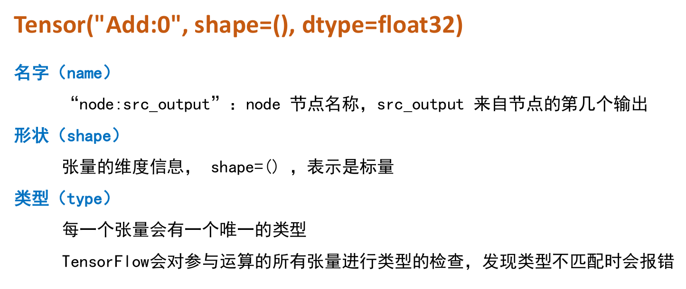
有三个术语描述张量的维度:**阶**(rank)、**形状**(shape)、**维数**(dimension number).如下:
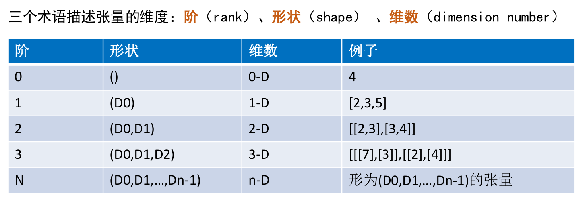
上面的形状属性括号内的D的含义为当前维度的元素个数.
下面是张量形状的代码示例:
```py
tens1 = tf.constant([[[1,2,2],[2,2,3]],
                    [[3,3,6],[5,4,3]],
                    [[7,0,1],[9,1,9]],
                    [[11,12,7],[1,3,14]]],name="tens1")
# 语句中包含[],{}或()括号中间换行的就不需要使用多行连接符

print(tens1)
```
输出为:
```py
Tensor("tens1:0", shape=(4, 2, 3), dtype=int32)
```
该张量的形状为(4,2,3),即第一维(即最外层维度)有4个元素,第二维有两个元素,第三维(即最内层的维度)有3个元素.
下面是另一段代码:
```py
scalar = tf.constant(100)
vector = tf.constant([1,2,3,4,5])
matrix = tf.constant([[1,2,3],[4,5,6]])
cube_matrix = tf.constant([[[1],[2],[3]],[[4],[5],[6]],[[7],[8],[9]]])

#get_shape()函数,获取张量的形状
print(scalar.get_shape())
print(vector.get_shape())
print(matrix.get_shape())
print(cube_matrix.get_shape())
```
运行结果:
```py
()
(5,)
(2, 3)
(3, 3, 1)
```

张量元素的获取也是非常简单的,下面对其进行介绍.
阶为1的张量等价于向量,通过**t[i]**获取元素.
阶为2的张量等价于矩阵,通过**t[i,j]**获取元素.
阶为3的张量,通过**t[i,j,k]**获取元素.
示例如下:
```py
tens1 = tf.constant([[[1,2],[2,3]],[[3,4],[5,6]]])

sess = tf.Session()
print(sess.run(tens1)[1,1,0])
sess.close()
```
运行结果为5.
需要注意的一点是访问的是张量的值,因此也要先运行.

TensorFlow支持14种不同的类型(下面只是列出了比较常用的一些,并未全部列出):
+ 浮点数: tf.float32、tf.float64
+ 整数: tf.int8、tf.int16、tf.int32、tf.int64、tf.uint8
+ 布尔: tf.bool
+ 复数: tf.complex64、tf.complex128
+ 字符串: tf.string

**默认类型**:不带小数点的数会被默认为int32,带小数点的数会被默认为float32
**TensorFlow会对参与运算的所有张量进行类型的检查,发现类型不匹配是时会报错**.
注意!只要不是一个类型就会报错,哪怕是int32与int64之间进行运算也会报错.

### 2.2.3 操作
计算图中的**节点**就是**操作**(Operation)
+ 一次加法也是一个操作
+ 一次乘法也是一个操作
+ 构建一些变量的初始值也是一个操作

每个运算操作都有**属性**,它在构建图的时候需要确定下来.
操作可以和计算**设备绑定**,指定操作在某个设备上执行.比如让CPU运行某些操作,让GPU运行另一些操作.
操作之间存在顺序关系,这些操作之间的的**依赖**就是**"边"**.
如果操作A的输入是操作B执行的结果,那么这个操作就依赖于操作B.
代码示例如下:
```py
# 定义变量a
a = tf.Variable(1,name="a")
# 定义操作b为a+1
b = tf.add(a,1,name="b")
#定义操作c为b*4
c = tf.multiply(b,4,name="c")
#定义d为c-b
d = tf.subtract(c,b,name="d")
```
其在TensorBoard中的计算图如下:
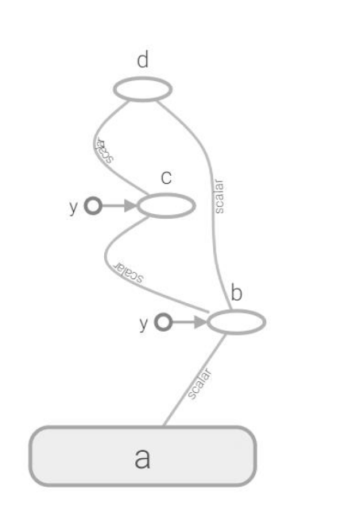

TensorFlow中大多数运算符都进行了重载操作，使我们可以快速使用 (+ - \* /) 等，但是有一点不好的是使用重载操作符后就不能为每个操作命名了。下面一些TensorFlow中具体的运算方法：
```py

# 算术操作符：+ - * / % 
tf.add(x, y, name=None)        # 加法(支持 broadcasting)
tf.subtract(x, y, name=None)   # 减法
tf.multiply(x, y, name=None)   # 乘法
tf.divide(x, y, name=None)     # 浮点除法, 返回浮点数(python3 除法)
tf.mod(x, y, name=None)        # 取余
 
# 幂指对数操作符：^ ^2 ^0.5 e^ ln 
tf.pow(x, y, name=None)        # 幂次方
tf.square(x, name=None)        # 平方
tf.sqrt(x, name=None)          # 开根号，必须传入浮点数或复数
tf.exp(x, name=None)           # 计算 e 的次方
tf.log(x, name=None)           # 以 e 为底，必须传入浮点数或复数
```

2.2 TensorFlow的基本的运算
------
### 2.2.1 会话
**会话**拥有并管理TensorFlow程序运行时的所有**资源**,当所有计算完成之后需要**关闭会话**帮助系统**回收资源**.
示例如下:
```py
# 定义计算图
tens1 = tf.constant([1,2,3])

# 创建一个会话
sess = tf.Session()

# 使用这个创建好的会话来得到关心的运算的结果,比如可以调用sess.run(result)
# 来得到张量result的取值
print(sess.run(tens1))

# 关闭会话使得本次运行中使用到的资源可以被释放
sess.close()
```
需要注意的一点,创建会话的tf.Session()函数第一个S需要大写.
需要明确调用 Session.close()函数来关闭会话并释放资源,在上述程序中,当程序因为异常退出时,关闭会话函数可能就不会被执行从而导致资源泄漏.
因此可以通过下面两种模式来确保会话的关闭.

会话的模式1:使用Python中的finally语句.示例代码如下:
```py
# 定义计算图
tens1 = tf.constant([1,2,3])

# 创建一个会话
sess = tf.Session()

try:
    print(sess.run(tens1))
except:
    print("Exception!")
finally:
    #确保能关闭会话使得本次运行中使用到的资源可以被释放
    sess.close()
```

会话的模式2:使用Python中的with语句.示例代码如下:
```py
node1 = tf.constant(3.0,tf.float32,name="node1")
node2 = tf.constant(4.0,tf.float32,name="node2")
result = tf.add(node1,node2)

# 创建一个会话,并通过Python中的上下文管理器来管理这个会话
with  tf.Session() as sess:
    # 使用创建好的会话来计算关系的结果
    print(sess.run(result))

# 不需要再调用Session.close()函数来关闭会话
# 当上下文退出时会话关闭和资源释放也自动完成了
```

TensorFlow不会自动生成默认的会话,需要手动指定.
当默认的会话被指定之后就可以通过**tf.Tensor.eval()函数**来计算一个张量的取值.
代码示例如下:
```py
node1 = tf.constant(3.0,tf.float32,name="node1")
node2 = tf.constant(4.0,tf.float32,name="node2")
result = tf.add(node1,node2)

sess = tf.Session()
with sess.as_default():
    print(result.eval())
```
或者用如下方式也是可以的:
```py
node1 = tf.constant(3.0,tf.float32,name="node1")
node2 = tf.constant(4.0,tf.float32,name="node2")
result = tf.add(node1,node2)

with tf.Session() as sess:
    print(result.eval(session=sess))
```
我在这里还发现了一个比较有意思的现象,如果像下面这样写的话,运行会报错:
```py
sess = tf.Session()
sess.as_default()
print(result.eval())
sess.close()
```
但是改成下面这样就可以正确运行了.
```py
with tf.Session() as sess:
    sess.as_default()
    print(result.eval())
```
刚开始的那个写法是不正确的 ,但为什么不正确我也不太清楚.vscode给出的提示如下:Use `with sess.as_default()` or pass an explicit session to `eval(session=sess)`.以后还是用这两种形式指定默认会话吧.
在交互式环境下,Python脚本或者Jupyter编辑器下,通过设置默认会话来获取张量的取值更加方便.
**tf.InteractiveSession()**,这个函数会生成一个会话并自动将生成的会话注册为默认会话.
```py
sess = tf.InteractiveSession()

print(result.eval())
sess.close()
```

### 2.2.2 常量和变量
**常量(constant)**是在运行过程中不会改变的单元,在TensorFlow中无须进行初始化操作.函数原型如下:
```py
tf.constant(
    value,
    dtype=None,
    shape=None,
    name='Const',
    verify_shape=False
)
```
**value**:是一个必须的值,可以是一个数值或字符串,也可以是一个列表.可以是一维的,也可以是多维的.
**dtype**:数据类型.
**shape**:张量的"形状",即维数及每一维的大小.
**name**:张量的名字,字符串类型.
**verify_shape**:默认为False,如果修改为True的话表示检查value的形状与shape是否相符,如果不符会报错.
示例代码如下:
```py
a = tf.constant(1.0,dtype=tf.float32,name='a')
b = tf.constant(2.5,dtype=tf.float32,name='b')
c = tf.add(a,b,name='c')

with tf.Session() as sess:
    c_value = sess.run(c)
    print(c_value)
```
输出结果为3.5.

**变量(Variable)**是在运行过程中会改变的单元,在TensorFlow中须进行**初始化操作**.
变量的定义与常量很相似,虽然函数有很多参数,但最常用的还是初始值,数据类型,名字这三个.函数原型如下:
```py
# V是大写!
tf.Variable(
    initial_value=None,
    trainable=True,
    collections=None,
    validate_shape=True,
    caching_device=None,
    name=None,
    variable_def=None,
    dtype=None,
    expected_shape=None,
    import_scope=None
)
```
**变量**须进行**初始化操作**,进行初始化的语句如下:
```py
# 个别变量初始化,这里的name_variable为你自己定义的变量名
init_op = name_variable.initializer()

# 所有变量初始化
init_op = tf.global_variables_initializer()
```
示例代码如下:
```py
node1 = tf.Variable(3.0,dtype=tf.float32,name='node1')
node2 = tf.Variable(4.0,dtype=tf.float32,name='node2')
result = tf.add(node1,node2,name='add')

with tf.Session() as sess:
    #变量初始化
    init = tf.global_variables_initializer()
    sess.run(init)
    
    print(sess.run(result))
```
输出结果为7.0
上面的代码增加了一个init初始化变量,并**调用会话的run命令对参数进行初始化**.这里一定要注意!
上述代码中调用tf.global_variables_initializer()函数只是进行了一个定义,并没有对变量进行初始化,必须要使用run命令对参数进行初始化.如果吧上面代码中的sess.run(init)删除后再运行的话,会发生错误.

### 2.2.3 变量的赋值
与传统编程语言不同,TensorFlow中的变量定义后,一般无需人工赋值,系统会根据算法模型,训练优化过程中**自动调整变量对应的数值**.
比如权重Weight变量w,经过多次迭代,会自动调整.如果不想让其自动调整,可以在定义变量时将trainable属性置为False.如下:
```py
epoch = tf.Variable(0,name='epoch',trainable=False)
```
特殊情况需要人工更新的,可用tf.assign()进行变量赋值,函数参数如下:
```py
tf.assign(
    ref,
    value,
    validate_shape=None,
    use_locking=None,
    name=None
)
```
函数将value的值赋给ref.其中,**ref必须是tf.Variable创建的Tensor**,我看文档里说value也是Tensor,但是在调用函数时将数值或者列表传递给value时也可以运行,可能是被包装成Tensor了吧.此外,默认情况下ref的shape和value的shape是相同的.
代码示例如下:
```py
import tensorflow as tf

value = tf.Variable(0,name='value')
one = tf.constant(1)
new_value = tf.add(value,one)
# 将new_value的值赋给value
update_value = tf.assign(value,new_value)

init = tf.global_variables_initializer()

with tf.Session() as sess:
    sess.run(init)
    for _ in range(10):
    	# 执行赋值操作
        sess.run(update_value)
        print(sess.run(value),end=' ')
```
输出结果为:
```py
1 2 3 4 5 6 7 8 9 10 
```
同样的,上面的代码调用assign函数只是定义了一个赋值操作,要想执行该操作,必须要再调用run命令.
下面再贴一段计算1+2+3+...+10的代码:
```py
sum_value = tf.Variable(0,name='sum_value')
number = tf.Variable(1,name='number')
one = tf.constant(1)

new_sum_value = tf.add(sum_value,number)
new_number = tf.add(number,one)

update_op1 = tf.assign(sum_value,new_sum_value)
update_op2 = tf.assign(number,new_number)

init = tf.global_variables_initializer()

with tf.Session() as sess:
    sess.run(init)
    for _ in range(10):
        sess.run(update_op1)
        sess.run(update_op2)
    print(sess.run(sum_value)) 
```
输出结果为55.

### 2.2.4 占位符、Feed数据填充和Fetch数据获取
TensorFlow中的**Variable变量类型**,在定义时需要初始化,但有些变量**定义时并不知道其数值**,只有当真正开始运行程序时,才由外部输入,比如训练数据,这时候需要用到**占位符**.
tf.placeholder**占位符**,是TensorFlow中特有的一种数据结构,类似动态变量,函数的参数、或者C语言或者Python语言中格式化输出时的"%"占位符.
占位符Placeholder的函数参数如下:
```py
tf.placeholder(
    dtype,
    shape=None,
    name=None
)
```
这里的shape参数可以是元组，也可以是列表。
示例如下:
```py
# 此代码生成一个2*3的二维数组,矩阵中每个元素的类型都是tf.float32,
# 内部对应的符号名称是tx
x = tf.placeholder(tf.float32,[2,3],name='tx')

# 只指定列数为3，不指定行数，None表示行的数量未知
y = tf.placeholder(tf.float32,[None,3],name='ty')
```

如果构建了一个包含placeholder操作的计算图,当在session中调用run方法时,placeholder占用的变量必须通过**feed_dict参数**传递进去,否则会报错.
传值时须按字典格式,以占位符的变量名为键,以所要传递的数据为值.
示例代码如下:
```py
a = tf.placeholder(tf.float32,name='a')
b = tf.placeholder(tf.float32,name='b')
c = tf.multiply(a,b,name='c')

init = tf.global_variables_initializer()

with tf.Session() as sess:
    sess.run(init)
    # 通过feed_dict的参数传值,按字典格式
    result = sess.run(c,feed_dict={a:8.0,b:3.5})
    print(result)
```
输出结果为28.0

**多次操作可以通过一次Feed完成执行**:
```py
a = tf.placeholder(tf.float32,name='a')
b = tf.placeholder(tf.float32,name='b')
c = tf.multiply(a,b,name='c')
d = tf.subtract(a,b,name='d')

init = tf.global_variables_initializer()

with tf.Session() as sess:
    sess.run(init)
    
    result = sess.run([c,d],feed_dict={a:[8.0,2.0,3.5],b:[1.5,2.0,4.0]})
    
    print(result)
    # 取结果中的第一个
    print(result[0])
```
输出为:
```py
[array([12.,  4., 14.], dtype=float32), array([ 6.5,  0. , -0.5], dtype=float32)]
[12.  4. 14.]
```
话说这里的输出结果不就是numpy中的数组类型吗,而且计算也跟numpy中的一样.

也可以**一次返回多个值分别赋给多个变量**,Python中是支持这种用法的.
示例代码如下:
```py
a = tf.placeholder(tf.float32,name='a')
b = tf.placeholder(tf.float32,name='b')
c = tf.multiply(a,b,name='c')
d = tf.subtract(a,b,name='d')

init = tf.global_variables_initializer()

with tf.Session() as sess:
    sess.run(init)
    
    #返回的两个值分别赋给两个变量
    rc,rd = sess.run([c,d],feed_dict={a:[8.0,2.0,3.5],b:[1.5,2.0,4.0]})
    
    print('value of c = ',rc,'value of d = ',rd)
```
输出为:
```py
value of c =  [12.  4. 14.] value of d =  [ 6.5  0.  -0.5]
```

2.3 TensorBoard可视化初步
------
TensorBoard是TensorFlow的可视化工具,通过TensorFlow程序运行过程中输出的日志文件可视化TensorFlow程序的运行状态.
TensorBoard和TensorFlow程序跑在不同的进程中.
示例代码如下:
```py
# 清除default graph和不断增加的节点
tf.reset_default_graph()

# logdir改为自己机器上的合适路径,我这里用的是相对路径
logdir = 'log/'

# 定义一个简单的计算图,实现向量加法的操作
input1 = tf.constant([1.0,2.0,3.0],name='input1')
input2 = tf.Variable(tf.random_uniform([3]),name='input2')
output = tf.add_n([input1,input2],name='add')

# 生成一个写日志文件的Writer,并将当前的TensorFlow计算图写入日志
writer = tf.summary.FileWriter(logdir,tf.get_default_graph())
writer.close()
```
然后在终端中运行如下命令:
```
# /path/log改为你自己机器上日志文件的存放位置
tensorboard --logdir=/path/log
```
这样就会运行TensorBoard了,启动服务的端口默认为6006,使用--port参数可以改变启动服务的端口.
在浏览器访问http://localhost:6006即可打开TensorBoard.
下面是TensorBoard中的常用API:
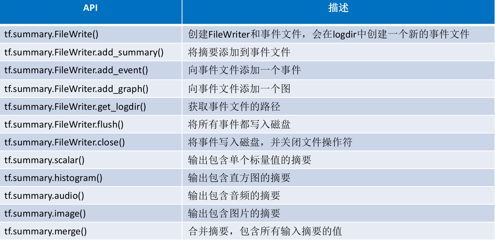

第三章 单变量线性回归:TensorFlow实战
======
3.1 监督式机器学习的基本术语
------
### 3.1.1 样本、特征、标签与模型
**机器学习系统**：通过学习如何组合输入信息，来对未见过的数据做出有用的预测。
下面通过一个简单的线性回归案例来对一些基本的术语进行介绍。
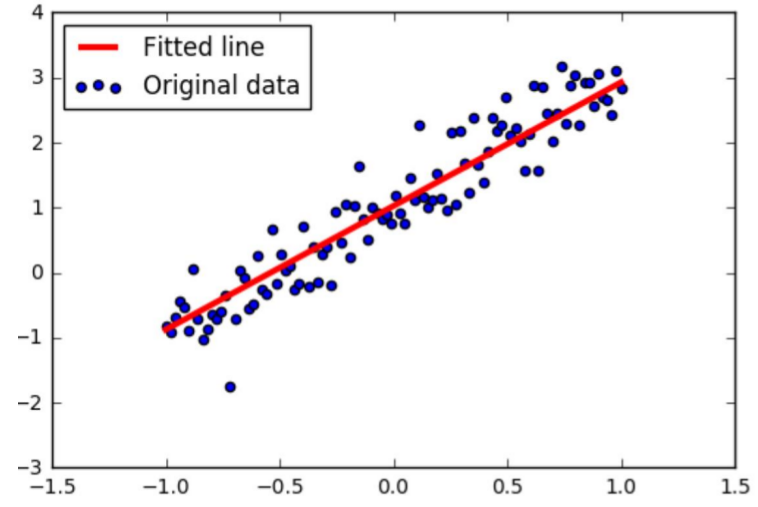
可以看到图中的原始数据点的分布符合某种规律，可以画出一条直线，使这些点相对均匀的分布在直线两侧。假设该直线方程为y = w*x + b，该方程即为线性回归方程。
**标签**是我们要预测的事物，在简单线性回归中为y变量。
**特征**是指用于描述数据的输入变量，在简单线性回归中为x变量。简单的机器学习项目可能会使用单个特征，而比较复杂的机器学习项目可能会使用数百万个特征，按如下方式指定：{x<sub>1</sub>,x<sub>2</sub>,...,x<sub>n</sub>}变量。
**样本**是指数据的特定实例。可分为如下两类：
+ 有标签样本
+ 无标签样本

**有标签样本**同时包含特征和标签。用于训练模型。在简单线性回归中为{x,y}。
**无标签样本**包含特征，但不包含标签。用于对新数据进行预测。在简单线性回归中为{x,?}。
**模型**可将无标签样本映射到预测标签y'。y'由模型内部参数定义，这些内部参数值是通过学习得到的。

### 3.1.2 训练与损失
**训练**模型表示通过**有标签样本**来学习所有**权重**和**偏差**的理想值。
在监督式学习中，机器学习算法通过以下方式构建模型：检查多个样本并尝试找出可最大限度地**减少损失**的模型。这一过程称为**经验风险最小化**。

损失是对糟糕预测的惩罚：**损失（loss）**是一个数值，表示对于**单个样本**而言模型预测的准确程度。**代价（cost）**是指**整个训练集**上所有样本误差的平均。不过现在很多都把损失与代价混着用了。
如果模型的预测完全准确，则损失为零，否则损失会较大。
**训练模型的目标**是从所有样本中找到一组**平均损失“较小”**的权重和偏差。
下面举个损失的例子：
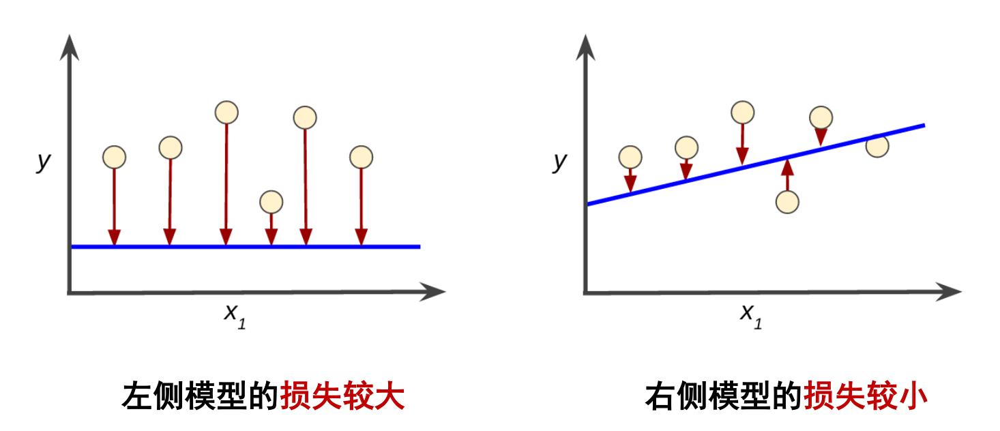
下面介绍一下常用的损失函数：
**L<sub>1</sub>损失**：基于模型预测的值与标签的实际值之差的绝对值。
**平方损失**：一种常见的损失函数，又称**L<sub>2</sub>损失**，其为L<sub>1</sub>损失的平方。
**均方误差（MSE)**：指的是每个样本的平均平方损失。计算公式如下：
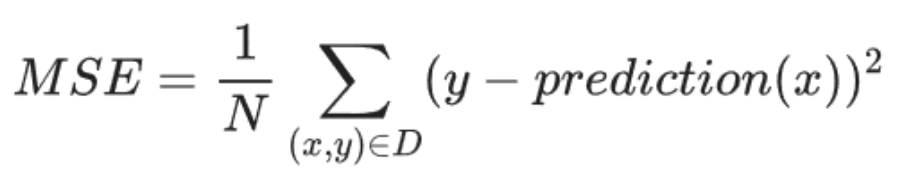
上面公式中的prediction(x)为y的预测值。
均方误差是常用的**代价函数**。但是也有很多地方代价函数与损失函数这两种说法混用。

### 3.1.3 模型训练与降低损失
训练模型的迭代过程如下：
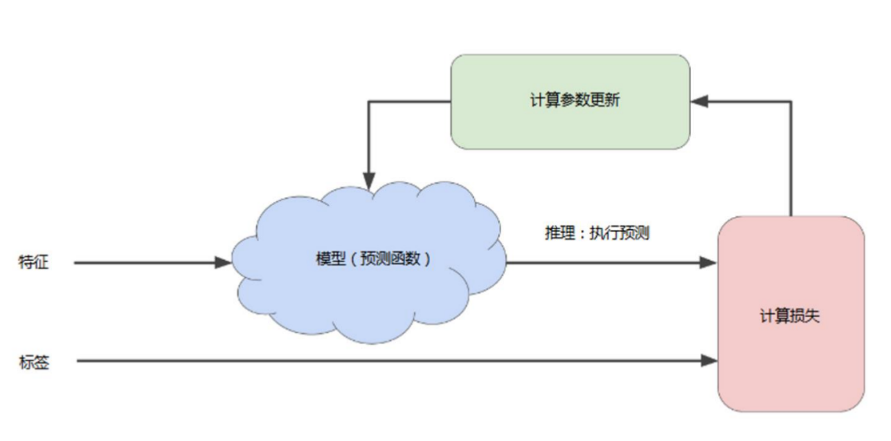
模型训练要点：首先对权重w和偏差b进行初始猜测，然后反复调整这些猜测，直到获得损失可能最低的权重和偏差为止。

在学习优化过程中，机器学习系统将根据所有标签去重新评估所有特征，为损失函数生成一个新值，而该值又产生新的参数值。
通常，你可以不断迭代，直到总体损失不再变化或至少变化及其缓慢为止。这时候，我们可以说该模型已**收敛**。

如果采用均方差作为该线性回归模型的代价函数，则其为**凸函数**。如下图：
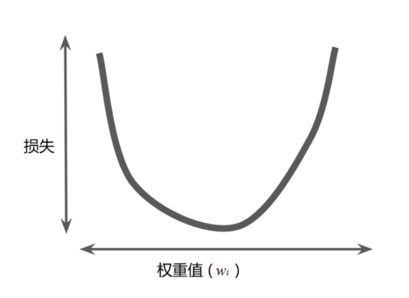
上图中的纵坐标严格来说应该是**代价**，而不是**损失**。凸形问题**只有一个最低点**；即只存在一个**斜率正好为0**的位置，这个最小值就是损失函数收敛之处。
值得一提的是，这里的凸函数与统计高数教材上的定义恰恰相反，这里的凹凸均是指的向下凹或向下凸。国外大多采用的这种定义。下面详细说一下这里的凸函数的定义。
对区间[a,b]上定义的函数f，若它对区间中任意两点x1和x2，均有f((x1+x2)/2)<=(f(x1)+f(x2))/2，则称f为区间[a,b]上的凸函数。对实数集上的函数，可通过求二阶导数来判别。若二阶导数在区间上非负，则称为凸函数，若二阶导数恒大于0，则称为严格凸函数。
显然这里的代价函数为凸函数，因为其二阶导数恒大于等于零。

### 3.1.4 梯度下降法与超参数
**梯度**：一个向量（矢量），表示某一函数在该点的**方向导数**沿着该方向取得**最大值**，即函数在该点处沿着该方向（此梯度的方向）变化最快，变化率最大。
**梯度**是矢量，具有**方向**和**大小**。
**梯度下降法**即沿着**负梯度方向**进行下一步探索，最终会到达一个**局部最小值点**。关于**梯度下降**和**反向传播算法**的详细内容可以去B站上看一下3b1b的视频，讲的挺不错的。
但是沿着负梯度方向进行下一步探索，**前进多少合适？**
用**负梯度**乘以一个称为**学习速率**（有时也称为**步长**）的标量，以确定下一个点的位置。
因此**反向传播算法**中跟新参数时，新参数等于旧参数加上负梯度乘学习率。
不过学习率要选的合适才会有比较好的效果，至于多少合适，也没有明确的方法指导，只有自己看着设置了。学习率设置不当的后果如下：
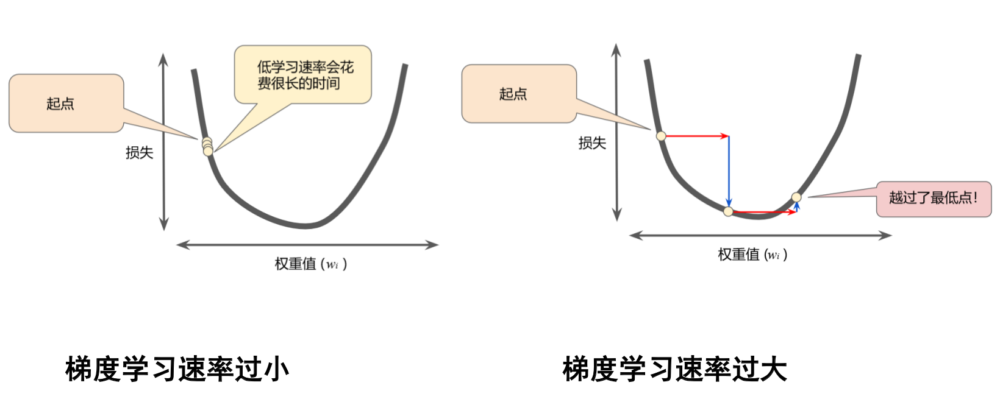

在机器学习中，**超参数**是在开始学习过程**之前**设置值的参数，而不是通过训练得到的参数数据。通常情况下，需要对超参数进行优化，选择一组好的超参数，可以提高学习的性能和效果。
**超参数**是编程人员在机器学习算法中用于调整的旋钮。（原来传说中的调参侠是这么来的......）
典型超参数：学习率、神经网络的隐含层数量......

3.2 线性回归问题TensorFlow实战
------
### 3.2.1 基本步骤
使用TensorFlow进行算法设计与训练的核心步骤如下：
1. 准备模型
2. 构建模型
3. 训练模型
4. 进行预测

上述步骤是我们使用TensorFlow进行算法设计与训练的核心步骤，贯穿于后面介绍的具体实战中，本章用一个简单的例子来讲解这几个步骤。
单变量的线性方程可以表示为：y = w*x + b。本例通过生成人工数据集，随机生成一个近似采样随机分布，使得w=2.0,b=1,并加入一个噪声，噪声的最大振幅为0.4。
部分代码如下：
```py
# 在Jupyter中，使用matplotlib显示图像需要设置为inline模式，否则不会显示图像
%matplotlib inline

import matplotlib.pyplot as plt
import numpy as np
import tensorflow as tf

# 设置随机数种子
np.random.seed(5)

# 直接采用np生成等差数列的方法，生成100个点，每个点的取值在-1～1之间
x_data = np.linspace(-1,1,100)

# y = 2*x + 1 + 噪声，其中，噪声的维度与x_data一样
# randn生成的随机数为标准正态分布
y_data = 2*x_data + 1.0 + np.random.randn(*x_data.shape) * 0.4
```
上面的x_data与y_data均为一维的shape为（100,）的ndarray数组。
其中，关于numpy和matplotlib的用法我之前的博客。
上面代码中最后一句中的\*的作用具体见下面这篇博客：[https://blog.csdn.net/yilovexing/article/details/80577510](https://blog.csdn.net/yilovexing/article/details/80577510) 

利用matplotlib画出生成结果：
```py
# 画出随机生成数据的散点图
plt.scatter(x_data,y_data)

# 画出我们想要学习到的线性函数y = 2*x + 1
plt.plot(x_data,2*x_data + 1.0,color='red',linewidth=3)
```
所绘制图形如下：
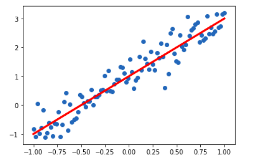

构建模型：
```py
# 定义训练数据的占位符，x是特征值，y是标签值
x = tf.placeholder(np.float32,name='x')
y = tf.placeholder(np.float32,name='y')

# 定义模型函数
def model(x,w,b):
    return tf.multiply(x,w) + b
```

定义模型结构：
```py
# 构建线性函数的斜率，变量w
w = tf.Variable(1.0,name='w0')

#构建线性函数的截距，变量b
b = tf.Variable(0.0,name='b0')

# pred是预测值，前向计算
pred = model(x,w,b)
```

设置训练参数：
```py
# 迭代次数
train_epochs = 10

# 学习率
learning_rate = 0.05
```

定义损失函数：
+ 损失函数用于描述预测值与真实值之间的误差，从而指导模型收敛方向。
+ 常见损失函数：均方差(Mean Square Error, MSE)和交叉熵(cross-entropy)。
交叉商后面再说，这里我们用L<sub>2</sub>损失函数（均方差）。代码如下：
```py
# 采用均方差作为损失函数
loss_function = tf.reduce_mean(tf.square(y - pred))
```

定义优化器：
定义优化器Optimizer，初始化一个GradientDescentOptimizer。
设置学习率，设置优化目标：最小化损失。
```py
#梯度下降优化器
optimizer = tf.train.GradientDescentOptimizer(learning_rate).minimize(loss_function)
```

初始化及开始训练：
```py
# 声明会话
sess = tf.Session()

# 变量初始化
init = tf.global_variables_initializer()
sess.run(init)

# 开始迭代训练，轮数为epoch，采用SGD随机下降优化方法
for epoch in range(train_epochs):
    for xs,ys in zip(x_data,y_data):
        _,loss = sess.run([optimizer,loss_function],feed_dict = {x:xs,y:ys})
    b0temp = b.eval(session=sess)
    w0temp = w.eval(session=sess)
    plt.plot(x_data,w0temp * x_data + b0temp)    # 在一个绘图区域内绘制出迭代训练结果图形
```
图形如下：
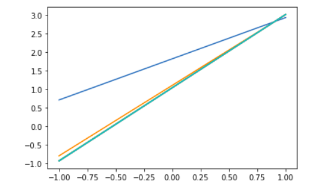
从上图可以看出,本案例所拟合的模型较简单，训练3次之后已经接近收敛，对于复杂模型，需要更多次训练才能收敛。

关于上面代码中的**zip()函数**，由于用的比较多，我在这里给出一些说明。
zip() 函数用于将可迭代的对象作为参数，将对象中对应的元素打包成一个个元组，然后返回由这些元组组成的**zip对象**。每个元组依次取各个可迭代对象的一个元素所组合成的。
我们可以使用list()转换来输出列表。
当传入参数的长度不同时，zip能自动以最短序列长度为准进行截取。
此外，**\*号操作符**可以实现zip()函数的逆过程，将zip对象变成原先组合前的数据。
zip语法：
```py
# 其参数为一个或多个迭代器，可以是元组、列表、字典等类型。
zip([iterable, ...])
```
下面是示例代码：
```py
In [1]: a = [1,2,3]

In [2]: b = [4,5,6]

In [3]: c = [4,5,6,7,8]

In [4]: zipped1 = zip(a)	# 一个参数时

In [5]: zipped1	# zip()函数返回值为zip对象
Out[5]: <zip at 0x7f8f08027f88>

In [6]: list(zipped1)	# 使用list()函数将其转化为列表
Out[6]: [(1,), (2,), (3,)]

In [7]: zipped2 = zip(a,b)	# 两个参数时

In [8]: list(zipped2)
Out[8]: [(1, 4), (2, 5), (3, 6)]

In [9]: zipped3 = zip(b,c)	# 不同长度

In [10]: list(zipped3)	# 以最短序列长度为准
Out[10]: [(4, 4), (5, 5), (6, 6)]

In [11]: zipped = zip(a,b)

In [12]: unzipped = zip(*zipped)	# 与zip()相反，zip(*)可理解为解压，将zip对象变成原先组合前的数据

In [13]: list(unzipped)
Out[13]: [(1, 2, 3), (4, 5, 6)]
```
需要注意的是，这里有一个坑！看下面的代码：
```py
In [1]: a = [1,2,3]

In [2]: b = [4,5,6]

In [3]: zipped = zip(a,b)

In [4]: list(zipped)
Out[4]: [(1, 4), (2, 5), (3, 6)]

In [5]: list(zipped)	# 这里居然输出了一个空列表！
Out[5]: []
```
为什么会出现上面这种情况呢，主要是因为zip对象是一个**迭代器**。**迭代器只能前进，不能后退**。
拿上面的代码来说，list()函数执行完后，迭代器的内部指针已经指向的内部的最后一个元组，然后到了下一个list()函数的时候，迭代器只能前进不能后退，所以指针没有被重置，此时迭代器已经没有元组可返回了，所以结果为空list。
zip()函数的介绍告一段落，下面接着开始正题。

当训练完成后，打印查看参数。代码如下：
```py
print('w: ',sess.run(w))    # w的值应该在2附近
print('b: ',sess.run(b))    # b的值应该在1附近
```
输出为：
```py
w:  1.9822965
b:  1.0420128
```

结果可视化：
```py
plt.scatter(x_data,y_data,label='Original')
plt.plot(x_data,x_data * sess.run(w) + sess.run(b),
        label='Fitted line',color='r',linewidth=3)
plt.legend()    # 显示图例
```
绘制图形如下：
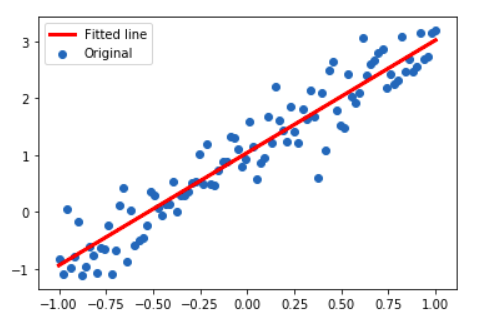

利用模型进行预测：
```py
x_test = 3.21
predict = sess.run(pred,feed_dict={x:x_test})
print('预测值：%f' % predict)

target = 2 * x_test + 1.0
print('目标值：%f' % target)
```
输出为：
```py
预测值：7.405184
目标值：7.420000
```

以上通过一个线性回归的简单例子介绍了利用TensorFlow实现机器学习的思路，重点讲解了下述步骤：
1. 生成人工数据集及其可视化
2. 构建线性模型
3. 定义损失函数
4. 定义优化器、最小化损失函数
5. 训练结果的可视化
6. 利用学习完成的模型进行预测

### 3.2.2 显示损失Loss
对之前进行训练的代码进行一些修改，使其能够显示损失值：
```py
# 开始训练，轮数为epoch，采用SGD随机下降优化方法
step = 0    # 记录训练步数
loss_list = []    #用于保存loss值的列表
display_step = 10    #控制报告的粒度

for epoch in range(train_epochs):
    for xs,ys in zip(x_data,y_data):
        _,loss = sess.run([optimizer,loss_function],feed_dict = {x:xs,y:ys})
        # 显示损失值loss
        loss_list.append(loss)
        step = step + 1
        if step % display_step == 0:
            print('Train Epoch: %02d   Step: %03d   loss= %.9f'
                 % (epoch + 1,step,loss))
            
    b0temp = b.eval(session=sess)
    w0temp = w.eval(session=sess)
    plt.plot(x_data,w0temp * x_data + b0temp)    #在一个绘图区域内绘制出训练图形
```
上述代码中定义了一个display_step变量来控制报告的粒度。例如，如果display_step设为10，则将每训练10个样本就输出一次损失值。与超参数不同，修改diaplay_step不会更改模型学习的规律。
还可以图形化显示损失值。如下图：
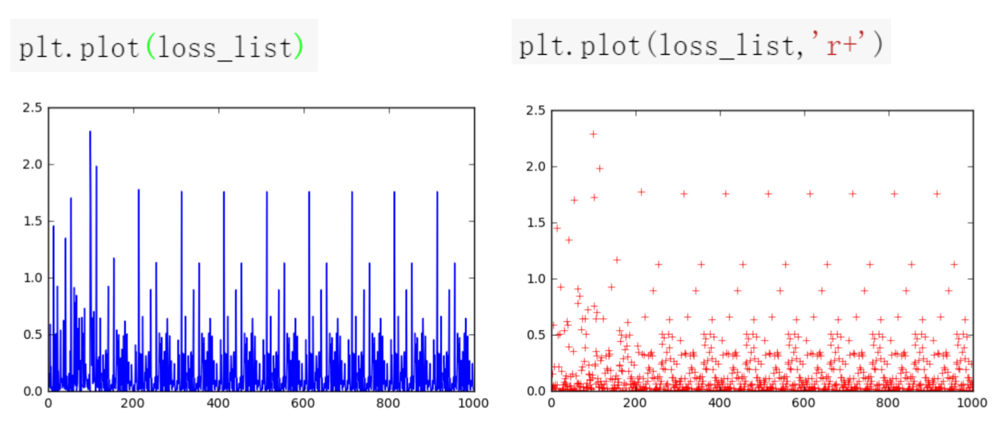

在梯度下降法中，**批量**指的是用于在单次迭代中计算梯度的样本总数。
假定批量是指整个数据集，数据集通常包含很大样本（数万甚至数千亿），此外，数据集通常包含多个特征。因此，一个批量可能相当巨大。如果是超大批量，则单次迭代就可能要花费很长时间进行计算。
介绍完了批量的概念，下面介绍一下梯度下降法的几种不同形式，其形式共有以下三种：
+ **批量梯度下降（Batch Gradient Descent，BSD）**
+ **随机梯度下降（Stochastic Gradient Descent，SGD）**
+ **小批量梯度下降（Mini-Batch Gradient Descent，MBGD）**

**批量梯度下降法**是最原始的形式，它是指在**每一次迭代时**使用**所有样本**来进行梯度的更新。
**随机梯度下降法**不同于批量梯度下降，随机梯度下降是**每次迭代**使用**一个样本**来对参数进行更新。使得训练速度加快。”随机“这一术语表示构成各个批量的一个样本都是随机选择的。
**小批量梯度下降**是对批量梯度下降以及随机梯度下降的一个折中办法。其思想是**每次迭代**使用**小批量**的样本来对参数进行更新。小批量通常包含10～1000个随机选择的样本。小批量梯度下降可以减少SGD中的杂乱样本数量，但仍然比全批量更高效。

第四章 多元线性回归：波士顿房价预测问题
======
4.1 机器学习中的线性代数基础
------
为了之后的学习，先在这里简单介绍一下机器学习中的线性代数。

### 4.1.1 线性代数的数学对象
线性代数中有如下的**数学对象**：
+ **标量**
+ **向量**
+ **矩阵**

如图：
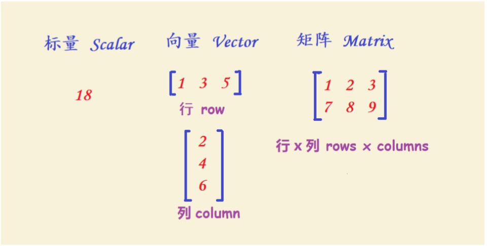

**标量**只是一个单一的数字。示例如下：
```py
In [1]: import numpy as np

In [2]: scalar_value = 18	# 标量

In [3]: scalar_value
Out[3]: 18

In [4]: scalar_value.shape	# 报错，因为int类型的标量没有shape属性
Traceback (most recent call last):

  File "<ipython-input-4-1e2e843c11f1>", line 1, in <module>
    scalar_value.shape

AttributeError: 'int' object has no attribute 'shape'

In [5]: scalar_np = np.array(scalar_value)	# 将其转化为ndarray

In [6]: scalar_np.shape	# 有shape属性
Out[6]: ()
```

**向量**是一个有序的数字数组，可以在一行或一列中。
请看下面的代码：
```py
In [7]: vector_value = [1,2,3]    # 列表

In [8]: vector_np = np.array(vector_value)    # 转化为ndarray

# shape显示为一维数组，其实这既不是行向量也不是列向量
In [9]: print(vector_np,vector_np.shape)
[1 2 3] (3,)
```
我们在上面的代码中利用列表创建了一个ndarray数组，该数组是一维的，所以并不是行向量或列向量。仔细想想，不管行向量还是列向量，都是**矩阵**的特殊形式，应当是**二维**的，比如列向量为m行1列。
因此，我们应当以如下的方式创建行、列向量。
```py
In [10]: vector_row = np.array([[1,2,3]])	# 创建行向量

In [11]: vector_row	# 行向量
Out[11]: array([[1, 2, 3]])

In [12]: vector_row.shape	# shape为(1,3)，即1行3列，为行向量
Out[12]: (1, 3)

In [13]: vector_column = np.array([[4],[5],[6]])	# 创建列向量

In [14]: vector_column	# 列向量
Out[14]: 
array([[4],
       [5],
       [6]])

In [15]: vector_column.shape	# shape为(3,1)，即3行1列，为列向量
Out[15]: (3, 1)
```

**矩阵**是一个有序的二维数组,它有两个索引。第一个指向该行,第二个指向该列。向量也是一个矩阵,但只有一行或一列。
创建矩阵的示例代码如下：
```py
In [16]: matrix_list = [[1,2,3],[4,5,6]]	# 列表

In [17]: matrix_list
Out[17]: [[1, 2, 3], [4, 5, 6]]

In [18]: matrix_np = np.array(matrix_list)	# 创建矩阵

In [19]: matrix_np
Out[19]: 
array([[1, 2, 3],
       [4, 5, 6]])

In [20]: matrix_np.shape	# 2行3列的矩阵
Out[20]: (2, 3)
```

### 4.1.2 线性代数基本运算规则
矩阵标量运算：如果**矩阵**乘、除或者加、减一个**标量**，采用广播运算，即矩阵的每个元素都与该标量进行数学运算。
如下：
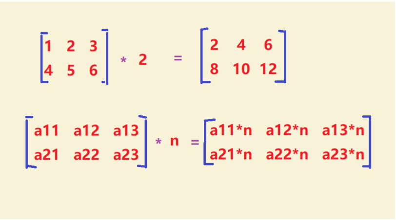

矩阵之间的加法和减法：要求矩阵具有**相同的尺寸**，并且结果将是与原矩阵尺寸相同的矩阵。计算时只需在第一个矩阵中添加或减去第二个矩阵中对应的值。
如下：
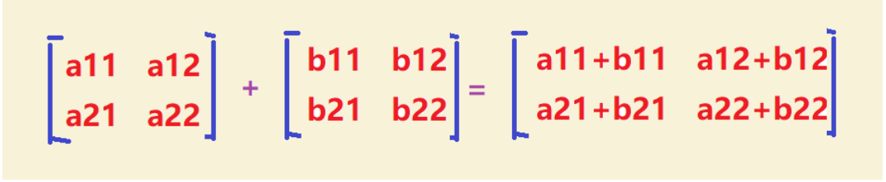

矩阵之间的**点乘（点积）**：要求矩阵具有**相同的尺寸**，矩阵各个**对应元素相乘**。
如下：
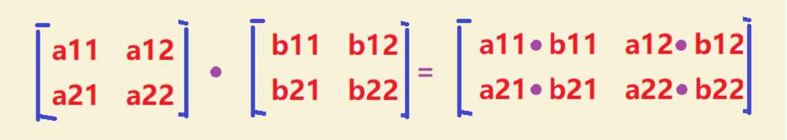

矩阵之间**相乘（叉乘）**：叉乘才是我们一般说的矩阵的乘法。只有**第一个矩阵的列数与第二个矩阵的行数相等**时，二者才能相乘。设第一个矩阵A的尺寸为m\*n，第二个矩阵B的尺寸为n\*k，则A\*B的尺寸为m\*k。
如下：
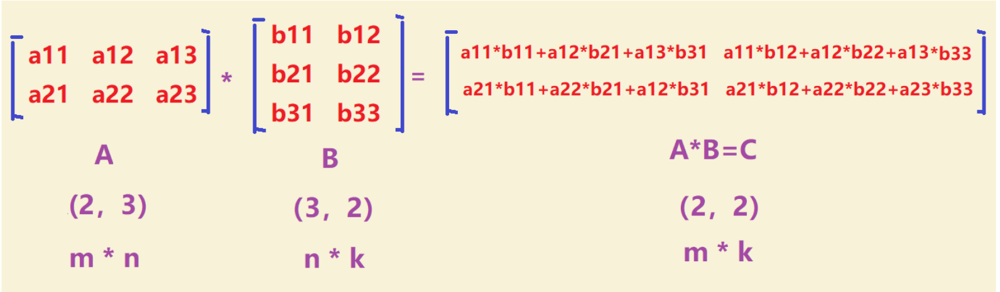
由于向量可以看作是矩阵的特例，所以就不详细讲向量的乘法了。

示例代码如下：
```py
In [1]: import numpy as np

In [2]: matrix_a = np.array([[1,2,3],	# 2行3列
                            [4,5,6]])

In [3]: matrix_b = np.array([[-1,-2,-3],	# 2行3列
                            [-4,-5,-6]])

In [4]: matrix_a * matrix_b		# 矩阵点乘
Out[4]: 
array([[ -1,  -4,  -9],
       [-16, -25, -36]])

In [5]: np.multiply(matrix_a,matrix_b)		# 作用与*相同
Out[5]: 
array([[ -1,  -4,  -9],
       [-16, -25, -36]])

In [6]: matrix_a = np.array([[1,2,3],	# 2行3列
                            [4,5,6]])

In [7]: matrix_b = np.array([[1,2,3,4],	# 3行4列
                            [2,1,2,0],
                            [3,4,1,2]])

In [8]: np.dot(matrix_a,matrix_b)	# 矩阵的乘法（叉乘），结果2行4列
Out[8]: 
array([[14, 16, 10, 10],
       [32, 37, 28, 28]])

In [9]: vector_row = np.array([[1,1,1]])	# 行向量

In [10]: vector_column = np.array([[1],[1],[1]])	# 列向量

In [11]: np.dot(vector_row,vector_column)	# 行向量乘列向量，为单个数
Out[11]: array([[3]])

In [12]: np.dot(vector_column,vector_row)	# 列向量乘行向量，为矩阵
Out[12]: 
array([[1, 1, 1],
       [1, 1, 1],
       [1, 1, 1]])
       
In [13]: np.matmul(matrix_a,matrix_b)	# 矩阵相乘（叉乘）用这种方式也可以
Out[13]: 
array([[14, 16, 10, 10],
       [32, 37, 28, 28]])
```
虽然我们说上面的是矩阵，但是这些矩阵其实是ndarray类型，本质上还是二维数组。因此在用\*做乘法时表现出来的是对应元素相乘，即矩阵的点乘运算。如果想要使用矩阵乘法或矩阵向量乘法的话，请用**np.dot()**方法或**np.matmul()**方法。
那么为什么numpy库不实现一个matrix类型呢，那样不是更方便吗？
实际上numpy中确实有一个matrix类型，不过官方强烈不推荐使用，这个类型在将来很可能被废除。

关于矩阵转置的实现，可以用**np.transpose()**方法。
示例代码如下：
```py
In [13]: matrix_a
Out[13]: 
array([[1, 2, 3],
       [4, 5, 6]])

In [14]: np.transpose(matrix_a)
Out[14]: 
array([[1, 4],
       [2, 5],
       [3, 6]])

In [15]: vector_row
Out[15]: array([[1, 1, 1]])

In [16]: np.transpose(vector_raw)
Out[16]: 
array([[1],
       [1],
       [1]])
```

4.2 数据与问题分析
------
### 4.2.1 波士顿房价问题描述
波士顿房价数据集包括**506**个样本，每个样本包括**12个特征变量**和该地区的平均房价。
房价显然和多个特征变量相关，不是单变量线性回归（**一元线性回归**）问题。需要选择多个特征变量来建立线性方程,这就是多变量线性回归（**多元线性回归**）问题。

回顾一下上一章所说的使用TensorFlow进行算法设计与训练的核心步骤：
1. 准备数据
2. 构建模型
3. 模型训练
4. 进行预测

本章我们仍是按照上述步骤进行。

### 4.2.2 数据文件读取
该数据集简单介绍如下：
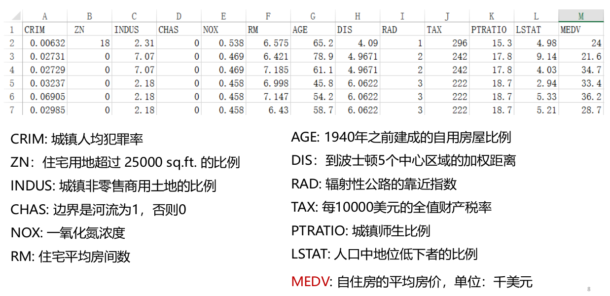

通过pandas读取数据文件，列出统计概述：
```py
import numpy as np
import matplotlib.pyplot as plt
import tensorflow as tf
import pandas as pd
from sklearn.utils import shuffle

# 读取数据文件
df = pd.read_csv('data/boston.csv',header=0)

# 显示数据摘要描述信息
print(df.describe())
```
输出如下：
```py
             CRIM         ZN       INDUS         CHAS         NOX          RM  \
count  506.000000  506.000000  506.000000  506.000000  506.000000  506.000000   
mean     3.613524   11.363636   11.136779    0.069170    0.554695    6.284634   
std      8.601545   23.322453    6.860353    0.253994    0.115878    0.702617   
min      0.006320    0.000000    0.460000    0.000000    0.385000    3.561000   
25%      0.082045    0.000000    5.190000    0.000000    0.449000    5.885500   
50%      0.256510    0.000000    9.690000    0.000000    0.538000    6.208500   
75%      3.677082   12.500000   18.100000    0.000000    0.624000    6.623500   
max     88.976200  100.000000   27.740000    1.000000    0.871000    8.780000   

              AGE         DIS         RAD         TAX     PTRATIO       LSTAT  \
count  506.000000  506.000000  506.000000  506.000000  506.000000  506.000000   
mean    68.574901    3.795043    9.549407  408.237154   18.455534   12.653063   
std     28.148861    2.105710    8.707259  168.537116    2.164946    7.141062   
min      2.900000    1.129600    1.000000  187.000000   12.600000    1.730000   
25%     45.025000    2.100175    4.000000  279.000000   17.400000    6.950000   
50%     77.500000    3.207450    5.000000  330.000000   19.050000   11.360000   
75%     94.075000    5.188425   24.000000  666.000000   20.200000   16.955000   
max    100.000000   12.126500   24.000000  711.000000   22.000000   37.970000   

             MEDV  
count  506.000000  
mean    22.532806  
std      9.197104  
min      5.000000  
25%     17.025000  
50%     21.200000  
75%     25.000000  
max     50.000000
```

下面简单介绍一下上面代码中出现的pd.read_csv()方法。其参数如下：
```py
pd.read_csv(filepath_or_buffer, sep=',', delimiter=None, header='infer', names=None, index_col=None, usecols=None, squeeze=False, prefix=None, mangle_dupe_cols=True, dtype=None, engine=None, converters=None, true_values=None, false_values=None, skipinitialspace=False, skiprows=None, nrows=None, na_values=None, keep_default_na=True, na_filter=True, verbose=False, skip_blank_lines=True, parse_dates=False, infer_datetime_format=False, keep_date_col=False, date_parser=None, dayfirst=False, iterator=False, chunksize=None, compression='infer', thousands=None, decimal=b'.', lineterminator=None, quotechar='"', quoting=0, escapechar=None, comment=None, encoding=None, dialect=None, tupleize_cols=False, error_bad_lines=True, warn_bad_lines=True, skipfooter=0, skip_footer=0, doublequote=True, delim_whitespace=False, as_recarray=False, compact_ints=False, use_unsigned=False, low_memory=True, buffer_lines=None, memory_map=False, float_precision=None)
```
下面简单介绍一下比较常用的几个参数。
**filepath_or_buffer**：必需，文件所在处的路径。
**seq**：指定分割符，默认为逗号“,”。
**header**：int, list of int, default ‘infer’。指定哪一行作为列名，默认header=0。如果人为指定了列名，header=None。
**names**：指定列名，如果文件中不包含标题行，则显式指定header=None。

想快速读取常规大小的数据文件时，通过创建读缓存区和其他的机制可能会造成额外的开销。此时建议采用Pandas库来处理。

### 4.2.3 准备建模
房价和多个特征变量相关，本讲尝试使用多元线性回归建模。结果可以由不同特征的输入值和对应的权重相乘求和，加上偏置项计算求解。如下：
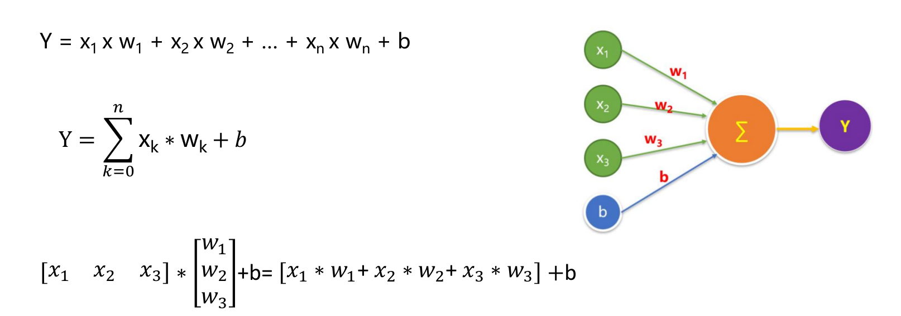
由于空间所限，图形中只画出了3个x变量，实际上本案例中是有12个x变量的。
其中还用到了矩阵用来简化表示形式。矩阵运算是机器学习的基本手段，必须掌握！

4.3 第一个版本的模型构建
------
### 4.3.1 数据准备与模型定义
载入所需数据：
```py
# 获取df的值，ndarray类型
df = df.values

# x_data为前12列特征数据
x_data = df[:,:12]

# y_data为最后一列的标签数据
y_data = df[:,12]
```

定义**特征数据**和**标签数据**的占位符：
```py
# 定义特征数据和标签数据的占位符
# 这里的None表示行的数量未知，只指定列的shape
x = tf.placeholder(tf.float32,[None,12],name='X')
y = tf.placeholder(tf.float32,[None,1],name='Y')
```
shape中**None** 表示行的数量未知，在实际训练时决定一次代入多少行样本，从一个样本的随机SDG到批量SDG都可以。

定义模型结构：
```py
# 定义了一个命名空间
with tf.name_scope('Model'):
    
    # w初始化值为shape=(12,1)的随机数
    w = tf.Variable(tf.random_normal([12,1],stddev=0.01),name='W')
    
    #  b初始化值为1.0
    b = tf.Variable(1.0,name='b')
    
    # w和x是矩阵相乘，用matmul，不能用multiply或者*
    def model(x,w,b):
        return tf.matmul(w,x) + b
    
    # 预测计算操作，前向计算节点
    pred = model(x,w,b)
```
**命名空间name_scope**:TensorFlow计算图模型中常有数以千计节点，在可视化过程中很难一下子全部展示出来，因此可用**tf.name_scope()**方法为变量划分范围，在可视化中，这表示在计算图中的一个层级，即将整个命名空间作为一个大的节点。
下面介绍一下**tf.random_normal()**方法，该方法从正态分布中输出随机值，其参数如下：
```py
tf.random_normal(shape,
                  mean=0.0,
                  stddev=1.0,
                  dtype=dtypes.float32,
                  seed=None,
                  name=None)
```
其返回值为一个**指定形状的张量**，具体参数如下：
+ shape: 输出张量的形状，必选
+ mean: 正态分布的均值，默认为0.0
+ stddev: 正态分布的标准差，默认为1.0
+ dtype: 输出的类型，默认为tf.float32
+ seed: 随机数种子
+ name: 操作的名称

上面的程序中还用到了tf.matmul()方法，TensorFlow中的**matmul()**方法与**multiply()**方法与numpy中所实现的功能是相同的，multiply()方法实现矩阵的点乘，matmul实现矩阵相乘（叉乘）。只不过tensorflow中的方法针对的是张量（Tensor类型），而numpy中的方法针对的是数组（ndarray类型）。

### 4.3.2 模型训练
设置训练超参数：
```py
# 迭代轮次
train_epochs = 50

# 学习率
learning_rate = 0.01
```

定义均方差损失函数：
```py
# 定义损失函数，均方误差
loss_function = tf.reduce_mean(tf.square(y - pred))
```

选择优化器：
```py
# 创建梯度下降优化器
optimizer = tf.train.GradientDescentOptimizer(learning_rate).minimize(loss_function)
```

声明并启动会话：
```py
sess = tf.Session()

# 定义初始化变量的操作
init = tf.global_variables_initializer()

sess.run(init)
```

迭代训练：
```py
loss_sum = 0.0
for epoch in range(train_epochs):
    for xs,ys in zip(x_data,y_data):
        
        # Feed数据必须和Placeholder的shape一致
        xs = xs.reshape(1,12)
        ys = ys.reshape(1,1)
        
        _,loss = sess.run([optimizer,loss_function],feed_dict={x:xs,y:ys})
        
        loss_sum = loss_sum + loss
        
    # 打乱数据顺序
    x_data,y_data = shuffle(x_data,y_data)
    
    b0temp = b.eval(session=sess)
    w0temp = b.eval(session=sess)
    loss_average = loss_sum/len(y_data)
    
    print('epoch= %d,   loss= %f,   b= %f,   w= %f' % (epoch+1,loss_average,b0temp,w0temp))
```
上面的训练过程中为什么要**打乱数据顺序**呢？
这是为了避免w与b与数据的顺序之间形成关联。比如说有个训练数据集为苹果、梨、橘子。如果一直以这个顺序进行训练，那么训练的结果有可能与数据的顺序对应起来，认为第一个输入的为苹果，第二个输入的为梨。为了避免这种情况，需要**在每一次迭代完成后打乱训练数据**。

下面介绍一下**sklearn.utils.shuffle()**方法，参数如下：
```py
sklearn.utils.shuffle(*arrays, **options)
```
\*array为带索引的序列，可以是arrays，lists，dataframes或者scipy sparse matrices。

4.4 后续版本的持续改进
------
### 4.4.1 版本2：特征数据归一化
按照上面的操作完成后，开始进行训练，但本次的训练结果出现了一些意外，部分输出如下：
```py
epoch= 1,   loss= nan,   b= nan,   w= nan
epoch= 2,   loss= nan,   b= nan,   w= nan
epoch= 3,   loss= nan,   b= nan,   w= nan
epoch= 4,   loss= nan,   b= nan,   w= nan
epoch= 5,   loss= nan,   b= nan,   w= nan
epoch= 6,   loss= nan,   b= nan,   w= nan
epoch= 7,   loss= nan,   b= nan,   w= nan
epoch= 8,   loss= nan,   b= nan,   w= nan
epoch= 9,   loss= nan,   b= nan,   w= nan
epoch= 10,   loss= nan,   b= nan,   w= nan
```
输出都是nan，这是怎么回事呢？
在训练的过程中，要考虑不同特征值取值范围的影响。有的特征值可能数值很小，比如只有零点几，但是它对标签的影响却很大；而有的特征值虽然数值很大，比如好几百，但是它对标签的影响却很小。要达到这种效果，与极小特征值相关的权值必须特别大才可以。
而我们是采用的梯度下降优化方法进行训练的，误差梯度可在更新中累积，变成非常大的梯度，然后导致网络权重的大幅更新，并因此使网络变得不稳定。在极端情况下，权重的值变得非常大，以至于溢出，导致 NaN 值。 网络层之间的梯度（值大于 1.0）重复相乘导致的指数级增长会产生**梯度爆炸**。

至于本例中的解决办法，就是数据**归一化**，将特征数据**映射到[0~1]区间**。
公式如下：
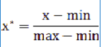
稍微修改一下代码：
```py
# 对特征数据（0～11列）做归一化
for i in range(12):
    df[:,i] = (df[:,i] - df[:,i].min())/(df[:,i].max() - df[:,i].min())

# x_data为前12列特征数据
x_data = df[:,:12]

# y_data为最后一列的标签数据
y_data = df[:,12]
```
注意！**仅对特征数据进行归一化，而不对标签数据进行归一化**。
numpy中的max()与min()方法均有如下的两种调用方式：
+ ndarray.min() / np.min(ndarray)
+ ndarray.max() / np.max(ndarray)

测试模型。由于所有的数据都用来训练了，所以暂时没有新的数据，只能用训练的数据来测试了。代码如下：
```py
# 任选一条数据来测试
n = np.random.randint(506)
print(n)
x_test = x_data[n]

# 别忘了reshape
x_test = x_test.reshape(1,12)
predict = sess.run(pred,feed_dict={x:x_test})
print('预测值：%f' % predict)

target = y_data[n]
print('标签值：%f' % target)
```
其中一部分输出如下：
```py
430
预测值：13.970398
标签值：13.800000

237
预测值：25.605413
标签值：24.800000
```
也还算可以，房价的影响因素是比较复杂的，用多元线性回归这种简单的模型能做到这种程度也算可以了。

### 4.4.2 版本2：可视化训练过程中的损失值
修改训练过程代码，只是每轮训练后添加一个这一轮的loss平均值。
代码如下：
```py
# 用于保存loss值的列表
loss_list = []

for epoch in range(train_epochs):
    loss_sum = 0.0
    for xs,ys in zip(x_data,y_data):
        
        # Feed数据必须和Placeholder的shape一致
        xs = xs.reshape(1,12)
        ys = ys.reshape(1,1)
        
        _,loss = sess.run([optimizer,loss_function],feed_dict={x:xs,y:ys})
        
        loss_sum = loss_sum + loss
        
    # 打乱数据顺序
    x_data,y_data = shuffle(x_data,y_data)
    
    b0temp = b.eval(session=sess)
    w0temp = w.eval(session=sess)
    loss_average = loss_sum/len(y_data)
    
    #每轮添加一次
    loss_list.append(loss_average)
    
    print('epoch=',epoch+1,'loss=',loss_average,'b=',b0temp,'w=',w0temp)
    
plt.plot(loss_list)
plt.show()
```
绘制图像如下：
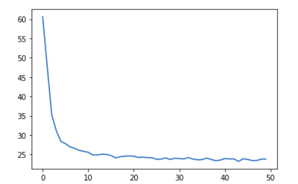

每步(单个样本)训练后添加这个loss值。
代码如下：
```py
# 用于保存loss值的列表
loss_list = []

for epoch in range(train_epochs):
    loss_sum = 0.0
    for xs,ys in zip(x_data,y_data):
        
        # Feed数据必须和Placeholder的shape一致
        xs = xs.reshape(1,12)
        ys = ys.reshape(1,1)
        
        _,loss = sess.run([optimizer,loss_function],feed_dict={x:xs,y:ys})
        
        loss_sum = loss_sum + loss
           
        #每轮添加一次
        loss_list.append(loss)
        
    # 打乱数据顺序
    x_data,y_data = shuffle(x_data,y_data)
    
    b0temp = b.eval(session=sess)
    w0temp = w.eval(session=sess)
    loss_average = loss_sum/len(y_data)
    
    print('epoch=',epoch+1,'loss=',loss_average,'b=',b0temp,'w=',w0temp)
    
plt.plot(loss_list)
plt.show()
```
绘制图像如下：
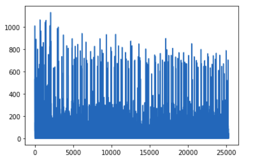

这么一对比的话，当然是前一种方法好啦。

### 4.4.3 版本4：加上TensorBoard可视化代码
修改代码：
```py
sess = tf.Session()

# 定义初始化变量的操作
init = tf.global_variables_initializer()

# 清除default graph和不断增加的节点
tf.reset_default_graph()

# 设置日志存储目录
logdir = 'log/'

# 设置一个操作，用于记录损失值loss，后面在TensorBoard中SCALARS栏可见
sum_loss_op = tf.summary.scalar('loss',loss_function)

# 合并所有需要记录的摘要日志文件，方便一次性写入
merged = tf.summary.merge_all()

sess.run(init)

# 创建摘要writer，将计算图写入摘要文件，后面在TensorBoard中GRAPHS栏可见
writer = tf.summary.FileWriter(logdir,sess.graph)
```

对训练过程中的代码做如下修改：
```py
        _,summary_str,loss = sess.run([optimizer,sum_loss_op,loss_function],feed_dict={x:xs,y:ys})
        
        # 将摘要协议缓冲区添加到事件文件中
        writer.add_summary(summary_str,epoch)
```
关于上面所用的一些TensorBoard方法以及TensorBoard的一些详细信息，会在后面的章节中进行介绍。
loss的图形如下：
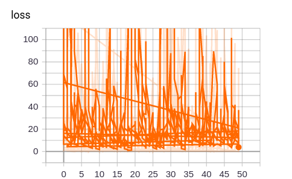
计算图如下：
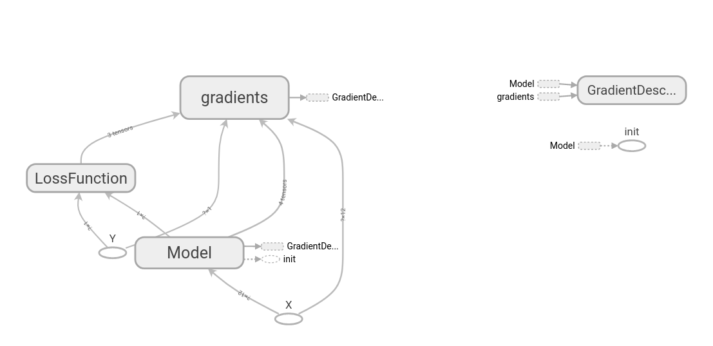

第五章 MNIST手写数字识别：分类应用入门
======
5.1 MNIST手写数字识别数据解读
------
### 5.1.1 数据集简介
**MNIST数据集**来自美国国家标准与技术研究所，National Institute of Standards and Technology (NIST)。数据集由来自 250 个不同人手写的数字构成,，其中 50% 是高中学生,，50% 来自人口普查局 (the Census Bureau) 的工作人员。
其中，**训练集**中有55000组数据，**验证集**中有5000组数据，**测试集**中有10000组数据。

MNIST数据集可在[http://yann.lecun.com/exdb/mnist/](http://yann.lecun.com/exdb/mnist/) 获取。
TensorFlow提供了如下的数据集读取方法：
```py
import tensorflow as tf
import matplotlib.pyplot as plt
import numpy as np
from tensorflow.examples.tutorials.mnist import input_data

# 在MNIST_data目录下读取MNIST数据集，采用独热编码
mnist = input_data.read_data_sets('MNIST_data/',one_hot=True)
```
MNIST数据集文件在读取时如果指定目录下不存在，则会自动去下载，需等待一定时间。如果已经存在了，则直接读取。
我将MNIST数据集放在了MINIS_data目录下，该数据集其实就是如下的四个压缩包：
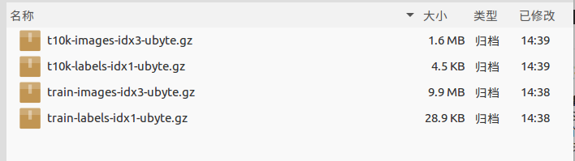
读取MNIST数据集时TensorFlow会自动解压，并将解压后的数据返回。

下面具体了解一下MNIST数据集：
```py
print('训练集train数量：',mnist.train.num_examples,
     '，验证集validation数量：',mnist.validation.num_examples,
     '，测试集test数量：',mnist.test.num_examples)

print('train images shape:',mnist.train.images.shape,  # 训练集图片（特征值）的shape
     'labels shape:',mnist.train.labels.shape)  # 训练集标签的shape
```
输出为：
```py
训练集train数量： 55000 ，验证集validation数量： 5000 ，测试集test数量： 10000
train images shape: (55000, 784) labels shape: (55000, 10)
```
可以看到该数据集的数据组数与之前所说的一样。
不过下面的输出中为什么训练所用的图片的shape为(55000,784)呢？标签的shape又为什么为(55000,10)呢？
其实55000很好理解，就是训练数据集中数据的组数。
训练所用的图片是28\*28的，因此该图片共有28\*28=784个像素点。而该图片是由灰度值所表示的，共784个灰度值，因此其shape为(55000,784)。
而训练数据集中的标签是采用的**10分类One Hot编码**表示的，因此有10位，所以其shape为(55000,10)。

下面咱们具体看一幅image的数据：
```py
In [5]: len(mnist.train.images[0])
Out[5]: 784

In [6]: mnist.train.images[0].shape
Out[6]: (784,)

In [7]: mnist.train.images[0]
Out[7]: array([0.        , 0.        , 0.        , 0.        , 0.        ,
       0.        , 0.        , 0.        , 0.        , 0.        ,
       0.        , 0.        , 0.        , 0.        , 0.        ,
       0.        , 0.        , 0.        , 0.        , 0.        ,
       0.        , 0.        , 0.        , 0.        , 0.        ,
       0.        , 0.        , 0.        , 0.        , 0.        ,
       0.        , 0.        , 0.        , 0.        , 0.        ,
       0.        , 0.        , 0.        , 0.        , 0.        ,
       0.        , 0.        , 0.        , 0.        , 0.        ,
       0.        , 0.        , 0.        , 0.        , 0.        ,
       0.        , 0.        , 0.        , 0.        , 0.        ,
       0.        , 0.        , 0.        , 0.        , 0.        ,
       0.        , 0.        , 0.        , 0.        , 0.        ,
       0.        , 0.        , 0.        , 0.        , 0.        ,
       0.        , 0.        , 0.        , 0.        , 0.        ,
       0.        , 0.        , 0.        , 0.        , 0.        ,
       0.        , 0.        , 0.        , 0.        , 0.        ,
       0.        , 0.        , 0.        , 0.        , 0.        ,
       0.        , 0.        , 0.        , 0.        , 0.        ,
       0.        , 0.        , 0.        , 0.        , 0.        ,
       0.        , 0.        , 0.        , 0.        , 0.        ,
       0.        , 0.        , 0.        , 0.        , 0.        ,
       0.        , 0.        , 0.        , 0.        , 0.        ,
       0.        , 0.        , 0.        , 0.        , 0.        ,
       0.        , 0.        , 0.        , 0.        , 0.        ,
       0.        , 0.        , 0.        , 0.        , 0.        ,
       0.        , 0.        , 0.        , 0.        , 0.        ,
       0.        , 0.        , 0.        , 0.        , 0.        ,
       0.        , 0.        , 0.        , 0.        , 0.        ,
       0.        , 0.        , 0.        , 0.        , 0.        ,
       0.        , 0.        , 0.        , 0.        , 0.        ,
       0.        , 0.        , 0.        , 0.        , 0.        ,
       0.        , 0.        , 0.        , 0.        , 0.        ,
       0.        , 0.        , 0.        , 0.        , 0.        ,
       0.        , 0.        , 0.        , 0.        , 0.        ,
       0.        , 0.        , 0.        , 0.        , 0.        ,
       0.        , 0.        , 0.        , 0.        , 0.        ,
       0.        , 0.        , 0.        , 0.        , 0.        ,
       0.        , 0.        , 0.        , 0.        , 0.        ,
       0.        , 0.        , 0.        , 0.        , 0.        ,
       0.        , 0.        , 0.        , 0.        , 0.        ,
       0.        , 0.        , 0.3803922 , 0.37647063, 0.3019608 ,
       0.46274513, 0.2392157 , 0.        , 0.        , 0.        ,
       0.        , 0.        , 0.        , 0.        , 0.        ,
       0.        , 0.        , 0.        , 0.        , 0.        ,
       0.        , 0.        , 0.3529412 , 0.5411765 , 0.9215687 ,
       0.9215687 , 0.9215687 , 0.9215687 , 0.9215687 , 0.9215687 ,
       0.9843138 , 0.9843138 , 0.9725491 , 0.9960785 , 0.9607844 ,
       0.9215687 , 0.74509805, 0.08235294, 0.        , 0.        ,
       0.        , 0.        , 0.        , 0.        , 0.        ,
       0.        , 0.        , 0.        , 0.        , 0.54901963,
       0.9843138 , 0.9960785 , 0.9960785 , 0.9960785 , 0.9960785 ,
       0.9960785 , 0.9960785 , 0.9960785 , 0.9960785 , 0.9960785 ,
       0.9960785 , 0.9960785 , 0.9960785 , 0.9960785 , 0.9960785 ,
       0.7411765 , 0.09019608, 0.        , 0.        , 0.        ,
       0.        , 0.        , 0.        , 0.        , 0.        ,
       0.        , 0.        , 0.8862746 , 0.9960785 , 0.81568635,
       0.7803922 , 0.7803922 , 0.7803922 , 0.7803922 , 0.54509807,
       0.2392157 , 0.2392157 , 0.2392157 , 0.2392157 , 0.2392157 ,
       0.5019608 , 0.8705883 , 0.9960785 , 0.9960785 , 0.7411765 ,
       0.08235294, 0.        , 0.        , 0.        , 0.        ,
       0.        , 0.        , 0.        , 0.        , 0.        ,
       0.14901961, 0.32156864, 0.0509804 , 0.        , 0.        ,
       0.        , 0.        , 0.        , 0.        , 0.        ,
       0.        , 0.        , 0.        , 0.        , 0.13333334,
       0.8352942 , 0.9960785 , 0.9960785 , 0.45098042, 0.        ,
       0.        , 0.        , 0.        , 0.        , 0.        ,
       0.        , 0.        , 0.        , 0.        , 0.        ,
       0.        , 0.        , 0.        , 0.        , 0.        ,
       0.        , 0.        , 0.        , 0.        , 0.        ,
       0.        , 0.        , 0.        , 0.32941177, 0.9960785 ,
       0.9960785 , 0.9176471 , 0.        , 0.        , 0.        ,
       0.        , 0.        , 0.        , 0.        , 0.        ,
       0.        , 0.        , 0.        , 0.        , 0.        ,
       0.        , 0.        , 0.        , 0.        , 0.        ,
       0.        , 0.        , 0.        , 0.        , 0.        ,
       0.        , 0.32941177, 0.9960785 , 0.9960785 , 0.9176471 ,
       0.        , 0.        , 0.        , 0.        , 0.        ,
       0.        , 0.        , 0.        , 0.        , 0.        ,
       0.        , 0.        , 0.        , 0.        , 0.        ,
       0.        , 0.        , 0.        , 0.        , 0.        ,
       0.        , 0.        , 0.        , 0.4156863 , 0.6156863 ,
       0.9960785 , 0.9960785 , 0.95294124, 0.20000002, 0.        ,
       0.        , 0.        , 0.        , 0.        , 0.        ,
       0.        , 0.        , 0.        , 0.        , 0.        ,
       0.        , 0.        , 0.        , 0.        , 0.        ,
       0.        , 0.09803922, 0.45882356, 0.8941177 , 0.8941177 ,
       0.8941177 , 0.9921569 , 0.9960785 , 0.9960785 , 0.9960785 ,
       0.9960785 , 0.94117653, 0.        , 0.        , 0.        ,
       0.        , 0.        , 0.        , 0.        , 0.        ,
       0.        , 0.        , 0.        , 0.        , 0.        ,
       0.        , 0.        , 0.26666668, 0.4666667 , 0.86274517,
       0.9960785 , 0.9960785 , 0.9960785 , 0.9960785 , 0.9960785 ,
       0.9960785 , 0.9960785 , 0.9960785 , 0.9960785 , 0.5568628 ,
       0.        , 0.        , 0.        , 0.        , 0.        ,
       0.        , 0.        , 0.        , 0.        , 0.        ,
       0.        , 0.        , 0.        , 0.14509805, 0.73333335,
       0.9921569 , 0.9960785 , 0.9960785 , 0.9960785 , 0.8745099 ,
       0.8078432 , 0.8078432 , 0.29411766, 0.26666668, 0.8431373 ,
       0.9960785 , 0.9960785 , 0.45882356, 0.        , 0.        ,
       0.        , 0.        , 0.        , 0.        , 0.        ,
       0.        , 0.        , 0.        , 0.        , 0.        ,
       0.4431373 , 0.8588236 , 0.9960785 , 0.9490197 , 0.89019614,
       0.45098042, 0.34901962, 0.12156864, 0.        , 0.        ,
       0.        , 0.        , 0.7843138 , 0.9960785 , 0.9450981 ,
       0.16078432, 0.        , 0.        , 0.        , 0.        ,
       0.        , 0.        , 0.        , 0.        , 0.        ,
       0.        , 0.        , 0.        , 0.6627451 , 0.9960785 ,
       0.6901961 , 0.24313727, 0.        , 0.        , 0.        ,
       0.        , 0.        , 0.        , 0.        , 0.18823531,
       0.9058824 , 0.9960785 , 0.9176471 , 0.        , 0.        ,
       0.        , 0.        , 0.        , 0.        , 0.        ,
       0.        , 0.        , 0.        , 0.        , 0.        ,
       0.        , 0.07058824, 0.48627454, 0.        , 0.        ,
       0.        , 0.        , 0.        , 0.        , 0.        ,
       0.        , 0.        , 0.32941177, 0.9960785 , 0.9960785 ,
       0.6509804 , 0.        , 0.        , 0.        , 0.        ,
       0.        , 0.        , 0.        , 0.        , 0.        ,
       0.        , 0.        , 0.        , 0.        , 0.        ,
       0.        , 0.        , 0.        , 0.        , 0.        ,
       0.        , 0.        , 0.        , 0.        , 0.        ,
       0.54509807, 0.9960785 , 0.9333334 , 0.22352943, 0.        ,
       0.        , 0.        , 0.        , 0.        , 0.        ,
       0.        , 0.        , 0.        , 0.        , 0.        ,
       0.        , 0.        , 0.        , 0.        , 0.        ,
       0.        , 0.        , 0.        , 0.        , 0.        ,
       0.        , 0.        , 0.8235295 , 0.9803922 , 0.9960785 ,
       0.65882355, 0.        , 0.        , 0.        , 0.        ,
       0.        , 0.        , 0.        , 0.        , 0.        ,
       0.        , 0.        , 0.        , 0.        , 0.        ,
       0.        , 0.        , 0.        , 0.        , 0.        ,
       0.        , 0.        , 0.        , 0.        , 0.        ,
       0.9490197 , 0.9960785 , 0.93725497, 0.22352943, 0.        ,
       0.        , 0.        , 0.        , 0.        , 0.        ,
       0.        , 0.        , 0.        , 0.        , 0.        ,
       0.        , 0.        , 0.        , 0.        , 0.        ,
       0.        , 0.        , 0.        , 0.        , 0.        ,
       0.        , 0.        , 0.34901962, 0.9843138 , 0.9450981 ,
       0.3372549 , 0.        , 0.        , 0.        , 0.        ,
       0.        , 0.        , 0.        , 0.        , 0.        ,
       0.        , 0.        , 0.        , 0.        , 0.        ,
       0.        , 0.        , 0.        , 0.        , 0.        ,
       0.        , 0.        , 0.        , 0.        , 0.01960784,
       0.8078432 , 0.96470594, 0.6156863 , 0.        , 0.        ,
       0.        , 0.        , 0.        , 0.        , 0.        ,
       0.        , 0.        , 0.        , 0.        , 0.        ,
       0.        , 0.        , 0.        , 0.        , 0.        ,
       0.        , 0.        , 0.        , 0.        , 0.        ,
       0.        , 0.        , 0.01568628, 0.45882356, 0.27058825,
       0.        , 0.        , 0.        , 0.        , 0.        ,
       0.        , 0.        , 0.        , 0.        , 0.        ,
       0.        , 0.        , 0.        , 0.        , 0.        ,
       0.        , 0.        , 0.        , 0.        , 0.        ,
       0.        , 0.        , 0.        , 0.        , 0.        ,
       0.        , 0.        , 0.        , 0.        , 0.        ,
       0.        , 0.        , 0.        , 0.        , 0.        ,
       0.        , 0.        , 0.        , 0.        ], dtype=float32)
```
由上面的代码可以看出，训练集中一个图像的形状为(784,)，而要想显示图像的话，要用reshape()方法将其形状转化为(28,28)，如下：
```py
mnist.train.images[0].reshape(28,28)
```

可视化image：
```py
import matplotlib.pyplot as plt

def plot_image(image):
    plt.imshow(image,cmap='binary')
    plt.show()
```
上面的代码中调用了**plt.imshow()**函数，下面对这个函数进行简单的介绍。
其参数很多，下面对两个比较重要的进行介绍。
```py
plt.imshow(X, cmap=None)
```
参数介绍：
X：X变量存储图像，可以是浮点型数组、unit8数组以及PIL图像，如果其为数组，则需满足以下形状：
+ M\*N      此时数组必须为浮点型，其中值为该坐标的灰度
+ M\*N\*3  RGB（浮点型或者unit8类型）
+ M\*N\*4  RGBA（浮点型或者unit8类型）

cmap：cmap即colormap（图谱），当cmap='binary'对应的图谱如下：
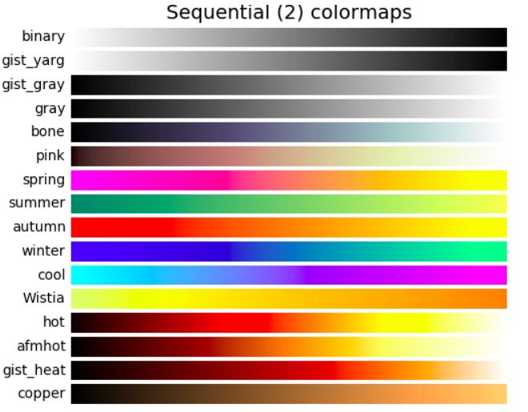

调用可视化image的函数：
```py
plot_image(mnist.train.images[1].reshape(28,28))
```
绘制图形如下：
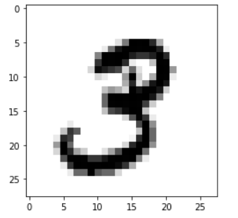

### 5.1.2 数据标签与独热编码
在介绍独热编码之前，我们先来看一下MNIST数据集中的标签。
```py
In [8]: mnist.train.labels[1]
Out[8]: array([0., 0., 0., 1., 0., 0., 0., 0., 0., 0.])
```
可以看到，输出结果并不是一个数，而是有10个元素的数组。这其实就是10分类的独热编码，该例中的独热编码表示3。

**独热编码（one hot encoding）**：一种**稀疏向量**，其中**一个元素设为1，所有其他元素均设为0**。
独热编码常用于表示拥有**有限个可能值**的字符串或标识符.
例如：假设某个植物学数据集记录了15000 个不同的物种，其中每个物种都用独一无二的字符串标识符来表示。在特征工程过程中，可能需要将这些字符串标识符编码为独热向量，**向量的大小为 15000**。

为什么要用独热编码呢？主要有以下原因：
利用独热编码，将离散特征的取值扩展到了欧式空间，离散特征的某个取值就对应欧式空间的某个点。机器学习算法中，特征之间距离的计算或相似度的常用计算方法都是基于欧式空间的，将离散型特征使用独热编码，会让特征之间的距离计算更加合理。

那么该如何从独热编码中取得我们所需要的值呢？
可以采用**argmax()函数**，其返回最大值的索引。该函数在Numpy库和TensorFlow中都有，且用法大体相同。不过要注意的一点是Numpy中该函数的返回值为一个数，而TensorFlow中的返回值为一个张量。
下面是示例代码：
```py
import numpy as np
np.argmax(mnist.train.labels[1])
```
输出值为3。

此外，**argmax()函数**还有一个axis参数，这个参数对TensorFlow与Numpy的作用都一样，下面通过代码详细的介绍一下：
```py
In [2]: import numpy as np

In [3]: a = np.arange(0,10).reshape(2,5)

In [4]: a
Out[4]: 
array([[0, 1, 2, 3, 4],
       [5, 6, 7, 8, 9]])

In [5]: np.argmax(a)	# axis默认为None，输出结果相当于把多维数组平铺后的下标
Out[5]: 9

In [6]: np.argmax(a,axis=0)	# 指定axis参数为0，按第一维（行）的元素取值，即同列的每一行
Out[6]: array([1, 1, 1, 1, 1])

In [7]: np.argmax(a,axis=1)	# 指定axis为1，按第二维（列）的元素取值，即同行的每一列
Out[7]: array([4, 4])

In [8]: np.argmax(a,axis=-1)	# 指定axis为-1，则按第最后维的元素取值
Out[8]: array([4, 4])
```
需要注意的是，TensorFlow中的argmax()函数返回的是张量，如果要获得其值，需要在会话中运行。

值得一提的时，如果使用input_data.read_data_sets()函数读取数据时将one_hot参数设为False，即不启用独热码，那么标签值就以单个数据的形式表示。
示例代码如下：
```py
# 在MNIST_data目录下读取MNIST数据集，采用独热编码
mnist_no_one_hot = input_data.read_data_sets('MNIST_data/',one_hot=False)

print(mnist_no_one_hot.train.labels[0:10])
```
输出结果如下：
```py
[7 3 4 6 1 8 1 0 9 8]
```

### 5.1.3 数据集的划分
构建和训练机器学习模型是希望**对新的数据做出良好预测**。如何去保证训练的实效，可以应对以前未见过的数据呢？
一种方法是将数据集分成两个子集：
+ **训练集**：用于训练模型的子集
+ **测试集**：用于测试模型的子集

如下图所示：

**测试集**应满足以下两个条件：
+ **规模足够大**，可产生具有统计意义的结果
+ **能代表整个数据集**，测试集的特征应该与训练集的特征相同

工作流程如下：
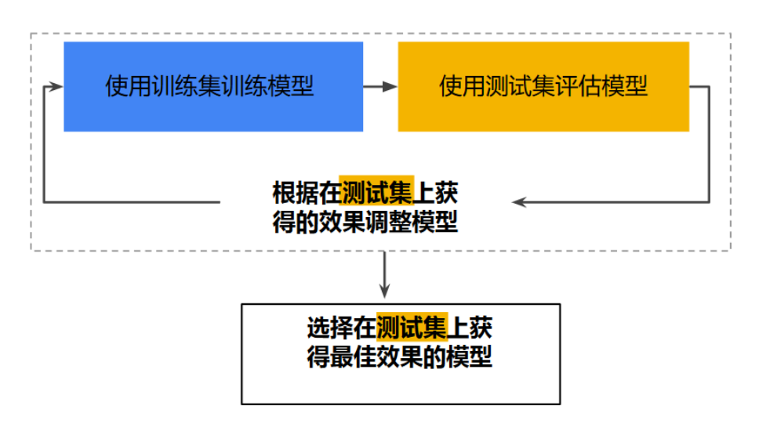
使用测试集和训练集来推动模型开发迭代的流程。
在每次迭代时，都会对训练数据进行训练并评估测试数据，并以基于测试数据的评估结果为指导来选择和更改各种模型超参数，例如学习速率和特征。这种方法是否存在问题?
**多次重复执行该流程可能导致模型不知不觉地拟合了特定测试集的特性**。

基于以上的考虑，我们采用了一种新的数据划分方法的。通过将数据集划分为三个子集,可以大幅降低**过拟合**的发生几率：

使用**验证集**评估训练集的结果。在模型“通过”验证集之后，使用测试集再次检查评估结果。

新的工作流程如下：
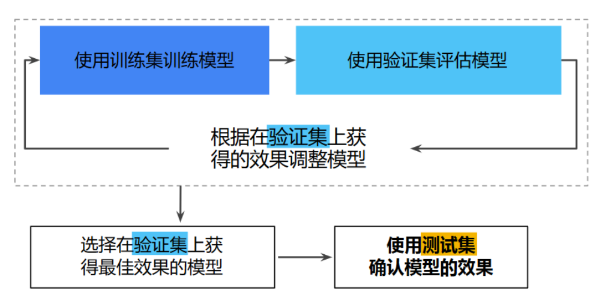

下面我们看一下MNIST数据集中验证数据与测试数据的情况：
```py
# 查看验证数据集情况
print('validation images:',mnist.validation.images.shape,
     'labels:',mnist.validation.labels.shape)

# 查看测试数据集情况
print('test images:',mnist.test.images.shape,
     'labels:',mnist.test.labels.shape)
```
输出如下：
```py
validation images: (5000, 784) labels: (5000, 10)
test images: (10000, 784) labels: (10000, 10)
```

### 5.1.4 数据的批量读取
实现数据的批量读取有下面的两种方法。
第一种是Python的切片，示例代码如下：
```py
print(mnist.train.labels[0:10])
```
输出如下：
```py
[[0. 0. 0. 0. 0. 0. 0. 1. 0. 0.]
 [0. 0. 0. 1. 0. 0. 0. 0. 0. 0.]
 [0. 0. 0. 0. 1. 0. 0. 0. 0. 0.]
 [0. 0. 0. 0. 0. 0. 1. 0. 0. 0.]
 [0. 1. 0. 0. 0. 0. 0. 0. 0. 0.]
 [0. 0. 0. 0. 0. 0. 0. 0. 1. 0.]
 [0. 1. 0. 0. 0. 0. 0. 0. 0. 0.]
 [1. 0. 0. 0. 0. 0. 0. 0. 0. 0.]
 [0. 0. 0. 0. 0. 0. 0. 0. 0. 1.]
 [0. 0. 0. 0. 0. 0. 0. 0. 1. 0.]]
```

第二种方法是使用mnist包提供的**next_batch()方法**，更推荐使用这种方式。
示例代码如下：
```py
# 批量读取数据
# 也可以以mnist.train.next_batch(10)的方式调用，而不用指明batch_size参数
batch_image_xs,batch_labels_ys = mnist.train.next_batch(batch_size=10)

print(batch_labels_ys)
```
上面的**batch_size**参数的含义是批次读取数据的个数。并且**返回值包含两部分**，一部分是图像的数据，一部分是标签的数据，需要分别进行接受。
另外，当第二次调用next_batch()时，其会**在上一次读的基础上接着往后读**，直到所有的样本都被取完。然后再取之前会**对数据集先做一次shuffle**，然后再重新读取。
输出结果与上一个相同：
```py
[[0. 0. 0. 0. 0. 0. 1. 0. 0. 0.]
 [0. 0. 0. 0. 1. 0. 0. 0. 0. 0.]
 [0. 0. 1. 0. 0. 0. 0. 0. 0. 0.]
 [0. 0. 0. 0. 1. 0. 0. 0. 0. 0.]
 [0. 0. 0. 0. 0. 0. 0. 0. 0. 1.]
 [1. 0. 0. 0. 0. 0. 0. 0. 0. 0.]
 [0. 1. 0. 0. 0. 0. 0. 0. 0. 0.]
 [0. 0. 0. 0. 0. 0. 0. 0. 0. 1.]
 [0. 0. 0. 0. 0. 0. 1. 0. 0. 0.]
 [0. 0. 0. 0. 0. 0. 0. 1. 0. 0.]]
```

5.2 分类模型构建与训练
------
### 5.2.1 模型构建
定义待输入数据的占位符：
```py
# mnist中每张图片中共有28*28=784个像素点
x = tf.placeholder(tf.float32,[None,784],name='X')

# 0～9一共10个数字=>10个类别
y = tf.placeholder(tf.float32,[None,10],name='Y')
```

定义模型变量。在本案例中，以正态分布的随机数初始化权重w，以常数0初始化偏置b。
代码如下：
```py
# 定义变量
w = tf.Variable(tf.random_normal([784,10]),name='W')
b = tf.Variable(tf.zeros([10]),name='b')	# b的shape为(10,)
```

定义前向计算：
```py
# tf.matmul的shape为(None,10)，None取决于用于训练的批量的大小
# b的shape为(10,)
forward = tf.matmul(x,w) + b
```
这里的**b会与w的每一行相加**。
具体原理类似于下面这张图：
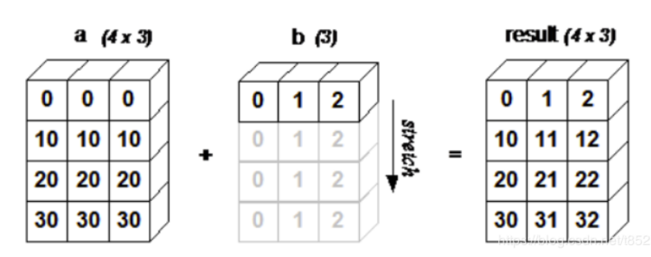

到上一步并不算结束，因为我们这个是分类问题，所以这一步要对计算出的y值进行结果的分类。
代码如下：
```py
pred = tf.nn.softmax(forward)    # Softmax分类
```
**softmax()函数**会将y值转化为目标属于该10分类中哪一类的**概率值**。

与上一章相比，我们在这一章是从**预测问题**到**分类问题**，从**线性回归**到**逻辑回归**。

### 5.2.2 逻辑回归
许多问题的预测结果是一个在连续空间的数值，比如房价预测问题，可以用线性模型来描述：
> Y = x<sub>1</sub>\*w<sub>1</sub> + x<sub>2</sub>\*w<sub>2</sub>  + ... + x<sub>n</sub>\*w<sub>n</sub>  + b

但也有很多场景需要输出的是**概率估算值**，例如：
+ 根据邮件内容判断是垃圾邮件的可能性
+ 根据医学影像判断肿瘤是恶性的可能性
+ 手写数字分别是 0、1、2、3、4、5、6、7、8、9的可能性（概率）

这时需要将预测输出值控制在**[0,1]**区间内。
**二元分类问题**的目标是正确预测两个可能的标签中的一个，**逻辑回归**(Logistic Regression)可以用于处理这类问题。

那么逻辑回归模型如何确保输出值始终落在 0 和 1 之间呢？
Sigmod函数（S型函数）生成的输出值正好具有这些特性，其定义如下：
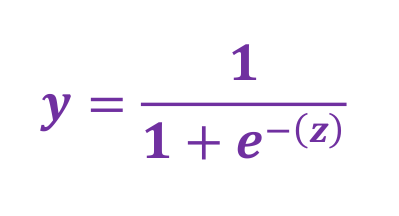
图像如下：
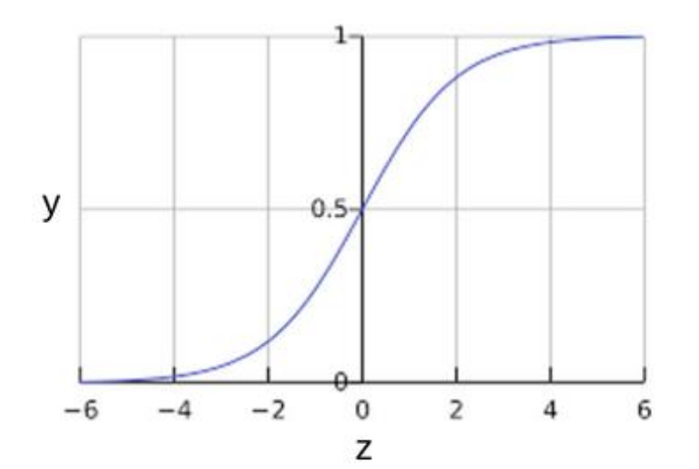
该函数具有如下特点：
+ 定义域为全体实数，值域在[0,1]之间
+ Z值在0点对应的结果为0.5
+ sigmoid函数连续可微分

可用其对线性模型的结果做进一步处理，从而输出介于0到1之间的概率值。
如下：
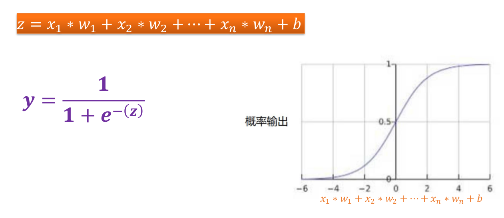

逻辑回归中的损失函数该如何定义呢？
前面线性回归的损失函数是**平方损失**，如果逻辑回归的损失函数也定义为**平方损失**，那么：
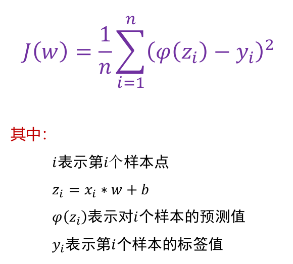
将Sigmoid函数带入上述函数可得下面的图像：
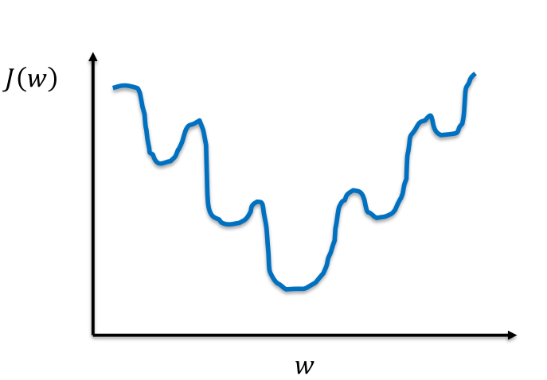
可以看到，该函数为非凸函数，有多个极小值。如果采用梯度下降法，会容易导致陷入局部最优解中。

二元逻辑回归的损失函数一般采用**对数损失函数**，定义如下：
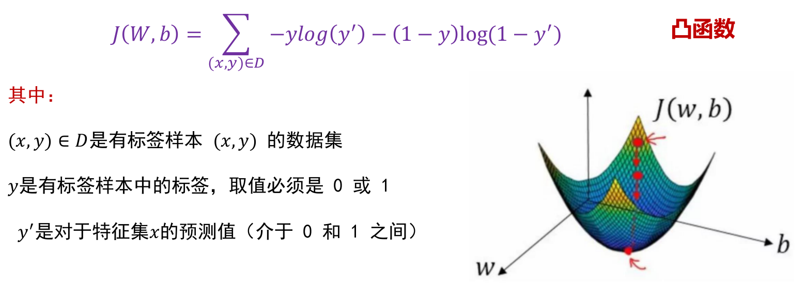
可以看到，这时候这个函数就为凸函数了，明显要比平方损失函数要好。

### 5.2.3 多元分类和Softmax
**逻辑回归**可生成介于0到1.0之间的小数。
**Softmax**将这一想法延伸到**多类别**领域。
在多类别问题中,Softmax 会**为每个类别分配一个用小数表示的概率**。这些用小数表示的**概率相加之和必须是 1.0**。
示例如下：
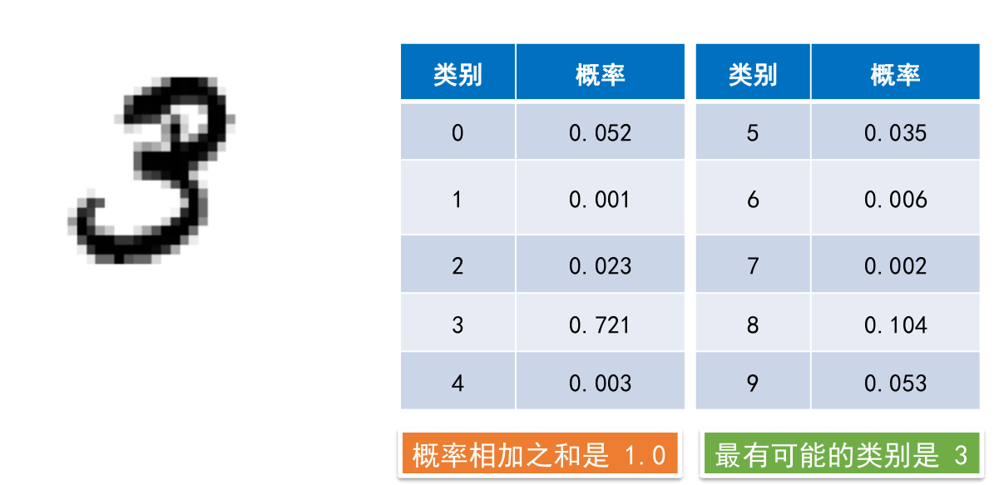

本章就是用到了Softmax来实现手写数字识别的问题。下面看一下神经网络中的Softmax层：

Softmax的方程如下：
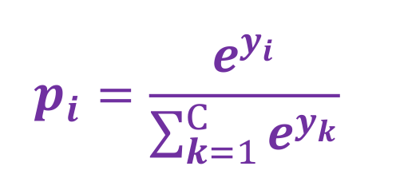
分母是对所有的y计算e的y次方，然后再求和。这样就能保证概率相加之和为1了。
此公式本质上是将逻辑回归公式延伸到了多类别。

下面介绍一下交叉熵损失函数。
**交叉熵**是一个信息论中的概念，它原来是用来估算平均编码长度的。给定两个概率分布p和q，通过q来表示p的交叉熵为：
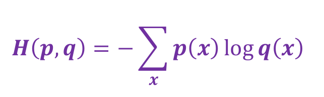
这里的log实际上就是数学上的lg，计算机里面经常这样表示......
交叉熵刻画的是**两个概率分布之间的距离**，p代表正确答案，q代表的是预测值，交叉熵越小，两个概率的分布越接近。
交叉熵计算示例：
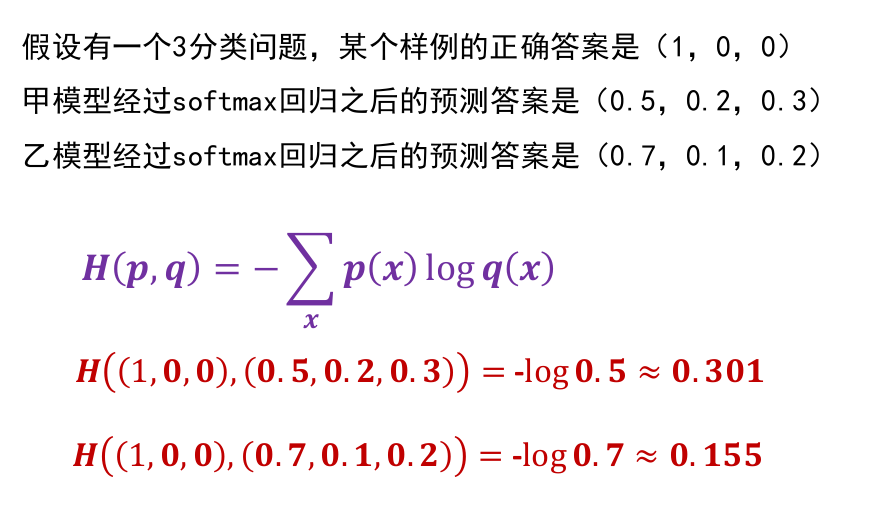
可以看到，交叉熵运算时是对应元素先进行运算，然后再进行求和。

在了解了交叉熵的概念后，可以开始定义交叉熵损失函数了。交叉熵损失函数定义如下：
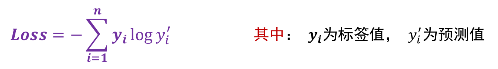
代码实现如下：
```py
# 交叉熵，指定轴axis为1，计算张量沿着轴1的和
loss_function = tf.reduce_mean(-tf.reduce_sum(y*tf.log(pred),axis=1))
```
需要注意的一点是，**tf.reduce_mean()函数**和**tf.reduce_sum()函数**默认情况下输出结果是**降维**的。
这二个函数的参数是一样的，下面介绍一下**tf.reduce_sum()函数**的参数：
```py
tf.reduce_sum(
    input_tensor, 
    axis=None, 
    keepdims=None,
    name=None)
```
input_tensor：待计算的向量。
axis：指定的轴，如果不指定，**默认对所有元素进行计算**。
keepdims：是否保持原有张量的维度。**默认为False，即对计算结果进行降维**。
name：操作的名称。

下面是示例代码：
```py
a = tf.constant([[1,2,3,4,5],
                [1,2,3,4,5],
                [1,2,3,4,5]],dtype=tf.int32,name='a')
sum_a = tf.reduce_sum(a)    # 未指定轴，计算所有元素的和，默认降维
sum_axis1_a = tf.reduce_sum(a,axis=1)   # 指定计算轴1的和，默认降维
mean = tf.reduce_mean(sum_axis1_a)    # 未指定轴，计算所有元素的均值，默认降维
mean_a = tf.reduce_mean(a)    # 未指定轴，计算所有元素的均值，默认降维
with tf.Session() as sess:
    print(sess.run(sum_a),sum_a.shape)
    print(sess.run(sum_axis1_a),sum_axis1_a.shape)
    print(sess.run(mean),mean.shape)
    print(sess.run(mean_a),mean_a.shape)
```
输出如下：
```py
45 ()	# a中所有元素的和
[15 15 15] (3,)	# 按a轴1计算的和，即每一行的和
15 ()	# 对a每一行的和计算均值
3 ()		# a中所有元素的均值
```

### 5.2.4 分类模型构建与训练实践
设置训练参数：
```py
# 设置训练参数
train_epochs = 50    # 训练轮数
batch_size = 100    # 单次训练样本数（批次大小）
total_batch = int(mnist.train.num_examples / batch_size)    # 一轮训练有多少批次
display_step = 1    # 显示粒度
learning_rate = 0.01    # 学习率
```

选择优化器：
```py
#选择优化器
optimizer = tf.train.GradientDescentOptimizer(learning_rate).minimize(loss_function)
```

定义准确率：
```py
# 检查预测类别tf.argmax(pred,axis=1)与实际类别tf.argmax(y,axis=1)的匹配情况
# 相等返回True，否则返回False
correct_prediction = tf.equal(tf.argmax(pred,axis=1),tf.argmax(y,axis=1))

# 准确率，将布尔值转化为浮点数，并计算平均值
accuracy = tf.reduce_mean(tf.cast(correct_prediction,tf.float32))
```
上面代码中**tf.cast()函数**的作用是实现数据类型转换。参数如下：
```py
# x为待转换的数据（张量）
# dtype为目标数据类型
tf.cast(x, dtype, name=None)
```
True转化为浮点数结果为1.0，False转化为浮点数结果为0.0。

声明会话，初始化变量：
```py
sess = tf.Session()    # 声明会话
init = tf.global_variables_initializer()    # 变量初始化
sess.run(init)
```

训练模型：
```py
# 开始训练
for epoch in range(train_epochs):
    for batch in range(total_batch):
        xs,ys = mnist.train.next_batch(batch_size)   # 读取批次数据
        sess.run(optimizer,feed_dict={x:xs,y:ys})   # 执行批次训练
        
    # toatl_batch个批次训练完成后，使用验证数据计算误差与准确率，验证集没有分批
    loss,acc = sess.run([loss_function,accuracy],
                        feed_dict={x:mnist.validation.images,y:mnist.validation.labels})
    # 打印训练过程中的详细信息
    if (epoch + 1) % display_step == 0:
        print('Train Epoch: %02d,  Loss= %.9f,  Accurary= %.4f'
             % (epoch + 1,loss,acc))
        
print('Train Finished!')
```
输出如下：
```py
Train Epoch: 01,  Loss= 4.879797935,  Accurary= 0.3038
Train Epoch: 02,  Loss= 3.045671225,  Accurary= 0.4814
Train Epoch: 03,  Loss= 2.285549641,  Accurary= 0.5728
Train Epoch: 04,  Loss= 1.876547456,  Accurary= 0.6324
Train Epoch: 05,  Loss= 1.623455882,  Accurary= 0.6726
Train Epoch: 06,  Loss= 1.451602697,  Accurary= 0.7018
Train Epoch: 07,  Loss= 1.329810500,  Accurary= 0.7232
Train Epoch: 08,  Loss= 1.233531237,  Accurary= 0.7424
Train Epoch: 09,  Loss= 1.159393549,  Accurary= 0.7574
Train Epoch: 10,  Loss= 1.099836111,  Accurary= 0.7688
Train Epoch: 11,  Loss= 1.049868107,  Accurary= 0.7794
Train Epoch: 12,  Loss= 1.007820368,  Accurary= 0.7840
Train Epoch: 13,  Loss= 0.971541822,  Accurary= 0.7926
Train Epoch: 14,  Loss= 0.940058231,  Accurary= 0.7996
Train Epoch: 15,  Loss= 0.911968648,  Accurary= 0.8044
Train Epoch: 16,  Loss= 0.887769699,  Accurary= 0.8090
Train Epoch: 17,  Loss= 0.865332007,  Accurary= 0.8130
Train Epoch: 18,  Loss= 0.845306814,  Accurary= 0.8164
Train Epoch: 19,  Loss= 0.827485740,  Accurary= 0.8202
Train Epoch: 20,  Loss= 0.810428739,  Accurary= 0.8242
Train Epoch: 21,  Loss= 0.795368671,  Accurary= 0.8256
Train Epoch: 22,  Loss= 0.781131923,  Accurary= 0.8306
Train Epoch: 23,  Loss= 0.768008232,  Accurary= 0.8332
Train Epoch: 24,  Loss= 0.755907059,  Accurary= 0.8346
Train Epoch: 25,  Loss= 0.745053411,  Accurary= 0.8362
Train Epoch: 26,  Loss= 0.733891785,  Accurary= 0.8374
Train Epoch: 27,  Loss= 0.723994493,  Accurary= 0.8398
Train Epoch: 28,  Loss= 0.714434564,  Accurary= 0.8412
Train Epoch: 29,  Loss= 0.705953479,  Accurary= 0.8442
Train Epoch: 30,  Loss= 0.697211921,  Accurary= 0.8474
Train Epoch: 31,  Loss= 0.689035177,  Accurary= 0.8490
Train Epoch: 32,  Loss= 0.681854963,  Accurary= 0.8484
Train Epoch: 33,  Loss= 0.674482226,  Accurary= 0.8496
Train Epoch: 34,  Loss= 0.667658150,  Accurary= 0.8512
Train Epoch: 35,  Loss= 0.661404192,  Accurary= 0.8514
Train Epoch: 36,  Loss= 0.654845059,  Accurary= 0.8534
Train Epoch: 37,  Loss= 0.648665011,  Accurary= 0.8546
Train Epoch: 38,  Loss= 0.642798781,  Accurary= 0.8550
Train Epoch: 39,  Loss= 0.637200952,  Accurary= 0.8558
Train Epoch: 40,  Loss= 0.631890357,  Accurary= 0.8572
Train Epoch: 41,  Loss= 0.626989901,  Accurary= 0.8580
Train Epoch: 42,  Loss= 0.622284353,  Accurary= 0.8588
Train Epoch: 43,  Loss= 0.616930246,  Accurary= 0.8598
Train Epoch: 44,  Loss= 0.612941027,  Accurary= 0.8614
Train Epoch: 45,  Loss= 0.608228505,  Accurary= 0.8620
Train Epoch: 46,  Loss= 0.603960276,  Accurary= 0.8638
Train Epoch: 47,  Loss= 0.599614084,  Accurary= 0.8646
Train Epoch: 48,  Loss= 0.595651090,  Accurary= 0.8652
Train Epoch: 49,  Loss= 0.591695189,  Accurary= 0.8662
Train Epoch: 50,  Loss= 0.587703526,  Accurary= 0.8664
Train Finished!
```
可以看出，损失值Loss是越来越小的，同时，准确率Accurary越来越高。

评估模型。完成训练后，在**测试集**上评估模型的准确率：
```py
accu_test = sess.run(accuracy,
                     feed_dict={x:mnist.test.images,y:mnist.test.labels})
print('Test Accuracy',accu_test)
```
输出如下
```py
Test Accuracy 0.8683
```

### 5.2.5 预测结果的可视化
在建立模型并进行训练后，若认为准确率可以接受，则可以使用此模型进行预测。
代码如下：
```py
# 由于pred预测结果是one hot编码格式，所以需要转换为0～9的数字
prediction_result = sess.run(tf.argmax(pred,axis=1),
                             feed_dict={x:mnist.test.images})
# 查看预测结果中的前10项
prediction_result[0:10]
```
输出结果如下：
```py
array([7, 2, 1, 0, 4, 1, 4, 9, 6, 9])
```
这种做法非常的不直观，而且也不知道预测出来的结果是对是错。能不能有一种更直观的表示方法呢？

下面我们对预测结果做可视化处理。
定义函数如下
```py
def plot_images_labels_prediction(images,    # 图像列表
                                 labels,     # 标签列表
                                 prediction, # 预测值列表   
                                 index,      # 从第index个开始显示
                                 num=10):    # 一次显示num幅图片
    fig = plt.gcf()    # 获取当前图表，Get Current Figure
    
    # 设置图表大小，两个参数分别为宽和高，单位为英寸，1英寸等于2.54cm
    fig.set_size_inches(10,12)
    
    if num > 25:
        num = 25    # 最多显示25个子图
    for i in range(0,num):
        # 将当前的图表分为5行5列，共计25个子图，并定位到其中的第i+1个子图
        ax = plt.subplot(5,5,i+1)
        
        # 显示第index个图像
        ax.imshow(images[index].reshape(28,28),cmap='binary')
        
        # 构建该图上要显示的title信息，这里的labels[index]为一维数组，所以不需要指定axis
        title = 'label=' + str(np.argmax(labels[index]))
        if len(prediction) > 0:    # 如果预测值不为空
            title += ', predict=' + str(prediction[index])    # 加入预测值信息
        
        ax.set_title(title,fontsize=10)    # 显示图上的title信息
        ax.set_xticks([])    # 不显示坐标轴
        ax.set_yticks([])
        index += 1
    plt.show()
```
调用该函数：
```py
plot_images_labels_prediction(mnist.test.images,
                             mnist.test.labels,
                             prediction_result,0,10)
```
输出如下：
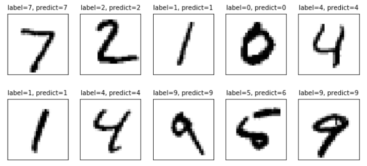

第六章 MNIST手写数字识别进阶：多层神经网络与应用
======
6.1 单隐藏层神经网络构建与应用
------
### 6.1.1 从单神经元到全连接神经网络
在上一章中，我们介绍了如何用一个神经元来处理分类问题，所采用的模型如下：
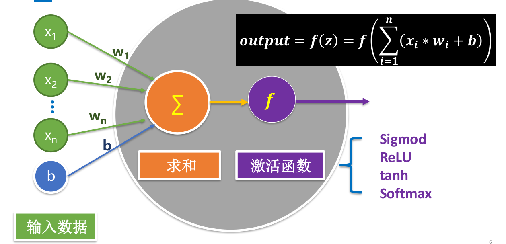
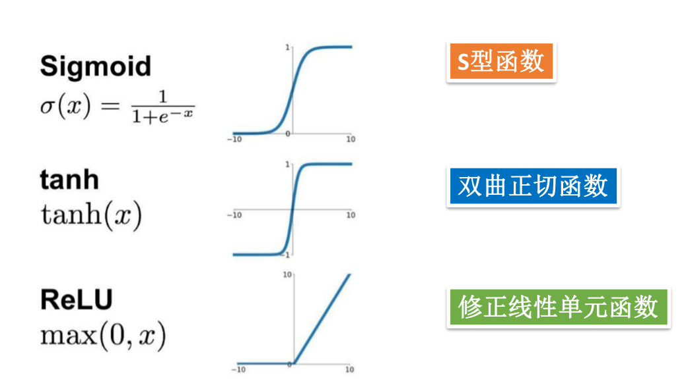
这种采用单个神经元来识别手写数字的方式，最终的准确率能够达到90%左右。那么我们能不能进一步的提高准确率呢？
下面我们尝试构建如下的单隐藏层全连接神经网络：
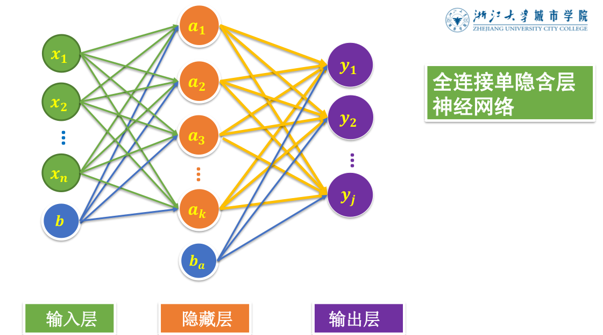

载入数据：
```py
import numpy as np
import matplotlib.pyplot as plt
import tensorflow as tf
from tensorflow.examples.tutorials.mnist import input_data

# 读取MNIST数据
mnist = input_data.read_data_sets('MNIST_data/',one_hot = True)
```

构建输入层：
```py
# 定义训练数据占位符
x = tf.placeholder(tf.float32,[None,784],name='X')
# 定义标签数据占位符
y = tf.placeholder(tf.float32,[None,10],name='Y')
```

构建隐藏层：
```py
# 隐藏层神经元数量
H1_NN = 256

# w1的前一层为784个神经元，后一层为H1_NN个神经元，所以w1的shape为[784,H1_NN]
w1 = tf.Variable(tf.truncated_normal([784,H1_NN],stddev=0.1))
# b1的后一层为H1_NN个神经元，所以b1的shape为(H1_NN,)
b1 = tf.Variable(tf.zeros([H1_NN]))

# 采用relu激活函数
y1 = tf.nn.relu(tf.matmul(x,w1) + b1)
```
上面的代码中用到了一个**tf.truncated_normal()函数**，该函数参数与**tf..random_normal()函数**参数相同。有一点不同的是该函数产生**截断正态分布随机数**，即随机数与均值的差值若大于两倍的标准差，则重新生成。
采用这种截断式的随机数做初始化要比完全随机要好。

构建输出层：
```py
# w2的前一层有H1_NN个神经元，后一层有10个神经元，所以w2的shape为(H1_NN,10)
w2 = tf.Variable(tf.truncated_normal([H1_NN,10]))
# b2的后一层有10个神经元，所以b2的shape为(10,)
b2 = tf.Variable(tf.zeros([10]))

# 结果层的前向计算值
forward = tf.matmul(y1,w2) + b2
# 由于是10分类问题，所以最后的激活函数应当用softmax函数
pred = tf.nn.softmax(forward)
```

定义损失函数：
```py
# 交叉熵
loss_function = tf.reduce_mean(-tf.reduce_sum(y*tf.log(pred),axis=1))
```

设置训练参数：
```py
# 设置训练参数
train_epochs = 40    # 训练轮数
batch_size = 50    # 单次训练样本数（批次大小）
total_batch = int(mnist.train.num_examples / batch_size)    # 一轮训练有多少批次
display_step = 1    # 显示粒度
learning_rate = 0.01    # 学习率
```

选择优化器：
```py
# 采用Adam优化器
optimizer = tf.train.AdamOptimizer(learning_rate).minimize(loss_function)
```
关于TensorFlow中优化器介绍，可以看这篇博客：[https://blog.csdn.net/junchengberry/article/details/81102058](https://blog.csdn.net/junchengberry/article/details/81102058) 。
一般还是Adam优化器用的比较多。

定义准确率：
```py
# 检查预测类别tf.argmax(pred,axis=1)与实际类别tf.argmax(y,axis=1)的匹配情况
# 相等返回True，否则返回False
correct_prediction = tf.equal(tf.argmax(pred,axis=1),tf.argmax(y,axis=1))

# 准确率，将布尔值转化为浮点数，并计算平均值
accuracy = tf.reduce_mean(tf.cast(correct_prediction,tf.float32))
```

训练模型：
```py
# 记录训练开始时间
from time import time
start_time = time()

sess = tf.Session()
init = tf.global_variables_initializer()
sess.run(init)

for epoch in range(train_epochs):
    for batch in range(total_batch):
        xs,ys = mnist.train.next_batch(batch_size)
        sess.run(optimizer,feed_dict={x:xs,y:ys})
        
    # total_batch个批次训练完成后，使用验证数据计算误差与准确率
    loss,acc = sess.run([loss_function,accuracy],
                        feed_dict={x:mnist.validation.images,y:mnist.validation.labels})
    if (epoch + 1) % display_step == 0:
        print('Train Epoch: %02d,  Loss= %.9f,  Accurary= %.4f'
             % (epoch + 1,loss,acc))

# 显示运行总时间
duration = time() - strat_time
print('Train Finished takes: %.2f' % (duration))
```
部分训练结果如下：
```py
Train Epoch: 01,  Loss= nan,  Accurary= 0.0958
Train Epoch: 02,  Loss= nan,  Accurary= 0.0958
Train Epoch: 03,  Loss= nan,  Accurary= 0.0958
Train Epoch: 04,  Loss= nan,  Accurary= 0.0958
Train Epoch: 05,  Loss= nan,  Accurary= 0.0958
```
很显然这不是我们想要的结果，肯定有哪个地方出现了问题。那么是哪出现了问题呢？
原因出自损失函数，我们的损失函数是如下定义的：
```py
# 交叉熵
loss_function = tf.reduce_mean(-tf.reduce_sum(y*tf.log(pred),axis=1))
```
注意里面有个log(pred)，在计算时有可能出现**log(0)**，因此出现问题的主要原因就是**log(0)引起的数据不稳定**。

TensorFlow中提供了结合softmax的交叉熵函数定义方法，使用此方法，可以避免log(0)的影响。
代码如下：
```py
# TensorFlow提供了softmax_cross_entropy_with_logits函数
# 用于避免因为log(0)值为nan造成的数据不稳定
loss_function = tf.reduce_mean(
    tf.nn.softmax_cross_entropy_with_logits(logits=forward,labels=y))
```
**tf.nn.softmax_cross_entropy_with_logits()函数**有如下几个参数：
```py
tf.nn.softmax_cross_entropy_with_logits(logits, labels, name=None)
```
+ logits：神经网络最后一层的输出，注意是**未经softmax激活函数处理的输出**，也就是上面代码中的forward，而不是pred。
+ labels：实际的标签，应与logits的shape相同
+ name：操作名称

我们更换损失函数：
```py
# TensorFlow提供了softmax_cross_entropy_with_logits函数
# 用于避免因为log(0)值为nan造成的数据不稳定
loss_function = tf.reduce_mean(
    tf.nn.softmax_cross_entropy_with_logits(logits=forward,labels=y))
```
需要注意的是，tf.nn.softmax_cross_entropy_with_logits()函数的返回值是一个**张量**，**要求损失函数的话，还要再对其求一步均值**。
再运行一次看看，部分结果如下：
```py
Train Epoch: 01,  Loss= 0.187707111,  Accurary= 0.9472
Train Epoch: 02,  Loss= 0.171345010,  Accurary= 0.9570
Train Epoch: 03,  Loss= 0.147639647,  Accurary= 0.9612
Train Epoch: 04,  Loss= 0.153220892,  Accurary= 0.9660
Train Epoch: 05,  Loss= 0.148393914,  Accurary= 0.9648
```
可以看到，结果正常了，并且准确率也比单个神经元提高了不少。
采用测试集评估模型：
```py
accu_test = sess.run(accuracy,
                     feed_dict={x:mnist.test.images,y:mnist.test.labels})
print('Test Accuracy:',accu_test)
```
输出为：
```py
Test Accuracy: 0.9688
```
单层全连接神经网络最后的准确率能达到97%左右。

### 6.1.2 模型应用
进行预测：
```py
# 由于是预测，所以只需要用到x
prediction_result = sess.run(tf.argmax(pred,axis=1),
                            feed_dict={x:mnist.test.images})
# 查看预测结果的前10项
prediction_result[0:10]
```
输出如下：
```py
array([7, 2, 1, 0, 4, 1, 4, 9, 6, 9])
```

找出预测错误：
```py
# 预测值与标签值的比较结果列表
# 这里的操作对象为数组，因此要用numpy库中的函数，而不是TensorFlow库中的函数
compare_lists = np.equal(prediction_result,
                         np.argmax(mnist.test.labels,axis=1))
print(compare_lists,'\n')

# err_lists列表中存放着预测错误的下标
err_lists = [i for i in range(len(compare_lists)) if compare_lists[i] == False]
print(err_lists,len(err_lists))
```
输出如下：
```py
[ True  True  True ...  True  True  True] 

[8, 18, 33, 61, 65, 149, 151, 193, 245, 247, 259, 320, 321, 352, 381, 403, 445, 447, 448, 495, 543, 552, 582, 610, 619, 646, 674, 685, 691, 707, 720, 726, 760, 844, 846, 866, 883, 900, 938, 944, 951, 956, 965, 1014, 1032, 1039, 1082, 1107, 1112, 1178, 1182, 1202, 1226, 1232, 1234, 1242, 1247, 1272, 1319, 1326, 1328, 1364, 1393, 1414, 1415, 1425, 1444, 1464, 1490, 1500, 1527, 1530, 1549, 1553, 1554, 1562, 1571, 1609, 1621, 1640, 1641, 1654, 1670, 1681, 1709, 1800, 1878, 1901, 1903, 1941, 1952, 1955, 1981, 1982, 2004, 2016, 2053, 2063, 2093, 2098, 2105, 2109, 2125, 2129, 2130, 2135, 2153, 2168, 2182, 2189, 2224, 2225, 2237, 2272, 2292, 2293, 2369, 2387, 2406, 2422, 2425, 2462, 2488, 2573, 2597, 2598, 2607, 2654, 2720, 2721, 2770, 2810, 2877, 2896, 2915, 2921, 2927, 2939, 2970, 2975, 2979, 3023, 3056, 3060, 3073, 3106, 3117, 3206, 3250, 3284, 3289, 3336, 3365, 3369, 3377, 3388, 3405, 3422, 3451, 3490, 3503, 3520, 3533, 3549, 3558, 3559, 3574, 3597, 3601, 3604, 3626, 3767, 3776, 3808, 3811, 3838, 3902, 3906, 3926, 3941, 3943, 3946, 3976, 4007, 4018, 4075, 4078, 4145, 4149, 4156, 4205, 4212, 4224, 4238, 4248, 4289, 4294, 4355, 4360, 4403, 4433, 4497, 4500, 4504, 4534, 4571, 4575, 4601, 4639, 4690, 4699, 4731, 4740, 4751, 4761, 4814, 4820, 4823, 4879, 4880, 4966, 5078, 5495, 5586, 5642, 5676, 5734, 5749, 5887, 5888, 5922, 5936, 5955, 5973, 6011, 6024, 6059, 6347, 6555, 6560, 6571, 6572, 6574, 6576, 6577, 6597, 6598, 6608, 6625, 6632, 6651, 6755, 6769, 6783, 6806, 7154, 7216, 7233, 7434, 7459, 7473, 7565, 7574, 7691, 7797, 7823, 7842, 7849, 7858, 7921, 8094, 8171, 8198, 8339, 8416, 8472, 8493, 8509, 8519, 8523, 8527, 9009, 9015, 9024, 9031, 9036, 9071, 9316, 9382, 9450, 9456, 9538, 9587, 9634, 9664, 9679, 9701, 9716, 9729, 9733, 9740, 9741, 9745, 9770, 9792, 9839, 9858, 9892, 9904, 9922, 9941, 9970] 312
```

下面对其进行可视化操作。其实只是对上一章的可视化函数上做了一点小改动。
代码如下：
```py
def plot_err_prediction(images,    # 图像列表
                       labels,     # 标签列表
                       prediction, # 预测值列表
                       err_lists,  # 错误预测的下标列表
                       index,      # 从第index个开始显示
                       num=10):    # 默认一次显示10幅
        fig = plt.gcf()
        fig.set_size_inches(10,12)
        if num > 25:
            num = 25    # 一次最多显示25幅
            
        for i in range(num):
            # 显示预测错误
            err_index = err_lists[index]
            ax = plt.subplot(5,5,i+1)
            ax.imshow(images[err_index].reshape(28,28),cmap='binary')
            
            # 设置标题及坐标轴
            title = 'labels=' + str(np.argmax(labels[err_index])) + \
            ', predict=' + str(prediction[err_index])
            ax.set_title(title,fontsize=10)
            ax.set_xticks([])
            ax.set_yticks([])
            index += 1
        plt.show()
```
调用该函数：
```py
plot_err_prediction(mnist.test.images,mnist.test.labels,
                    prediction_result,err_lists,0)
```
输出如下：
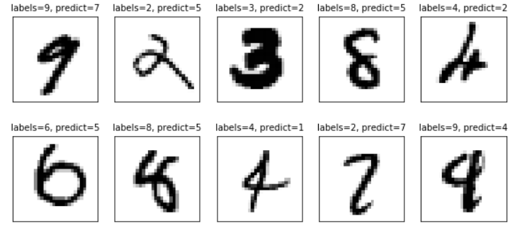

6.2 多层神经网络建模与模型的保存还原
------
### 6.2.1 2层神经网络的构建
构建模型：
```py
# 隐藏层神经元数量
H1_NN = 256    # 第1隐藏层神经元为256个
H2_NN = 64    # 第2隐藏层神经元为64

# 输入层-第1隐藏层参数和偏置项
w1 = tf.Variable(tf.truncated_normal([784,H1_NN],stddev=0.1))
b1 = tf.Variable(tf.zeros([H1_NN]))

# 第1隐藏层-第2隐藏层参数和偏置项
w2 = tf.Variable(tf.truncated_normal([H1_NN,H2_NN],stddev=0.1))
b2 = tf.Variable(tf.zeros([H2_NN]))

# 第2隐藏层-输出层参数和偏置项
w3 = tf.Variable(tf.truncated_normal([H2_NN,10],stddev=0.1))
b3 = tf.Variable(tf.zeros([10]))

# 计算第1隐藏层结果
y1 = tf.nn.relu(tf.matmul(x,w1) + b1)

# 计算第2隐藏层结果
y2 = tf.nn.relu(tf.matmul(y1,w2) + b2)

# 计算输出结果
forward = tf.matmul(y2,w3) + b3
pred = tf.nn.softmax(forward)
```

训练完成后评估模型：
```py
accu_test = sess.run(accuracy,
                     feed_dict={x:mnist.test.images,y:mnist.test.labels})
print('Test Accuracy:',accu_test)
```
输出为：
```py
Test Accuracy: 0.9699
```

### 6.2.2 3层神经网络的构建
构建模型：
```py
# 隐藏层神经元数量
H1_NN = 256    # 第1隐藏层神经元为256个
H2_NN = 64    # 第2隐藏层神经元为64
H3_NN = 32    # 第3隐藏层神经元为32

# 输入层-第1隐藏层参数和偏置项
w1 = tf.Variable(tf.truncated_normal([784,H1_NN],stddev=0.1))
b1 = tf.Variable(tf.zeros([H1_NN]))

# 第1隐藏层-第2隐藏层参数和偏置项
w2 = tf.Variable(tf.truncated_normal([H1_NN,H2_NN],stddev=0.1))
b2 = tf.Variable(tf.zeros([H2_NN]))

# 第2隐藏层-第3隐藏层参数和偏置项
w3 = tf.Variable(tf.truncated_normal([H2_NN,H3_NN],stddev=0.1))
b3 = tf.Variable(tf.zeros([H3_NN]))

# 第3隐藏层-输出层参数和偏置项
w4 = tf.Variable(tf.truncated_normal([H3_NN,10],stddev=0.1))
b4 = tf.Variable(tf.zeros([10]))

# 计算第1隐藏层结果
y1 = tf.nn.relu(tf.matmul(x,w1) + b1)

# 计算第2隐藏层结果
y2 = tf.nn.relu(tf.matmul(y1,w2) + b2)

# 计算第3隐藏层结果
y3 = tf.nn.relu(tf.matmul(y2,w3) + b3)

# 计算输出结果
forward = tf.matmul(y3,w4) + b4
pred = tf.nn.softmax(forward)
```

训练完成后评估模型：
```py
accu_test = sess.run(accuracy,
                     feed_dict={x:mnist.test.images,y:mnist.test.labels})
print('Test Accuracy:',accu_test)
```
输出如下：
```py
Test Accuracy: 0.9762
```
需要注意的一点是，**神经网络的层数并不是越多越好，需要具体问题具体分析**。

### 6.2.3 模型重构
上面两节构建多层神经网络的代码太罗嗦了，能不能优化一下呢？
我们可以定义一个全连接层函数，来实现神经网络各层的定义。
代码如下：
```py
# 定义全连接层函数 fully connected
def fcn_layer(inputs,          # 输入数据
             input_dim,        # 输入神经元数量
             output_dim,       # 输出神经元数量
             activation=None): # 激活函数
    
    # 以截断正态分布的随机数初始化w
    w = tf.Variable(tf.truncated_normal([input_dim,output_dim],stddev=0.1))
    # 以0初始化b
    b = tf.Variable(tf.zeros([output_dim]))
    
    xwb = tf.matmul(inputs,w) + b    #建立表达式：inputs * w + b
    
    if activation is None:    # 默认不使用激活函数
        outputs = xwb
    else:                    # 若传入激活函数，则用其对输出结果进行变换
        outputs = activation(xwb)
        
    return outputs
```

在Python中，函数名称可以可以赋值给其他变量，被赋值的变量称为函数的引用，当该变量被使用时，就会执行变量所引用的函数。
示例代码如下：
```py
# 定义两数和函数
def add(a,b):
    return a + b

# add函数名称赋值给sum_ab变量
sum_ab = add

# 使用sum_ab变量
print(sum_ab(-3,5))
# 使用add变量
print(add(-3,5))
```
输出如下：
```py
# 定义两数和函数
def add(a,b):
    return a + b

# add函数名称赋值给sum_ab变量
sum_ab = add

# 使用sum_ab变量
print(sum_ab(-3,5))
# 使用add变量
print(add(-3,5))
```
上面定义的全连接层函数中的activation参数就是这种用法。

下面以三隐层模型的建立作为示例：
```py
# 构建输入层
x = tf.placeholder(tf.float32,[None,784],name='X')

# 定义标签数据占位符
y = tf.placeholder(tf.float32,[None,10],name='Y')

# 隐藏层神经元数量
H1_NN = 256    # 第1隐藏层神经元为256个
H2_NN = 64    # 第2隐藏层神经元为64
H3_NN = 32    # 第3隐藏层神经元为32

# 构建隐藏层1
h1 = fcn_layer(inputs=x,input_dim=784,output_dim=H1_NN,activation=tf.nn.relu)

# 构建隐藏层2
h2 = fcn_layer(inputs=h1,input_dim=H1_NN,output_dim=H2_NN,activation=tf.nn.relu)

# 构建隐藏层3
h3 = fcn_layer(inputs=h2,input_dim=H2_NN,output_dim=H3_NN,activation=tf.nn.relu)

# 构建输出层
# 由于后面的损失函数要用到未经激活函数处理的输出，所以这里的activation定义为None
forward = fcn_layer(inputs=h3,input_dim=H3_NN,output_dim=10,activation=None)
pred = tf.nn.softmax(forward)
```
代码要比之前的简洁多了。

### 6.2.4 模型保存
初始化参数和模型目录：
```py
# 存储模型的粒度
save_step = 5

# 创建保存模型文件的目录
import os
ckpt_dir = 'ckpt_dir/'
if not os.path.exists(ckpt_dir):
    os.makedirs(ckpt_dir)
```

训练并存储模型：
```py
# 声明完所有变量后，调用tf.train.Saver
saver = tf.train.Saver()

# 记录训练开始时间
from time import time
start_time = time()

sess = tf.Session()
init = tf.global_variables_initializer()
sess.run(init)

for epoch in range(train_epochs):
    for batch in range(total_batch):
        xs,ys = mnist.train.next_batch(batch_size)
        sess.run(optimizer,feed_dict={x:xs,y:ys})
        
    # total_batch个批次训练完成后，使用验证数据计算误差与准确率
    loss,acc = sess.run([loss_function,accuracy],
                        feed_dict={x:mnist.validation.images,y:mnist.validation.labels})
    if (epoch + 1) % display_step == 0:
        print('Train Epoch: %02d,  Loss= %.9f,  Accurary= %.4f'
             % (epoch + 1,loss,acc))
        
    if (epoch + 1) % save_step == 0:
        # 训练过程中存储模型
        # os.path.join()函数连接两个或更多的路径名
        saver.save(sess,os.path.join(ckpt_dir,'mnist_model_{:06d}.ckpt'.format(epoch + 1)))
        print('mnist_model_{:06d}.ckpt saved'.format(epoch + 1))

# 存储训练完成后的模型        
saver.save(sess,os.path.join(ckpt_dir,'mnist_model.ckpt'))
print('Model saved!')

# 显示运行总时间
duration = time() - start_time
print('Train Finished takes: %.2f' % (duration))
```

TensorFlow模型保存时有两个主要的文件：
1. Meta graph：这是一个协议缓冲区，它保存了完整的TensorFlow图形，即所有变量、操作、集合等。该文件以.meta作为扩展名。
2. Checkpoint file：这是一个二进制文件，它包含了所有的权重、偏差、梯度和所有其他变量的值。这个文件有一个扩展名.ckpt。然而，Tensorflow从0.11版本中改变了这一点。现在，我们有两个文件，而不是单个.ckpt文件。

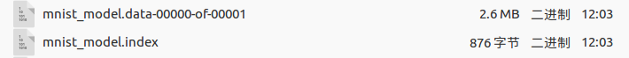
.data文件是包含我们训练变量的文件。
与此同时，Tensorflow也有一个名为“checkpoint”的文件，它只保存最新保存的checkpoint文件的记录。
因此，TensorFlow模型如下：
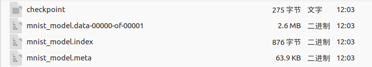
并且，TensorFlow默认最多保存最近5次的。因此此时ckpt_dir文件夹下应该有16个文件，其中包括1个名为checkpoint的文件和5个（每一个模型都由3个文件组成）TensorFlow模型。
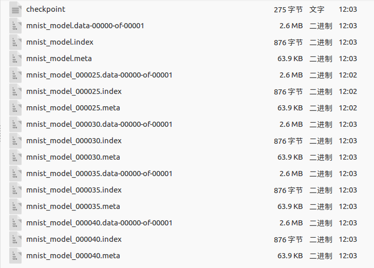

下面介绍一下**tf.train.saver.save()方法**，该方法常用参数如下：
```py
save(
    sess,
    save_path)
```
sess：会话对象。Tensorflow变量仅在会话中存在，因此必须在一个会话中保存模型。
save_path：要保存的文件路径+文件名的前缀，不需要加.ckpt扩展名。
示例：
```py
# 在ckpt_dir文件夹下生成名为mnist_model的模型文件
saver.save(sess,'ckpt_dir/mnist_model')
```

### 6.2.5 模型还原
TensorFlow中采用**tf.train.saver.restore()方法**实现已保存模型的载入。其参数如下：
```py
restore(
    sess,
    save_path)
```
sess：用于还原变量的会话。
save_path：先前保存参数的路径。包括模型文件名。
示例：
```py
# 读取ckpt_dir文件夹下名为mnist_model的模型文件
saver.restore(sess,'ckpt_dir/mnist_model')
```

读取模型：
```py
# 声明完所有变量后，调用tf.train.Saver
saver = tf.train.Saver()

# 记录训练开始时间
from time import time
start_time = time()

sess = tf.Session()
init = tf.global_variables_initializer()
sess.run(init)

# 获取CheckpointState对象
ckpt = tf.train.get_checkpoint_state(ckpt_dir)

if ckpt and ckpt.model_checkpoint_path:	# 如果模型文件存在
    # 从已保存的模型中读取参数
    saver.restore(sess,ckpt.model_checkpoint_path)
    print('Restore model from',ckpt.model_checkpoint_path)
```

上面的代码用到了**tf.train.get_checkpoint_state()函数**，下面对其进行介绍。
该函数的参数如下：
```py
tf.train.get_checkpoint_state(
    checkpoint_dir,
    latest_filename=None
)
```
checkpoint_dir：模型文件的存放目录
该函数会读取那个名为“checkpoint”的文件，如果该文件内有合法的CheckpointState原型，将其返回。这是什么意思呢？
让我们看一下名为“checkpoint”的文件的内容：
```py
model_checkpoint_path: "mnist_model"
all_model_checkpoint_paths: "mnist_model_000025"
all_model_checkpoint_paths: "mnist_model_000030"
all_model_checkpoint_paths: "mnist_model_000035"
all_model_checkpoint_paths: "mnist_model_000040"
all_model_checkpoint_paths: "mnist_model"
```
再运行如下代码：
```py
ckpt = tf.train.get_checkpoint_state(ckpt_dir)
print(type(ckpt))
print(ckpt)
```
结果如下：
```py
<class 'tensorflow.python.training.checkpoint_state_pb2.CheckpointState'>
model_checkpoint_path: "ckpt_dir/mnist_model"
all_model_checkpoint_paths: "ckpt_dir/mnist_model_000025"
all_model_checkpoint_paths: "ckpt_dir/mnist_model_000030"
all_model_checkpoint_paths: "ckpt_dir/mnist_model_000035"
all_model_checkpoint_paths: "ckpt_dir/mnist_model_000040"
all_model_checkpoint_paths: "ckpt_dir/mnist_model"
```
CheckpointState对象与“checkpoint”文件的内容相同！
CheckpointState对象有**model_checkpoint_path**和**all_model_checkpoint_paths**两个属性。其中model_checkpoint_path保存了最新的tensorflow模型文件的文件名（包含文件路径），all_model_checkpoint_paths则有未被删除的所有tensorflow模型文件的文件名（包含文件路径）。
因此我们可以通过tf.train.get_checkpoint_state()函数获得CheckpointState对象，并根据CheckpointState对象的model_checkpoint_path属性来载入最新的TensorFlow模型文件。

除了采用上面的代码外，我们还可以使用**tf.train.latest_checkpoint()函数**来找到最新的模型文件，从而实现模型的还原。
该函数的参数如下：
```py
tf.train.latest_checkpoint(
    checkpoint_dir,
    latest_filename=None
)
```
checkpoint_dir：模型文件的存放目录
该函数会返回最新的tensorflow模型文件的文件名（包含文件路径）。
示例如下：
```py
ckpt = tf.train.latest_checkpoint(ckpt_dir)
print(ckpt)
```
输出为：
```py
ckpt_dir/mnist_model
```

下面我们试着用这种方式来实现模型的还原。
代码如下：
```py
# 声明完所有变量后，调用tf.train.Saver
saver = tf.train.Saver()

# 记录训练开始时间
from time import time
start_time = time()

sess = tf.Session()
init = tf.global_variables_initializer()
sess.run(init)

# 如果有检查点文件，读取最新的检查点文件，恢复各种变量值
ckpt = tf.train.latest_checkpoint(ckpt_dir)
if ckpt != None:
    saver.restore(sess,ckpt)    # 加载所有的参数
    print('Restore model from',ckpt)
else:
    print('Training from scratch')
```

在介绍完了上面这些东西之后，我们可以考虑一下如何实现断点续训。
代码如下：
```py
# 定义一个记录训练轮数的epoch变量，使其能够被保存
# 指定trainable变量为False，表示该变量不参与训练
epoch = tf.Variable(0,name='epoch',trainable=False)

# ------读取模型文件，还原变量，代码省略------

# 获取续训参数
start = sess.run(epoch)
print('Training starts from %d epoch' % start + 1)

for ep in range(start,train_epochs):
    
    #------训练过程代码，略------
    
    # 将ep+1赋值给epoch，相当于每次循环epoch都自加1
    # 需要注意的是，调用赋值函数只是定义了一个操作，要想操作执行，必须要调用会话中的run函数
    sess.run(epoch.assign(ep + 1))
```
这样就可以实现断点重训了。

第七章 图像识别问题：卷积神经网络及其应用
======
7.1 从全连接网络到卷积神经网络
------
对于MNIST 手写数字识别，假如第一个隐层的节点数为500，那么一个全连接层的参数个数为：
> 28×28×1×500+500 ≈ 40万

其中的1为通道数，由于MNIST数据集中的图像都是黑白的，所以为色彩**单通道**。
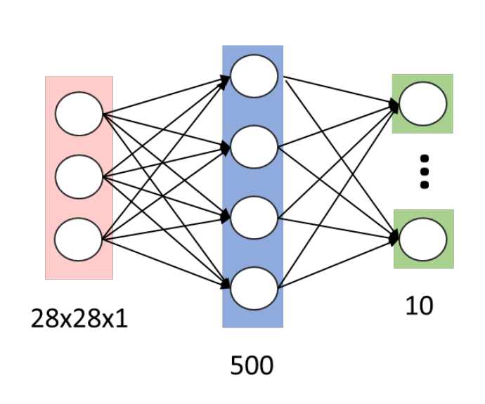
当图片更大时，比如CIFAR数据集中，图片大小为32×32×3，此时全连接层的参数有：
> 32×32×3×500+500 ≈ 150万

这里的3也为通道数，色彩**三通道**（RGB三色）。
当图片分辨率进一步提高时，当隐层数量增加时，例如:600 x 600 图像，各隐层节点数分别为300、200和100，则参数个数为：
> 600 x 600 x 300 + 300 x 200 + 200 x 100 ≈ 1.08亿

而参数增多会导致计算速度减慢，过拟合等问题。因此，我们需要更合理的结构来有效减少参数个数！
这就引出了卷积神经网络。
关于卷积神经网络的比较好的文章：
[https://www.zhihu.com/question/52668301](https://www.zhihu.com/question/52668301) 。这是知乎上的一个问题，强烈推荐看YJango的回答（第三个），机器之心的回答也可以看看。
[https://blog.csdn.net/v_july_v/article/details/51812459](https://blog.csdn.net/v_july_v/article/details/51812459) 

7.2 卷积神经网络的介绍
------
### 7.2.1 卷积神经网络概述
1962年Hubel和Wiesel通过对猫视觉皮层细胞的研究，提出了**感受野(receptive field)**的概念。视觉皮层的神经元就是局部接受信息的，只受某些特定区域刺激的响应，而不是对全局图像进行感知。
1984年日本学者Fukushima基于感受野概念提出**神经认知机(neocognitron)**。
**卷积神经网络（ConvolutionalNeuralNetwork,CNN）**可看作是神经认知机的推广形式。

CNN是一个**多层的神经网络**，每层由**多个二维平面**组成，其中每个平面由**多个独立神经元**组成。
如下：
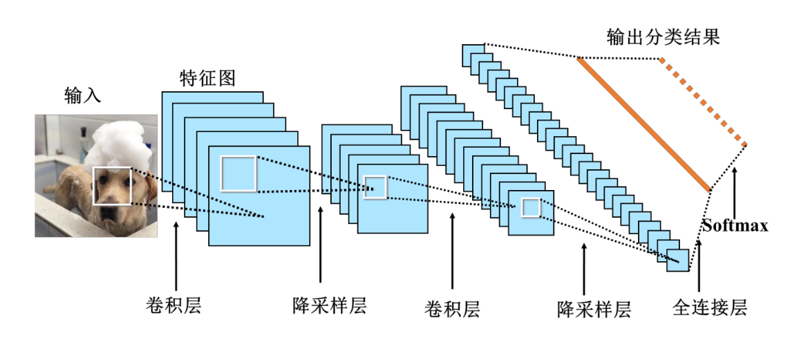
卷积神经网络的主要结构如下：
1. **输入层**：将每个像素代表一个特征节点输入到网络中。
2. **卷积层**：卷积运算的主要目的是使原信号特征增强，并降低噪音。
3. **降采样层**（也叫**池化层**）：降低网络训练参数及模型的过拟合程度。
4. **全连接层**：对生成的特征进行加权。
下面对卷积神经网络中的卷积和池化运算进行介绍。

### 7.2.2 卷积
在介绍卷积神经网络的基本概念之前，我们先做一个矩阵运算：
1. **求点积**：将5×5输入矩阵中3×3深蓝色区域中每个元素分别与其对应位置的权值（红色数字）相乘，然后再相加，所得到的值作为3×3输出矩阵（绿色）的第一个元素。实际上，类似于前馈神经网络，这里所得到的值还应加上一个**偏移量b<sub>0</sub>**。
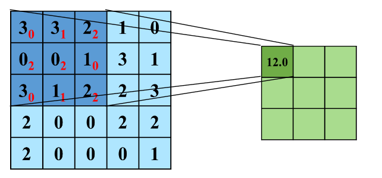
2. **滑动窗口**：将3×3权值矩阵向右移动一个格(即,步长为1)。
3. **重复操作**：同样地，将此时深色区域内每个元素分别与对应的权值相乘然
后再相加，所得到的值作为输出矩阵的第二个元素；重复上述“求点积-滑动窗
口”操作，直至输出矩阵所有值被填满。
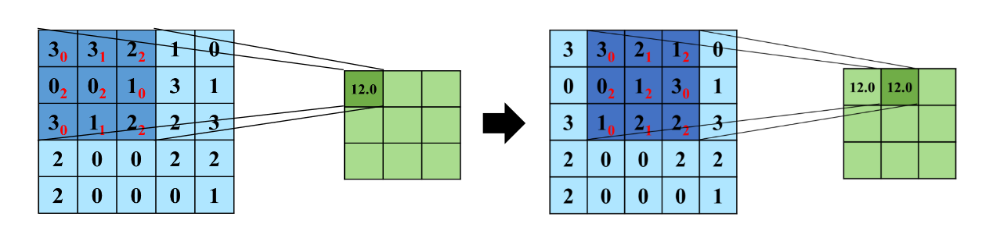

**卷积核**在2 维输入数据上“滑动”，对当前输入部分的元素进行矩阵乘法，然后将结果汇为单个输出像素值，重复这个过程直到遍历整张图像，这个过程就叫做**卷积**。
这个权值矩阵就是**卷积核**。卷积操作后的图像称为**特征图（feature map）**。
卷积运算有以下两个主要特点：
+ **局部连接**：每个输出特性不用查看每个输入特征，而只需查看**部分输入特征**。
+ **权值共享**：卷积核在图像上滑动过程中**保持不变**。即**权值**以及**偏移量b<sub>0</sub>**在图像上滑动过程中都是不变的。

常用的卷积核有以下三种：
```py
# 提取垂直方向特征
# sobel_x
kernel_1 = np.array([[-1,0,1],
                    [-2,0,2],
                    [-1,0,1]])

# 提取水平方向特征
# sobel_y
kernel_2 = np.array([[-1,-2,1],
                    [0,0,0],
                    [1,2,1]])

# Laplace扩展算子
# 二阶微分算子
kernel_3 = np.array([[1,1,1],
                    [1,-8,1],
                    [1,1,1]])
```
其中sobel_x主要提取垂直方向特征，sobel_y主要提取水平方向特征。Laplace则比较平均。
下面是同一张图片经过这几种卷积核进行运算后所产生的特征图：

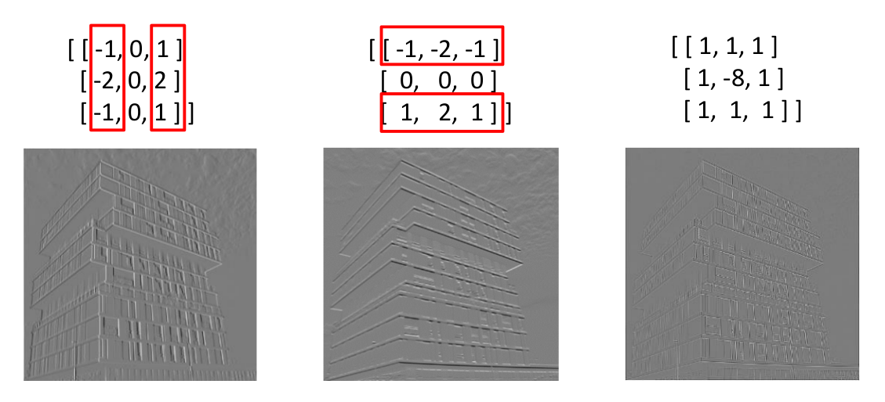
可以看到，经不同卷积核所进行的卷积运算的差距还是蛮大的。
卷积运算的主要目的是**使原信号特征增强，并降低噪音**。
对图像用一个卷积核进行卷积运算，实际上是一个滤波的过程。每个**卷积核**都是一种**特征提取方式**，就像是一个筛子，将图像中符合条件的部分筛选出来。

观察卷积示例，我们会发现一个**现象**：在卷积核滑动的过程中图像的边缘会被裁剪掉，5×5特征矩阵将转换为 3×3的特征矩阵。
那么如何使得输出尺寸与输入保持一致呢?
**0填充（Zero padding）**：用额外的“假”像素（通常值为 0）填充边缘。这样，在滑动时的卷积核可以允许原始边缘像素位于卷积核的中心，同时延伸到边缘之外的假像素，从而产生与输入（5×5蓝色）相同大小的输出（5×5绿色）。
如下：
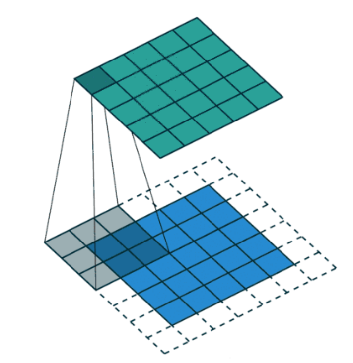

下面介绍一下**多通道卷积**。
每个卷积核都会将图像生成为另一幅特征映射图，即：**一个卷积核提取一种特征**。为了使特征提取更充分，可以添加多个卷积核以提取不同的特征，也就是，**多通道卷积**。
多通道卷积主要有以下步骤：
+ 每个通道使用一个卷积核进行卷积操作
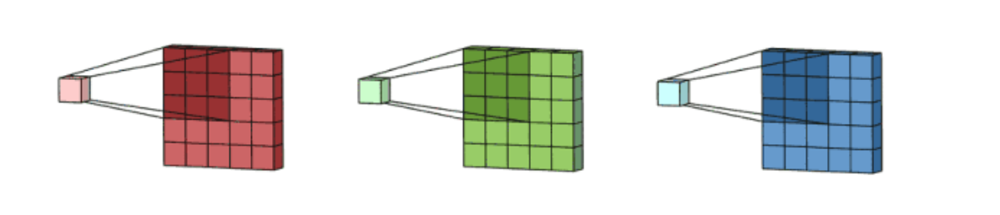
+ 然后将这些特征图相同位置上的值相加,生成一张特征图。
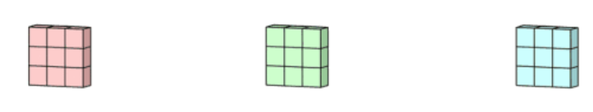
+ **加偏置**。偏置的作用是对每个feature map加一个偏置项以便产生最终的输出特征图。
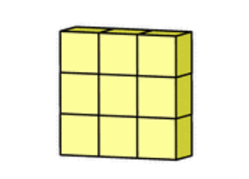

和前馈神经网络一样，经过线性组合和偏移后，会**加入非线性部分**来增强模型的拟合能力。
如下：
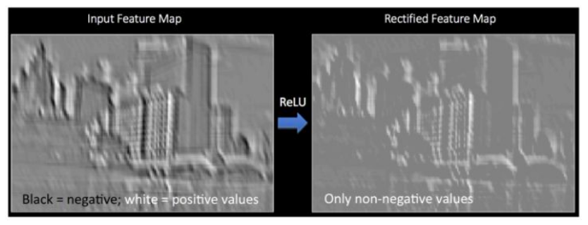
**卷积层的输出应经过激活函数处理后再送入下一层**。因此，卷积神经网络中间部分更细致一些的结构图应该如下：
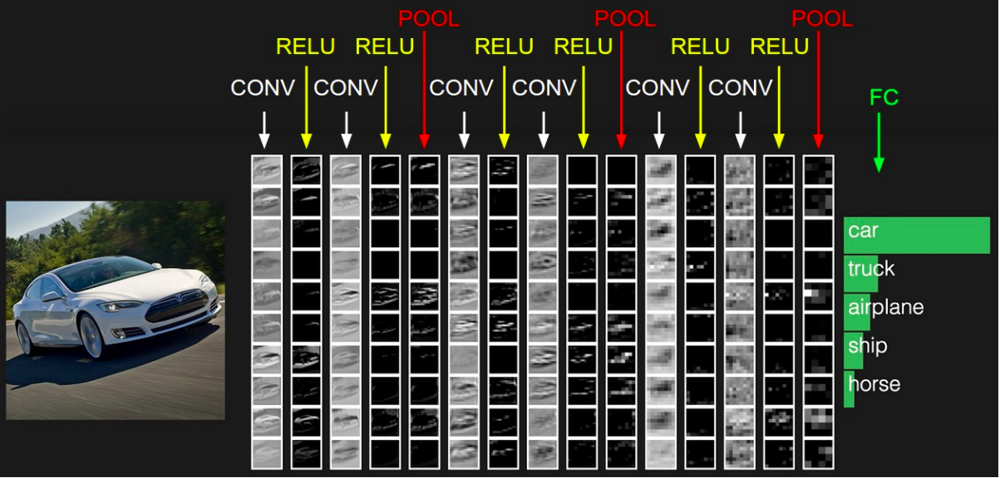
其中CONV代表卷积层，RELU代表relu激活函数激活，POOL代表池化层。

### 7.2.3 池化
在卷积层之后常常紧接着一个降采样层，通过减小矩阵的长和宽，从而达到减少参数的目的。
降采样是降低特定信号的采样率的过程。最常用的降采样方法是**池化（pooling）**。

计算图像一个区域上的某个特征的平均值或最大值，这种聚合操作就叫做**池化（pooling）**。
卷积层的作用是探测上一层特征的局部连接，而池化的作用是**在语义上把相似的特征合并起来**，从而达到降维的目的。这些概要统计特征不仅具有低得多的维度（相比使用所有提取得到的特征），同时还会改善结果（不容易过拟合）。

常用的池化方法：
1. **均值池化**：对池化区域内的像素点**取均值**，这种方法得到的特征数据**对背景信息更敏感**。
2. **最大池化**：对池化区域内所有像素点取**最大值**，这种方法得到的特征**对纹理特征信息更加敏感**。
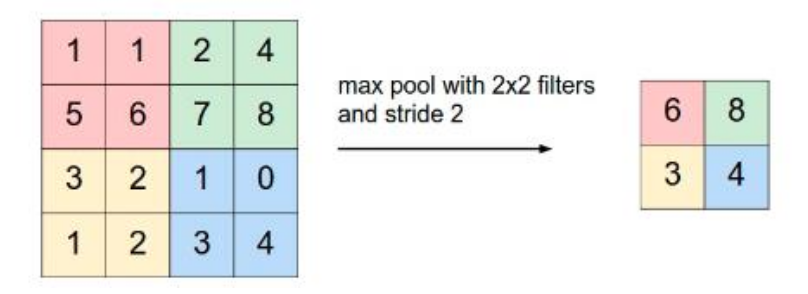
隐层与隐层之间空间分辨率递减，因此，为了检测更多的特征信息、形成更多不同通道特征的组合，从而形成更复杂的特征，需要逐渐增加每层所含的平面数（也就是特征图的数量）。

**步长（stride）**是卷积操作的重要概念，表示卷积核在图片上移动的格数。通过步长的变换，可以得到不同尺寸的卷积输出结果。
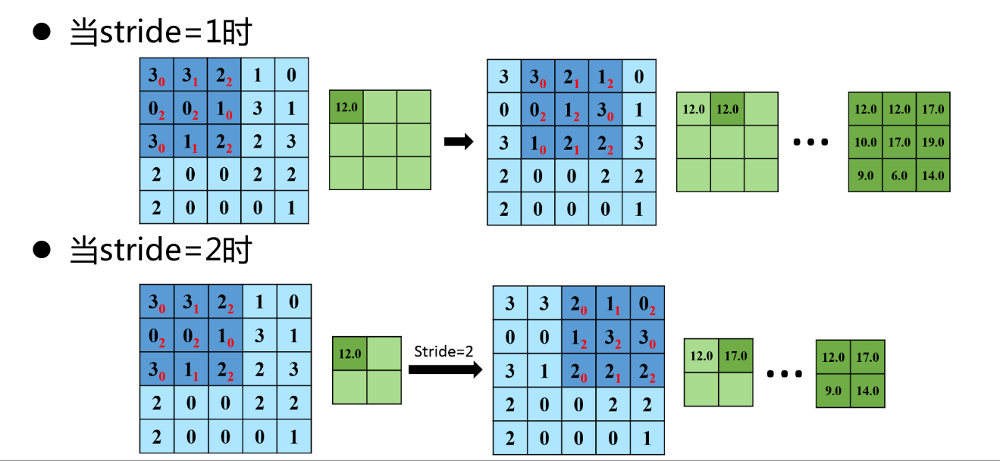
步长大于1的卷积操作也是**降维的一种方式**
卷积后图片尺寸：假如步长为S，原始图片尺寸为[N1,N1]，卷积核大小为
[N2,N2]，那么卷积之后图像大小：
[(N1-N2)/S+1, (N1-N2)/S+1]

卷积神经网络过程概括：输入图像通过若干个“卷积→降采样”后，连接成一个向量输入到传统的分类器层中，最终得到输出。
可用如下的正则表达式表示：
**输入层→(卷积层+→池化层?)+→全连接层+**
+表示一个或多个，?表示0个或一个，()表示一组。

### 7.2.4 TensorFlow中CNN的相关函数
卷积函数：
```py
tf.nn.conv2d(input, filter, strides, padding, use_cudnn_on_gpu=None,name=None)
```
+ input：需要做卷积的输入数据。注意：这是一个**4维张量**（[batch,in_height,in_width,in_channels]），要求类型为float32或float64其中之一。batch为图片的数量，in_height 为图片高度，in_weight 为图片宽度，in_channel 为图片的通道数，灰度图该值为1，彩色图为3。
+ filter：卷积核。[filter_height, filter_width, in_channels, out_channels]，其中filter_height为卷积核高度，filter_width为卷积核宽度，in_channels是图像通道数 ，和input 的in_channels要保持一致，out_channels是卷积核数量。
+ strides：图像每一维的步长，是一个一维向量，长度为4。一般为[1,stride,stride,1]，其中第一个1和最后一个1是固定值，需要改变的是中间的两个数，即在x轴和y轴的移动步长。
+ padding：定义元素边框与元素内容之间的空间。"SAME"或"VALID"（**注意要大写！**），这个值决定了不同的卷积方式。当为"SAME"时，表示边缘填充，适用于全尺寸操作；当为"VALID"时，表示边缘不填充。使用"SAME"时卷积结果与卷积前图像大小相同，使用"VALID"时卷积结果要小于卷积前图像。**对卷积操作来说，一般是选"SAME"**。
+ use_cudnn_on_gpu：bool类型，是否使用cudnn加速，默认为True。
+ name：该操作的名称
+ 返回值：返回一个tensor，即feature map，shape仍然是[batch, height, width, channels]这种形式

对上面filter参数中out_channels的中的疑问：为什么颜色通道为1或3的图像，经过卷积后，它的通道可以变成 128 或者其它呢？
答案在于卷积核的数目。一个卷积核得到的特征提取是不充分的，我们可以添加多个卷积核，比如32个卷积核，可以学习32种特征，此时输出为32个feature map，即输出的图像的通道数为32。所以上面的out_channels为输出图像的通道数，也就是卷积核的数目。
卷积过程对一个通道的图像进行卷积，比如10个卷积核，得到10个feature map，那么那么**输入图像为RGB三个通道**呢？输出为30个feature map吗？答案肯定不是的。**输出的个数依然是卷积核的个数10，只不过输出的图像是对RGB三个通道的加和**。
这一部分，其实在我前面推荐的那篇YJango的回答也有所提及，可以看一下。

示例代码：
```py
import tensorflow as tf
import numpy as np

input_data = tf.Variable(np.random.rand(10,9,9,4),dtype=tf.float32)
filter_data = tf.Variable(np.random.rand(3,3,4,2),dtype=tf.float32)

# 卷积
y1 = tf.nn.conv2d(input_data,filter_data,strides=[1,1,1,1],padding='SAME')
y2 = tf.nn.conv2d(input_data,filter_data,strides=[1,1,1,1],padding='VALID')

print(input_data)
print(y1)
print(y2)
```
输出如下：
```py
<tf.Variable 'Variable_12:0' shape=(10, 9, 9, 4) dtype=float32_ref>
Tensor("Conv2D_8:0", shape=(10, 9, 9, 2), dtype=float32)
Tensor("Conv2D_9:0", shape=(10, 7, 7, 2), dtype=float32)
```
可以看到在指定padding参数为"VAILD"后，输出的特征图的大小相较于原始图像的大小是减小了的。

池化函数：
```py
# 最大池化
tf.nn.max_pool(value, ksize, strides, padding, name=None)

# 平均池化
tf.nn.avg_pool(value, ksize, strides, padding, name=None)
```
+ value：需要池化的输入。一般池化层接在卷积层后面，所以输入通常是conv2d所输出的feature map，依然是4维的张量([batch, height, width,channels])。
+ ksize：池化窗口的大小，由于一般不在batch和channel上做池化，所以ksize一般是[1,height, width,1]。
+ strides：跟卷积函数中strides含义一样。图像每一维的步长，是一个一维向量，长度为4，一般为[1,stride,stride,1]。
+ padding：和卷积函数中padding含义一样，"SAME"或"VALID"。
+ name：该操作的名称。
+ 返回值：返回一个Tensor，类型不变，shape仍然是[batch, height, width, channels]这种形式。

示例如下：
```py
input_data = tf.Variable(np.random.rand(1,3,3,1),dtype=tf.float32)
filter_data = tf.Variable(np.random.rand(2,2,1,3),dtype=tf.float32)

# 卷积
y = tf.nn.conv2d(input_data,filter_data,strides=[1,1,1,1],padding='SAME')

# 最大池化
output1 = tf.nn.max_pool(y,ksize=[1,2,2,1],strides=[1,2,2,1],padding='SAME')
output2 = tf.nn.max_pool(y,ksize=[1,2,2,1],strides=[1,2,2,1],padding='VALID')

print(y)
print(output1)
print(output2)
```
输出为：
```py
Tensor("Conv2D_11:0", shape=(1, 3, 3, 3), dtype=float32)
Tensor("MaxPool_2:0", shape=(1, 2, 2, 3), dtype=float32)
Tensor("MaxPool_3:0", shape=(1, 1, 1, 3), dtype=float32)
```
可以看到，使用不同的padding参数，结果还是不一样的。
因为模板在滑动时，可能存在覆盖不完全的地方，就比如用2*2的模板，对于VALID模式和SAME模式就不一样，SAME模式会补全橙色部分，而VALID模式就不会补全了。


7.3 卷积神经网络实现MNIST手写数据识别
------
采用的卷积神经网络结构如下：
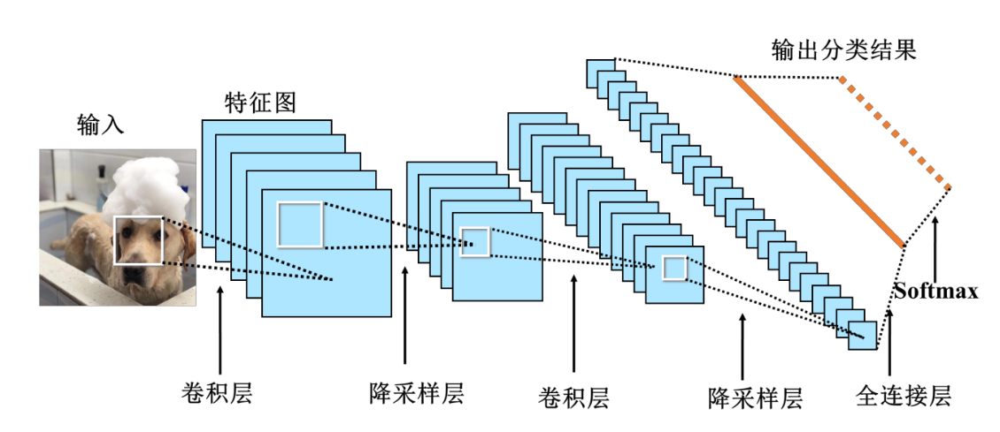

|输入层|卷积层1|降采样层1|卷积层2|降采样层2|全连接层|输出层|
|------|------|------|------|------|------|------|
|28x28图像，<br>通道为1（黑白图片）|第一次卷积：<br>输入通道：1<br>输出通道：32<br>卷积后图像尺寸不变，依然是28x28|第一次降采样：<br>将28x28图像缩小为14x14；<br>池化不改变通道数量，因此依然是32个|第二次卷积：<br>输入通道：32<br>输出通道：64<br>卷积后图像尺寸不变依然是14x14|第二次降采样：<br>将14x14图像缩小为7x7；<br>池化不改变通道数量，因此依然是64个|将64个7x7的图像转换成长度是64x7x7=3136的一维向量，该层有128个神经元|输出层共有10个神经元，对应0-9这10个类别|

导入数据：
```py
import numpy as np
import matplotlib.pyplot as plt
import tensorflow as tf
from tensorflow.examples.tutorials.mnist import input_data

# 读取mnist数据
mnist = input_data.read_data_sets('MNIST_data/',one_hot=True)
```

参数设置：
```py
# 参数设置
train_epochs = 150    # 训练轮次
learning_rate = 0.0001    # 学习率
batch_size = 50    # 单次训练样本数（批次大小）
total_batch = int(mnist.train.num_examples / batch_size)    # 一轮训练有多少批次
display_step = 1    # 显示粒度
save_step = 1    # 存储模型的粒度
```

定义共享函数：
```py
# 定义权值
def weight(shape):
    return tf.Variable(tf.truncated_normal(shape,stddev=0.1),name='W')

# 定义偏置
def bias(shape):
    return tf.Variable(tf.zeros(shape),name='b')

# 定义卷积操作
# 步长为1,padding为'SAME'
def conv2d(x,W):
    return tf.nn.conv2d(x,W,strides=[1,1,1,1],padding='SAME')

# 定义池化操作
# 步长为2,即原尺寸的长和宽各除以2
def max_pool_2x2(x):
    return tf.nn.max_pool(x,ksize=[1,2,2,1],strides=[1,2,2,1],padding='SAME')
```

定义网络结构：
```py
# 输入层
# 28x28图像，通道为1
with tf.name_scope('input_layer'):
    x = tf.placeholder(tf.float32,shape=[None,28,28,1],name='x')
    
# 第一个卷积层
# 输入通道：1,输出通道：32,卷积后图像尺寸不变，依然是28x28
with tf.name_scope('conv_1'):
    W1 = weight([3,3,1,32])    # [k_width,k_height,input_chn,output_chn]
    b1 = bias([32])    # 与output_chn一致
    conv_1 = conv2d(x,W1) + b1
    conv_1 = tf.nn.relu(conv_1)
    
# 第一个池化层
# 将28x28图像缩小为14x14,池化不改变通道数量，因此依然是32个
with tf.name_scope('pool_1'):
    pool_1 = max_pool_2x2(conv_1)
    
# 第2个卷积层
# 输入通道：32，输出通道：64，卷积后图像尺寸不变，依然是14x14
with tf.name_scope('conv_2'):
    W2 = weight([3,3,32,64])
    b2 = bias([64])
    conv_2 = conv2d(pool_1,W2) + b2
    conv_2 = tf.nn.relu(conv_2)
    
# 第2个池化层
# 将14x14图像缩小为7x7，池化不改变通道数量，因此依然是64个
with tf.name_scope('pool_2'):
    pool_2 = max_pool_2x2(conv_2)
    
# 全连接层
# 将第2个池化层的64个7x7的图像转换为一维的向量，长度是64×7×7=3136
# 128个神经元
with tf.name_scope('fc'):
    W3 = weight([3136,128])    # 有128个神经元
    b3 = bias([128])
    # -1是指未设定行数，程序随机分配，所以这里的含义为(任意行，3136列)
    flat = tf.reshape(pool_2,[-1,3136])
    h = tf.nn.relu(tf.matmul(flat,W3) + b3)
    # 采用dropout
    h_dropout = tf.nn.dropout(h,keep_prob=0.8)
    
# 输出层
# 输出层共有10个神经元，对应到0-9这10个类别
with tf.name_scope('output_layer'):
    W4 = weight([128,10])
    b4 = bias([10])
    # 训练时用pred_dropout，测试时用pred
    pred = tf.nn.softmax(tf.matmul(h,W4) + b4)
    pred_dropout = tf.nn.softmax(tf.matmul(h_dropout,W4) + b4)
```
上面的代码中使用了**dropout**，它是神经网络训练中防止过拟合的一种技术。
dropout是一种正则化方法，通过对网络某层的节点都设置一个被消除的概率，之后在训练中按照概率随机将某些节点消除掉，以达到正则化，降低方差的目的。
示例如下：
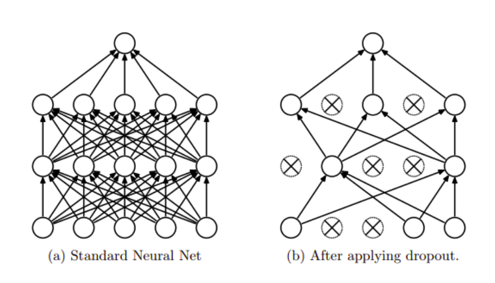
tensorflow中提供了实现dropout的函数，该函数为**tf.nn.dropout()**。参数如下：
```py
tf.nn.dropout(
    x,
    keep_prob,
    noise_shape=None,
     seed=None,
    name=None
)
```
+ x：指输入，浮点型Tensor。
+ keep_prob：float类型，每个元素被保留下来的概率。

就这两个参数比较常用，其他的就不做介绍了。值得一提的是，**Dropout 层只能在训练中使用，而不能用于测试过程**，这是很重要的一点。

构建模型：
```py
with tf.name_scope('optimizer'):
    # 定义占位符
    y = tf.placeholder(tf.float32,shape=[None,10],name='labels')
    # 定义使用dropout的损失函数
    loss_function_dropout = tf.reduce_mean(
        tf.nn.softmax_cross_entropy_with_logits(logits=pred_dropout,labels=y))
    # 定义无dropout的损失函数
    loss_function = tf.reduce_mean(
        tf.nn.softmax_cross_entropy_with_logits(logits=pred,labels=y)) 
    # 选择优化器
    optimizer = tf.train.AdamOptimizer(learning_rate).minimize(loss_function_dropout)
```

定义准确率：
```py
with tf.name_scope('evaluation'):
    # 记录预测正确与否的张量
    # 这里用的是未经dropout的prep
    correct_prediction = tf.equal(tf.argmax(pred,axis=1),tf.argmax(y,axis=1))
    # 正确率
    accuracy = tf.reduce_mean(tf.cast(correct_prediction,tf.float32))
```

启动会话：
```py
import os
from time import time

# 训练轮数（由0开始）
epoch = tf.Variable(0,name='epoch',trainable=False)

# 记录训练开始时间
start_time = time()

# 定义会话及变量初始化
sess = tf.Session()
init = tf.global_variables_initializer()
sess.run(init)
```

断点续训：
```py
# 设置检查点存储目录
ckpt_dir = 'mnist_ckpt/'
if not os.path.exists(ckpt_dir):
    os.makedirs(ckpt_dir)
    
# 生成saver
# max_to_keep表示要保留的最近文件的最大数量，默认为5
saver = tf.train.Saver(max_to_keep=5)

# 如果有检查点文件，读取最新的检查点文件，恢复各种变量值
ckpt = tf.train.latest_checkpoint(ckpt_dir)
if ckpt != None:
    saver.restore(sess,ckpt)    # 加载所有参数
else:
    print('Training from scratch')
    
# 获取续训参数
start = sess.run(epoch)
print('Training starts from %d epoch.' % (start + 1))
```

迭代训练：
```py
# 迭代训练
for ep in range(start,train_epochs):
    for batch in range(total_batch):
        xs,ys = mnist.train.next_batch(batch_size)
        # 将xs转变为4维数组
        xs = xs.reshape([batch_size,28,28,1])
        sess.run(optimizer,feed_dict={x:xs,y:ys})
        
    # total_batch个批次训练完成后，使用验证数据计算误差与准确率
    # 别忘了将喂给x的数据reshape
    loss,acc = sess.run([loss_function,accuracy],
                       feed_dict={x:mnist.validation.images.reshape([mnist.validation.num_examples,28,28,1]),
                                  y:mnist.validation.labels})
    
    # 更新epoch变量的值
    sess.run(epoch.assign(ep + 1))
    
    if (ep + 1) % display_step == 0:
        # 打印损失值与准确率
        print('Train Epoch: %02d,  Loss= %.9f,  Accurary= %.4f'
             % (ep + 1,loss,acc))
        
    if (ep + 1) % save_step == 0:
        # 训练过程中存储模型
        saver.save(sess,os.path.join(ckpt_dir,'mnist_model_{:06d}'.format(ep + 1)))
        print('mnist_model_{:06d} saved'.format(ep + 1))
        
# 显示运行总时间
duration = time() - start_time
print('Train Finished takes: %.2f' % (duration))
```

计算测试集上的准确率：
```py
# 测试集上的正确率
acc_test = sess.run(accuracy,
                    feed_dict={x:mnist.test.images.reshape([mnist.test.num_examples,28,28,1]),
                               y:mnist.test.labels})
print('test accuracy: %.4f' % acc_test)
```
