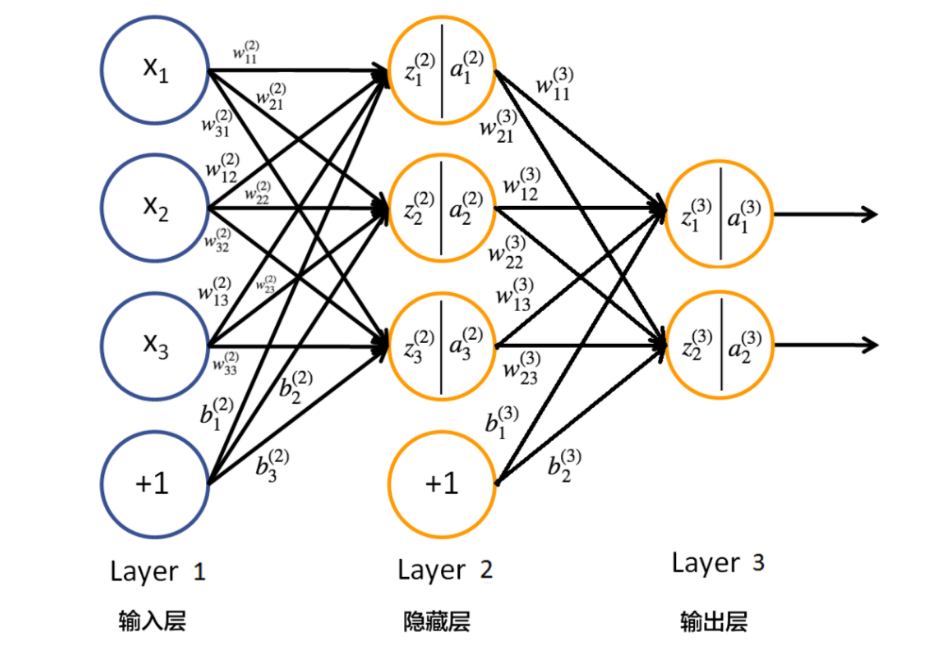
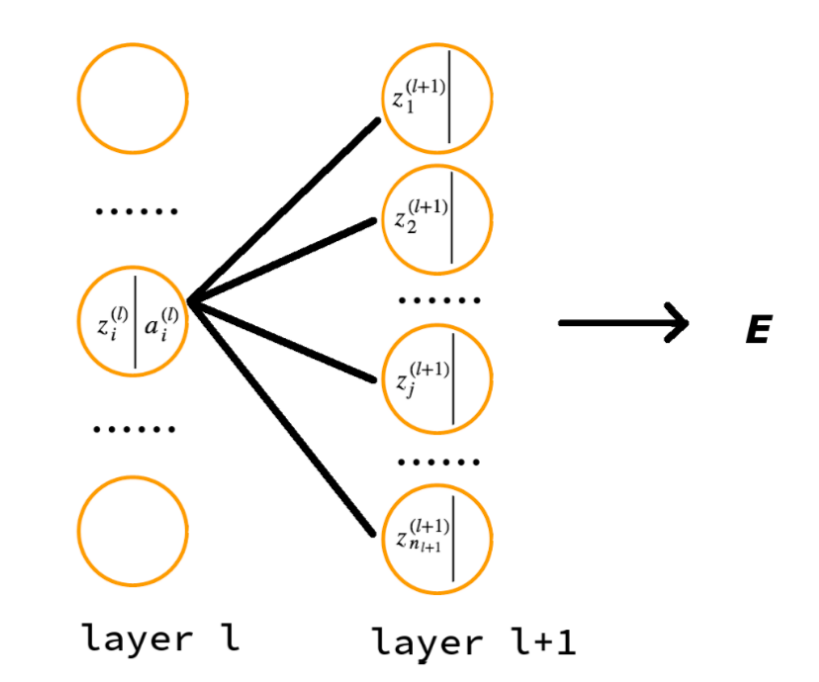
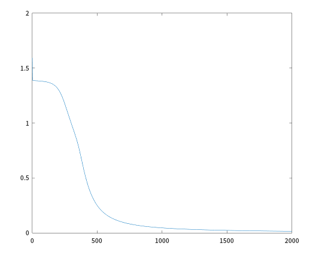
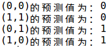

## 1. 符号说明及前向传播
<!--more-->
本节的符号说明：

+ $ \ n_l \ $表示第$ \ l \ $层神经元的个数
+ $ \ \sigma(\cdot) \ $表示神经元的激活函数
+ $\ W^{(l)} \in \mathbb{R}^{n_{l} \times n_{l-1}}\ $表示第$ \ l - 1\ $到第$\ l\ $层的权重矩阵
+ $\ w_{i,j}^{(l)}\ $是权重矩阵$\ W^{(l)}\ $中的元素，表示第$\ l - 1\ $层第$\ j\ $个神经元到第$\ l\ $层第$\ i\ $个神经元的连接的权重（注意标号的顺序）
+ $\ b^{(l)} = (b_{1}^{(l)}, b_{2}^{(l)}, \cdots, b_{n_{l}}^{(l)})^{T} \in \mathbb{R}^{n_{l}}\ $表示$\ l - 1\ $到$\ l\ $层的偏置
+ $\ z^{(l)} = (z_{1}^{(l)}, z_{2}^{(l)}, \cdots, z_{n_{l}}^{(l)})^{T} \in \mathbb{R}^{n_{l}}\ $表示$\ l \ $层神经元的状态
+ $\ a^{(l)} = (a_{1}^{(l)}, a_{2}^{(l)}, \cdots, a_{n_{l}}^{(l)})^{T} \in \mathbb{R}^{n_{l}}\ $表示$\ l \ $层神经元的激活值（即输出值）

神经网络（三层感知机）的示例如下图：



假设我们的神经网络共有$\ L\ $层，我们可以很容易的写出第$\ l\ (2 \le l \le L)\ $层神经元的状态及激活值为：
$$
\begin{align}
z^{(l)} &= W^{(l)}a^{(l - 1)} + b^{(l)} \tag{3.1} \\ 
a^{(l)} &= \sigma(z^{(l)}) \tag{3.2}
\end{align}
$$
这也是神经网络前向传播的主要公式。

## 2. 反向传播推导

那么我们该怎么训练这个神经网络呢？我们可以根据神经网络的预测值以及真实值构造一个代价函数，然后使用梯度下降方法使其最小化。

假设我们的训练数据集$\ D = \{(x^{(1)}, y^{(1)}), (x^{(2)}, y^{(2)}), \cdots, (x^{(N)}, y^{(N)}) \}\ $，其中共有$\ N\ $组数据，并且$\ y^{(i)} \in \mathbb{R}^{n_{L}}\ $，即$\ y^{(i)} = (y_{1}^{(i)}, y_{2}^{(i)}, \cdots, y_{n_{L}}^{(i)})^{T}\ $。

损失函数可以使用均方差损失函数、交叉熵损失函数或者其他有效的函数。这里我们使用均方差损失函数。对某一个训练数据$\ (x^{(i)}, y^{(i)})\ $来说，其损失函数可写为：
$$
\begin{align}
E_{(i)} &= \frac{1}{2} \Vert y^{(i)}  - o^{(i)} \Vert^{2} \tag{3.3} \\
&= \frac{1}{2} \sum_{k = 1}^{n_{L}} (y^{(i)}_{k} - o^{(i)}_{k})^{2}
\end{align}
$$
其中，$\ o^{(i)}\ $为神经网络对输入$\ x^{(i)}\ $产生的实际输出。

所有训练样本的代价函数可写为：
$$
E_{total} = \frac{1}{N} \sum_{i = 1}^{N} E_{(i)} \tag{3.4}
$$
我们的目标就是调整权重和偏置使总体代价变小，求得总体代价取最小值时对应的各个神经元的参数（即权重和偏置）。

如果采用批量梯度下降法，可以用下面的公式更新参数$\ w_{i,j}^{(l)}\ $和$\ b_{i}^{(l)} $，其中$\ 2 \le l \le L$：
$$
\begin{align}
W^{(l)} &= W^{(l)} - \alpha \frac{\partial E_{total}}{\partial W^{(l)}}  \\
&= W^{(l)} - \frac{\alpha}{N} \sum_{i = 1}^{N} \frac{\partial E_{(i)}}{\partial W^{(l)}} \tag{3.5} \\
b^{(l)} &= b^{(l)} - \alpha \frac{\partial E_{total}}{\partial b^{(l)}}  \\
&= b^{(l)} - \frac{\alpha}{N} \sum_{i = 1}^{N} \frac{\partial E_{(i)}}{\partial b^{(l)}} \tag{3.6}
\end{align}
$$
其中，$\alpha \ $为学习率。由上面公式可知，只需求得每一个训练数据的损失函数$\ E_{(i)}\ $对参数的偏导数$\ \frac{\partial E_{(i)}}{\partial W^{(l)}}\ $和$\ \frac{\partial E_{(i)}}{\partial b^{(l)}}\ $，即可得到参数的迭代更新公式。

为简单起见，在下文的推导中，我们去掉$E_{(i)}$的下标，直接记为$E$（要理解它是单个数据的误差）。并且将$\frac{\partial E}{\partial z^{(l)}_{i}}$记为$\delta_{i}^{(l)}$，即做下面的定义：
$$
\delta_{i}^{(l)} \equiv \frac{\partial E}{\partial z^{(l)}_{i}}
$$
下面我们正式开始推导。对最后一层的$\ \delta^{(L)}_{i}\ $推导如下：
$$
\begin{align}
\delta^{(L)}_{i} &= \frac{\partial E}{\partial z^{(L)}_{i}} \\
&= \frac{\partial E}{\partial a^{(L)}_{i}} \frac{\partial a^{(L)}_{i}}{\partial z^{(L)}_{i}} \\
&= \frac{\partial E}{\partial a^{(L)}_{i}} \sigma'(z^{(L)}_{i}) \tag{3.7}
\end{align}
$$
对于$\delta^{(l)}_{i}$，$2 \le l \le L-1$的推导如下：
$$
\begin{align}
\delta^{(l)}_{i} &= \frac{\partial E}{\partial z^{(l)}_{i}} \\
&= \frac{\partial E}{\partial z^{(l+1)}_{1}} \frac{\partial z^{(l+1)}_{1}}{\partial z^{(l)}_{i}} + \frac{\partial E}{\partial z^{(l+1)}_{2}} \frac{\partial z^{(l+1)}_{2}}{\partial z^{(l)}_{i}} + \cdots + \frac{\partial E}{\partial z^{(l+1)}_{n_{l+1}}} \frac{\partial z^{(l+1)}_{n_{l+1}}}{\partial z^{(l)}_{i}} \\
&= \sum_{j = 1}^{n_{l+1}} \frac{\partial E}{\partial z^{(l+1)}_{j}} \frac{\partial z^{(l+1)}_{j}}{\partial z^{(l)}_{i}} \\
&= \sum_{j = 1}^{n_{l+1}} \delta_{j}^{(l+1)} \frac{\partial z^{(l+1)}_{j}}{\partial z^{(l)}_{i}} \tag{3.8}
\end{align}
$$
上式中为什么会有$\ \frac{\partial E}{\partial z^{(l)}_{i}} = \sum\limits_{j = 1}^{n_{l+1}} \frac{\partial E}{\partial z^{(l+1)}_{j}} \frac{\partial z^{(l+1)}_{j}}{\partial z^{(l)}_{i}}\ $呢？其实仅是利用“函数之和的求导法则”及“求导的链式法则”。如果把$\ E\ $从后往前展开，当展开到$\ l+1\ $层时，$E\ $可以看作是关于$\ z^{(l+1)}\ $的函数；如果再向前展开一层到$\ l\ $层，$\ E\ $可看作是关于$\ z^{(l)}\ $的函数。由于$\ l+1\ $层的每个神经元都和$\ z_{i}^{(l)}\ $所在神经元有连接，因此当$\ E\ $对$\ l\ $层的某个$\ z_{i}^{(l)}\ $求导时，可以转化成上式中$\ E\ $对$\ z^{(l+1)}_{j}\ (1 \le j \le n_{l+1})\ $求导乘上$\ z^{(l+1)}_{j}\ $对$\ z_{i}^{(l)}\ $求导，然后再对$\ j\ $由$\ 1\ $到$\ n_{l+1}\ $加和的形式。看下图能够更好的理解：



由于：
$$
\begin{align}
z_{j}^{(l+1)} &= \sum_{i = 1}^{n_{l}} w_{ji}^{(l+1)}a_{i}^{(l)} + b_{j}^{(l+1)} \\
&= \sum_{i = 1}^{n_{l}} w_{ji}^{(l+1)}\sigma(z_{i}^{(l)}) + b_{j}^{(l+1)} \tag{3.9}
\end{align}
$$
则：
$$
\begin{align}
\frac{\partial z^{(l+1)}_{j}}{\partial z^{(l)}_{i}} &= \frac{\partial z^{(l+1)}_{j}}{\partial a^{(l)}_{i}} \frac{\partial a^{(l)}_{i}}{\partial z^{(l)}_{i}} \\
&= w_{ji}^{(l+1)} \sigma'(z_{i}^{(l)}) \tag{3.10}
\end{align}
$$
将式$\ (3.10)\ $​代入式$\ (3.8)\ $中得：
$$
\begin{align}
\delta_{i}^{(l)} &= \sum_{j = 1}^{n_{l+1}} \delta_{j}^{(l+1)} \frac{\partial z^{(l+1)}_{j}}{\partial z^{(l)}_{i}} \\
&= \sum_{j = 1}^{n_{l+1}} \delta_{j}^{(l+1)} w_{ji}^{(l+1)} \sigma'(z_{i}^{(l)}) \\
&= \left(\sum_{j = 1}^{n_{l+1}} \delta_{j}^{(l+1)} w_{ji}^{(l+1)}\right) \sigma'(z_{i}^{(l)}) \tag{3.11}
\end{align}
$$
上式是BP算法最核心的公式，它利用$\ l+1\ $层的$\ \delta^{(i+1)}\ $来计算$\ l\ $层的$\ \delta^{(l)}\ $。

对权重求偏导：
$$
\begin{align}
\frac{\partial E}{\partial w_{ij}^{(l)}} &= \frac{\partial E}{\partial z^{(l)}_{i}} \frac{\partial z^{(l)}_{i}}{\partial w_{ij}^{(l)}} \\
&= \delta^{(l)}_{i} \frac{\partial z^{(l)}_{i}}{\partial w_{ij}^{(l)}} \\
&= \delta^{(l)}_{i} a^{(l-1)}_{j} \tag{3.12}
\end{align}
$$
对偏置求偏导：
$$
\begin{align}
\frac{\partial E}{\partial b_{i}^{(l)}} &= \frac{\partial E}{\partial z^{(l)}_{i}} \frac{\partial z^{(l)}_{i}}{\partial b_{i}^{(l)}} \\
&= \delta^{(l)}_{i} \tag{3.13}
\end{align}
$$
至此，我们对于反向传播算法的推导可以说是结束了。下一节中我们会对反向传播算法做一个总结，并且讨论一些神经网络的训练方法。

## 3. 总结及神经网络的训练

根据上一节的推导，我们可以将反向传播算法总结为如下四个公式：
$$
\begin{align}
&\delta^{(L)}_{i} = \frac{\partial E}{\partial a^{(L)}_{i}} \sigma'(z^{(L)}_{i}) \tag{BP-1} \\
&\delta_{i}^{(l)} = \left(\sum_{j = 1}^{n_{l+1}} \delta_{j}^{(l+1)} w_{ji}^{(l+1)}\right) \sigma'(z_{i}^{(l)}) \tag{BP-2} \\
&\frac{\partial E}{\partial w_{ij}^{(l)}} = \delta^{(l)}_{i} a^{(l-1)}_{j} \tag{BP-3} \\
&\frac{\partial E}{\partial b_{i}^{(l)}} = \delta^{(l)}_{i} \tag{BP-4}
\end{align}
$$
这四个公式可以写成对应的矩阵（向量）形式：
$$
\begin{align}
&\delta^{(L)} = \frac{\partial E}{\partial a^{(L)}} \odot \sigma'(z^{(L)}) \tag{BP-1} \\
&\delta^{(l)} = \left((W^{(l+1)})^{T} \delta^{(l+1)} \right) \odot \sigma'(z^{(l)}) \tag{BP-2} \\
&\frac{\partial E}{\partial W^{(l)}} = \delta^{(l)} (a^{(l-1)})^{T} \tag{BP-3} \\
&\frac{\partial E}{\partial b^{(l)}} = \delta^{(l)} \tag{BP-4}
\end{align}
$$
训练神经网络时，需要先对参数（即$\ W\ $和$\ b\ $）进行初始化，然后进行信息前向传播，求得损失函数（或代价函数），再进行反向传播，利用梯度下降对参数进行更新。

梯度下降法主要有以下三种不同的形式：

+ 批量梯度下降（Batch Gradient Descent，BGD）：批量梯度下降是指每次迭代时使用**所有样本**来对参数进行更新。
+ 随机梯度下降（Stochastic Gradient Descent，SGD）：随机梯度下降是指每次迭代使用**一个样本**来对参数进行更新。
+ 小批量梯度下降（Mini-Batch Gradient Descent，MBGD）：小批量梯度下降是指每次迭代使用**batch_size个样本**对参数进行更新。其中batch_size是一个超参数，需要人为指定。

## 3.4 神经网络实现异或问题分类

异或问题是一个二分类问题，为了解决该问题，我们可以构建一个单隐层的神经网络。输入层中有两个神经元，隐藏层中有3个神经元，输出层中有一个神经元。

我们采用sigmoid函数作为该神经网络的激活函数，sigmoid函数的表达式如下：
$$
\sigma(z) = \frac{1}{1 + e^{-z}} \tag{3.14}
$$
其导数为：
$$
\begin{align}
\sigma'(z) &= \frac{e^{-z}}{(1 + e^{-z})^{2}} \\
&= (\frac{1}{1 + e^{-z}})(1 -\frac{1}{1 + e^{-z}}) \\
&= \sigma(z)(1 - \sigma(z)) \tag{3.15}
\end{align}
$$
采用如下的损失函数：
$$
E(a,y) = -[yloga + (1-y)log(1-a)] \tag{3.16}
$$
神经网络训练主要代码如下：

```matlab
% 训练数据
X = [0,0; 1,1; 0,1; 1,0]';
y = [0; 0; 1; 1]';

% 设置超参数
input_size = 2;         % 输入层神经元数
hidden_size = 3;        % 隐藏层神经元数
out_size = 1;           % 输出层神经元数
learning_rate = 0.5;   % 学习率
training_epoch = 2000;    % 迭代轮数

% 初始化参数
W2 = rand(hidden_size, input_size);
b2 = rand(hidden_size, 1);
W3 = rand(out_size, hidden_size);
b3 = rand(out_size, 1);

% 每轮迭代所得到的代价数组
costs = zeros(1,training_epoch);

for i = 1:training_epoch,
    % 获取代价以及梯度
    [cost, grad] = computeGrad(W2, b2, W3, b3, X, y);
    costs(i) = cost;
    
    % reshape梯度
    index = 1;
    dW3 = reshape(grad(index:out_size * hidden_size), out_size, hidden_size);
    index = index + out_size * hidden_size;
    db3 = reshape(grad(index:index - 1 + out_size), out_size,1);
    index = index + out_size;
    dW2 = reshape(grad(index:index - 1 + hidden_size * input_size), hidden_size, input_size);
    index = index + hidden_size * input_size;
    db2 = reshape(grad(index:end), hidden_size, 1);
    
    % 更新参数
    W3 = W3 - learning_rate * dW3;
    b3 = b3 - learning_rate * db3;
    W2 = W2 - learning_rate * dW2;
    b2 = b2 - learning_rate * db2;
end;

% 绘制代价的图像
plot(costs);

% 做出预测
for i = 1:size(X,2),
    x = X(:,i);
    prediction = predict(x, W2, b2, W3, b3);
    fprintf('(%d,%d)的预测值为：%d\n',x(1),x(2),prediction);
end;
```

其中，实现前向传播以及反向传播的函数代码如下：

```matlab
function [cost, grad] = costFunction (W2, b2,W3,b3,X,y)
    % 此函数进行前向传播与反向传播运算，并返回代价以及梯度
    
    % 样本数
    N = size(X,1);
    
    % 前向传播
    Z2 = W2 * X + b2;
    A2 = sigmoid(Z2);
    Z3 = W3 * A2 + b3;
    A3 = sigmoid(Z3);
    
    % 计算代价函数
    cost = sum(-y.*log(A3) - (1-y).*log(1-A3)) / N;
    
    % 反向传播
    dZ3 = A3 - y;
    dW3 = dZ3 * (A2)' / N;
    db3 = sum(dZ3) / N;
    dZ2 = W3' * dZ3 .* sigmoidGradient(Z2);
    dW2 = dZ2 * (X)' / N;
    db2 = sum(dZ2,2) / N;
    
    % 将计算出的梯度展开成向量
    grad = [dW3(:); db3(:); dW2(:); db2(:)];
end
```

其余函数代码如下：

```matlab
function g = sigmoid (z)
    % sigmoid函数
    g = 1.0 ./ (1 + exp(-z));
end

function [g] = sigmoidGradient(z)
    % sigmoid函数的导数
    g = sigmoid(z) .* (1 - sigmoid(z));
end

function [prediction] = predict(x, W2, b2, W3, b3)
    % 此函数对x做出预测
    % 前向传播
    z2 = W2 * x + b2;
    a2 = sigmoid(z2);
    z3 = W3 * a2 + b3;
    a3 = sigmoid(z3);
    if a3 > 0.5,
        prediction = 1;
    else
        prediction = 0;
    end;
end
```

迭代过程中代价函数值的变化如下：



预测结果如下：



能够看出此神经网络在经过了2000轮的迭代训练后，已经能够实现异或问题的正确分类。

**参考资料**：
[直观理解反向传播](https://www.bilibili.com/video/BV164411m79z?p=34)
[反向传播算法推导过程](https://blog.csdn.net/zhaozx19950803/article/details/80226525)
[神经网络BP反向传播算法原理和详细推导流程](https://blog.csdn.net/qq_32865355/article/details/80260212)
[三种梯度下降方法的理解](https://www.cnblogs.com/lliuye/p/9451903.html)
[logistic回归中的梯度下降法](https://www.bilibili.com/video/BV164411m79z?p=15)