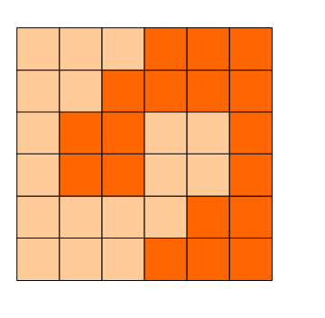

到暴力求解法了，慢慢来吧。
<!--more-->

1. 素数环（Prime Ring Problem，uva524）
======
解题思路：这个题就是用回溯法。不过要注意测试第一个和最后一个数，判断二者之和是否是素数。**如果在回溯法中使用了辅助全局变量，一定要把它们恢复原状，如本题中的代码第33行**，若函数有多个出口，则需要在每个出口处恢复被修改的值。
```cpp
#include<cstdio>
#include<cmath>
#include<cstring>

using namespace std;

const int maxn = 20;
int n,vis[maxn],Case = 0,num[maxn];

bool is_prime(int a){
    if(a <= 1) return false;
    int m = floor(sqrt(a) + 0.5);
    for(int i = 2;i <= m;i++){
        if(a % i == 0) return false;
    }
    return true;
}

void bfs(int cur){
    if(cur == n && is_prime(num[0] + num[n - 1])){
        for(int i = 0;i < n;i++){
            if(i > 0) printf(" ");
            printf("%d",num[i]);
        }
        printf("\n");
    }
    else{
        for(int i = 2;i <= n;i++){
            if(!vis[i] && is_prime(i + num[cur - 1])){
                num[cur] = i;
                vis[i] = 1;
                bfs(cur + 1);
                vis[i] = 0;
            }
        }
    }
}

int main(){
    while(scanf("%d",&n) == 1){
        memset(vis,0,sizeof(vis));
        num[0] = 1;
        vis[1] = 1;
        if(++Case > 1) printf("\n");
        printf("Case %d:\n",Case);
        bfs(1);
    }
    return 0;
}
```

2. 方格分割
======
6x6的方格，沿着格子的边线剪开成两部分。
要求这两部分的形状完全相同。

如图：p1.png, p2.png, p3.png 就是可行的分割法。




试计算：
包括这3种分法在内，一共有多少种不同的分割方法。
注意：旋转对称的属于同一种分割法。

请提交该整数，不要填写任何多余的内容或说明文字。

解题思路:这个题挺好的一个题,我刚开始没想到怎么做,题目中说的两部分即是关于(3,3)点中心对称.我们从(3,3)点出发,两人沿着边相向而行,等到达边界即为一种情况,**用回溯法解决即可**,由于旋转对称属于同一种分割法,所以结果要除4.
```cpp
#include<iostream>
#include<cstdio>
#include<cstring>

using namespace std;
const int N = 6;

int dir[4][2] = {{1,0},{-1,0},{0,1},{0,-1}};
int vis[N+1][N+1],ans = 0;

void dfs(int x,int y){
    if(x == 0 || x == 6 || y == 0 || y == 6){
        ans++;
        return;
    }
    for(int i = 0;i < 4;i++){
        int ax = x + dir[i][0];
        int ay = y + dir[i][1];
        if(vis[ax][ay]) continue;
        vis[ax][ay] = 1;
        vis[N-ax][N-ay] = 1;
        dfs(ax,ay);
        vis[ax][ay] = 0;
        vis[N-ax][N-ay] = 0;
    }
}

int main(){
    memset(vis,0,sizeof(vis));
    vis[N/2][N/2] = 1;
    dfs(N/2,N/2);
    printf("%d\n",ans/4);
    return 0;
}
```