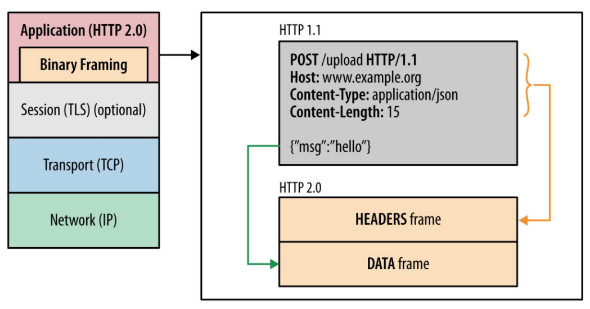
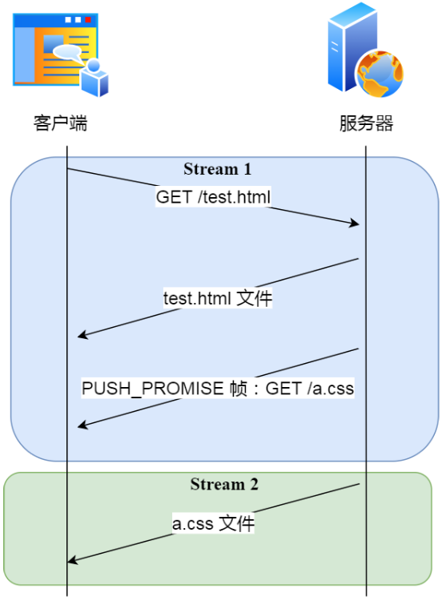

# 1 网络模型

<!--more-->

常见的网络模型有OSI七层参考模型和TCP/IP五层参考模型。


为了更好的学习计算机网络，通常使用综合了二者优点的五层参考模型。


各层的相关知识总结如下：

| 五层参考模型 |                             任务                             |                             功能                             |           协议            |             传输单位             |
| :----------: | :----------------------------------------------------------: | :----------------------------------------------------------: | :-----------------------: | :------------------------------: |
|    应用层    |                     提供系统与用户的接口                     |    1.文件传输<br />2.访问和管理<br />3.电子邮件服务<br />    |   FTP，SMTP，POP3，HTTP   |                无                |
|    传输层    |                  负责主机之间两个进程的通信                  | 1.为端到端提供可靠的传输服务<br />2.为端到端提供流量控制、差错控制、服务质量等管理服务<br /> |       TCP、UDP、ARQ       | 报文段（TCP）、用户数据报（UDP） |
|    网络层    | 1.将传输层的传下来的报文段封装成分组<br />2.选择适当的路由，使网络层传输下来的分组能够交付到主机<br /> | 1.为传输层提供服务<br />2.组包和拆包<br />3.路由选择<br />4.拥塞控制<br /> | ICMP、ARP、RARP、IP、IGMP |         数据报（路由器）         |
|    链路层    |               将网络层传下来的IP数据报组装成帧               | 1.链路的建立、拆除、分离<br />2.帧定界和帧同步<br />3.差错检测<br /> |         HDLC、PPP         |        帧（交换机、网桥）        |
|    物理层    |                       透明的传输比特流                       |                   为设备提供传送数据的通路                   |            无             |      比特（集线器，中继器）      |

# 2 HTTP协议

HTTP是Hyper Text Transfer Protocol的缩写，也就是**超文本传输协议**，定义了客户端与服务器端通信时，发送数据的格式。

HTTP主要特点如下：

- 基于TCP/IP的高级协议
- 默认端口号：80
- 基于请求/响应模型的：一次请求对应一次响应
- 无状态的：每次请求之间相互独立，不能交互数据

## 2.1 请求消息数据格式

请求消息：客户端发送给服务器端的数据。数据格式如下：

1. **请求行**
   - 请求方式 请求URI 请求协议/版本
   - 示例：`GET /login.html HTTP/1.1`
2. **请求头**：客户端浏览器告诉服务器一些信息
   - 请求头名称：请求头值
   - 示例：`Host: localhost`
3. **请求空行**：空行，用于分割POST请求的请求头和请求体
4. **请求体**：封装POST请求消息的请求参数

请求消息的完整示例如下：

```http
POST /login.html	HTTP/1.1
Host: localhost
User-Agent: Mozilla/5.0 (Windows NT 6.1; Win64; x64; rv:60.0) Gecko/20100101 Firefox/60.0
Accept: text/html,application/xhtml+xml,application/xml;q=0.9,*/*;q=0.8
Accept-Language: zh-CN,zh;q=0.8,zh-TW;q=0.7,zh-HK;q=0.5,en-US;q=0.3,en;q=0.2
Accept-Encoding: gzip, deflate
Referer: http://localhost/login.html
Connection: keep-alive
Upgrade-Insecure-Requests: 1

username=zhangsan
```

请求头中的Host字段拼接上请求行中的URI即可组成URL。

## 2.2 响应消息数据格式

响应消息：服务器发送给客户端的数据。数据格式如下：

1. **响应行**
   - 响应协议/版本 响应状态码 状态码描述
   - 示例：`HTTP/1.1 200 OK`
2. **响应头**：服务器告诉客户端的一些信息
   - 响应头名称：响应头值
   - 示例：`Content-Type: text/html;charset=UTF-8`
3. **响应空行**：空行，用于分割响应头和响应体
4. **响应体**：传输的数据

响应消息的完整示例如下：

```http
HTTP/1.1 200 OK
Content-Type: text/html;charset=UTF-8
Content-Length: 101
Date: Wed, 06 Jun 2018 07:08:42 GMT

<html>
<head>
<title>$Title$</title>
</head>
<body>
hello , response
</body>
</html>
```

## 2.3 HTTP请求方式介绍

HTTP/1.0中支持GET、POST、HEAD三种HTTP请求方式。

HTTP/1.1中新增了OPTIONS、PUT、DELETE、TRACE、CONNECT、PATCH六种请求方式。

在介绍常见的HTTP请求方式之前，我们需要先了解幂等性的概念。

**幂等性**：相同操作执行多次与执行一次所产生的影响相同。

常用的请求方式汇总如下：

- GET
  - GET方法用于向服务器获取指定的资源。
  - 使用GET方法的请求应该只是读取数据，而不会对数据产生其他影响。
  - GET方法是幂等的。
- HEAD
  - HEAD方法与GET方法相同，但响应消息没有响应体。
  - HEAD方法是幂等的。
- POST
  - POST方法用于将数据发送到服务器以创建或更新资源。
  - 它要求服务器确认请求中包含的内容作为由URI区分的Web资源的另一个下属。
  - POST方法是非幂等的。
- PUT
  - PUT方法用于将数据发送到服务器以创建或更新资源。
  - 它会将请求中包含的内容放在所提供的URI下，如果URI指示的是当前资源，则会被改变；如果URI未指示当前资源，则服务器可以使用该URI创建资源。
  - PUT方法是幂等的。
- DELETE
  - DELETE方法用来删除指定的资源。
  - 它会删除URI给出的目标资源的所有当前内容。
  - DELETE方法是幂等的。

上面的POST方法与PUT方法看起来好像没什么区别，二者都可以用来创建或更新数据。但是在HTTP规范中POST方法是非幂等的，比如我们使用POST方法执行新建博客操作，请求一次新建一篇博客，请求多次新建多篇博客，这就是非幂等的。

HTTP规范中PUT方法是幂等的，比如我们使用PUT方法更新博客时，即使相同的请求执行多次，最终的结果也都是一样的。

所以一般情况下我们使用POST新建资源，使用PUT更新资源。当然这些都是约定（conversion）而不是规定（standard），具体是什么样的效果还得看服务器端的代码实现。不过最好还是遵守约定。

**参考资料**：

[HTTP请求方法详解](https://juejin.cn/post/6844903607964270599)

[常见的http请求方式](https://zhuanlan.zhihu.com/p/136995030)

## 2.4 HTTP常见的状态码

HTTP中一共有以下五大类状态码：


- `1xx`：**提示信息**，是协议处理中的一种中间状态。
- `2xx`：表示服务器**成功**处理了客户端的请求。
  - **200 OK**：最常见的成功状态码，表示一切正常。
  - **204 No Content**：常见的成功状态码，与200 OK基本相同，但响应消息没有body数据。
- `3xx`：表示客户端请求的资源发生了变动，需要客户端用新的URL重新发送请求获取资源，也就是**重定向**。
  - **302 Found**：表示临时重定向，说明请求的资源还在，但暂时需要⽤另⼀个URL来访问。302会在响应头中添加字段`Location`，指明后续要跳转的URL，浏览器会自动重定向新的URL。
  - **304 Not Modified**：表示资源未修改，重定向已存在的缓存文件，也称缓存重定向。
- `4xx`：表示客户端发送的报文有误，服务器无法处理。
  - **401 Unauthorized**：表示用户没有访问权限，需要进行身份认证。
  - **404 Not Found**：表示请求的资源在服务器上不存在或未找到，所以无法提供给客户端 。
- `5xx`：表示客户端请求报文正确，但是服务器处理时内部发生了错误。
  - **500 Internal Server Error**：服务器内部出现错误。

## 2.5 HTTP常见字段

- **请求头**
  - `Host`
    - 客户端发送请求时，用来指定服务器的域名。
    - `Host: www.baidu.com`。
  - `Connection`
    - 该字段最常用于客户端要求服务器使用TCP持久连接，以便其他请求复用。
    - HTTP/1.1版本的默认连接都是持久连接，但为了兼容老版本的HTTP，需要指定`Connection`字段的值为`Keep-Alive`。
    - `Connecton: Keep-Alive`。
  - `Accept`
    - 客户端声明自己可以接受哪些数据格式。
    - `Accept: */*`表示客户端声明自己接受任何格式的数据。
  - `Accept-Enconding`
    - 客户端声明自己可以接受哪些压缩方法。
    - `Accept-Enconding: gzip, deflate`。
- **响应头**
  - `Content-Length`
    - 表明服务器返回的数据长度（响应体长度）。
    - `Content-Length: 1000`，表明本次返回的响应体长度为1000个字节。
    - 有时候也会出现在POST请求的请求头中，用于说明请求体长度。
  - `Content-Type`
    - 表明服务器返回的数据是什么格式。
    - `Content-Type: text/html; charset=utf-8`，表明发送的是html文本，并且编码是UTF-8。
    - 对应请求头中的`Accept`字段。
  - `Content-Enconding`
    - 表明服务器返回的数据使用了什么压缩格式。
    - `Content-Encoding: gzip`。
    - 对应请求头中的`Accept-Enconding`字段。

# 3 GET与POST的区别？

GET与POST主要有以下区别：

- 用途
  - GET方法用于向服务器获取指定的资源，并且GET是幂等的。
  - POST方法用于将数据发送到服务器以创建或更新资源，并且POST是非幂等的。
  - 这一区别是真正的HTTP协议中GET与POST的区别。
- 参数位置
  - GET请求使用URL传递参数。
  - POST请求的参数放在请求体中。
- 参数长度
  - 由于GET请求使用URL传递参数，参数长度受到URL长度限制。
  - POST请求中参数长度无限制。
  - HTTP协议没有规定URL的长度，这个限制主要是浏览器和服务器的原因。
- 参数数据类型
  - GET请求只能接受ASCII字符。
  - POST请求无限制。
- 编码方式
  - GET请求只能进行URL编码。
  - POST请求支持多种编码方式。
- 缓存
  - GET请求会被浏览器主动缓存。
  - POST请求不会被浏览器主动缓存，除非手动设置。

以上区别除了第一条之外，都不是HTTP协议中所规定的。

# 4 HTTP/1.1、HTTP/2、HTTP/3演变

## 4.1 HTTP/1.1

### 4.1.1 默认使用长连接

HTTP/1.0默认每次请求都需要与服务器建立一个TCP连接，服务器处理完成后立即断开TCP连接（**短连接**）。可以设置请求头中的`connection`字段为`Keep-Alive`字段来使用长连接。

HTTP/1.1默认使用**长连接**的通信方式，减少了TCP连接的重复建立和断开所造成的额外开销，减轻了服务器端的负载。

长连接的特点是，只要任意一端没有明确提出断开连接，则保持TCP连接状态。


### 4.1.2 Pipeline机制

HTTP/1.0在同一个TCP连接上面，请求是串行的，客户端发送一个请求，必须等待收到响应之后，才能再发送下一个请求。

HTTP/1.1引入了**Pipeline机制**，在同一个TCP连接上面，允许客户端不用等待上一次请求结果返回，就可以发出下一次请求。但是**服务器端必须按照接收到客户端请求的先后顺序依次回送响应结果**，以保证客户端能够区分出每次请求的响应内容。


### 4.1.3 队头阻塞问题

Pipeline机制存在**队头阻塞（Head-Of-Line Blocking）**问题。

假设客户端发送的请求顺序是1、2、3，虽然服务器是并发处理的，但是服务器端响应请求的顺序也必须是1、2、3。一旦前一个响应未能及时返回，后面的响应将被阻塞，这就是队头阻塞问题。

由于队头阻塞问题，HTTP/1.1中的Pipeline机制很少使用。

### 4.1.4 总结

- **默认使用长连接**。
  - HTTP/1.0默认每次请求都需要与服务器建立一个TCP连接，服务器处理完成后立即断开TCP连接（**短连接**）。
  - HTTP/1.1默认使用**长连接**的通信方式，减少了TCP连接的重复建立和断开所造成的额外开销，减轻了服务器端的负载。
- **Pipeline机制**
  - HTTP/1.0在同一个TCP连接上面，请求是串行的，客户端发送一个请求，必须等待收到响应之后，才能再发送下一个请求。
  - HTTP/1.1引入了Pipeline机制，在同一个TCP连接上面，允许客户端不用等待上一次请求结果返回，就可以发出下一次请求。但是服务器端必须按照接收到客户端请求的先后顺序依次发送响应结果，以保证客户端能够区分出每次请求的响应内容。

## 4.2 HTTP/2

### 4.2.1 二进制分帧

HTTP/2不再使用文本格式，而是采用二进制格式传输数据，提高了HTTP的传输效率与解析效率。从下图可以看到HTTP/1.1的响应与HTTP/2的区别：



HTTP/2中将响应消息划分成了两个**帧（Frame）**，一个是HEADERS类型的帧，对应HTTP/1.1中的响应行和响应头，另一个是DATA类型的帧，对应HTTP/1.1中的响应体。

HTTP/2中二进制帧的结构如下：


各字段含义如下：

- 帧长度（Length）：Frame Playload的长度，即实际传输数据的长度。
- 帧类型（Type）：表示帧的类型，HTTP/2中定义了10种类型的帧，一般分为**数据帧**和**控制帧**两类。
  
- 标志位（Flags）：可以保存8个标志位，用于携带简单的控制信息。
- R：保留的一位字段，未使用。
- 流标识符（Stream Identifier）：用于标识该帧（Frame）属于哪个流（Stream）。
- Frame Playload：实际传输的数据。

### 4.2.2 多路复用

HTTP/1.1引入了Pipeline机制，使得客户端不用等待上一次请求结果返回，就可以发出下一次请求，但是请求处理依旧是串行的，服务器端必须完成上一条请求的处理并返回响应，才能响应下一条请求（阻塞）。

如果想要并发的发送多条请求，且各个请求之间互不干扰的话，HTTP/1.1就只能使用多条TCP连接来实现了。


HTTP/2.0的**多路复用**可以在一条TCP连接中，并发的发送多个请求和响应，且互不干扰（非阻塞）。


在介绍HTTP/2的多路复用之前，我们需要先了解几个概念：

- 连接（Connection）：1个TCP连接包含多个数据流。
- 数据流（Stream）
  - 每个request和response的数据包合在一起称为一个数据流（双向）。
  - 数据流中可以包含1条或多条消息。
- 消息（Message）
  - 对应HTTP/1.x中的请求或者响应。
  - 消息中包含一个或多个数据帧。
- 数据帧（Frame）：HTTP/2通信的最小单位。


每一个Stream都有一个自己的Steam ID，每个帧的头部也会携带Stream ID信息，用于标识该帧属于哪个Stream。

在一条TCP连接中，不同的Stream可以交错传输（并发），但是**同一个Stream内的帧必须按序传输**。读取数据的时候，根据帧的头部中携带的Stream ID信息将属于同一个Steam的帧拼到一起（也就是把具有相同Stream ID的帧拼到一起），就可以组成一个请求或者响应。

另外，同一个连接中的Stream ID是不能复用的，只能顺序递增。所以当Stream ID耗尽时，需要开启新的TCP连接。

### 4.2.3 服务端推送

HTTP/1.1不支持服务器主动推送资源给客户端，都是由客户端主动发起请求后，才能获取到服务器响应的资源。

比如，客户端通过HTTP/1.1请求从服务器获取到了HTML文件，客户端发现里面用到了CSS文件，所以又要发送获取CSS文件的请求，需要两次消息往返。

而如果使用HTTP/2的服务端推送的话，客户端在访问HTML时，服务器可以主动推送CSS文件，不需要客户端再次发送请求获取了。


服务端推送需要我们手动进行配置。在Nginx中，如果希望客户端访问`test.html`时，服务器能够主动推送`/test.css`，那么可以进行如下设置：

```nginx
location /test.html {
    http2_push /test.css;
}
```

那么HTTP/2的推送是怎么实现的呢？

实现服务端推送需要由服务端建立Stream，并通过该Stream向客户端发送数据。为了保证服务端与客户端建立的Stream的Stream ID不会发生冲突，HTTP/2规定**客户端建立的Stream的Stream ID必须是奇数，服务端建立的Stream的Stream ID必须是偶数**。

服务端在推送资源时，会先发送`PUSH_PROMISE`类型的帧传输HTTP头部。客户端可以从HTTP头部中的`Promised Stream ID`字段获知，接下来服务器端会在哪个偶数号Stream中推送资源（HTTP body）。



如上图，服务端在Stream1中通知客户端CSS资源即将到来，然后在Stream2中发送CSS资源。注意Stream1和Stream2是可以并发的。

### 4.2.4 首部压缩

HTTP/2使用**HPACK算法**进行首部压缩。HPACK算法主要包括三部分：

- 静态表：预定义的首部字段列表。
- 动态表：同样是首部字段列表，初始为空，动态更新。
- Huffman编码

简单来说，HPACK使用两个索引表（静态表与动态表）来把首部映射到索引值，并对不存在的首部使用Huffman编码，并动态缓存到索引，从而达到压缩头部的效果。

### 4.2.5 HTTP/2没有彻底解决队头阻塞问题

HTTP/2中的多路复用并没有彻底解决队头阻塞问题，只是将队头阻塞问题从HTTP Request粒度细化到了TCP报文段的粒度。

**只要用TCP协议，就绕不开队头阻塞问题**。因为TCP报文段是有序传输的，如果一个报文段在网络上被阻塞了，则接收端会一直等待该报文段，如果该报文段不来，后面的报文段都不会成功被接收（TCP队头阻塞）。

HTTP/1.1中队头阻塞发生的原因：

1. 服务器对请求处理的慢。
2. 服务器对请求处理的很及时，但网络传输慢，TCP报文段在网络中发生阻塞或丢失。

HTTP/2的多路复用只能解决原因1导致的队头阻塞问题，而解决不了原因2导致的队头阻塞。另外，TCP队头阻塞的产生是由TCP自身的实现机制决定的，无法避免。要想在应用程序中避免TCP队头阻塞带来的影响，只有舍弃TCP协议。

## 4.3 HTTP/3

HTTP/3传输层使用UDP协议来替代TCP协议，并依靠应用层的QUIC（Quick UDP Internet Connection）协议来实现可靠传输。HTTP/3相较于HTTP/2具有如下优点：

- **无队头阻塞**：使用UDP协议替换了TCP协议，从根本上解决了队头阻塞的问题。
- **建立连接速度快**：HTTP/3内部包含TLS1.3，只需要1个RTT就可以同时完成建立连接与TLS密钥协商。而HTTP/2需要进行TCP三次握手和TLS四次握手，共有3个RTT的时延。
- **连接迁移**：QUIC协议没有用四元组的方式来标识连接，而是使用Connection ID标识，即使IP地址或端口变化，只要Connection ID不发生改变，就可以无缝的复用原连接。HTTP/2由于使用TCP连接，使用四元组的方式标识连接，所以只能够断开连接，然后再重新建立连接。

**参考资料**：

[深入理解HTTP1.0和HTTP1.1的区别](https://www.jianshu.com/p/95a521b006a8)

[网络协议:HTTP2详解](https://mojotv.cn/2019/01/03/what-is-http2#SFRUUC8xLngg566A5LuL)

[深入理解http2.0协议，看这篇就够了！](https://juejin.cn/post/6844903984524705800)

[解开 HTTP/2 的面纱：HTTP/2 是如何建立连接的](https://halfrost.com/http2_begin/)

[深入 HTTP2（帧，消息，流）](https://www.jianshu.com/p/51b2a9c98fca)

[HPACK 介绍](https://gohalo.me/post/linux-network-http2-hpack-introduce.html)

[什么是队头阻塞以及如何解决](https://juejin.cn/post/6844903853985366023)

# 5 HTTPS

在介绍HTTPS之前，先介绍几个前置知识。

## 5.1 对称加密

**对称加密**：发送方和接收方**共享同一个密钥**，发送方发送消息时，使用该密钥进行加密，接收方接收数据时，使用该密钥进行解密。

对称加密的计算比较简单，运算速度快。


但是这种加密方式有一个问题：密钥如何传输？密钥不可能在网上明文传输，而如果对密钥A进行加密传输，又需要另外一个密钥B，密钥B的传输又需要一个密钥C……如此循环，无解。

## 5.2 非对称加密

**非对称加密**需要一对密钥：公钥和私钥，公钥可以任意分发而私钥保密。

公私钥的生成办法：

- 私钥就是一个随机生成的字符串。
- 公钥是通过私钥计算出来的，私钥确定，对应的公钥也就确定了。但反过来，根据公钥计算不出私钥，计算过程是不可逆的。

非对称加密主要分为两个操作：

- 签名和验签。私钥签名，公钥验签，目的是防篡改。如果第三方截获到消息之后篡改，则接收的验签是肯定过不了的。同时也防抵赖，既然没有人可以篡改，只可能是发送方自己发出的。
- 加密和解密。公钥加密，私钥解密。目的是防止信息被第三方拦截和偷听。第三方即使能截获到消息，但如果没有私钥，也无法进行解密。

非对称加密的计算比较复杂，运算速度较慢。

双向非对称加密：


单向非对称加密：


## 5.3 数字证书

非对称加密的前提是公钥可以在网络上安全传输，但如何保证公钥的传输不被拦截并篡改？也就是说，如果客户端拿到服务器的公钥，如何直到这个公钥真的就是服务器的呢？

为了解决这一问题，我们需要借助第三方权威机构CA（Communications Authority），由CA向服务器颁发数字证书，服务器公钥放在数字证书中，只要证书是可信的，公钥就是可信的。

服务器将自己的公钥和一些信息发送CA，CA会为其颁发数字证书。数字证书中通常包含一下内容：

- 公钥
- 持有者信息
- 证书认证机构（CA）的信息
- CA对这份文件的数字签名及使用的算法
- 证书有效期
- 其他额外信息

数字证书的作用就是用来认证公钥持有者的身份，以防止第三方进行冒充（中间人攻击）。

CA签发数字证书的流程如下：

- CA对证书内容使用Hash算法（摘要算法）进行计算，得到证书内容的哈希值（摘要）。
- 然后CA会使用自己的私钥对该摘要进行加密，生成数字签名。
- 证书内容（明文）与数字签名一起组成了完整的数字证书。

客户端校验服务端的数字证书的流程如下：

- 客户端得到证书，分解成明文部分和数字签名。
- 用CA机构的公钥进行解密，得到哈希值H1（由于CA机构是一种公信身份，操作系统或浏览器中通常会内置CA机构的证书和公钥信息）。
- 用证书中声明的Hash算法对明文部分进行哈希，得到哈希值H2。
- 如果哈希值H1与H2相等，表示证书可信，没有被篡改。


## 5.4 SSL/TLS协议

HTTPS实际上就是在HTTP层与TCP层自己加了SSL/TLS层，保障数据传输的安全性。


TLS的大致流程如下：


采用对称加密与非对称加密结合的混合加密方式：

- 在通信建立前采用**非对称加密**的方式加密传输会话密钥（对称加密的秘钥），后续不再使用非对称加密。
  - 使用数字证书防止公钥在网络传输的过程中被篡改。
  - CA机构签发数字证书给服务器，客户端使用对数字证书进行验证，看是否可信。
- 在通信过程中全部使用**对称加密**的方式加密明文数据。

采用混合加密的方式的原因：

- 对称加密只使用一个密钥，运算速度快，密钥必须保密，无法做到安全的秘钥交换。
- 非对称加密使用公钥和私钥两个密钥，公钥可以任意分发而私钥保密，解决了密钥交换问题但速度慢。

## 5.5 基于RSA的密钥协商算法

基于RSA的密钥协商算法大致流程如下：


- 客户端和服务器交换了3个东西：客户端随机数（明文）、服务器随机数（明文）、pre-master key（密文，用服务器公钥加密）。这三个数都是随机生成的。
- 主密钥 = PRF(pre-master key，客户端随机数，服务器随机数)，英文master key
  会话密钥 = PRF(主密钥，客户端随机数，服务器随机数)，英文session key
- 会话密钥作为对称加密的密钥，后续数据传输加密使用。

基于RSA的密钥协商算法不具有**前向安全性**。前向安全性是指，非对称加密的密钥泄露之后，只能破解后续的通信，而历史的通信数据不能被破解。

因为pre-master key是用服务器数字证书中的公钥加密传输的，一旦服务器私钥泄露，pre-master key就会被破解。pre-master key再加上另外两个明文的随机数，就能够算出最终的会话密钥。

## 5.6 基于ECDHE的密钥协商算法

基于RSA的密钥协商算法大致流程如下：


- 每一次会话，双方都各自临时生成一对公/私钥（即图中的DH参数，图中传递的DH参数均为公钥）。私钥自己保存，公钥双方交换，会话关闭后就销毁。
- 根据临时的公/私钥对算出pre-master key，主密钥、会话密钥的计算方法和RSA中的一样。
- pre-master key
  = f(客户端随机数，服务端随机数，客户端ECDHE公钥，服务端ECDHE私钥)
  = f(客户端随机数，服务端随机数，服务端ECDHE公钥，客户端ECDHE私钥)

为了保证服务端ECDHE公钥在传输过程中不被篡改（第二次握手），服务端会使用与数字证书中公钥对应的私钥为服务端ECDHE公钥进行签名（RSA算法）。客户端会首先使用CA的公钥对数字证书进行验签，验签没问题的话，就取出其中的服务端公钥，然后使用服务端公钥对服务端ECDHE公钥进行验签，防止被篡改。

基于ECDHE的密钥协商算法是具有前向安全性的，原因在于pre-master key没有在网络上传输，而是双方各自算出来的，而且每次会话中计算pre-master key的公/私钥对都不相同。即使攻击者破解了服务端，获取了服务器的私钥以及当前会话的ECDHE私钥，攻击者也只能计算出当前会话的会话密钥，而无法计算出历史会话的会话密钥，因为历史会话中使用的ECDHE临时公私钥对已经被销毁了。

# 6 HTTP与HTTPS的区别

- HTTP是明文传输，HTTPS是加密传输，更安全，但是消耗资源也更多。
- 端口不同，HTTP默认端口是80，而HTTPS默认端口是443。

# 7 TCP

TCP的主要特点如下：

- TCP是**面向连接的**。也就是说，应用程序在使用TCP协议之前，必须先建立TCP连接。在数据传输完毕后，必须释放已经建立的TCP连接。并且**每一条TCP连接只能是点对点的（一对一）**。
- TCP提供**可靠交付**的服务。通过TCP连接传输的数据，无差错、不丢失、不重复、并且按序到达。
- TCP提供**全双工通信**。TCP连接的两端都设有发送缓存和接收缓存，用来临时存放双向通信的数据。在发送时，应用程序在把数据传送给TCP的缓存后，就可以做自己的事，而TCP在合适的时候把数据发送出去。在接收时，TCP把收到的数据放入缓存，上层的应用进程会在合适的时候读取缓存中的数据。
- **面向字节流**。虽然应用程序和TCP的交互式一次一个数据块（大小不等），但TCP把应用程序交下来的数据仅仅看成是一连串的**无结构的字节流**。TCP不保证接收方应用程序所收到的数据块和发送方应用程序所发出的数据块具有大小对应的关系。

**面向连接的**、**可靠的**、**基于字节流**的传输层通信协议。

TCP四元组可以唯一的确定一个连接：

- 源ip
- 源端口
- 目的ip
- 目的端口

## 7.1 TCP报文段的首部格式


下面解释一下其中比较重要的字段：

- **序号**：TCP连接中传输的字节流中的**每一个字节都要按顺序编号**，字节流的起始序号在连接建立时设置。首部中的序号字段值指的是本报文段所发送的数据的第一个字节的序号。例如，一个报文段的序号字段值是301，而携带的数据共有100字节，这就表明：本报文段的数据的第一个字节的序号是301，最后一个字节的序号是400。显然，下一个报文段的数据序号应当从401开始，即下一个报文段的序号字段值应为401。
- **确认号**：表示期望收到对方下一个报文段的第一个数据字节的序号，即对方下一个报文段的序号字段值应当等于该确认号。
- **数据偏移**：即TCP报文段的首部长度，由于首部中还有长度不确定的选项字段，因此数据偏移字段是必要的。
- **控制位**：
  - **确认ACK**：仅当ACK为1时确认号字段才有效。TCP规定，在连接建立后所有传送的报文段都必须把ACK置为1。
  - **复位RST**：当RST为1时，表明TCP连接中出现严重差错，必须释放连接，然后再重新建立连接。
  - **同步SYN**：在连接建立时用来同步序号。
  - **终止FIN**：用来释放一个连接。当FIN为1时，表明此报文段的发送方的数据已发送完毕，并要求释放连接。
- **窗口**：指的是发送本报文段的一方的**接收窗口**的大小（以字节为单位）。窗口字段明确指出了现在允许对方发送的数据量。窗口值经常在动态变化着。

## 7.2 TCP连接建立

### 7.2.1 三次握手


- 初始两端的TCP进程都处于CLOSED（关闭）状态。
- TCP服务器进程进入LISTEN（收听）状态，等待客户的连接请求。
- TCP客户进程向B发出连接请求报文段，首部中的同步位SYN=1，同时选择一个初始序号seq=x。这时，TCP客户进程进入SYN-SENT（同步已发送）状态。
- B收到连接请求报文段后，如果同意建立连接，则向A发送确认。在确认报文段应该把SYN位和ACK位都置为1，确认号为ack=x+1，同时也为自己选择一个初始序号seq=y。此时，TCP服务器进程进入SYN-RCVD（同步收到）状态。
- TCP客户进程收到B的确认后，还要向B给出确认。确认报文段的ACK置为1，确认号ack=y+1，而自己的序号seq=x+1。这一次的报文段可以携带数据，如果不携带数据则不消耗序号，在这种情况下，下一个数据报文段的序号仍是seq=x+1。这时，TCP连接已经建立，A进入ESTABLISHED（已建立连接状态）。当B收到A的确认后，也进入ESTABLISHED状态。

### 7.2.2 为什么要进行三次握手

- **三次握手恰好可以保证客户端和服务器对自己的发送、接收能力做了一次确认**。
  - 第一次，客户端给服务器发送了seq=x，**此时服务器知道客户端的发送能力没问题**。
  - 第二次，服务器回复了seq=y、ack=x+1，**这时客户端知道自己的发送和接收能力没有问题，但服务器只知道自己的接收能力没问题**。
  - 第三次，客户端发送了ack=y+1，服务器收到后知道自己第二次发的确认报文段被客户端收到了，**自己的发送能力也没问题**。
- **避免历史连接**。假设B收到了已经失效的连接请求报文段，如果是两次握手，B会发送确认报文段，同意建立连接。由于此时A并没有发出建立连接的请求，因此不会理睬B的确认，也不会向B发送数据。但B却以为新的连接已经建立了，并一直等待A发送数据，B的许多资源就这样被浪费了。
- **同步双方初始序号**。如果只是两次握手，那么服务器的初始序号是得不到确认的，无法可靠的完成双方初始序号的同步。

### 7.2.3 SYN泛洪攻击

SYN泛洪攻击是指攻击者短时间伪造不同IP地址的SYN报文，服务端每接收到一个SYN报文，就会发送ACK+SYN报文，但其发送出去的ACK+SYN报文是不会得到攻击者的ACK应答的，久而久之就会**占满服务端的SYN接收队列（半连接队列）**，使得服务器不能为正常用户服务。

可以使用SYN Cookie技术解决SYN泛洪攻击问题：

- 当SYN队列满之后，后续服务器收到SYN报文后，不会再向SYN队列中存储数据
- 而是计算出一个cookie值（与一般说的Cookie不是一个概念），将这一个cookie值放入到SYN+ACK报文的序号字段中，返回给客户端。
- 服务端接收到客户端的应答报文后，服务器会检查这个ACK包的合法性，如果合法，直接放到Accept队列中。

## 7.3 TCP连接释放

### 7.3.1 四次挥手


- 初始两端都处于ESTABLISHED状态。
- A打算关闭连接，此时会发送一个连接释放报文，即FIN标志位置为1的报文，之后A进入FIN_WAIT_1（终止等待1）状态。
- B收到该报文后，就向A发送确认报文，接着B进入CLOSED-WAIT（关闭等待）状态。此时的TCP连接处于半关闭（half-close）状态，即A已经没有数据要发送了，但如果B要发送数据，A仍然要接收。
- A收到来自B的确认后，进入FIN-WAIT-2（终止等待2）状态，等待B发出的连接释放报文段。
- 若B已经没有要向A发送的数据，就向A发送连接释放报文，之后B就进入LAST-ACK（最后确认）状态，等待A的确认。
- A在收到B的连接释放报文段后，发送确认报文，之后进入TIME-WAIT状态。
- B收到了A的确认报文后，进入CLOSED状态，至此服务端已经完成了连接的关闭。
- A在经过2MSL时间后，自动进入CLOSED状态，至此客户端也完成了连接的关闭。

### 7.3.2 为什么挥手需要四次？

因为服务端有可能还要再向客户端发送数据，因此服务端的ACK报文段和FIN报文段一般都会分开发送，从而比三次握手多了一次。

### 7.3.3 为什么TIME-WAIT等待的时间是2MSL

MSL（Maximum Segment Lifetime）最长报文段寿命，它是任何报文段在网络上存活的最长时间，超过这个时间报文段将被丢弃。MSL应该要大于等于TTL变为0的时间，以确保报文段自然消亡。

A在TIME-WAIT状态必须等待2MSL的时间，原因如下：

- **为了保证A发送的最后一个ACK报文段能够到达B**（主要原因）。如果A发送的ACK报文段丢失，导致处于LAST-ACK状态的B收不到对已发送的FIN+ACK报文段的确认。B会超时重传这个FIN+ACK报文段，而A就能在2MSL时间内收到这个重传的FIN+ACK报文段。接着A重传一次确认，重新启动2MSL计时器。
- 确保当前连接的产生的报文段全部消亡，不会遗留到下一个新的连接中。

## 7.4 TCP可靠传输的实现

在说可靠传输的实现之前，我们首先要知道什么是可靠传输？

可靠传输就是要保证传输的数据**无差错**、**不丢失**、**不重复**、**按序到达**。

TCP通过以下几个机制来保证可靠传输：

- 校验和
- 顺序编号和确认机制
- 重传机制

### 7.4.1 校验和

发送端计算待发送TCP报文段的校验和，然后接收端对接收到的TCP报文段验证其校验和。

其目的是为了发现TCP的首部和数据在发送端到接收端之间是否发生了变动。如果接收方检测到校验和有差错，则该TCP报文会被直接丢弃。

### 7.4.2 顺序编号和确认机制

TCP连接中传输的字节流中的**每一个字节都要按顺序编号**，TCP首部中的序号字段值指的是本报文段所发送的数据的第一个字节的序号。

接收方在收到发送方发送的数据后，就会向其发送确认。TCP默认采用**累计确认**的方式，假如确认号字段为101，则表示所有编号小于101的字节都已经收到了，期望收到的下一个字节的编号为101。

### 7.4.3 重传机制

重传机制主要分为以下两种：

- **超时重传**：TCP发送方在发送报文段的时候，会设置一个定时器，如果在规定时间内没有收到接收方发来的ACK确认报文段，发送方就会重传这个已发送的报文段。
- **快重传**：每当接收方收到比期望序号大的失序报文段时，就像发送方发送一个**冗余ACK**，指明下一个期待字节的序号。当发送方**收到三个相同的ACK报文段**时，会直接进行重传。

### 7.4.4 TCP如何保证可靠传输

- 无差错：接收方收到TCP报文段后，会对其校验和进行检查，如果接收方发现该TCP报文段出现差错，则丢弃该报文段，不发送确认。
- 不丢失：即报文段不丢失，由重传机制保证。
- 不重复：接收方如果收到了重复的报文段，将会丢弃该报文段，并且发送确认报文段，否则对方会再次发送。
- 按序到达：通常将未按序号到达的报文段先临时存放在接收窗口（缓冲区）中，等待它前面的报文段达到后，再按序交付给上层的应用进程。

### 7.4.5 滑动窗口

假设TCP每发送一个TCP报文段，都要进行一次确认应答，并且接收端只有在收到了上一个报文段的确认应答后才能发送下一个报文段。这种方式的效率是非常低的。

为了解决这一问题，TCP引入了**窗口**的概念，窗口分为发送窗口和接收窗口，**以字节为单位**。

发送窗口表示：在没有收到接收方确认的情况下，发送方可以连续把窗口内的数据都发送出去。凡是已经发送过的数据，在未收到确认之前都必须暂时保留。

**参考资料**：

[原来 TCP 为了保证可靠传输做了这么多](https://juejin.cn/post/6916073832335802382)

[TCP报文到达确认(ACK)机制](http://xstarcd.github.io/wiki/shell/TCP_ACK.html)

## 7.5 TCP的流量控制

流量控制（flow control）就是让发送方的发送速率不要太快，要让接收方来得及接收。

**TCP的流量控制通过滑动窗口实现，发送方的发送窗口不能超过接收方给出的接收窗口的数值**。

### 7.5.1 窗口关闭

如果发送方接收到接收方的零窗口通知的报文段，发送方会将自己的发送窗口大小置为0，并停止发送数据。后续等待收到接收方发送的非零窗口的通知后，才能继续发送数据。在这种情况下，如果接收方发送的非零窗口的通知丢失，就会导致发送方一直等待收到接收方发送的非零窗口的通知，而接收方也一直等待发送方发送的数据这种局面，发生**死锁**。

为了解决这一问题，TCP为每一个连接设有一个持续计时器，只要TCP连接的一方收到对方的零窗口通知，就启动持续计时器。若持续计时器设置的时间到期，就发送一个**零窗口探测报文段**，对方在收到该探测报文后，就会给出自己当前的窗口大小：

- 如果窗口仍然是0，重新设置持续计时器。
- 如果窗口不为0，那么就可以打破死锁，开始发送数据。

### 7.5.2 糊涂窗口综合征

如果接收端接收的很慢，这时候接收端缓冲区很快被填满，然后窗口通告为0字节，这个时候发送端停止发送，应用程序收上去1个字节后，发出窗口通告为1字节，发送方收到通告之后，发出1个字节的数据，这样周而复始，传输效率会非常低。

解决这个问题，可以有下面两种方案：

- 让接收方不通告小窗口给发送方：等待空闲窗口能够容纳MSS长度的报文或者达到窗口大小的一半，再向接收方发送窗口通告（小窗口通告为0）。
- 让发送方避免发送小数据（Nagle算法）
  - 对于从应用程序接收到的第一块数据（没有任何等待ACK的包），立即发送，一个字节的数据也需要发送出去。
  - 对于后面的数据，TCP会累计并等待，**等收到一个接收方发出的ACK，或者累积到一定长度（最大报文段长度MSS或发送窗口大小的一半）时**，然后再发送数据。

## 7.6 TCP的拥塞控制

拥塞控制就是防止过多的数据注入到网络中，是一个**全局性的过程**。

相反，流量控制往往是指点对点通信量的控制，是个**端到端**的问题（接收端控制发送端）。流量控制所要做的就是抑制发送端发送数据的速率。

为了实现拥塞控制，发送方维持了一个叫做拥塞窗口cwnd的状态变量，因此，发送窗口的值即为**min(拥塞窗口cwnd，接收窗口rwnd)**。

TCP进行拥塞控制的算法有四种，即**慢开始（slow start）**、**拥塞避免（congestion avoidandce）**、**快重传（fast retransmit）**和**快恢复（fast recovery）**。


- 慢开始
  - 初始设置拥塞控制cwnd=1，表示可以传一个MSS大小的数据。
  - 当发送方每收到一个ACK确认报文，拥塞窗口cwnd的大小就会加1。
  - 可以看出慢启动算法，可发送报文段的个数呈**指数增加**。
- 拥塞避免：当拥塞窗口cwnd超过慢启动门限ssthresh就会进入拥塞避免算法
  - 拥塞避免算法中，每收到一个ACK确认报文时，拥塞窗口cwnd的大小增加1/cwnd（即每经过一个往返时间RTT就把发送方的拥塞窗口cwnd加1）。
  - 拥塞避免算法中，可发送报文段的个数呈**线性增加**。
- 快重传：当发送方收到三个同样的ACK确认报文后，立即重传丢失的报文段。此时可以认为网络中发生了拥塞，执行快恢复算法。
- 快恢复：
  - ssthresh=cwnd/2
  - cwnd=ssthresh，也就是设置为原来的一半（有的也设置cwnd=ssthresh+3）
  - 执行拥塞避免算法

## 7.7 TCP的粘包问题

TCP是一个面向字节流的协议，像流一样源源不断地传输应用层的数据，并不管应用层的数据包之间的分界。而这一特性就导致了**粘包问题**。

比如，客户端write两次，2个数据包，假设是“abc”，“def”。

服务端read一次，读取的可能是"abcdef"，也可能是"abcd"，然后"ef"在下次被读取到。

这就是粘包问题。

为了解决这一问题，我们可以采用以下三种方式进行分包：

- **固定长度的消息**。
- **特殊字符作为边界**。可以在应用层消息之间插入一个特殊的字符串，这样接收方在接收数据时，读到了这个特殊字符，就认为已经读完了一个完整的消息。
- **数据包前面加上一个定长的长度字段**。比如前4个字节表示数据包长度，然后根据这一长度读取实际数据。

# 8 UDP

## 8.1 介绍

UDP的主要特点是：

- UDP是**无连接的**。即发送数据之前不需要建立连接。
- UDP**尽最大努力交付**，即不保证可靠交付。
- UDP是**面向报文**的。UDP对应用层交下来的报文，既不合并，也不拆分，而是**保留这些报文的边界**。也就是说，UDP一次交付一个完整的报文。
- **UDP支持一对一、一对多、多对一和多对多的交互通信**。

## 8.2 UDP首部格式


UDP首部主要包含以下几个字段：

- 源端口：源端口号。
- 目的端口：目的端口号。
- 长度：指的是UDP用户数据包长度，包括首部和数据，其最小值是8（仅有首部）。
- 检验和：检测UDP数据报在传输中是否有错。有错就丢弃。

# 9 域名系统DNS

域名系统DNS（Domain Name System）用于将域名转换为对应的IP地址。互联网的域名空间可以看作是一个树型结构：


最上面的是根，但没有对应的名字。根下面一级的结点就是最高一级的顶级域名，顶级域名可以往下划分子域名，即二级域名。再往下划分就是三级域名、四级域名，等等。

域名的解析需要依靠域名服务器，域名服务器可以分为以下四种不同的类型：

- **根域名服务器**：最高层次的域名服务器，所有的根域名服务器都知道所有的顶级域名服务器的域名和IP地址。
- **顶级域名服务器**：这些域名服务器管理在该顶级域名服务器注册的二级域名。
- **权限域名服务器**：负责一个区的域名服务器。
- **本地域名服务器**

域名的解析有两种查询方式：递归查询（recursive query）和迭代查询（iteration query）。主机向本地域名服务器的查询一般都是采用递归查询。本地域名服务器向根域名服务器的查询通常是采用迭代查询，当然，也可以采用递归查询，取决于最初的查询请求报文的设置要求使用哪一种查询方式。


# 10 ARP地址解析协议

ARP地址解析协议的作用是通过网络层的IP地址获取数据链路层的MAC地址。

ARP通过以下步骤来进行IP地址解析：

- ARP进程（假设为主机A上的ARP进程）在本局域网**广播**发送一个ARP请求分组。ARP请求分组的主要内容是：“我的IP地址是多少，MAC地址是多少，我想知道IP地址为多少的主机的MAC地址”。
- 本局域网上的所有主机运行的ARP进程都收到此ARP请求分组。
- 如果有主机（假设为主机B）发现自己的IP地址与ARP请求分组中要查询的IP地址一致，就收下该ARP请求分组，并向主机A**单播**发送ARP响应分组。ARP响应分组的主要内容是：“我的IP地址是多少，我的MAC地址是多少”。
- 主机A收到主机B的ARP请求响应分组后，就再去ARP高速缓存中写入主机B的IP地址到MAC地址的映射。


另外，ARP对保存在高速缓存中每一个映射地址项目都设置**生存时间**，凡是超过生存时间的项目就从高速缓存中删除掉。

# 11 DHCP

DHCP（Dynamic Host Configuration Protocol）动态主机配置协议能够令计算机动态获取IP地址。

大致流程如下：

- 客户端首先发起DHCP发现报文（DHCP DISCOVER），由于客户端没有IP地址，也不知道DHCP服务器的地址，所以使用UDP广播通信。目的地址为255.255.255.255，并且使用0.0.0.0作为源IP地址。
- DHCP服务器收到DHCP发现报文后，会发出DHCP提供报文（DHCP OFFER）向客户端做出响应，该报文携带了IP地址等配置信息。
- 客户端收到一个或多个服务器的DHCP提供报文后，从中选择一个服务器，并向选中的服务器发送DHCP请求报文（DHCP REQUEST）进行响应。
- 服务器用DHCP ACK报文对DHCP请求报文进行响应，从这时起，DHCP客户就可以使用该服务器提供的IP地址了。

# 12 常见概念总结

- **最大传输单元MTU（Maximum Transfer Unit）**：数据链路层规定的最大报文长度。如果IP数据报封装成链路层的帧时，长度大于MTU，则IP数据报要进行分片。MTU默认值为1500字节。

- **最大报文段长度MSS（Maximum Segment Size）**：TCP报文段中**数据字段的最大长度**（不包含首部）。规定这一长度的原因在于，避免TCP报文段过长从而在网络层进行分片。

- **生存时间TTL（Time To Live）**：数据包在网络中的寿命，由发出数据包的源点设置。

  - 防止无法交付的数据报无限制的在互联网中兜圈子，从而白白消耗网络资源。

  - TTL的单位不是秒，而是跳数。

- **最长报文段寿命MSL（Maximum Segment Lifetime）**：它是任何报文段在网络上存活的最长时间，超过这个时间报文段将被丢弃。

  - TCP四次挥手释放连接时，TIME-WAIT状态需要等待2MSL的时间。
  - MSL应该要大于等于TTL变为0的时间，以确保报文自然消亡。

- **超时重传时间RTO（Retransmission Time-Out）**：TCP报文段超时重传的时间，应该略大于RTT。

# 13 键入网址到网页显示，期间发生了什么？

主要可以分为如下几步：

1. 浏览器解析URL，生成HTTP请求。
2. 对域名进行DNS解析，获取其对应的IP地址。
3. 三次握手建立TCP连接（HTTP/1.1、HTTP/2），生成TCP报文段发送HTTP请求（传输层）。
4. 递交到网络层，将TCP报文段封装成IP数据报，然后根据IP地址进行IP数据报的转发：
   - 先判断是否直接交付。对路由器直接相连的网络逐个进行检查，用各网络的子网掩码和目的IP逐位相与，看结果是否和相应的网络地址匹配。若匹配，则把分组进行直接交付，转发任务结束。否则就是间接交付。
   - 间接交付。查询路由表找到下一跳路由器的IP地址，将分组转发给该路由器。
5. 执行ARP地址解析协议，获得IP地址对应的MAC地址，将IP数据报封装成帧进行传输（数据链路层）。
6. 服务器收到客户端传输的HTTP请求之后，会一层层解包，递交到上层HTTP应用程序。
7. 服务器处理HTTP请求，并对请求做出响应。
8. 客户端浏览器收到服务器响应，对页面进行渲染并显示。

# 14 TCP保活机制

## 14.1 介绍

连接中启动保活功能的一端，在保活时间内连接处于非活动状态，则向对方发送一个保活探测报文。如果收到响应，则重置保活计时器；如果没有收到响应报文，则经过一个保活时间间隔后再次向对方发送一个保活探测报文，直到发送次数达到保活探测数，此时，对方主机将被确认为不可达，连接被中断。

## 14.2 为什么TCP保活机制不能替代应用层的心跳机制？

应用层的心跳机制除了说明应用程序还活着（进程还在，网络通畅），更重要的是表明应用程序还能正常工作。而TCP保活机制由操作系统负责探查，即使进程死锁或阻塞，操作系统也会如常收发TCP保活信息，对方无法得知这一异常。

**参考资料**：

[TCP保活机制](https://juejin.cn/post/6844903878819840008)