# 1 项目整体介绍

<!--more-->

项目主要可以分为以下几个模块：

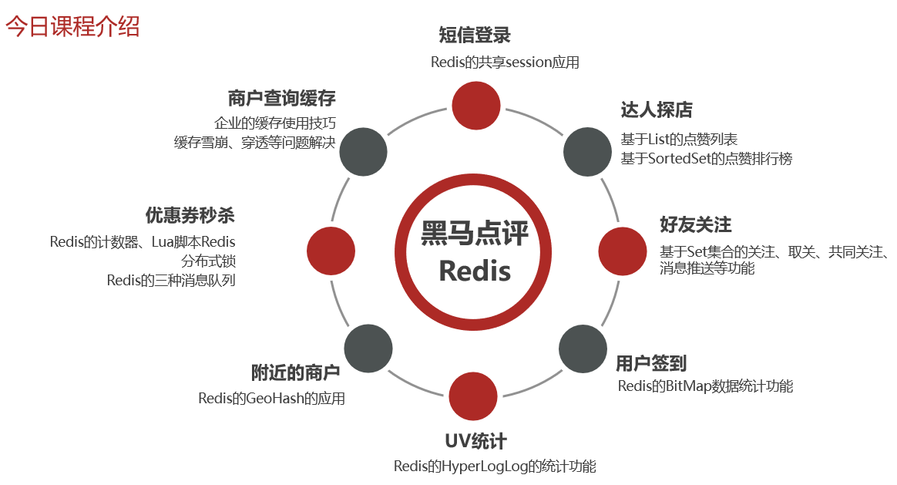

数据库中主要有以下表：

- tb_user：用户表，存储用户的基本信息
- tb_user_info：用户详情表
- tb_shop：商户信息表
- tb_shop_type：商户类型表
- tb_blog：用户日记表（达人探店日记）
- tb_follow：用户关注表
- tb_voucher：优惠券表
- tb_voucher_order：优惠券订单表

项目大致架构如下：

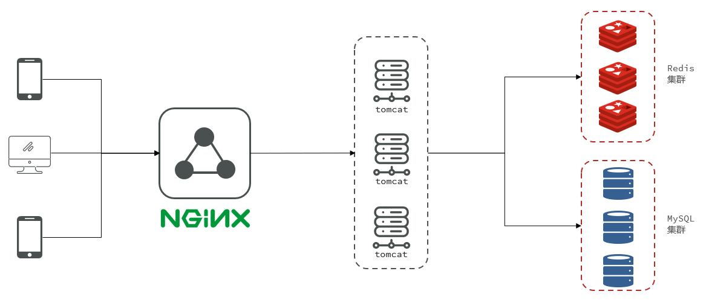

项目为单体项目，采用前后端分离模式，前端项目部署到nignx中，而后端项目部署到tomcat服务器中。当用户发起请求时，首先请求页面，即向nginx发起请求，然后nginx向服务端发起请求，服务端查询数据并将查询到的数据返回给前端，前端进行渲染即可。

由于是前后端分离，因此要向前端返回统一格式的数据，所以我们定义了一个`Result`类作为返回结果，`Result`类的代码如下：

```java
@Data
@NoArgsConstructor
@AllArgsConstructor
public class Result {
    private Boolean success;
    private String errorMsg;
    private Object data;
    private Long total;

    public static Result ok(){
        return new Result(true, null, null, null);
    }
    public static Result ok(Object data){
        return new Result(true, null, data, null);
    }
    public static Result ok(List<?> data, Long total){
        return new Result(true, null, data, total);
    }
    public static Result fail(String errorMsg){
        return new Result(false, errorMsg, null, null);
    }
}
```

其中，上面的三个注解都是lombok中的注解，`@Data`为类中的成员变量添加getter与setter方法，`@NoArgsConstructor`为类添加无参构造方法，`@AllArgsConstructor`为类添加全参构造方法。

# 2 短信登录

## 2.1 短信验证码发送

要想实现短信登录，第一步就要发送验证码，发送验证码的大致流程如下：

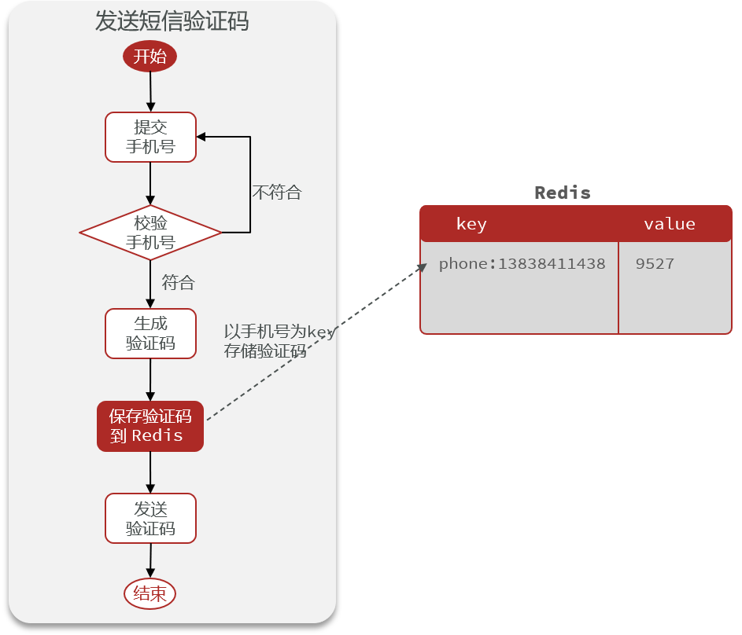

短信验证码其实就是一个6位的随机数。由于下一步短信验证码登录需要校验短信验证码，因此这里我们需要将发送出去的短信验证码存储到redis中，并且设置一个超时时间。存储到redis中时，以手机号为key，再添加一个前缀以区分不同业务。

另外，由于使用阿里云短信验证服务较为繁琐，因此这里我们直接输出到控制台表示已发送给用户验证码。

`UserController`中对应的handler代码如下：

```java
/**
 * 发送手机验证码
 * @param phone 手机号码
 */
// PostMapping注解相当于指定请求方式为POST的RequestMapping
@PostMapping("/code")
public Result sendCode(@RequestParam("phone") String phone) {
    // 发送短信验证码并保存验证码
    return userService.sendCode(phone);
}
```

其中，`UserServiceImpl`中的`sendCode`函数实现如下：

```java
/**
 * 发送手机验证码
 * @param phone 手机号码
 */
@Override
public Result sendCode(String phone) {
    // 1.校验手机号
    if(RegexUtils.isPhoneInvalid(phone)) {
        // 2.如果手机号格式错误，返回错误信息
        return Result.fail("手机号码格式错误！");
    }
    // 3.手机号格式正确，生成验证码
    String code = RandomUtil.randomNumbers(6);

    // 4.保存验证码到redis
    stringRedisTemplate.opsForValue().set(LOGIN_CODE_KEY + phone, code, LOGIN_CODE_TTL, TimeUnit.MINUTES);

    // 5.发送验证码
    log.debug("发送短信验证码成功，验证码：{}", code);
    // 返回ok
    return Result.ok();
}
```
为了降低代码耦合度，我们将key的前缀以及超时时间定义为`RedisConstants`类中的静态常量，如下：
```java
// 验证码的key前缀以及超时时间，验证码使用前缀加上手机号作为key
public static final String LOGIN_CODE_KEY = "login:code:";
public static final Long LOGIN_CODE_TTL = 2L;
```

## 2.2 短信验证码登录、注册

用户收到短信验证码之后，可以使用该验证码进行登录，不存在的用户会自动注册，大致流程如下：

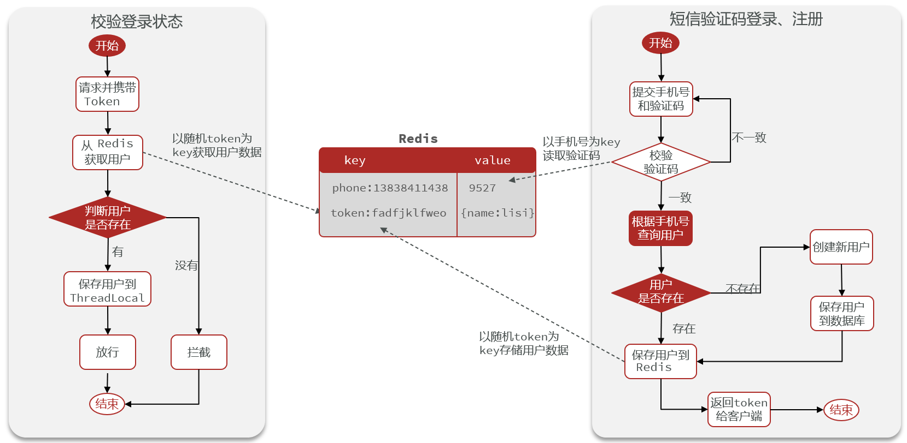

为了实现单点登录，我们会在登录成功之后以token作为key，将用户信息保存到redis中，并返回token给客户端。当用户下次再来访问或者访问本站点的其他资源时，我们会首先检查其请求中是否有token，如果没有或redis中不存在以该token为key的数据，则返回失败信息；如果有token并且能够在redis中查询到用户信息，则将用户信息存储到ThreadLocal中，供后续使用，放行。至于这里为什么将用户信息存储到当前线程的ThreadLocal中，是因为一个请求会使用一个线程对其进行处理，存放到线程的ThreadLocal中不会发生线程安全问题。单点登录的细节以及代码实现会在下一节讲到。

短信验证码登录、注册的`UserController`中的handler如下：

```java
/**
 * 登录功能
 * @param loginForm 登录参数，包含手机号、验证码；或者手机号、密码
 */
@PostMapping("/login")
public Result login(@RequestBody LoginFormDTO loginForm){
    // 实现登录功能
    return userService.login(loginForm);
}
```

其中，`LoginFromDTO`的代码如下：

```java
@Data
public class LoginFormDTO {
    private String phone;
    private String code;
    private String password;
}
```

`UserServiceImpl`中对应的`login`方法实现如下：

```java
/**
 * 登录功能
 * @param loginForm 登录参数，包含手机号、验证码；或者手机号、密码
 */
@Override
public Result login(LoginFormDTO loginForm) {
    // 1.校验手机号
    String phone = loginForm.getPhone();
    if(RegexUtils.isPhoneInvalid(phone)) {
        // 2.如果不符合，返回错误信息
        return Result.fail("手机号码格式错误！");
    }
    // 3. 校验验证码
    String code = loginForm.getCode();
    String cacheCode = stringRedisTemplate.opsForValue().get(LOGIN_CODE_KEY + phone);
    if(cacheCode == null || !cacheCode.equals(code)) {
        // 4. 不一致，报错
        return Result.fail("验证码错误！");
    }

    // 5.一致，根据手机号查询用户 select * from tb_user where phone = ?
    User user = query().eq("phone", phone).one();

    // 6.判断用户是否存在
    if(user == null) {
        // 7.不存在，创建用户并保存
        user = createUserWithPhone(phone);
    }

    // 8.保存用户信息到redis中
    // 8.1 随机生成token，作为登录令牌
    String token = UUID.randomUUID().toString(true);
    // 由于User类中字段较多，部分字段用不上，全部存储会浪费空间，而且User中还存在着用户密码等敏感信息
    // 所以这里我们只存储用户中部分必要的数据：id、nickName、icon，封装到UserDTO中
    // 8.2 将UserDTO对象转化为HashMap，以供后续存储为redis中的hash类型
    UserDTO userDTO = BeanUtil.copyProperties(user, UserDTO.class);
    // 需要注意的是，由于stringRedisTemplate中只能存储String类型的数据，所以这里要把对象中的一些非String属性转化为String
    Map<String, Object> userMap = BeanUtil.beanToMap(userDTO, new HashMap<>(),
            CopyOptions.create()
                    .setIgnoreNullValue(true)
                    .setFieldValueEditor((fieldName, fieldValue) -> fieldValue.toString()));
    // 8.3 存储
    String tokenKey = LOGIN_USER_KEY + token;
    stringRedisTemplate.opsForHash().putAll(tokenKey, userMap);
    // 如果token一直存储在redis中，会造成极大的空间浪费，因此我们要对其设置失效时间
    // 这里仿照session的处理，当客户端30分钟无请求时，关闭session
    // 当客户端30分钟无请求时，将redis中的token清除
    // 为了实现这一功能，需要在客户端发来新的请求时，将失效时间重新设置为30分钟，这一部分将在拦截器中实现
    // 8.4 设置token有效期
    stringRedisTemplate.expire(tokenKey, LOGIN_USER_TTL, TimeUnit.MINUTES);
    // 9.返回token
    return Result.ok(token);
}
```

这里我们将`UserDTO`对象转化为HashMap的形式存储到redis中，其实可以直接以json字符串的形式进行存储，只不过我们多用几种方式熟悉下操作。

其中，`createUserWithPhone`方法的代码如下：

```java
/**
 * 根据手机号创建用户
 * @param phone 用户手机号
 */
private User createUserWithPhone(String phone) {
    // 1.创建用户
    User user = new User();
    user.setPhone(phone);
    user.setNickName(SystemConstants.USER_NICK_NAME_PREFIX + RandomUtil.randomString(10));
    // 2.保存用户
    save(user);
    return user;
}
```

静态常量的声明如下：

```java
// 用户信息的key以及超时时间，用户信息使用前缀加上token作为key，这里我们使用的token为uuid
public static final String LOGIN_USER_KEY = "login:token:";
public static final Long LOGIN_USER_TTL = 30L;
```

## 2.3 单点登录

这一小节，我们实现单点登录功能。上一小节中，我们讲到当用户登录成功后，会向前端返回一个token。前端接收token后，会将其存放到浏览器的localStorage中，并且在每次请求时都会将token放在请求头中，以“authorization”作为键，token自身作为值。

另外，由于用户信息是以token作为key存放在redis中的，如果token一直存储在redis中，会造成极大的空间浪费，因此我们要对其设置失效时间，这里我们仿照session的处理，当客户端30分钟无请求时，关闭session。同样的，当客户端30分钟无请求时，我们将redis中的token清除。为了实现这一功能，需要在客户端发来新的请求时，将失效时间重新设置为30分钟，这一部分将在拦截器中实现。

为了刷新token有效期，我们定义了一个叫做`RefreshTokenInterceptor`的拦截器，该拦截器不对任何请求进行拦截，只起到当有请求时，就刷新token有效期的作用，并且，该拦截器拦截所有请求。

示意图如下：

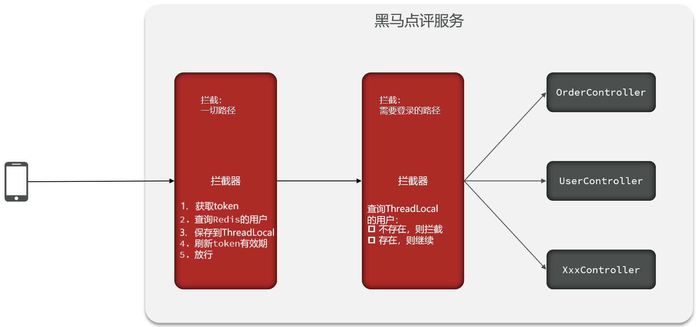

`RefreshTokenInterceptor`的代码如下：

```java
/**
 * 拦截器，刷新token有效期
 * 需要注意的时，这个拦截器不对任何请求进行拦截，只起到当有请求时，就刷新token有效期的作用
 * 并且，该拦截器拦截所有请求
 */
public class RefreshTokenInterceptor implements HandlerInterceptor {

    // 由于这里的LoginInterceptor没有放入spring的IOC容器中，不归spring管理
    // 所以这里无法直接进行注入，但是我们可以通过构造方法传入一个stringRedisTemplate，将其赋值给这一成员变量
    private StringRedisTemplate stringRedisTemplate;

    public RefreshTokenInterceptor(StringRedisTemplate stringRedisTemplate) {
        this.stringRedisTemplate = stringRedisTemplate;
    }

    /**
     * 调用时间：Controller方法处理之前
     * 执行顺序：链式Interceptor情况下，按照Interceptor声明的顺序一个接一个执行
     * 若返回false，则中断执行，注意，此时不会进入afterCompletion
     */
    @Override
    public boolean preHandle(HttpServletRequest request, HttpServletResponse response, Object handler) throws Exception {
        // 我们在/user/login中返回token给前端之后，前端代码将token存入到了sessionStorage中，
        // 并且在每次请求的时候，都会将该token放入到请求头中，key为authorization
        // 1.获取请求头中的token
        String token = request.getHeader("authorization");
        if(StrUtil.isBlank(token)) {
            // 不存在，直接放行
            return true;
        }
        // 2.基于token获取redis中的用户
        String tokenKey = LOGIN_USER_KEY + token;
        Map<Object, Object> userMap = stringRedisTemplate.opsForHash().entries(tokenKey);
        // 3.判断用户是否存在
        if(userMap.isEmpty()) {
            // 4.不存在，直接放行
            return true;
        }
        // 5.将查询到的hash数据转化为UserDTO对象
        UserDTO user = BeanUtil.fillBeanWithMap(userMap, new UserDTO(), false);

        // 6.存在，保存用户信息到ThreadLocal
        UserHolder.saveUser(user);

        // 7.刷新token有效期，当客户端30分钟无请求时，清除token
        stringRedisTemplate.expire(tokenKey, LOGIN_USER_TTL, TimeUnit.MINUTES);
        // 8.放行
        return true;
    }

    /**
     * 调用前提：preHandle返回true
     * 调用时间：Controller方法处理完之后，DispatcherServlet进行视图的渲染之前，也就是说在这个方法中可以对ModelAndView操作
     * 执行顺序：链式Interceptor情况下，按照Interceptor声明的顺序倒着执行
     */
    @Override
    public void postHandle(HttpServletRequest request, HttpServletResponse response, Object handler, ModelAndView modelAndView) throws Exception {

    }

    /**
     * 调用前提：preHandle返回true
     * 调用时间：DispatcherServlet进行视图的渲染之后
     * 多用于清理资源
     */
    @Override
    public void afterCompletion(HttpServletRequest request, HttpServletResponse response, Object handler, Exception ex) throws Exception {
        UserHolder.removeUser();
    }
}
```

另外，为了拦截不包含token的请求，我们还需要再定义一个拦截器`LoginInterceptor`，代码如下：

```java
/**
 * 拦截器，校验登录状态
 */
public class LoginInterceptor implements HandlerInterceptor {

    @Override
    public boolean preHandle(HttpServletRequest request, HttpServletResponse response, Object handler) throws Exception {
        // 1.判断是否需要拦截
        if(UserHolder.getUser() == null) {
            // 用户未登陆，需要拦截，设置状态码为401，表示没有权限访问
            response.setStatus(401);
            // 拦截
            return false;
        }
        // 用户已登录，放行
        return true;
    }
}
```

在定义拦截器之后，为了令拦截器生效，我们还需要对其进行配置，配置类代码如下：

```java
@Configuration
public class MvcConfig implements WebMvcConfigurer {

    // 注入stringRedisTemplate，并通过构造方法将其传递给LoginInterceptor
    @Resource
    private StringRedisTemplate stringRedisTemplate;

    // 配置登录拦截器
    @Override
    public void addInterceptors(InterceptorRegistry registry) {
        /*
        默认所有Interceptor的order都是0，order越小，优先级越大。此时按照Interceptor添加的顺序执行
        这里，RefreshTokenInterceptor需要先执行，所以我们将其order设为0，将LoginInterceptor的order设为1
         */
        // token刷新拦截器
        registry.addInterceptor(new RefreshTokenInterceptor(stringRedisTemplate)).order(0);
        // 登录拦截器
        registry.addInterceptor(new LoginInterceptor())
                // 不拦截的请求页面
                .excludePathPatterns(
                        "/shop/**",
                        "/voucher/**",
                        "/shop-type/**",
                        "/upload/**",
                        "/blog/hot",
                        "/user/code",
                        "/user/login",
                        "/demo/test"
                ).order(1);
    }
}
```

需要注意的是，`RefreshTokenInterceptor`需要先执行。

# 3 商户查询缓存

## 3.1 缓存介绍

缓存就是数据交换的缓冲区，是存储数据的临时地方，一般读写性能较高。缓存能够降低后端负载、提高读写效率、降低响应时间，但是增加了维护缓存与数据库之间数据一致性的成本，代码编写也更为复杂。但总体来说，缓存的使用还是利大于弊的。

后端通常使用redis作为数据库与客户端之间的缓存，添加缓存之前客户端的请求直接打到数据库，从数据库中查询数据并返回给客户端。示意图如下：

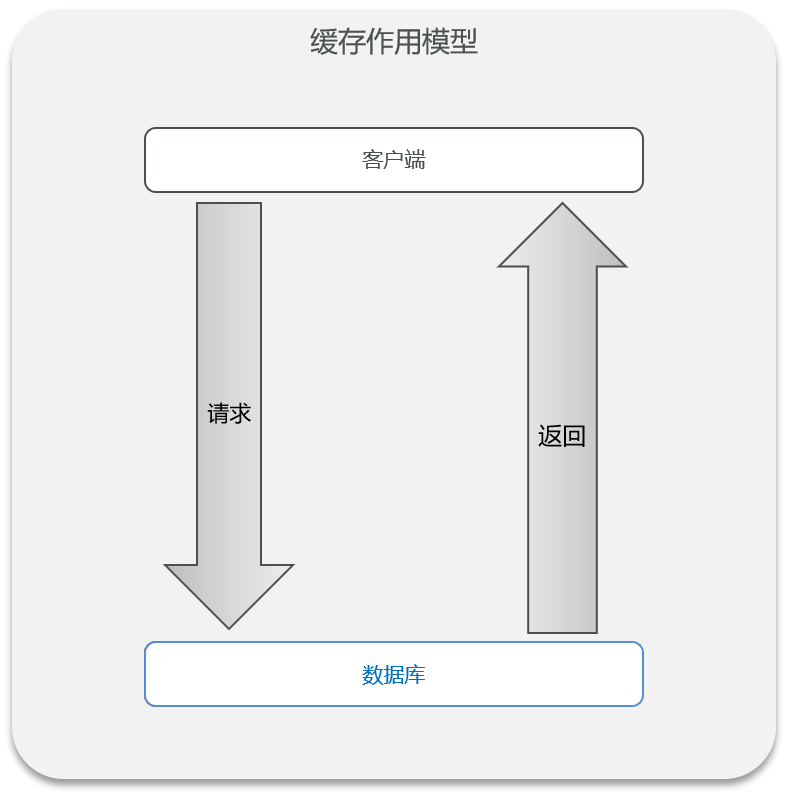

在添加了redis缓存后，服务器端收到客户端的请求后，会首先查询redis中是否有客户端需要的数据，如果命中，直接返回；如果未命中，则查询数据库，将查询到的数据写入到redis缓存中，并将数据返回给客户端。示意图如下：

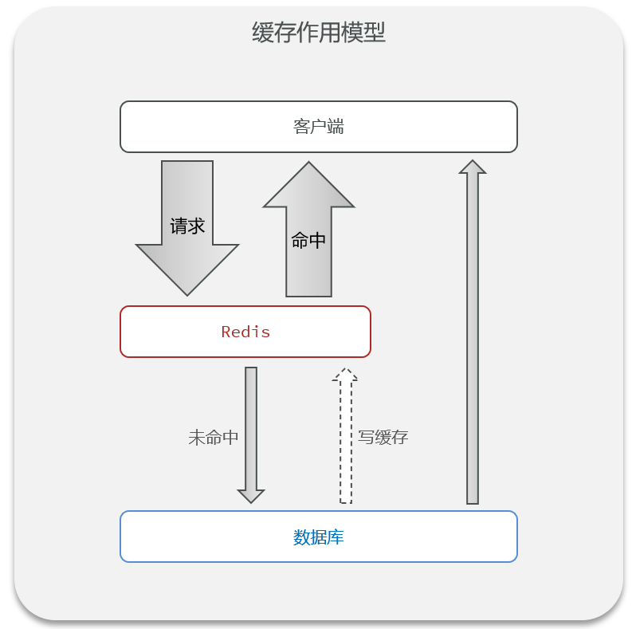

通过上述讲解，我们现在可以给出根据id查询商铺的流程：

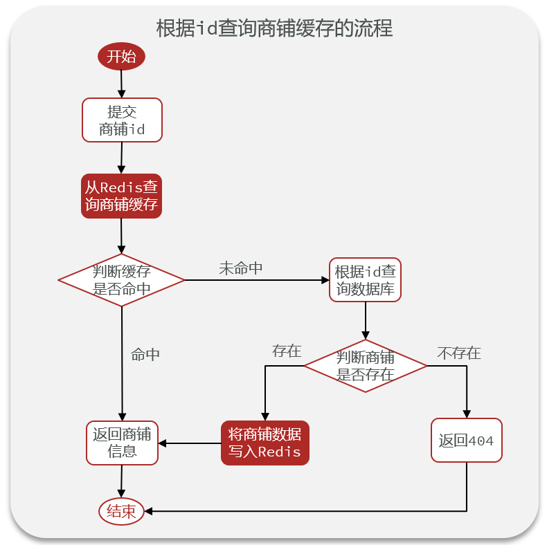

## 3.2 缓存主动更新策略

在讲缓存主动更新策略之前，先说一下缓存与数据库之间的一致性。

一致性就是数据保持一致，在分布式系统中，可以理解为多个节点中数据的值是一致的。

- **强一致性**：要求系统写入什么，读出来的也会是什么，实现起来往往对系统的性能影响较大。
- **弱一致性**：这种一致性级别约束了系统在写入成功后，不承诺立即可以读到写入的值，也不承诺多久之后数据能够达到一致，但会尽可能地保证到某个时间级别（比如秒级别）后，数据能够达到一致状态。
- **最终一致性**：最终一致性是弱一致性的一个特例，系统会保证在一定时间内，能够达到一个数据一致的状态。最终一致性是弱一致性中非常推崇的一种一致性模型，也是业界在大型分布式系统的数据一致性上比较推崇的模型。

缓存可以提升性能、缓解数据库压力，但是使用缓存会导致数据不一致的问题。为了实现数据库与缓存之间的一致性，可以使用以下几种缓存主动更新策略：

- Cache Aside Pattern
- Read/Write Through Pattern
- Write Behind Caching Pattern

下面依次对这几种缓存模式进行介绍。

### 3.2.1 Cache Aside Pattern

Cache Aside Pattern是由缓存的调用者，在更新数据库的同时操作缓存。操作缓存和数据库时有三个问题需要考虑：

1. 删除缓存还是更新缓存
   - 更新缓存：每次更新数据库都更新缓存，无效写操作较多。同时，更新缓存有可能出现两个并发的更新操作导致脏数据的情况（不推荐）。
   - 删除缓存：更新数据库时让缓存失效，查询时再更新缓存（推荐）。
2. 先删除缓存还是先操作数据库
   - 先删除缓存，再操作数据库（不推荐）
   - 先操作数据库，再删除缓存（推荐）
3. 如何保证缓存与数据库的操作都执行成功
   - 消息队列
   - 订阅变更日志

#### 删除缓存还是更新缓存？

假设我们采用“先更新数据库，再更新缓存”的方案，并且两步都可以成功执行的前提下，如果存在并发，情况会是怎样的呢？假设有线程A和线程B两个线程，需要更新同一条数据，那么可能会发生这样的场景：

1. 线程A更新数据库（value=1）
2. 线程B更新数据库（value=2）
3. 线程B更新缓存（value=2）
4. 线程A更新缓存（value=1）

最终value的值在数据库中是2，但在缓存中却是1。也就是说，虽然A先于B发生，但操作数据库加缓存的整个过程，B却比A先完成。

同样的，采用“先更新缓存，再更新数据库”的方案，也会有类似问题。

除此之外，我们从缓存利用率的角度来评估这个方案，也是不推荐的。因为每次数据发生变更，都无脑更新缓存，但是缓存中的数据不一定会被马上读取，甚至有可能会出现更新到缓存中的数据一次都没有被读取，就被后续更新的数据给覆盖掉的情况，导致缓存中可能存放了很多不常访问的资源，浪费缓存资源。

由此可发现，这种同时更新数据库和缓存的方案，不仅可能会出现脏数据的问题，而且缓存利用率不高，所以我们考虑另外一种方案：删除缓存。

同时更新数据库和缓存会有两种可能导致数据不一致：

1. **由于异常原因导致其中一方更新失败**
2. **由于并发带来的资源竞争，引起的数据的错误更新**

将更新缓存换成删除缓存，可以解决并发导致的数据不一致。那么问题来了，更新数据库和删除缓存到底先执行哪一步才能解决并发带来的数据不一致问题呢？

#### 先删除缓存还是先操作数据库？

注意，这里我们先假设两步都成功，因为目前只考虑并发。首先讨论先删除缓存，后更新数据库的情况。如果有两个线程要并发读写数据，可能会发生以下场景：

1. 线程A要更新value=2（原value=1），更新之前先删除缓存
2. 线程B读缓存，发现不存在，因为A已经把缓存删掉了，所以会从数据库总读取到旧值（value=1）
3. 线程A将新值写入数据库（value=2）
4. 由于之前线程B在读缓存的时候未命中，所以将从数据库中读取的值写入缓存（value=1）

最终value的值在缓存中1（旧值），在数据库中是2（新值），发生不一致。可见，先删除缓存，后更新数据库，当发生并发读写时，还是存在数据不一致的情况。

然后讨论先更新数据库，后删除缓存的情况。依旧是两个线程并发读写数据；

1. 线程A读缓存，发现不存在
2. 线程A读取数据库，得到值（value=1）
3. 线程B更新数据库（value=2）
4. 线程B删除缓存
5. 线程A将旧值写入缓存（value=1）

最终value的值在缓存中的是1（旧值），在数据库中是2（新值），也发生了不一致。哎？不是说可以解决并发带来的数据不一致吗？为什么两种方式都会导致数据不一致呢？

实际上，“先更新数据库，后删除缓存”这种方案如果发生数据不一致情况的话，必须满足以下三个条件：

- 缓存刚好已失效
- 读请求与写请求并发
- 更新数据库 + 删除缓存的时间（步骤3、4），要比读数据库 + 写缓存时间短（步骤2、5），即写操作先于读操作执行完毕

条件1和2的概率虽然低，但还是有可能发生 ，但条件3发生的概率可以说是微乎其微，因为实际上写操作要比读操作慢得多。所以我们可以说“先更新数据库，再删除缓存”在并发层面基本上是可以保证数据一致性的。就算上面三个条件都满足了，出现了数据不一致情况，我们可以设置超时时间，以超时剔除作为兜底方案。只要到达缓存过期时间，后面的读请求自然会从数据库中读取新值然后写入到缓存中。

经过上面的讨论，我们可以给出Cache Aside Pattern的读写请求流程。

读请求流程如下：

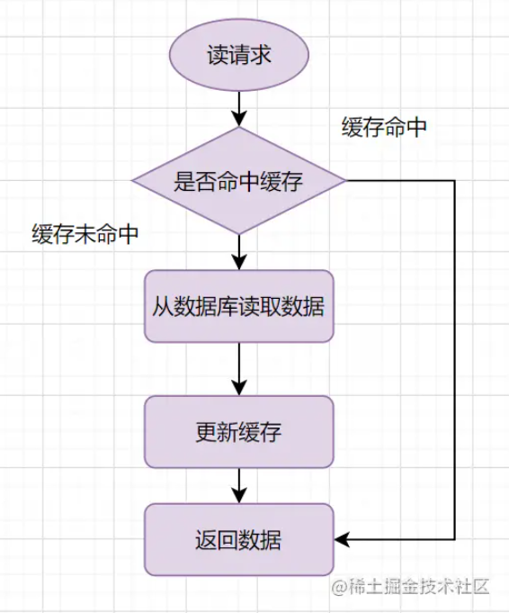

写请求流程如下：

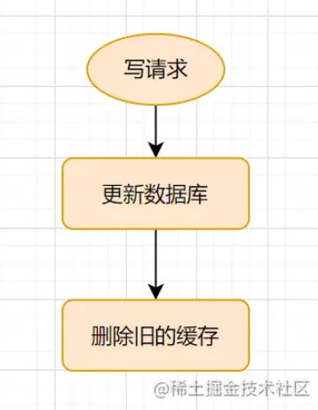

#### 如何保证缓存与数据库的操作都执行成功?

经过前面的分析，我们决定采用“更新数据库 + 删除缓存”这一策略，从而解决并发引起的数据不一致问题。但是即使使用这一策略，只要第二步发生失败，就会导致数据库和缓存不一致。所以剩下的问题就在于如何保证第二步的成功。

如果第二步的删除缓存失败，最简单的解决方法就是重试。但是采用同步重试的方案不太严谨，会有以下几个问题：

- 立即重试很大概率还会失败
- 重试次数设置多少才合理
- 重试会一直占用这个线程资源，无法服务其他客户端请求

所以比较好的方案是采用异步重试。

异步重试其实就是把重试请求写到消息队列中，然后由专门的消费者来重试，直到成功。

- 消息队列保证可靠性：写到队列中的消息，成功消费之前不会丢失（重启项目也不担心）
- 消息队列保证消息成功投递：下游从队列拉取消息，成功消费后才会删除消息，否则还会继续投递消息给消费者（符合我们重试的场景）

但是上面的做法会对业务代码造成大量的入侵，那么我们有没有其他的方案呢？答案是有的，这也是近几年比较流行的解决方案：订阅数据库变更日志，再操作缓存。具体来讲就是，我们的业务应用在修改数据时，只需修改数据库，无需操作缓存。那什么时候操作缓存呢，这就和数据库的变更日志有关了。

拿MySQL举例，当一条数据发生修改时，MySQL就会产生一条变更日志（Binlog），我们可以订阅这个日志，拿到具体操作的数据，然后再根据这条数据，去删除对应的缓存。订阅变更日志，目前也有了比较成熟的开源中间件，例如阿里的canal。

至此，我们可以得出结论，想要保证数据库和缓存一致性，推荐使用“先更新数据库，再删除缓存”的方案，并配合消息队列或订阅变更日志来实现。所以对于业务调用方来说，如果数据库更新成功，那么直接返回成功即可，删除缓存这一步异步实现；如果数据库更新失败，那么直接返回失败，删除缓存也无需再进行了。

### 3.2.2 Read/Write Through Pattern

缓存与数据库整合为一个服务，由服务来维护一致性，调用者调用该服务，无需关心缓存一致性问题。

### 3.2.3 Write Behind Caching Pattern

调用者只操作缓存，由其他线程异步的将缓存数据持久化到数据库，保证最终一致。

### 3.2.4 总结

项目中为了保证数据库与缓存之间的一致性，采用Cache Aside Pattern这一主动更新策略，并以超时剔除作为兜底方案。

- 读操作：
  - 缓存命中则直接返回
  - 缓存未命中则查询数据库，并写入缓存，设定超时时间
- 写操作：
  - 先写数据库，然后再删除缓存

由于设置了超时时间，所以即使出现之前提到的极端情况造成脏数据，或者出现数据库更新成功，而缓存删除失败的情况，也可以实现最终一致性。只要到达缓存过期时间，后面的读请求自然会从数据库中读取新值然后写入到缓存中。

`ShopController`中更新商铺信息对应的handler如下：

```java
/**
 * 更新商铺信息
 * @param shop 商铺数据
 * @return 无
 */
@PutMapping
public Result updateShop(@RequestBody Shop shop) {
    // 写入数据库
    return shopService.update(shop);
}
```

其中，`ShopServiceImpl`中的`update`方法的实现如下：

```java
/**
 * 更新商铺信息
 * 为了保证数据库与redis缓存之间的一致性，这里我们采用cache aside缓存模式，并且以超时剔除作为兜底方案
 * 简单来说，cache aside缓存模式就是先更新数据库，然后再删除缓存中的对应值
 * @param shop 商铺数据
 * @return 无
 */
@Override
@Transactional
public Result update(Shop shop) {
    Long id = shop.getId();
    if(id == null) {
        return Result.fail("店铺id不能为空");
    }
    // 在实体类中使用@TableId注解标识主键，这一方法应该是通过这一注解找到主键并进行更新的
    // 1.更新数据库
    updateById(shop);
    // 2.删除缓存
    stringRedisTemplate.delete(CACHE_SHOP_KEY + id);
    return Result.ok();
}
```

**参考资料**：

[https://www.cnblogs.com/traditional/p/11890972.html](https://www.cnblogs.com/traditional/p/11890972.html)

[https://juejin.cn/post/6964531365643550751](https://juejin.cn/post/6964531365643550751)

[https://www.bilibili.com/video/BV1cr4y1671t](https://www.bilibili.com/video/BV1cr4y1671t)

## 3.3 缓存穿透

缓存穿透是指客户端请求的数据在缓存和数据库中都不存在，这样缓存永远不会生效，这些请求都会打到数据库。

常见的解决方案有两种：缓存空对象和布隆过滤器，下面一一对其进行介绍。

### 3.3.1 缓存空对象

当请求的数据在数据库中不存在时，为了防止下一次该数据的请求仍然打到数据库，我们可以在缓存中缓存一个空对象。这样的话，下一次该数据的请求就会命中redis，然后直接返回。另外，为了防止空对象一直在redis中存储，我们还需要设置一个超时时间。示意图如下：

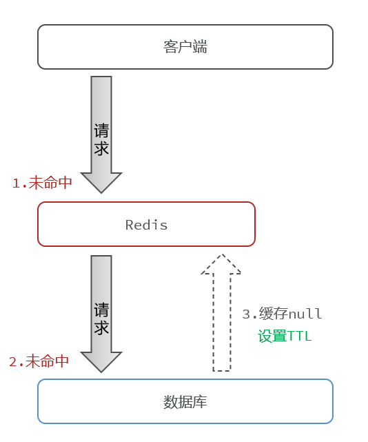

该方法的优缺点如下：

- 优点：实现简单、维护方便
- 缺点：
  - 额外的内存消耗
  - 可能造成短期的不一致

关于可能造成短期的不一致，比如redis中缓存了一个id为9的空对象，然后数据库中新插入了一个id为9的对象（数据库中插入数据是不会去更新缓存的），这样用户来查询还是会查询到redis的空对象，出现数据不一致。不过这一问题以及额外的内存消耗问题都可以通过设置超时时间的方式在一定程度上解决。

我们在项目中使用的就是这一方案来防止缓存穿透，那么原来的根据id查询商铺信息的流程图就变为了如下形式：

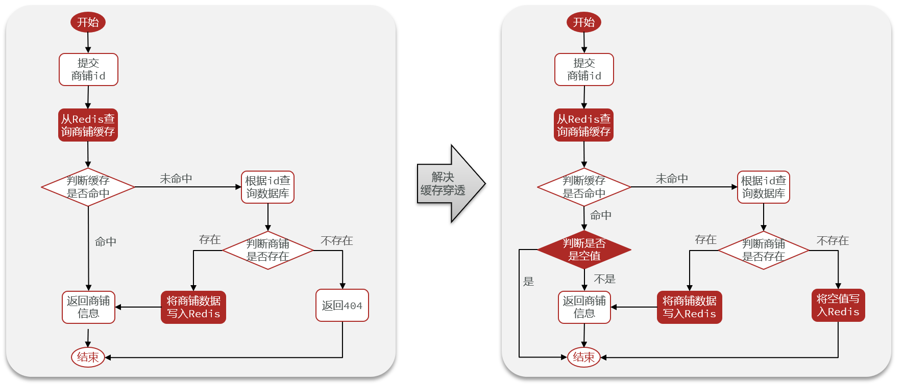

代码如下：

```java
/**
 * 根据id查询商铺信息
 * 解决缓存穿透问题。缓存穿透是指客户端请求的数据在缓存和数据库中都不存在，这样缓存永远不会生效，这些请求都会打到数据库。
 * 常见的解决方案有两种：
 * 1.缓存空对象
 *      * 优点：实现简单，维护方便
 *      * 缺点：
 *          * 额外的内存消耗
 *          * 可能造成短期的不一致。比如，redis中缓存了一个id为9的空对象，然后数据库中新插入了一个id为9的对象（插入数据
 *          是不会去更新缓存的），这样用户来查询还是会查询到redis中的空对象，出现数据不一致。
 *      上述两种缺点都可以采用设置超时时间的方法在一定程度上解决。
 * 2.布隆过滤
 *      * 优点：内存占用较少，没有多余key
 *      * 缺点：
 *          * 实现复杂
 *          * 存在误判可能。布隆过滤器可以告诉你“某样东西一定不存在或者可能存在”。当数据不存在时，拒绝该请求，这样就避免了
 *          缓存穿透的发生；当存在时，放行。
 * 这里我们使用缓存空对象的方式来解决缓存穿透问题
 * @param id 商铺id
 * @return 商铺详情数据
 */
private Shop queryWithPassThrough(Long id) {
    String key = CACHE_SHOP_KEY + id;
    // 为了多练习一下redis中不同数据的存取，这里我们采用json的格式存取，不采用之前的hash方式
    // 1.从redis查询商铺缓存
    String shopJson = stringRedisTemplate.opsForValue().get(key);
    // 2.判断redis中是否存在
    if(StrUtil.isNotBlank(shopJson)) {
        // 3.redis中存在，直接返回
        return JSONUtil.toBean(shopJson, Shop.class);
    }
    // 上面的isNotBlank返回false有两种情况，shopJson为null，或者shopJson为空值
    // 当shopJson为null时，说明redis中未缓存该数据，当shopJson为空值时，说明redis中存在是我们缓存的空对象
    // 如果shopJson不为null，说明我们查找到我们缓存在redis中的空对象，数据库中实际上是不存在该数据的，返回错误信息
    if(shopJson != null) {
        // 返回错误信息
        return null;
    }
    // 4.redis中不存在，根据id查询数据库
    Shop shop = getById(id);
    // 5.数据库中不存在，返回错误
    if(shop == null) {
        // 在返回错误值之前，将空值写入到redis中，并设置超时时间，以防止缓存穿透的发生
        stringRedisTemplate.opsForValue().set(key, "", CACHE_NULL_TTL, TimeUnit.MINUTES);
        // 返回错误信息
        return null;
    }
    // 6.数据库中存在，写入redis
    stringRedisTemplate.opsForValue().set(key, JSONUtil.toJsonStr(shop), CACHE_SHOP_TTL, TimeUnit.MINUTES);
    // 7.返回
    return shop;
}
```

### 3.3.2 布隆过滤器

本质上布隆过滤器是一种比较巧妙的概率型数据结构，特点是高效地插入和查询，可以用来告诉你“**某样东西一定不存在或者可能存在**”。相比于传统的List、Set、Map等数据结构，它更高效、占用空间更少，但是缺点是其返回的结果是概率性的，而不是确切的。

使用布隆过滤器解决缓存穿透问题，首先要进行布隆过滤器预热，其实就是把将来作为判断的key加入布隆过滤器。另外，在更新数据的同时，需要同步到布隆过滤器中，否则会导致有数据查不出来的情况。使用布隆过滤器之后，查询数据的流程如下：

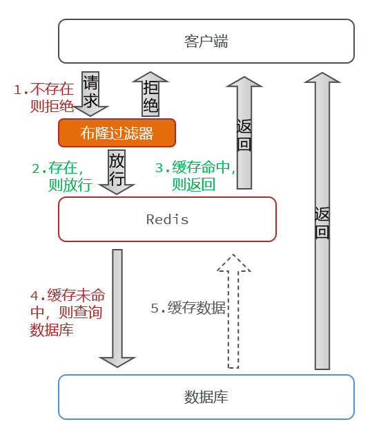

布隆过滤器的优缺点如下：

- 优点：内存占用较少，没有多余key
- 缺点：
  - 实现复杂
  - 存在误判可能

关于布隆过滤器的原理以及一些细节，可以看下面两篇博客：

[https://zhuanlan.zhihu.com/p/43263751](https://zhuanlan.zhihu.com/p/43263751)

[https://juejin.cn/post/7068578263638999048](https://juejin.cn/post/7068578263638999048)

## 3.4 缓存雪崩

**缓存雪崩**是指在同一时段大量的缓存key同时失效或者Redis服务宕机，导致大量请求到达数据库，带来巨大压力。

**解决方案**

- 给不同的Key的TTL添加随机值
- 利用Redis集群提高服务的可用性
- 给缓存业务添加降级限流策略
- 给业务添加多级缓存

## 3.5 缓存击穿

**缓存击穿问题**也叫热点Key问题，就是一个被**高并发访问**并且**缓存重建业务较复杂**的Key突然失效了，无数的请求会在瞬间给数据库带来巨大的冲击。

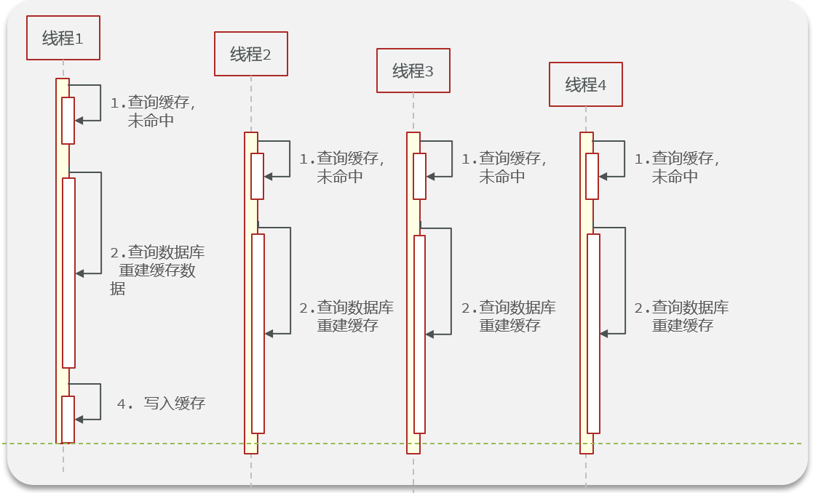

假设线程1查询时Key已经失效，未命中缓存，所以线程1要去查询数据库并进行缓存的重建。然而由于业务比较复杂，缓存重建时间比较长，在缓存重建的这段时间内，当其他请求到来时，由于无法命中缓存，这些线程仍然会去查询数据库，然后执行缓存重建操作。由于该key为热点key，且缓存重建时间较长，在这段时间内，大量的请求打到数据库，很有可能造成数据库瘫痪。

对于缓存击穿，常见的解决方案有两种：

- 互斥锁
- 逻辑过期

下面我们将详细介绍下这两种解决方案。

### 3.5.1 互斥锁解决缓存击穿

使用互斥锁能够解决缓存击穿这一问题。假设当前缓存已失效，线程1过来查询，未命中，则去获取互斥锁，当获取锁成功之后，再去执行查询数据库并重建缓存数据的操作，当缓存重建成功后，释放锁。假设另外还有一个线程2来查询，当缓存命中时，则直接将查询到的数据返回。如果未命中，则尝试获取互斥锁，由于此时线程1已经成功获得锁，线程2获取锁失败，休眠并重新查询缓存，重复执行上述步骤，直到缓存命中为止。

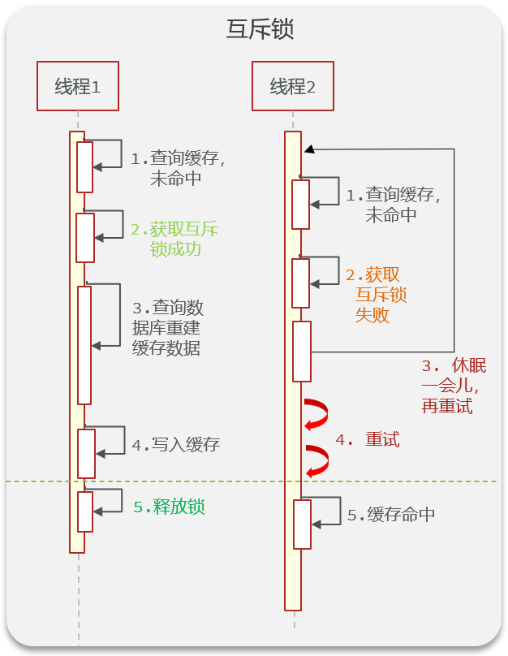

使用互斥锁方案解决缓存击穿问题，原来根据id查询商铺信息的流程图就变为了如下形式：

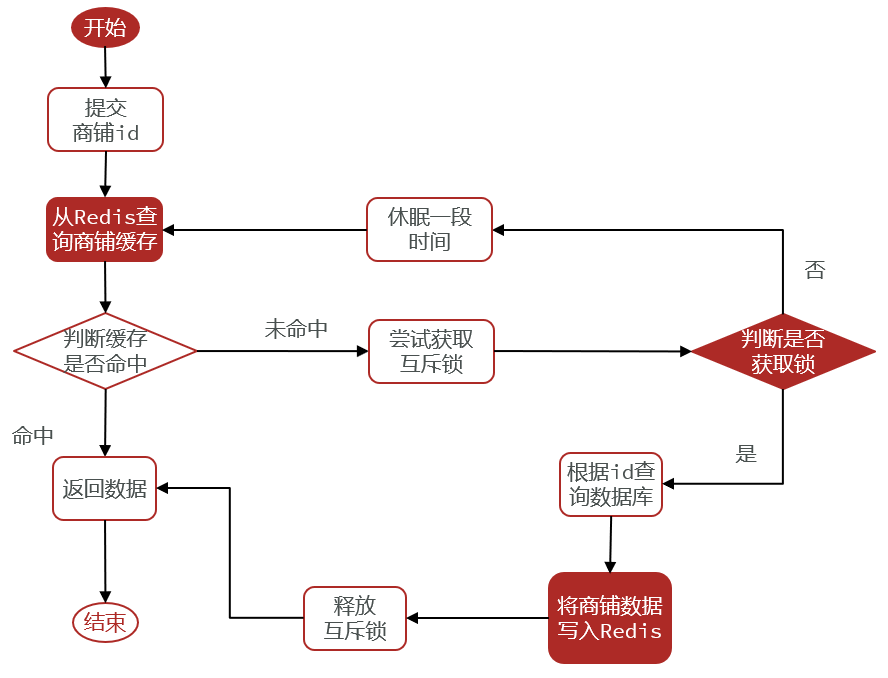

操作锁的代码：

```java
/**
 * 获取锁，redis中是没有类似于java中的锁的，但是我们可以使用setnx命令实现互斥锁
 * setnx只有在key不存在的时候才能设值成功，当第一个线程设值成功后，其他线程就无法再进行设值了，直到该线程将key删除为止
 * @param key 获取锁使用的key
 * @return 是否获取成功
 */
private boolean tryLock(String key) {
    // setnx对应的api为setIfAbsent，这里设置一个超时时间，以免因为出现异常情况导致锁无法释放的情况
    Boolean flag = stringRedisTemplate.opsForValue().setIfAbsent(key, "1", 10, TimeUnit.SECONDS);
    // 这里最好不要直接返回flag，因为可能会出现空指针异常
    // 要么对flag是否为空进行特判，然后再返回，要么就使用下面的工具类
    return BooleanUtil.isTrue(flag);
}

/**
 * 释放锁
 * @param key 待释放的锁对应的key
 */
private void unlock(String key) {
    stringRedisTemplate.delete(key);
}
```

添加互斥锁解决缓存击穿后，根据id查询商铺的代码：

```java
/**
 * 根据id查询商铺信息
 * 解决缓存击穿问题。缓存击穿问题也叫热点key问题，就是一个被高并发访问并且缓存重建业务较复杂的key突然失效了，
 * 无数的请求访问会在瞬间给数据库带来巨大的冲击。
 * 常见的解决方案有两种：
 *      * 互斥锁
 *      * 逻辑过期
 * 这里使用互斥锁解决缓存击穿问题，包含通过缓存空对象解决缓存穿透的问题。
 * @param id 商铺id
 * @return 商铺详情数据
 */
private Shop queryWithMutex(Long id) {
    String key = CACHE_SHOP_KEY + id;
    // 1.从redis查询商铺缓存
    String shopJson = stringRedisTemplate.opsForValue().get(key);
    // 2.判断redis中是否存在
    if(StrUtil.isNotBlank(shopJson)) {
        // 3.redis中存在，直接返回
        return JSONUtil.toBean(shopJson, Shop.class);
    }
    // 判断命中的值是否是空值
    if(shopJson != null) {
        // 不为null，说明是空值，返回错误信息
        return null;
    }

    // 4.实现缓存重建
    // 4.1 获取互斥锁
    String lockKey = LOCK_SHOP_KEY + id;
    Shop shop = null;
    try {
        boolean isLock = tryLock(lockKey);
        // 4.2 判断是否获取成功
        if(!isLock) {
            // 4.3 获取锁失败，则休眠并重试
            Thread.sleep(50);
            return queryWithMutex(id);
        }
        // 4.4 成功，根据id查询数据库
        shop = getById(id);
        // 5.数据库中不存在，返回错误
        if(shop == null) {
            // 在返回错误值之前，将空值写入到redis中，并设置超时时间，以防止缓存穿透的发生
            stringRedisTemplate.opsForValue().set(key, "", CACHE_NULL_TTL, TimeUnit.MINUTES);
            // 返回错误信息
            return null;
        }
        // 6.数据库中存在，写入redis
        stringRedisTemplate.opsForValue().set(key, JSONUtil.toJsonStr(shop), CACHE_SHOP_TTL, TimeUnit.MINUTES);
    } catch (InterruptedException e) {
        throw new RuntimeException(e);
    } finally {
        // 7.释放互斥锁
        unlock(lockKey);
    }
    // 8.返回
    return shop;
}
```

其实这里的互斥锁应该采用Redission提供的互斥锁，因为自己实现的锁还是有一些问题。比如我们在setnx时设置了一个超时时间，用来防止锁无法释放的情况。但是如果我们的业务在执行过程中出了一些问题，在业务执行期间到达了key的超时时间，锁被释放，此时就会出现安全问题。而Redission中的锁就不会出现这一问题，因为它有看门狗机制自动延长超时时间，这个我们后面会详细讲。

### 3.5.2 逻辑过期解决缓存击穿

之所以会出现缓存击穿问题，主要原因在于我们对key设置了过期时间，当key达到过期时间时，缓存失效，大量的请求涌入数据库，从而产生缓存击穿。既然这样，那么如果我们不设置过期时间，缓存击穿问题不就不会发生了吗。但是不设置过期时间，数据就会一直占用内存，所以我们可以使用逻辑过期。

逻辑过期指的是我们并不为key设置过期时间，而是将过期时间设置在key的value中。当达到过期时间时，redis并不会去清除该key，而是需要我们通过代码去处理。

假设当前线程1去查询缓存，检查逻辑过期时间后发现当前key已过期，则先去获取互斥锁，获取成功后开启一个新线程（线程2）去查询数据库，执行缓存重建逻辑，开启新线程成功后，线程1不会去等待缓存重建结束，而是直接返回过期数据。新开的线程会去查询数据库，然后写入缓存，并重置逻辑过期时间，当成功完成缓存重建之后，新开的线程才会释放锁。之后，假设又有线程来查询缓存，如果该线程检查逻辑过期时间后发现当前key已过期，则先去获取互斥锁，由于此时线程2还在进行缓存重建，并未释放锁，该线程获取互斥锁失败，则不进行重试，直接返回旧数据（线程3）；如果该线程检查逻辑过期时间后，发现当前key没有过期，说明此时线程2已完成缓存重建，则直接返回查询到的数据（线程4）。

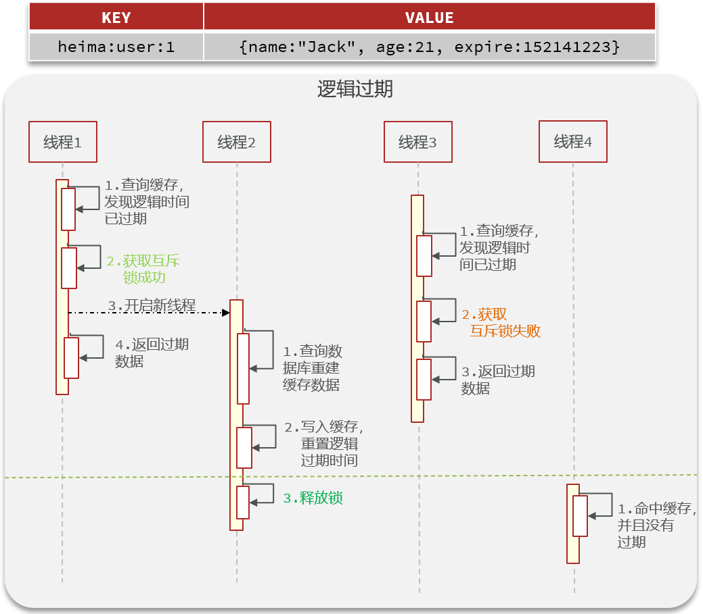

这种方案的巧妙之处在于异步地构建缓存，缺点在于**在构建完缓存之前，返回的都是脏数据（旧数据）**。

使用逻辑过期方案解决缓存击穿问题，原来根据id查询商铺信息的流程图就变为了如下形式：

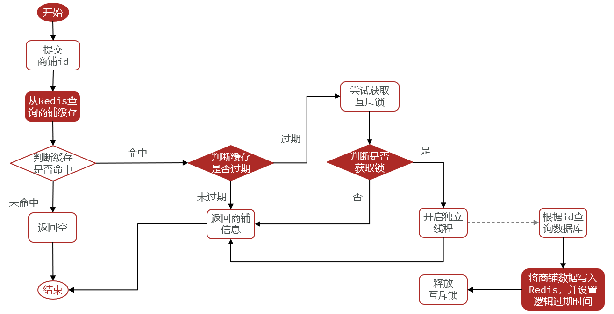

由于使用逻辑过期方案时，redis中存储的数据的value要带上过期时间，此时要么去修改原来的实体类，要么新建一个实体类。我们采用第二个方案，该方案对原来的代码没有侵入性。

```java
@Data
public class RedisData {
    private LocalDateTime expireTime;
    private Object data;
}
```

逻辑过期通常配合缓存预热使用，即在缓存启动启动时，先将一些热点数据加载进入缓存。我们使用单元测试来执行此操作。我们在单元测试中调用如下方法以将数据加载进入缓存。

```java
/**
 * 存储商户数据到redis中，并添加逻辑过期的超时时间
 * @param id 商户id
 * @param expireSeconds 超时时间
 */
public void saveShop2Redis(Long id, Long expireSeconds) {
    // 1.查询店铺数据
    Shop shop = getById(id);
    // 2.封装逻辑过期时间
    RedisData redisData = new RedisData();
    redisData.setData(shop);
    redisData.setExpireTime(LocalDateTime.now().plusSeconds(expireSeconds));
    // 3.写入redis
    stringRedisTemplate.opsForValue().set(CACHE_SHOP_KEY + id, JSONUtil.toJsonStr(redisData));
}
```

添加逻辑过期解决缓存击穿后，根据id查询商铺的代码：

```java
private static final ExecutorService CACHE_REBUILD_EXECUTOR = Executors.newFixedThreadPool(10);

/**
 * 根据id查询商铺信息
 * 使用逻辑过期解决缓存击穿问题
 * @param id 商铺id
 * @return 商铺详情数据
 */
private Shop queryWithLogicalExpire(Long id) {
    String key = CACHE_SHOP_KEY + id;
    // 1.从redis查询商铺缓存
    String shopJson = stringRedisTemplate.opsForValue().get(key);
    // 2.判断redis中是否存在
    // 由于我们已经做了redis预热，也就是将要用的数据都存储到了redis中，所以当redis中查询不到数据时，
    // 数据库中肯定也不存在，直接返回null即可
    if(StrUtil.isBlank(shopJson)) {
        // 3.redis中不存在，直接返回null
        return null;
    }
    // 4.命中，需要先把json反序列化为对象
    RedisData redisData = JSONUtil.toBean(shopJson, RedisData.class);
    // json反序列化之后，其中的引用类型的成员变量类型为JSONObject，还需要再次进行反序列化
    // 有点类似于java里面的深拷贝
    Shop shop = JSONUtil.toBean((JSONObject) redisData.getData(), Shop.class);
    LocalDateTime expireTime = redisData.getExpireTime();
    // 5.判断是否过期
    if(expireTime.isAfter(LocalDateTime.now())) {
        // 5.1 未过期，直接返回店铺信息
        return shop;
    }
    // 5.2 已过期，需要缓存重建
    // 6. 缓存重建
    // 6.1 获取互斥锁
    String lockKey = LOCK_SHOP_KEY + id;
    boolean isLock = tryLock(lockKey);
    // 6.2 判断是否获取锁成功
    if(isLock) {
        // 6.3 成功，开启独立线程，实现缓存重建
        CACHE_REBUILD_EXECUTOR.submit(() -> {
            try {
                // 重建缓存
                this.saveShop2Redis(id, 20L);
            } catch (Exception e) {
                throw new RuntimeException(e);
            } finally {
                // 释放锁
                unlock(lockKey);
            }
        });
    }
    // 6.4 返回过期的商铺信息
    return shop;
}
```

### 3.5.3 互斥锁与逻辑过期对比

**互斥锁方案**：由于保证了互斥性，所以数据一致，且实现简单，因为仅仅只需要加一把锁，而不需要其他的额外操作，同时也没有什么额外的内存消耗。缺点在于有锁就有可能发生死锁问题，且只能串行执行，性能会受到影响。

**逻辑过期方案**：线程读取过程中不需要等待，性能好，使用一个额外的线程持有锁去重构缓存，但是在重构缓存完成之前，其他的线程只能返回旧数据，且实现起来较复杂。

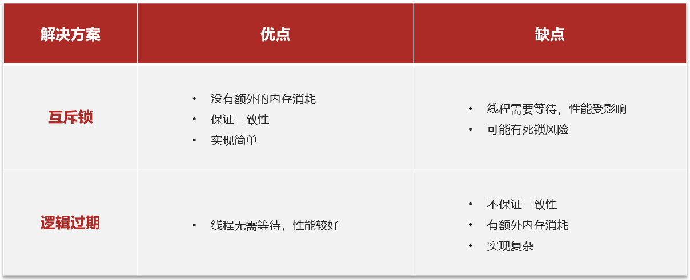

## 3.6 封装Redis工具类

由于上面的一些缓存的操作的不仅在查询商铺业务中会用到，在其他业务中也可能会用到，所以我们将其封装为一个通用的缓存工具类。

```java
@Slf4j
@Component
public class RedisClient {

    private final StringRedisTemplate stringRedisTemplate;

    private static final ExecutorService CACHE_REBUILD_EXECUTOR = Executors.newFixedThreadPool(10);

    public RedisClient(StringRedisTemplate stringRedisTemplate) {
        this.stringRedisTemplate = stringRedisTemplate;
    }

    /**
     * 将任意java对象序列化为json并存储在string类型的key中，并设置TTL过期时间
     */
    public void set(String key, Object value, Long time, TimeUnit unit) {
        stringRedisTemplate.opsForValue().set(key, JSONUtil.toJsonStr(value), time, unit);
    }

    /**
     * 将任意java对象序列化为json并存储在string类型的key中，设置逻辑过期时间，用于处理缓存击穿问题
     */
    public void setWithLogicalExpire(String key, Object value, Long time, TimeUnit unit) {
        // 设置逻辑过期
        RedisData redisData = new RedisData();
        redisData.setData(value);
        redisData.setExpireTime(LocalDateTime.now().plusSeconds(unit.toSeconds(time)));
        // 写入redis
        stringRedisTemplate.opsForValue().set(key, JSONUtil.toJsonStr(value));
    }

    /**
     * 根据指定的key查询缓存，并反序列化为指定类型，利用缓存空值的方式解决缓存穿透问题
     * @param keyPrefix key的前缀，利用该前缀与id构造key
     * @param id 待查询数据的id
     * @param type 待查询数据的Class
     * @param dbFallback 数据库查询逻辑
     * @param time 时间
     * @param unit 时间单位
     * @param <R> 待查询数据的类型
     * @param <ID> id的数据类型
     * @return 查询结果
     */
    public <R, ID> R queryWithPassThrough(String keyPrefix, ID id, Class<R> type, Function<ID, R> dbFallback,
                                           Long time, TimeUnit unit) {
        String key = keyPrefix + id;
        // 1.从redis查询商铺缓存
        String json = stringRedisTemplate.opsForValue().get(key);
        // 2.判断redis中是否存在
        if(StrUtil.isNotBlank(json)) {
            // 3.redis中存在，直接返回
            return JSONUtil.toBean(json, type);
        }
        // 上面的isNotBlank返回false有两种情况，shopJson为null，或者shopJson为空值
        // 当shopJson为null时，说明redis中未缓存该数据，当shopJson为空值时，说明redis中存在是我们缓存的空对象
        // 如果shopJson不为null，说明我们查找到我们缓存在redis中的空对象，数据库中实际上是不存在该数据的，返回错误信息
        if(json != null) {
            // 返回错误信息
            return null;
        }

        // 4.redis中不存在，根据id查询数据库
        R r = dbFallback.apply(id);
        // 5.数据库中不存在，返回错误
        if(r == null) {
            // 在返回错误值之前，将空值写入到redis中，并设置超时时间，以防止缓存穿透的发生
            stringRedisTemplate.opsForValue().set(key, "", CACHE_NULL_TTL, TimeUnit.MINUTES);
            // 返回错误信息
            return null;
        }
        // 6.数据库中存在，写入redis
        this.set(key, r, time, unit);
        // 7.返回
        return r;
    }
    
    /**
     * 根据指定的key查询缓存，并反序列化为指定类型，利用互斥锁解决缓存击穿问题，并且使用缓存空值的方式解决缓存穿透问题
     * @param keyPrefix key的前缀，利用该前缀与id构造key
     * @param lockKeyPrefix 获取锁的key的前缀
     * @param id 待查询数据的id
     * @param type 待查询数据的Class
     * @param dbFallback 数据库查询逻辑
     * @param time 时间
     * @param unit 时间单位
     * @param <R> 待查询数据的类型
     * @param <ID> id的数据类型
     * @return 查询结果
     */
    public <R, ID> R queryWithMutex(String keyPrefix, String lockKeyPrefix, ID id, Class<R> type,
                                    Function<ID, R> dbFallback, Long time, TimeUnit unit) {
        String key = keyPrefix + id;
        // 1.从redis查询商铺缓存
        String json = stringRedisTemplate.opsForValue().get(key);
        // 2.判断redis中是否存在
        if(StrUtil.isNotBlank(json)) {
            // 3.redis中存在，直接返回
            return JSONUtil.toBean(json, type);
        }
        // 判断命中的值是否是空值
        if(json != null) {
            // 不为null，说明是空值，返回错误信息
            return null;
        }

        // 4.实现缓存重建
        // 4.1 获取互斥锁
        String lockKey = lockKeyPrefix + id;
        R r = null;
        try {
            boolean isLock = tryLock(lockKey);
            // 4.2 判断是否获取成功
            if(!isLock) {
                // 4.3 获取锁失败，则休眠并重试
                Thread.sleep(50);
                return queryWithMutex(keyPrefix, lockKeyPrefix, id, type, dbFallback, time, unit);
            }
            // 4.4 成功，根据id查询数据库
            r = dbFallback.apply(id);
            // 5.数据库中不存在，返回错误
            if(r == null) {
                // 在返回错误值之前，将空值写入到redis中，并设置超时时间，以防止缓存穿透的发生
                stringRedisTemplate.opsForValue().set(key, "", CACHE_NULL_TTL, TimeUnit.MINUTES);
                // 返回错误信息
                return null;
            }
            // 6.数据库中存在，写入redis
            this.set(key, r, time, unit);
        } catch (InterruptedException e) {
            throw new RuntimeException(e);
        } finally {
            // 7.释放互斥锁
            unlock(lockKey);
        }
        // 8.返回
        return r;
    }

    /**
     * 根据指定的key查询缓存，并反序列化为指定类型，利用逻辑过期解决缓存击穿问题
     * @param keyPrefix key的前缀，利用该前缀与id构造key
     * @param lockKeyPrefix 获取锁的key的前缀
     * @param id 待查询数据的id
     * @param type 待查询数据的Class
     * @param dbFallback 数据库查询逻辑
     * @param time 时间
     * @param unit 时间单位
     * @param <R> 待查询数据的类型
     * @param <ID> id的数据类型
     * @return 查询结果
     */
    public <R, ID> R queryWithLogicalExpire(String keyPrefix, String lockKeyPrefix, ID id, Class<R> type, Function<ID, R> dbFallback,
                                             Long time, TimeUnit unit) {
        String key = keyPrefix + id;
        // 1.从redis查询商铺缓存
        String json = stringRedisTemplate.opsForValue().get(key);
        // 2.判断redis中是否存在
        // 由于我们已经做了redis预热，也就是将要用的数据都存储到了redis中，所以当redis中查询不到数据时，
        // 数据库中肯定也不存在，直接返回null即可
        if(StrUtil.isBlank(json)) {
            // 3.redis中不存在，直接返回null
            return null;
        }
        // 4.命中，需要先把json反序列化为对象
        RedisData redisData = JSONUtil.toBean(json, RedisData.class);
        // json反序列化之后，其中的引用类型的成员变量类型为JSONObject，还需要再次进行反序列化
        // 有点类似于java里面的深拷贝
        R r = JSONUtil.toBean((JSONObject) redisData.getData(), type);
        LocalDateTime expireTime = redisData.getExpireTime();
        // 5.判断是否过期
        if(expireTime.isAfter(LocalDateTime.now())) {
            // 5.1 未过期，直接返回店铺信息
            return r;
        }
        // 5.2 已过期，需要缓存重建
        // 6. 缓存重建
        // 6.1 获取互斥锁
        String lockKey = lockKeyPrefix + id;
        boolean isLock = tryLock(lockKey);
        // 6.2 判断是否获取锁成功
        if(isLock) {
            // 6.3 成功，开启独立线程，实现缓存重建
            CACHE_REBUILD_EXECUTOR.submit(() -> {
                try {
                    // 查询数据库
                    R newR = dbFallback.apply(id);
                    // 重建缓存
                    this.setWithLogicalExpire(key, newR, time, unit);
                } catch (Exception e) {
                    throw new RuntimeException(e);
                } finally {
                    // 释放锁
                    unlock(lockKey);
                }
            });
        }
        // 6.4 返回过期的商铺信息
        return r;
    }

    /**
     * 获取锁，redis中是没有类似于java中的锁的，但是我们可以使用setnx命令实现互斥锁
     * setnx只有在key不存在的时候才能设值成功，当第一个线程设值成功后，其他线程就无法再进行设值了，直到该线程将key删除为止
     * @param key 获取锁使用的key
     * @return 是否获取成功
     */
    private boolean tryLock(String key) {
        // setnx对应的api为setIfAbsent
        Boolean flag = stringRedisTemplate.opsForValue().setIfAbsent(key, "1", 10, TimeUnit.SECONDS);
        // 这里最好不要直接返回flag，因为可能会出现空指针异常
        // 要么对flag是否为空进行特判，然后再返回，要么就使用下面的工具类
        return BooleanUtil.isTrue(flag);
    }

    /**
     * 释放锁
     * @param key 待释放的锁对应的key
     */
    private void unlock(String key) {
        stringRedisTemplate.delete(key);
    }
}
```

在`ShopServiceImpl`中：

```java
/**
 * 根据id查询商铺信息
 * @param id 商铺id
 * @return 商铺详情数据
 */
@Override
public Result queryById(Long id) {
    // 缓存穿透
//        Shop shop = queryWithPassThrough(id);
    Shop shop = redisClient.
            queryWithPassThrough(CACHE_SHOP_KEY, id, Shop.class, this::getById, CACHE_SHOP_TTL, TimeUnit.MINUTES);

    // 互斥锁解决缓存击穿
//        Shop shop = queryWithMutex(id);

    // 逻辑过期解决缓存击穿
//        Shop shop = queryWithLogicalExpire(id);

    if(shop == null) {
        return Result.fail("店铺不存在");
    }
    // 返回
    return Result.ok(shop);
}
```

# 4 优惠券秒杀

## 4.1 全局唯一ID

每个店铺都可以发布优惠券，当用户抢购时，就会生成订单并保存到`tb_voucher_order`这张表，而订单表如果使用数据库自增ID就会存在一些问题：

- id的规律性太明显
- 受表单数据量的限制

场景分析一：订单id（编号）是会暴露给用户的，如果我们使用的订单id有太明显的规则，用户很容易猜测出来一些敏感信息，比如商城在一天之内卖出了多少单。

场景分析二：随着商城规模越来越大，mysql的单表容量不宜超过500W，当数据量过大时，我们要进行分库分表，而不同分表下的数据库自增id可能会产生重复。

**全局ID生成器**：是一种在分布式系统下用来生成全局唯一ID的工具，一般要满足下列特性：

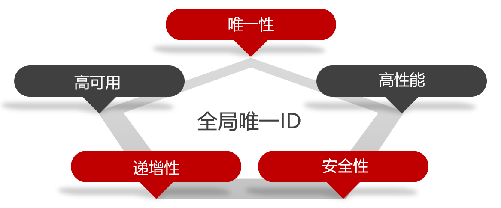

其中的安全性主要是指的信息安全，即id无规则，不会透漏隐私信息。

这里我们使用redis实现全局唯一id：

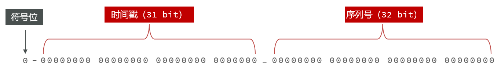

该id为64bit的正整数，由以下三部分组成：

- 符号位：1bit，永远为0
- 时间戳：31bit，以秒为单位，可以使用69年
- 序列号：32bit，计数器，以天为单位。

其中，序列号由redis维持并实现自增，每天采用不同的key实现序列号自增。

代码如下：

```java
/**
 * 为订单生成全局唯一id
 * 这里我们使用redis自增的方式实现全局唯一id，每天采用一个新的key对序列号进行自增
 * id的实现采用64位的整数，即long类型，并且id由以下三部分组成：
 *      * 符号位：1bit，永远为0
 *      * 时间戳：31bit，以秒为单位，可以使用69年
 *      * 序列号：32bit，计数器，以天为单位。
 * 其实redis中维持一个订单数量，然后用该订单数量作为全局唯一id也可以，
 * 只不过不满足信息安全这一个要求，因此我们在前面拼接上一个时间戳，
 * 保证生成的全局唯一id无规律。
 */
@Component
public class RedisIdWorker {

    // 开始时间戳，从2022年1月1日0时0分0秒开始
    private static final long BEGIN_TIMESTAMP = 1640995201L;

    // 序列号的位数
    private static final int COUNT_BITS = 32;

    private final StringRedisTemplate stringRedisTemplate;

    public RedisIdWorker(StringRedisTemplate stringRedisTemplate) {
        this.stringRedisTemplate = stringRedisTemplate;
    }

    public long nextId(String keyPrefix) {
        // 1.生成时间戳
        LocalDateTime now = LocalDateTime.now();
        long nowSecond = now.toEpochSecond(ZoneOffset.UTC);
        long timestamp = nowSecond - BEGIN_TIMESTAMP;

        // 在使用redis自增实现全局唯一id时要注意一个问题，我们不能一直在一个键上自增，
        // 因为当订单量过大时，可能会超出序列号的表示范围，因此我们每天的订单采用一个键
        // 按照yyyy:MM:dd的形式组织，由于redis中key的层级结构，我们后期统计订单数的时候也好统计。
        // 2.生成序列号
        // 2.1 获取当前日期，精确到天
        String date = now.format(DateTimeFormatter.ofPattern("yyyy:MM:dd"));
        // 2.2 自增长
        long count = stringRedisTemplate.opsForValue().increment("icr:" + keyPrefix + ":" + date);

        // 3.拼接并返回
        return timestamp << COUNT_BITS | count;
    }
}
```

其实redis中维持一个订单数量，然后用该订单数量作为全局唯一id也可以（满足全局唯一且趋势递增），只不过不满足信息安全这一个要求，因此我们在前面拼接上一个时间戳，保证生成的全局唯一id无规律。

另外，我们可以使用**薄雾（Mist）算法**，以订单数量作为薄雾算法中的自增数。当然，为了避免被人猜到我们使用了薄雾算法，我们可以不设置自增数为47bit，可以设置为其他合适的位数。

## 4.2 实现优惠券秒杀下单

每个店铺都可以发布优惠券，分为平价券和特价券。平价券可以任意购买，而特价券需要秒杀抢购。

表关系如下：

- `tb_voucher`：优惠券的基本信息，优惠金额、使用规则等
- `tb_seckill_voucher`：优惠券的库存、开始抢购时间、结束抢购时间。特价优惠券才需要填写这些信息

秒杀下单时需要判断两点：

- 秒杀是否开始或结束，如果尚未开始或已经结束则无法下单
- 库存是否充足，不足则无法下单

流程图如下：

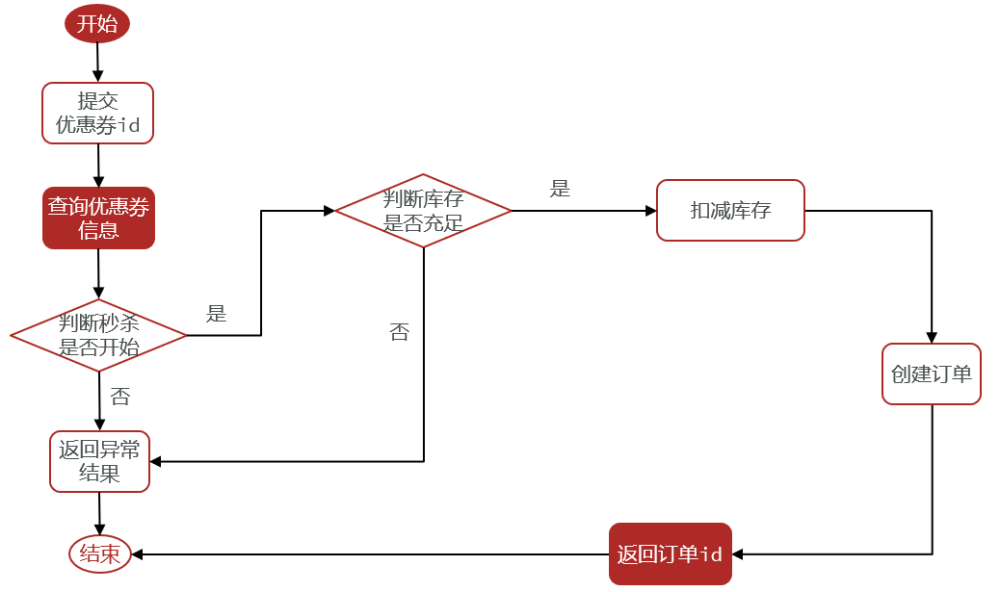

代码如下：

```java
/**
 * 实现秒杀下单
 * 下单时需要判断两点：
 *      * 秒杀是否开始或结束，如果尚未开始或已经结束则无法下单
 *      * 库存是否充足，不足则无法下单
 * @param voucherId 秒杀优惠券id
 * @return 订单id
 */
@Override
public Result seckillVoucher(Long voucherId) {
    // 1.查询优惠券
    SeckillVoucher voucher = seckillVoucherService.getById(voucherId);
    // 2.判断秒杀是否开始
    if (voucher.getBeginTime().isAfter(LocalDateTime.now())) {
        // 尚未开始
        return Result.fail("秒杀尚未开始！");
    }
    // 3.判断秒杀是否已经结束
    if (voucher.getEndTime().isBefore(LocalDateTime.now())) {
        // 尚未开始
        return Result.fail("秒杀已经结束！");
    }
    // 4.判断库存是否充足
    if (voucher.getStock() < 1) {
        // 库存不足
        return Result.fail("库存不足！");
    }
    
    return createVoucherOrder(voucherId);
    //5，扣减库存
    boolean success = seckillVoucherService.update()
            .setSql("stock= stock -1")
            .eq("voucher_id", voucherId).update();
    if (!success) {
        //扣减库存
        return Result.fail("库存不足！");
    }
    //6.创建订单
    VoucherOrder voucherOrder = new VoucherOrder();
    // 6.1.订单id
    long orderId = redisIdWorker.nextId("order");
    voucherOrder.setId(orderId);
    // 6.2.用户id
    Long userId = UserHolder.getUser().getId();
    voucherOrder.setUserId(userId);
    // 6.3.代金券id
    voucherOrder.setVoucherId(voucherId);
    save(voucherOrder);

    return Result.ok(orderId);

}
```

## 4.3 超卖问题

我们原有代码是这么写的：

```java
 if (voucher.getStock() < 1) {
        // 库存不足
        return Result.fail("库存不足！");
    }
    //5，扣减库存
    boolean success = seckillVoucherService.update()
            .setSql("stock= stock -1")
            .eq("voucher_id", voucherId).update();
    if (!success) {
        //扣减库存
        return Result.fail("库存不足！");
    }
```

假设线程1先来查询库存，发现库存大于1，正要去执行扣减库存操作。此时，线程2也过来查询库存，发现库存大于1，也去执行扣减库存操作。那么这两个线程都会去扣减库存，最终导致库存变为-1，出现超卖问题。

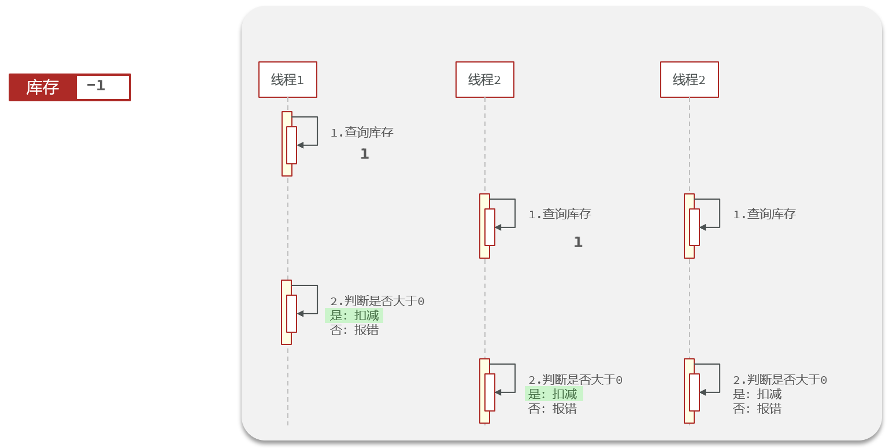

超卖问题是典型的多线程安全问题，针对这一问题的常见解决方案就是加锁。对于我们这个项目，可以直接修改代码如下：

```java
// set stock = stock - 1 where id = ? and stock > 0
boolean success = seckillVoucherService.update()
    .setSql("stock = stock - 1")
    .eq("voucher_id", voucherId)
    .gt("stock", 0).update();
```

在sql语句中加上判断来防止超卖问题的发生。这里其实是用到了MySQL中的排他锁，简称X锁，如果一个事务获取了一个数据行的排他锁，其他事务就不能再获得该行的其他锁。（但是这种方式会导致多个线程都达到了数据库，在数据库执行操作，会不会给数据带来较大的压力？）

## 4.4 一人一单

### 4.4.1 初步实现

需求：修改秒杀业务，要求同一个优惠券，一个用户只能下一单。

流程图如下：

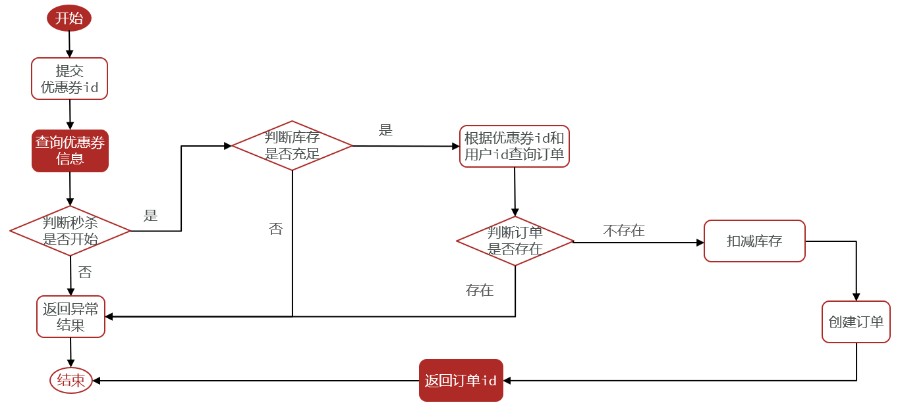

添加一人一单的秒杀业务代码如下：

```java
/**
 * 实现秒杀下单
 * 下单时需要判断两点：
 *      * 秒杀是否开始或结束，如果尚未开始或已经结束则无法下单
 *      * 库存是否充足，不足则无法下单
 * @param voucherId 秒杀优惠券id
 * @return 订单id
 */
@Override
public Result seckillVoucher(Long voucherId) {
    // 1.查询优惠券
    SeckillVoucher seckillVoucher = seckillVoucherService.getById(voucherId);
    // 2.判断秒杀是否开始
    if(LocalDateTime.now().isBefore(seckillVoucher.getBeginTime())) {
        // 尚未开始
        return Result.fail("秒杀尚未开始！");
    }
    // 3.判断秒杀是否结束
    if(LocalDateTime.now().isAfter(seckillVoucher.getEndTime())) {
        // 尚未开始
        return Result.fail("秒杀已经结束！");
    }
    // 4.判断库存是否充足
    if(seckillVoucher.getStock() < 1) {
        // 库存不足
        return Result.fail("库存不足！");
    }

    return createVoucherOrder(voucherId);
}

/**
 * 创建秒杀订单并保存，实现一人一单
 * @param voucherId 秒杀优惠券id
 * @return 订单id
 */
@Transactional
public Result createVoucherOrder(Long voucherId) {
    // 5.一人一单逻辑
    // 5.1.用户id
    Long userId = UserHolder.getUser().getId();
    int count = query().eq("user_id", userId).eq("voucher_id", voucherId).count();
    // 5.2.判断是否存在
    if (count > 0) {
        // 用户已经购买过了
        return Result.fail("用户已经购买过一次！");
    }

    //6，扣减库存
    boolean success = seckillVoucherService.update()
        .setSql("stock = stock - 1")
        .eq("voucher_id", voucherId)
        .gt("stock", 0).update();
    if (!success) {
        //扣减库存
        return Result.fail("库存不足！");
    }
    //7.创建订单
    VoucherOrder voucherOrder = new VoucherOrder();
    // 7.1.订单id
    long orderId = redisIdWorker.nextId("order");
    voucherOrder.setId(orderId);

    voucherOrder.setUserId(userId);
    // 7.3.代金券id
    voucherOrder.setVoucherId(voucherId);
    save(voucherOrder);

    return Result.ok(orderId);
}
```

上面的代码与之前的超卖问题一样，同样存在并发安全问题。如果有多个并发请求过来，查询数据库，发现都不存在订单，这种情况下还是无法做到一人一单。因此我们需要加锁来保证其并发安全性。

使用java自带的锁无法保证集群环境下的并发安全问题。比如我们在两台服务器上部署了tomcat，每个tomcat都有一个属于自己的jvm，而java自带的锁是依赖于jvm的，不同jvm上的锁并不互通。虽然两台服务器上运行的代码相同，当jvm1中的线程1获得了锁，其对jvm2并没有影响，jvm2中的线程3仍然可以去获得jvm2的锁。

在这种情况下，我们就需要使用分布式锁来解决这一问题。

### 4.4.2 分布式锁介绍

分布式锁：满足分布式系统或集群模式下多进程可见并且互斥的锁。

分布式锁的核心思想就是让大家都使用同一把锁，这样我们就可以锁住在不同服务器上运行的线程，从而实现部分代码的串行执行。

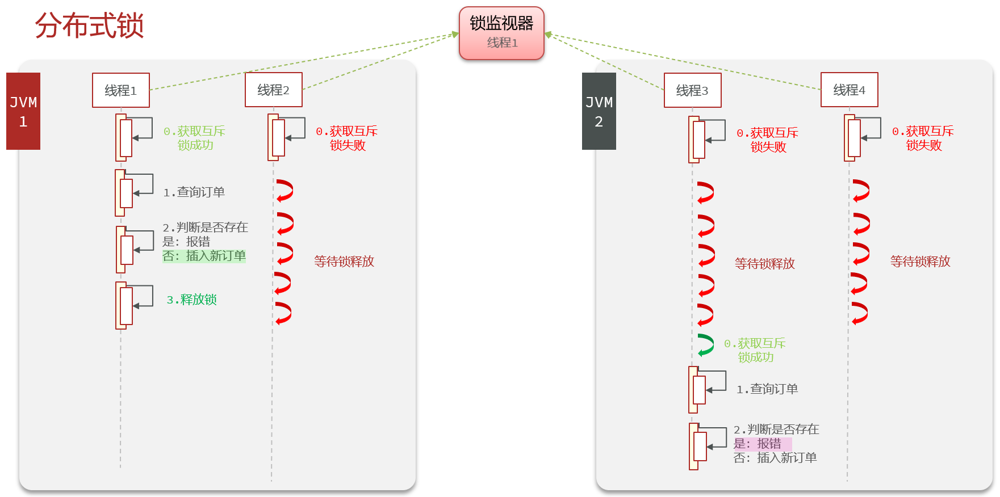

通常，分布式锁需要满足下面几个条件：

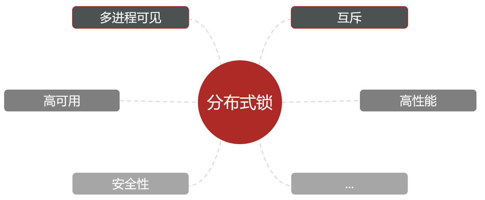

其中的可见性并不是并发编程中指的内存可见性，而是说多个进程之间都能感知到变化的意思。

常见的分布式锁有三种：

- MySQL：mysql本身就带有锁机制，但是由于mysql性能本身一般，所以使用mysql作为分布式锁的情况比较少见
- Redis：redis作为分布式锁是十分常见的一种方式，利用setnx这个方法，如果插入key成功，则表示成功获得锁。如果已经有人插入成功，则其他人是无法成功插入的，表示无法获得锁。redsi就是使用这套逻辑来实现分布式锁的。
- Zookeeper：zookeeper也是企业级开发中较好的一个实现分布式锁的方案，由于这里主要是学习redis，所以就不再深入讲解。

### 4.4.3 Redis分布式锁实现

实现分布式锁首先需要实现下面两个基本方法：

- 获取锁：

  - 互斥：确保只能有一个线程获取锁
  - 非阻塞：尝试一次，成功返回true，失败返回false

  

- 释放锁

  - 手动释放
  - 超时释放：获取锁时添加一个超时时间

  

这套分布式锁的实现逻辑如下图：

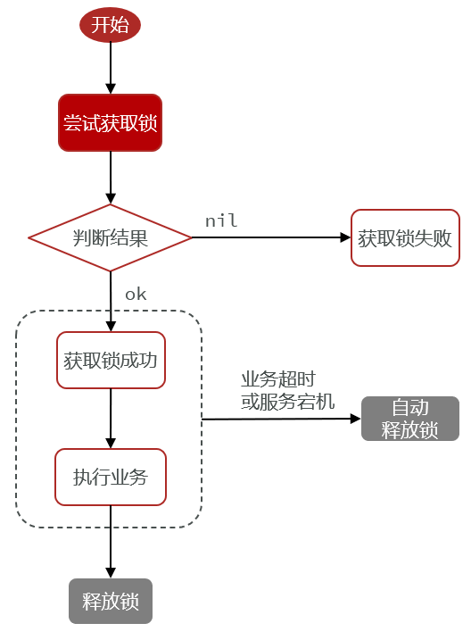

在实现分布式锁之前，我们首先定义一个锁的接口：

```java
public interface ILock {
    /**
     * 尝试获取锁
     * @param timeoutSec 锁持有的超时时间，过期后自动释放
     * @return true代表获取锁成功，false代表获取锁失败
     */
    boolean tryLock(long timeoutSec);

    /**
     * 释放锁
     */
    void unlock();
}
```

下面的`SimpleRedisLock`就是我们自己实现的基于Redis分布式锁，其实现了`ILock`接口。

```java
/**
 * 实现redis分布式锁
 */
public class SimpleRedisLock implements ILock{

    // 分布式锁的key就是利用定义好的前缀拼接上name形成的
    private final String name;
    private final StringRedisTemplate stringRedisTemplate;

    public SimpleRedisLock(String name, StringRedisTemplate stringRedisTemplate){
        this.name = name;
        this.stringRedisTemplate = stringRedisTemplate;
    }

    // 分布式锁key的前缀，只是为了让redis中的key看起来更清晰，没有其他作用
    private static final String KEY_PREFIX = "lock:";

    /**
     * 尝试获取锁
     * @param timeoutSec 锁持有的超时时间，过期后自动释放
     * @return true代表获取锁成功，false代表获取锁失败
     */
    @Override
    public boolean tryLock(long timeoutSec) {
        // key中的value存什么都行，这里我们存线程id
        String threadId = Thread.currentThread().getId();
        // 获取锁，使用前缀拼接上用户自定义的name作为key
        Boolean success = stringRedisTemplate.opsForValue()
                .setIfAbsent(KEY_PREFIX + name, threadId, timeoutSec, TimeUnit.SECONDS);
        // 由于我们得到的success是Boolean包装类对象，而返回值要的是boolean基本数据类型，
        // 由包装类自动拆箱到基本数据类型可能会发生空指针异常，所以最好采用下面这种用法
        // 之前使用的hutool下面的BooleanUtil.isTrue底层源码其实就是这个
        return Boolean.TRUE.equals(success);
    }
    
    /**
     * 释放锁
     */
    public void unlock() {
        //通过del删除锁
        stringRedisTemplate.delete(KEY_PREFIX + name);
    }
}
```

### 4.4.4 Redis分布式锁改进

**之前的分布锁实现有可能会出现锁误删的情况**。

比如，线程1持有锁，但在运行时出现了阻塞，导致其持有的锁超时自动释放。这时线程2来尝试获得锁，成功获得锁之后执行其业务代码。但是当线程1执行完其自身业务逻辑后，线程1会去释放锁，但是现在的锁并不是线程1原来持有的锁了，而是线程2持有的锁。就这样，线程1错误释放了线程2持有的锁，而此时线程2的业务代码还未执行完毕，引发线程安全问题。

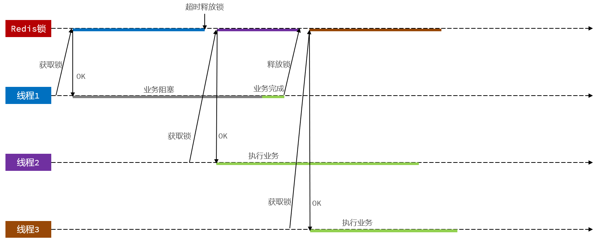

**解决方案**：解决方案就是在每个线程释放锁的时候，去判断一下当前这把锁是否属于自己，如果不属于自己，则不进行删除。

假设还是上面的情况，线程1执行业务代码时发生阻塞，锁超时自动释放。线程2成功获得锁执行业务代码。当线程1执行完业务逻辑后，进行释放锁的操作，但是此时线程1发现当前锁的线程标识不是自己，因此放弃删除，这就避免了锁误删的情况。

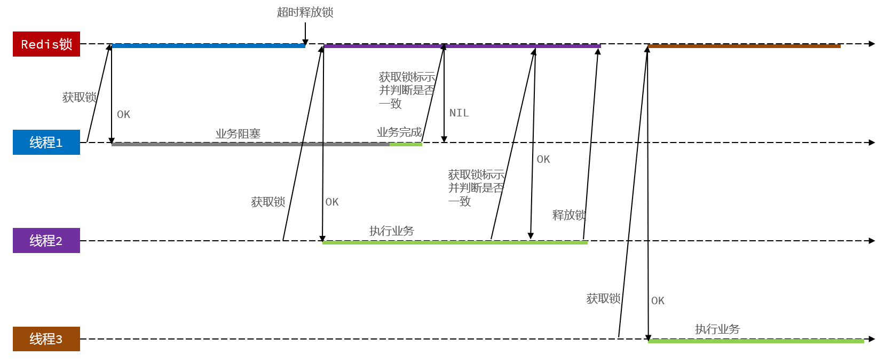

因此，之前的分布式锁实现可以修改为如下逻辑：在获取锁时存入线程标识，在释放锁时先获取锁中的线程标识，判断是否与当前线程标识一致：

- 如果一致则释放锁
- 如果不一致则不释放锁

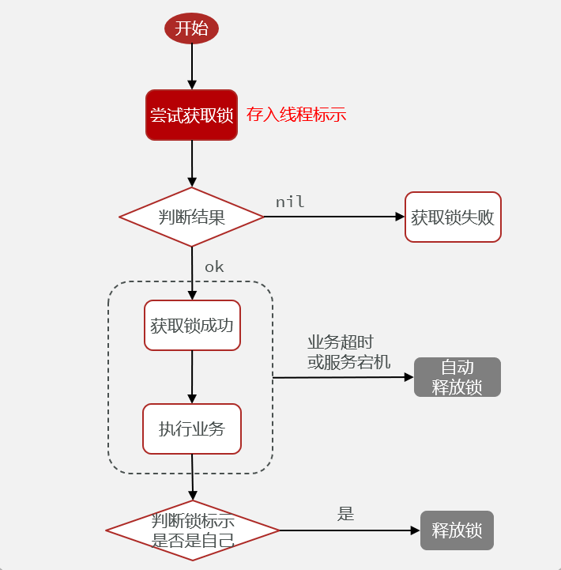

然而，即使这样修改之后，仍然可能会出现问题，原因在于**判断线程标识与释放锁这两步操作不具备原子性**。

比如线程1现在持有锁，在执行业务逻辑的过程中，线程1准备删除锁，并且已经执行完判断锁标识操作，结果为true。此时由于一些原因线程1发生了阻塞，其持有的锁被超时释放，线程2申请并拿到了锁。当线程1阻塞结束之后，它会直接执行删除锁的操作，即使现在是线程2持有锁，因为之前线程1已经通过条件判断了。这就是删锁时的原子性问题。

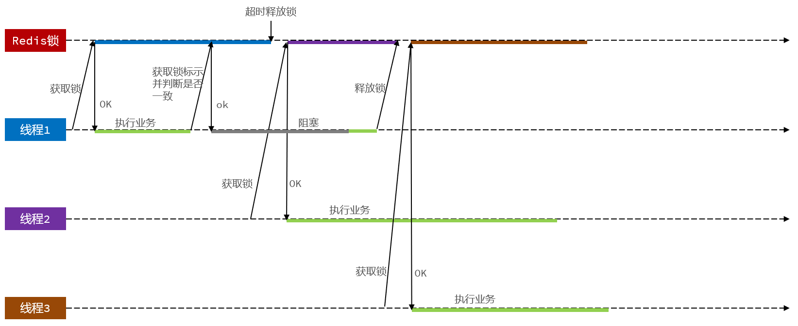

Redis中提供了Lua脚本功能，在一个脚本中编写多条Redis命令，确保多条命令执行的原子性。使用Lua脚本（unlock.lua）进行判断线程标识以及释放锁的代码如下：

```lua
-- KEYS[1]表示redis中的存储的线程标识，ARGV[1]表示当前线程的线程标识
-- 比较线程标识与锁中的标识是否一致，只有当一致时，才可以删除锁
if(redis.call('get', KEYS[1]) == ARGV[1]) then
    -- 释放锁 del key
    -- 成功删除锁，返回1
    return redis.call('del', KEYS[1])
end
-- 失败，返回0
return 0
```

经过最终改进的Redis分布式锁代码如下：

```java
/**
 * 实现redis分布式锁
 */
public class SimpleRedisLock implements ILock{

    // 分布式锁的key就是利用定义好的前缀拼接上name形成的
    private final String name;
    private final StringRedisTemplate stringRedisTemplate;

    public SimpleRedisLock(String name, StringRedisTemplate stringRedisTemplate){
        this.name = name;
        this.stringRedisTemplate = stringRedisTemplate;
    }

    // 分布式锁key的前缀，只是为了让redis中的key看起来更清晰，没有其他作用
    private static final String KEY_PREFIX = "lock:";
    // 线程标识的前缀，使用uuid，可以区别集群中的其他机器
    private static final String ID_PREFIX = UUID.randomUUID().toString(true) + "-";
    // lua脚本对象，这里的泛型是lua脚本返回类型
    private static final DefaultRedisScript<Long> UNLOCK_SCRIPT;
    static {
        UNLOCK_SCRIPT = new DefaultRedisScript<>();
        // 设置lua脚本位置，接收一个Resource对象
        // 我们可以使用spring中的ClassPath，默认在classpath路径下进行查找
        UNLOCK_SCRIPT.setLocation(new ClassPathResource("unlock.lua"));
        // 设置lua脚本返回类型
        UNLOCK_SCRIPT.setResultType(Long.class);
    }

    /**
     * 尝试获取锁
     * @param timeoutSec 锁持有的超时时间，过期后自动释放
     * @return true代表获取锁成功，false代表获取锁失败
     */
    @Override
    public boolean tryLock(long timeoutSec) {
        // 生成线程标识，使用uuid拼接线程id作为标识
        String threadId = ID_PREFIX + Thread.currentThread().getId();
        // 获取锁，使用前缀拼接上用户自定义的name作为key，使用线程标识作为value
        Boolean success = stringRedisTemplate.opsForValue()
                .setIfAbsent(KEY_PREFIX + name, threadId, timeoutSec, TimeUnit.SECONDS);
        // 由于我们得到的success是Boolean包装类对象，而返回值要的是boolean基本数据类型，
        // 由包装类自动拆箱到基本数据类型可能会发生空指针异常，所以最好采用下面这种用法
        // 之前使用的hutool下面的BooleanUtil.isTrue底层源码其实就是这个
        return Boolean.TRUE.equals(success);
    }

    /**
     * 释放锁
     * 为了防止锁的误删，我们在value中存储了当前线程的唯一标识：uuid-线程id
     * 每次释放锁之前，需要先判断redis中存储的锁标识是否与当前线程的标识相一致
     * 如果一致，则进行删除；不一致，则不进行处理
     * 另外，为了保证这判断与删除这两步操作的原子性，我们采用lua脚本执行这两步操作
     */
    @Override
    public void unlock() {
        // 调用lua脚本
        // 这里的几个参数分别为lua脚本对象、key参数列表（即KEYS数组中的参数）、其他参数（即ARGV中的参数）
        stringRedisTemplate.execute(
                UNLOCK_SCRIPT,
                Collections.singletonList(KEY_PREFIX + name),
                ID_PREFIX + Thread.currentThread().getId()
        );
    }
}
```

在有了分布式锁之后，之前的`createVoucherOrder`代码修改如下：

```java
/**
 * 创建秒杀订单并保存，实现一人一单
 * 由于synchronized是jvm提供的，每个jvm之间的锁都是独立的，因此无法应对集群情况下的线程安全问题
 * 这里我们使用redis分布式锁来解决集群下的线程安全问题
 * @param voucherId 秒杀优惠券id
 * @return 订单id
 */
@Transactional
public Result createVoucherOrder(Long voucherId) {
    Long userId = UserHolder.getUser().getId();

    SimpleRedisLock redisLock = new SimpleRedisLock("order:" + userId, stringRedisTemplate);
    boolean isLock = redisLock.tryLock(1000);
    if(!isLock) {
        return Result.fail("不允许重复下单！");
    }

    try {
        // 5.1 查询订单
        int count = query().eq("user_id", userId).eq("voucher_id", voucherId).count();
        // 5.2 判断是否存在
        if(count > 0) {
            // 用户已经购买过了
            return Result.fail("用户已经购买过一次！");
        }

        // 乐观锁解决超卖问题，扣减库存情况比较特殊，在sql上加一个判断stock>0的判断条件即可
        // set stock = stock - 1 where id = ? and stock > 0
        // 6.扣减库存
        boolean success = seckillVoucherService.update()
                .setSql("stock = stock - 1")
                .eq("voucher_id", voucherId)
                .gt("stock", 0).update();
        if(!success) {
            // 扣减失败
            return Result.fail("库存不足！");
        }
        // 7.创建订单
        VoucherOrder voucherOrder = new VoucherOrder();
        // 7.1 订单id，这里使用全局唯一id
        long orderId = redisIdWorker.nextId("order");
        voucherOrder.setId(orderId);
        // 7.2 用户id
        voucherOrder.setUserId(userId);
        // 7.3 代金券id
        voucherOrder.setVoucherId(voucherId);

        save(voucherOrder);

        // 7.返回订单id
        return Result.ok(orderId);
    } finally {
        redisLock.unlock();
    }
}
```

到这里，我们基本上完成了分布式锁的实现，主要有以下几点：

- 添加超时时间，防止死锁问题的发生
- 添加线程标识，通过判断线程标识是否是当前线程标识来决定是否释放锁，从而避免锁的误删
- 使用Lua脚本保证判断线程标识与释放锁这两步操作的原子性

### 4.4.5 分布式锁-Redisson

我们自己实现的锁还存在以下的问题：

- 不可重入：同一个线程无法多次获取同一把锁
- 不可重试：获取锁只尝试一次就返回false，没有重试机制
- 超时释放：锁超时释放虽然可以避免死锁，但如果是业务执行耗时较长，也会导致锁释放，存在安全隐患
- 主从一致性：如果redis中使用了主从集群，由于主从同步存在延迟，当主结点宕机时，其中的锁信息未同步到从结点中，则新的主结点（从结点推举而来）中是不存在锁信息的，其他线程仍然可以获得锁，这就出现了多个线程获得锁的情况

这里面我感觉最严重的是第三点，如果业务执行时间较长，锁超时被释放掉，有可能会导致十分严重的安全隐患。

Redisson实现的分布式锁则不具备上述缺点。关于超时释放，Redisson实现的分布式锁中利用watchDog，每隔一段时间（releaseTime / 3），重置超时时间。关于Redisson的细节，这里就不再进行讲解。

使用Redisson提供的分布式锁的`createVoucherOrder`代码如下：

```java
/**
 * 创建秒杀订单并保存，实现一人一单
 * 使用Redisson提供的分布式锁
 * @param voucherId 秒杀优惠券id
 * @return 订单id
 */
@Transactional
public Result createVoucherOrder(Long voucherId){
    Long userId = UserHolder.getUser().getId();

    // 创建锁对象，传入参数为锁的名称，即redis中key的名称
    RLock redisLock = redissonClient.getLock("lock:order:" + userId);
    // 尝试获取锁，这里的tryLock可以传递三个参数，分别是
    // 最大等待时间，即在这个时间内，如果获取不到锁，会在合适的时机进行重试；
    // 锁自动释放时间，防止服务宕机导致锁得不到释放，指定该参数将不会启动watchdog
    // 时间单位TimeUnit
    // boolean isLock = redisLock.tryLock(1, 10, TimeUnit.SECONDS);
    // 空参表示不进行重试，且锁的最大释放时间为30秒，并且使用watchdog自动续约，每过10秒重新续约30秒
    // 当释放锁之后，watchdog会被取消，或者当服务器宕机之后，watchdog也不会再执行
    boolean isLock = redisLock.tryLock();
    // 判断
    if(!isLock) {
        // 获取锁失败，直接返回失败
        return Result.fail("不允许重复下单！");
    }

    try {
        // 5.1 查询订单
        int count = query().eq("user_id", userId).eq("voucher_id", voucherId).count();
        // 5.2 判断是否存在
        if(count > 0) {
            // 用户已经购买过了
            return Result.fail("用户已经购买过一次！");
        }

        // 乐观锁解决超卖问题，扣减库存情况比较特殊，在sql上加一个判断stock>0的判断条件即可
        // set stock = stock - 1 where id = ? and stock > 0
        // 6.扣减库存
        boolean success = seckillVoucherService.update()
                .setSql("stock = stock - 1")
                .eq("voucher_id", voucherId)
                .gt("stock", 0).update();
        if(!success) {
            // 扣减失败
            return Result.fail("库存不足！");
        }
        // 7.创建订单
        VoucherOrder voucherOrder = new VoucherOrder();
        // 7.1 订单id，这里使用全局唯一id
        long orderId = redisIdWorker.nextId("order");
        voucherOrder.setId(orderId);
        // 7.2 用户id
        voucherOrder.setUserId(userId);
        // 7.3 代金券id
        voucherOrder.setVoucherId(voucherId);

        save(voucherOrder);

        // 7.返回订单id
        return Result.ok(orderId);
    } finally {
        redisLock.unlock();
    }
}
```

## 4.5 秒杀优化

### 4.5.1 秒杀优化思路

我们的下单操作，大致可以分为以下几个步骤：

1. 查询优惠券
2. 判断秒杀库存是否足够
3. 查询订单
4. 校验是否是一人一单
5. 扣减库存
6. 创建订单

其中1、3、5,、6都是要操作数据库的，并且1、3操作数据库只是为了后续的判断以及校验做准备。这样一来，所有的下单请求都会打到数据库，不管该请求最终能不能成功下单，这会给数据库带来极大的压力，而且由于有关数据库的操作都比较慢，拖慢了程序的整体执行时间。那么我们应该怎么优化呢？

我们其实可以将资格校验放到redis中做，比如是否在秒杀时间内、库存是否足够、是否一人一单等等。然后再将这些通过资格校验的请求放到数据库，进行扣减库存以及创建订单操作。另外，由于通过资格校验之后，意味着我们肯定是能够成功下单的，因此我们可以向用户返回成功以缩短响应时间，然后再异步进行下单操作。

到这其实是有个问题的，既然是异步执行下单操作，那么我们怎么知道什么时候下单成功呢？我们可以在redis中完成资格校验之后，将订单id返回给前端，前端可以使用该订单id对后端进行轮询（时间间隔不要太短），来查看订单是否已成功创建。


**整体思路**：当用户下单之后，判断库存是否充足只需要到redis中查找相应的key，然后判断该key对于的value是否大于0即可。如果不充足，则直接结束，如果充足，则查询set集合判断该用户是否已经下单，如果set集合中没有该用户id，说明可以下单，将该用户id存入set集合中，并将用户id和优惠券id以及订单id存入消息队列中。整个过程需要保证是原子性的，我们可以使用lua脚本来操作。

其中，redis中的key是对应业务前缀拼上优惠券id组成，set集合中存储的是已经下过单的用户的id。


### 4.5.2 Redis消息队列

消息队列字面意思就是存放消息的队列，最简单的消息队列模型包括3个角色：

- 消息队列：存储和管理消息，也被称为消息代理（Message Broker）
- 生产者：发送消息和消息队列
- 消费者：从消息队列获取消息并处理消息

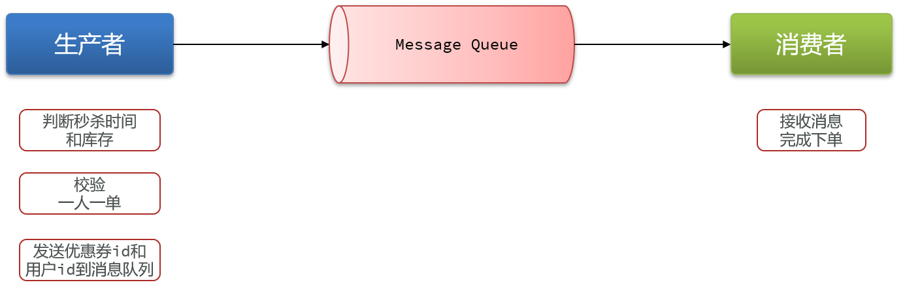

使用队列的好处在于**解耦**。在我们的秒杀场景中，我们利用redis去校验下单条件，再通过队列把消息发送出去，然后再启动一个线程去消费这个消息，完成解耦，同时也加快我们的响应速度。

由于这门课的主要目的是学习redis，所以这里我们使用redis本身的消息队列。Redis提供了三种不同的方式来实现消息队列：

- List结构：基于List结构模拟消息队列
- PubSub：基本的点对点消息模型
- Stream：比较完善的消息队列模型

我们使用Stream并结合其中的消费者组读取消息来作为消息队列的实现，另外两个这里就不再多介绍了。Stream中的消费者组（Consumer Group）将多个消费者划分到一个组中，监听同一个队列，具备下列特点：

- **消息分流**：队列中的消息会分流给组内的不同消费者，而不是重复消费，从而加快消息处理的速度。也就是说同一个消费者组内的消费者是竞争关系，当有一个消费者消费了消息之后，组内的其他消费者无法再消费该消息。
- **消息标识**：消费者组会维护一个标识，记录最后一个被处理的消息，哪怕消费者宕机重启，还会从标识之后读取消息，确保每一个消息都会被消费。
- **消息确认**：消费者获取消息后，消息处理pending状态，并存入一个pending-list，当处理完成后需要通过XACK来确认消息，标记消息为已处理，此时消息才会从pending-list中移除。

Stream中的消息队列以及消费者组的基本操作如下：

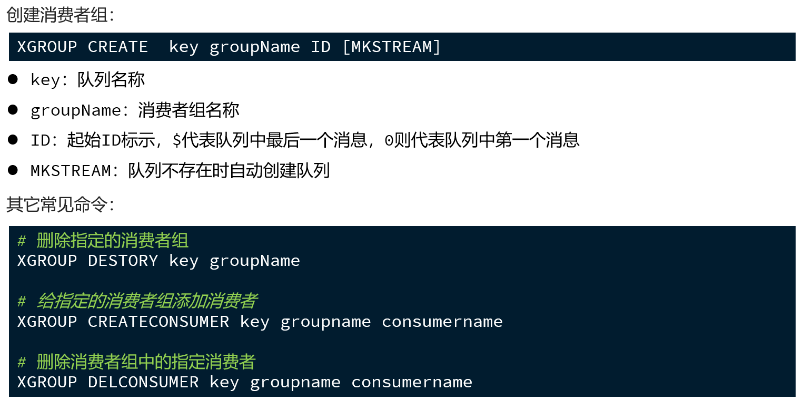


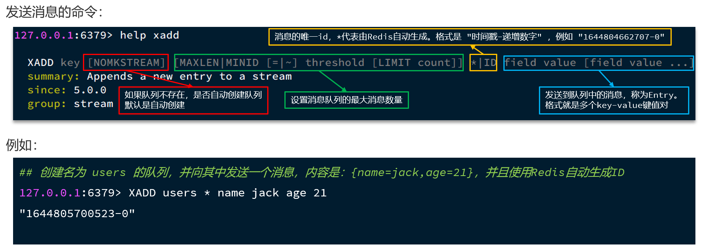

### 4.5.3 代码实现

需求：

- 创建一个Stream类型的消息队列，名为stream.orders
- 创建秒杀下单的Lua脚本，在认定有抢购资格后，直接向stream.orders中添加消息，内容包含voucherId、userId、orderId
- 项目启动时，开启一个线程任务，尝试获取stream.orders中的消息，完成下单

消息队列直接使用命令在redis中创建即可。

Lua脚本内容如下：

```lua
-- 1.参数列表
-- 1.1 优惠券id
local voucherId = ARGV[1]
-- 1.2 用户id
local userId = ARGV[2]
-- 1.3 订单id
local orderId = ARGV[3]

-- 2.数据key
-- 2.1 库存key，其中存储着优惠券的剩余库存。lua中..表示字符串拼接
local stockKey = 'seckill:stock:' .. voucherId
-- 2.2 订单key，set类型。如果set中存储了用户id，说明该用户已下单；否则，说明该用户未下单
-- 可以通过判断其中是否存在某用户的id来判断该用户是否已下单该优惠券，进而实现一人一单功能
local orderKey = 'seckill:order:' .. voucherId

-- 3.脚本业务
-- 3.1 判断库存是否充足 get stockKey
-- tonumber是lua中的一个函数，将字符串转化为数字
if(tonumber(redis.call('get', stockKey)) <= 0) then
    -- 库存不足，返回1
    return 1
end
-- 3.2 判断用户是否下单 sismember orderKey userId
if(redis.call('sismember', orderKey, userId) == 1) then
    -- 存在，说明是重复下单，返回2
    return 2
end
-- 3.3 redis预减库存 incrby stockKey -1
redis.call('incrby', stockKey, -1)
-- 3.4 下单（这里只是将用户redis中的set） sadd orderKey userId
redis.call('sadd', orderKey, userId)
-- 3.5 发送消息到队列中，之后消费者会从队列中接收消息，并根据消息内容创建订单，更新数据库
-- xadd stream.orders * k1 v1 k2 v2 ...
redis.call('xadd', 'stream.orders', '*', 'userId', userId, 'voucherId', voucherId, 'id', orderId)
-- 操作成功，返回0
return 0
```

`seckillVoucher`方法进行秒杀操作，该方法执行lua脚本进行资格判断，判断通过则将消息发送到消息队列中，实现异步下单；不通过则返回失败。代码如下：

```java
// lua脚本对象
private static final DefaultRedisScript<Long> SECKILL_SCRIPT;
static {
    SECKILL_SCRIPT = new DefaultRedisScript<>();
    SECKILL_SCRIPT.setLocation(new ClassPathResource("seckill.lua"));
    SECKILL_SCRIPT.setResultType(Long.class);
}

/**
 * 实现秒杀下单，采用消息队列进行异步下单。这里使用redis中的stream实现消息队列。
 * 下单前要进行秒杀资格判断：
 *      * 库存是否充足，不足则无法下单
 *      * 用户是否已经购买过该商品，如果购买过，则不允许下单
 * 不过这里没有进行秒杀是否开始或结束的判断，可以将秒杀开始与结束时间放到redis中，然后进行判断
 * @param voucherId 秒杀优惠券id
 * @return 订单id
 */
@Override
public Result seckillVoucher(Long voucherId) {
    Long userId = UserHolder.getUser().getId();
    Long orderId = redisIdWorker.nextId("order");
    // 1.执行lua脚本，lua脚本中实现了购买资格判断以及下单后将消息发送到消息队列中的操作
    Long result = stringRedisTemplate.execute(
            SECKILL_SCRIPT,
            Collections.emptyList(),
            voucherId.toString(), userId.toString(), orderId.toString()
    );
    int r = result.intValue();
    // 2.判断结果是否为0
    if(r != 0) {
        // 2.1 不为0，表示没有购买资格
        return Result.fail(r == 1 ? "库存不足" : "不能重复下单");
    }
    // 3.返回订单id
    return Result.ok(orderId);
}
```

消费者相关代码，在项目启动时，就会开启线程对消息队列中的消息进行消费，并根据消息中的相关信息进行扣减库存和下单。

```java
private static final ExecutorService SECKILL_ORDER_EXECUTOR = Executors.newSingleThreadExecutor();

/**
 * 该注解功能：当依赖注入完成后用于执行初始化的方法，并且只会被执行一次
 * 执行顺序：
 * Constructor(构造方法) -> @Autowired(依赖注入) -> @PostConstruct(注释的初始化方法)
 * 在依赖注入完成后，提交消费者任务，监听消息队列中是否有新的未被消费的消息
 * 如果有，则取出该消息进行处理（生成订单，将订单写入到数据库）
 */
@PostConstruct
private void init() {
    SECKILL_ORDER_EXECUTOR.submit(new VoucherOrderHandler());
}

private class VoucherOrderHandler implements Runnable {

    @Override
    public void run() {
        String queueName = "stream.orders";
        while(true) {
            try {
                // 1.获取消息队列中的订单信息 XREADGROUP GROUP g1 c1 COUNT 1 BLOCK 2000 STREAMS stream.orders >
                List<MapRecord<String, Object, Object>> list = stringRedisTemplate.opsForStream().read(
                        // 指定组名和消费者名称
                        Consumer.from("g1", "c1"),
                        // 指定一些可选的命令，这里相当于指定COUNT 1 BLOCK 2000
                        StreamReadOptions.empty().count(1).block(Duration.ofSeconds(2)),
                        // 指定队列名以及从队列的哪里开始读取，这里是从最新的未被消费的位置读取，即>
                        StreamOffset.create(queueName, ReadOffset.lastConsumed())
                );
                // 2.判断订单信息是否为空
                if(list == null || list.isEmpty()) {
                    // 如果为null，说明没有消息，继续下一次循环
                    continue;
                }
                // 3.解析数据
                // 由于查询时指定count为1，所以这里我们确定只有一条数据，直接get(0)即可
                MapRecord<String, Object, Object> record = list.get(0);
                // 通过getValue获得我们存进去的键值对
                Map<Object, Object> value = record.getValue();
                VoucherOrder voucherOrder = BeanUtil.fillBeanWithMap(value, new VoucherOrder(), true);
                // 4.将订单信息写入到数据库
                createVoucherOrder(voucherOrder);
                // 5.确认消息 xack stream.orders g1 id
                // 由于有确认机制，如果在redis预减缓存之后，数据库中的更新没有成功，消息是不会被确认的
                // 程序会继续对未被确认的消息的进行处理，直到数据库更新成功，消息被确认为止
                stringRedisTemplate.opsForStream().acknowledge(queueName, "g1", record.getId());
            } catch(Exception e) {
                log.error("处理订单异常", e);
                // 发生异常，对那些已接收但未确认的消息进行处理
                handlePendingList();
            }
        }
    }

    private void handlePendingList() {
        String queueName = "stream.orders";
        while(true) {
            try {
                // 1.获取pending-list中的订单信息 XREADGROUP GROUP g1 c1 COUNT 1 BLOCK 2000 STREAMS stream.orders 0
                List<MapRecord<String, Object, Object>> list = stringRedisTemplate.opsForStream().read(
                        // 指定组名和消费者名称
                        Consumer.from("g1", "c1"),
                        // 指定一些可选的命令，这里相当于指定COUNT 1
                        StreamReadOptions.empty().count(1),
                        // 指定队列名以及从队列的哪里开始读取，这里是从pending-list的第一条消息读取，即0
                        StreamOffset.create(queueName, ReadOffset.from("0"))
                );
                // 2.判断订单信息是否为空
                if(list == null || list.isEmpty()) {
                    // 如果为null，说明没有异常消息，结束循环
                    break;
                }
                // 3.解析数据
                // 由于查询时指定count为1，所以这里我们确定只有一条数据，直接get(0)即可
                MapRecord<String, Object, Object> record = list.get(0);
                // 通过getValue获得我们存进去的键值对
                Map<Object, Object> value = record.getValue();
                VoucherOrder voucherOrder = BeanUtil.fillBeanWithMap(value, new VoucherOrder(), true);
                // 4.将订单信息写入到数据库
                createVoucherOrder(voucherOrder);
                // 5.确认消息 xack stream.orders g1 id
                stringRedisTemplate.opsForStream().acknowledge(queueName, "g1", record.getId());
            } catch(Exception e) {
                log.error("处理订单异常", e);
            }
        }
    }
}

/**
 * 保存秒杀订单到数据库
 * 使用Redisson提供的分布式锁，这里其实不加锁也没什么问题，因为前面已经做过判断了
 * 按理来说由于我们之前在redis中做了判断，所以这里的判断应该是都可以通过的
 * 不过还是留着当做一个兜底方案吧
 * @param voucherOrder 秒杀订单
 */
@Transactional
public void createVoucherOrder(VoucherOrder voucherOrder){
    Long userId = voucherOrder.getUserId();
    Long voucherId = voucherOrder.getVoucherId();

    // 创建锁对象，传入参数为锁的名称，即redis中key的名称
    RLock redisLock = redissonClient.getLock("lock:order:" + userId);
    // 尝试获取锁，这里的tryLock可以传递三个参数，分别是
    // 最大等待时间，即在这个时间内，如果获取不到锁，会在合适的时机进行重试；
    // 锁自动释放时间，防止服务宕机导致锁得不到释放，指定该参数将不会启动watchdog
    // 时间单位TimeUnit
    // boolean isLock = redisLock.tryLock(1, 10, TimeUnit.SECONDS);
    // 空参表示不进行重试，且锁的最大释放时间为30秒，并且使用watchdog自动续约，每过10秒重新续约30秒
    // 当释放锁之后，watchdog会被取消，或者当服务器宕机之后，watchdog也不会再执行
    boolean isLock = redisLock.tryLock();
    // 判断
    if(!isLock) {
        // 获取锁失败，直接返回失败
        log.error("不允许重复下单！");
        return;
    }

    try {
        // 5.1 查询订单
        int count = query().eq("user_id", userId).eq("voucher_id", voucherId).count();
        // 5.2 判断是否存在
        if(count > 0) {
            // 用户已经购买过了
            log.error("用户已经购买过一次！");
            return;
        }

        // 使用数据库的互斥锁解决超卖问题，在sql上加一个判断stock>0的判断条件即可
        // set stock = stock - 1 where id = ? and stock > 0
        // 6.扣减库存
        boolean success = seckillVoucherService.update()
                .setSql("stock = stock - 1")
                .eq("voucher_id", voucherId)
                .gt("stock", 0).update();
        if(!success) {
            // 扣减失败
            log.error("库存不足！");
            return;
        }
        // 7.保存订单
        save(voucherOrder);
    } finally {
        // 释放锁
        redisLock.unlock();
    }
}
```

## 4.6 总结

到这，我们的优惠券秒杀功能就实现的差不多了，其他的一些功能比如说隐藏秒杀接口、限流等这里就不再实现了。下面总结一下秒杀这一部分的内容。

### 超卖问题是怎么解决的？

超卖问题产生的原因本质上是无法保证判断库存是否大于0以及扣减库存这两步操作的原子性。所以要解决这一问题只需要保证这两步操作的原子性即可。

一种是通过加分布式锁的方式来保证上述两步操作的原子性。

另外一种方法是，除了在代码中判断库存是否大于0外，我们可以在扣减库存的sql语句中加上一个判断，也就是使用下面的sql语句实现扣减库存。

```sql
set stock = stock - 1 where id = ? and stock > 0
```

这种方法实际上是利用了数据库中的写锁来保证判断库存是否大于0以及扣减库存这两步操作的原子性。我们的代码中就是使用的这种方式。但是这种方式有一个问题，不管能不能成功下单，请求都会去访问数据库，给数据库带来了极大的压力。

我们的思路是使得尽可能少的请求到达数据库，只放那些能够成功下单的请求到达数据库。因此在redis中进行预减库存，当redis中库存大于0时，则将该请求对应的用户id、优惠券id以及订单id存入消息队列中；当redis中库存小于0，则返回失败。这样就使得大量的请求被拦截到数据库之外。另外，由于redis中使用Lua脚本可以保证原子性，也就不会出现超卖问题。不过，我们可以在扣减库存中的sql添加上库存是否大于0的判断来进行兜底。

总的来说，我们利用redis的Lua脚本来保证判断redis中库存是否大于0以及扣减库存这两步操作的原子性，并且在数据库扣减库存的sql中添加库存是否大于0的判断进行兜底，以此来解决超卖问题。

# 5 好友关注

## 5.1 关注和取消关注

关注是`User`之间的关系，是博主与粉丝之间的关系，数据库中有一张`tb_follow`表存储这一关系。


基于该表结构，实现两个接口：

- 关注和取关功能接口
- 判断是否关注功能的接口

`FollowController`中对应代码如下：

```java
/**
 * 关注功能
 * @param followUserId 关注用户id
 * @param isFollow true表示进行关注；false表示已关注，进行取关
 */
@PutMapping("/{id}/{isFollow}")
public Result follow(@PathVariable("id") Long followUserId, @PathVariable("isFollow") Boolean isFollow) {
    return followService.follow(followUserId, isFollow);
}

/**
 * 当前用户是否关注了id为followUserId的用户
 * @param followUserId 目标用户id
 * @return 已关注，返回true；未关注，返回false
 */
@GetMapping("/or/not/{id}")
public Result isFollow(@PathVariable("id") Long followUserId){
    return followService.isFollow(followUserId);
}
```

`FollowService`中的对应实现如下：

```java
/**
 * 关注功能
 * @param followUserId 关注用户id
 * @param isFollow true表示进行关注；false表示已关注，进行取关
 */
@Override
public Result follow(Long followUserId, Boolean isFollow) {
    // 1.获取登录用户id
    Long userId = UserHolder.getUser().getId();
    String key = FOLLOW_KEY + userId;
    // 2.判断到底是关注还是取关
    if(BooleanUtil.isTrue(isFollow)) {
        // 3.关注，新增数据
        Follow follow = new Follow();
        follow.setUserId(userId);
        follow.setFollowUserId(followUserId);
        boolean isSuccess = save(follow);
        if(isSuccess) {
            // 把关注用户的id，放入redis的set集合，sadd userId followUserId
            // 这里放到set集合主要的作用是后续进行共同关注操作
            stringRedisTemplate.opsForSet().add(key, followUserId.toString());
        }
    }
    else {
        // 4.取关，删除数据 delete from tb_follow where user_id = ? and follow_user_id = ?
        boolean isSuccess = remove(new QueryWrapper<Follow>()
                .eq("user_id", userId).eq("follow_user_id", followUserId));
        if(isSuccess) {
            // 把关注用户的id从Redis集合中移除
            stringRedisTemplate.opsForSet().remove(key, followUserId.toString());
        }
    }
    return Result.ok();
}

/**
 * 当前用户是否关注了id为followUserId的用户
 * @param followUserId 目标用户id
 * @return 已关注，返回true；未关注，返回false
 */
@Override
public Result isFollow(Long followUserId) {
    // 1.获取登录用户id
    Long userId = UserHolder.getUser().getId();
    // 2.查询是否关注 select count(*) form tb_follow where user_id = ? and follow_user_id = ?
    Integer count = query().eq("user_id", userId).eq("follow_user_id", followUserId).count();
    // 3.判断
    return Result.ok(count > 0);
}
```

## 5.2 共同关注

共同关注这一功能可以使用Redis中的set集合来实现，我们可以将用户的关注的人分别放入到不同的set集合中，然后再通过集合之间求交集的方式获取共同关注数据。

共同关注的代码如下：

```java
/**
 * 共同关注，使用redis中的set数据类型实现该功能
 * @param id 目标用户id
 * @return 共同关注用户列表
 */
@Override
public Result followCommons(Long id) {
    // 1.获取当前用户id
    Long userId = UserHolder.getUser().getId();
    String key1 = FOLLOW_KEY + userId;
    // 2.求交集
    String key2 = FOLLOW_KEY + id;
    Set<String> intersect = stringRedisTemplate.opsForSet().intersect(key1, key2);
    if(intersect == null || intersect.isEmpty()) {
        // 无交集
        return Result.ok(Collections.emptyList());
    }
    // 3.解析id集合
    List<Long> ids = intersect.stream().map(Long::valueOf).collect(Collectors.toList());
    // 4.查询用户
    List<UserDTO> users = userService.listByIds(ids)
            .stream()
            .map(user -> BeanUtil.copyProperties(user, UserDTO.class))
            .collect(Collectors.toList());
    return Result.ok(users);
}
```

## 5.3 Feed流

当我们关注了用户后，这个用户发了动态，那么我们应该把这些数据推送给用户，这种关注推送其实就是一种Feed流，直译为投喂。为用户持续的提供”沉浸式“的体验，通过无限下拉刷新获取新的信息。

传统模式的内容解锁，需要用户通过搜索引擎或者是其他方式去解锁想看的内容。


而对于Feed流，不需要用户再去查找信息，而是系统分析用户到底想要什么，然后直接把内容推送给用户，从而使用户能够更加的节约时间，不用主动去寻找。

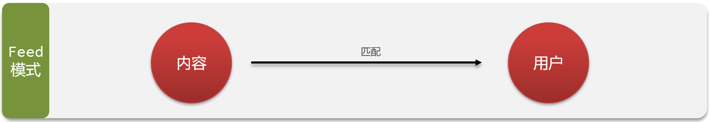

Feed流有两种常见模式：

- **Timeline**：不做内容筛选，简单的按照内容发布时间排序，常用于好友或关注。例如朋友圈，微博关注等。
  - 优点：信息全面，不会有缺失。并且实现也相对简单
  - 缺点：信息噪音较多，用户不一定感兴趣，内容获取效率低
- **智能排序**：利用智能算法屏蔽掉违规的、用户不感兴趣的内容。推送用户感兴趣信息来吸引用户
  - 优点：投喂用户感兴趣信息，用户粘度很高，容易沉迷
  - 缺点：如果算法不精准，可能起到反作用

本项目是基于关注的用户来做Feed流，因此采用Timeline模式。该模式的实现方式有三种：

- 拉模式
- 推模式
- 推拉结合

下面对这几种模式一一进行介绍。

### 5.3.1 拉模式

拉模式也叫读扩散，这应该是最符合我们自觉的一种实现方式。如下图：

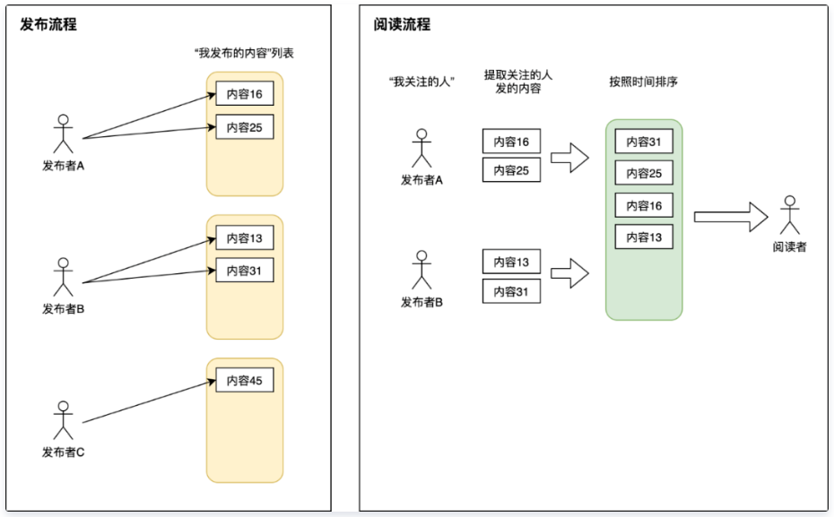

每一个内容发布者都要一个自己的发件箱（“我发布的内容”），每当我们发出一个新帖子时，都会存入自己的发件箱中。当我们的粉丝来阅读自己的收件箱时，系统首先需要拿到粉丝关注的所有人，然后遍历所有发布者的发件箱，取出他们所发布的帖子，然后依据发布时间排序，展示给阅读者。

这种设计，阅读者读一次Feed流，后台会扩散为N次读操作（N等于关注的人数）以及一次聚合操作，因此称为读扩散。每次读Feed流相当于去关注者的收件箱主动拉取帖子，因此也得名拉模式。

这种模式的好处是底层存储简单，没有空间浪费。坏处是每次读操作会非常重。如果我关注的人非常多，遍历一遍我关注的所有人，并且再聚合一次，系统开销会非常大，时延上可能达到无法忍受的地步。因此读扩散主要适用于系统中阅读者关注的人没那么多，并且刷Feed流并不频繁的场景。

### 5.3.2 推模式

大多数Feed流产品的读写比大概在100:1，读多写少。那么拉模式这种很重的读逻辑并不适合大多数场景，因此就有了推模式。如下图：

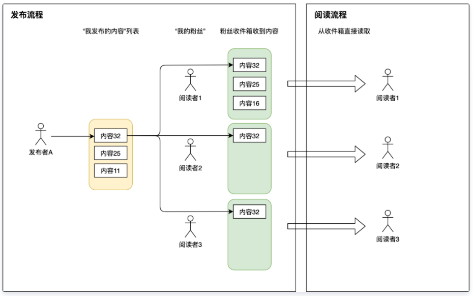

当发布者发表一篇帖子的时候，除了往自己的发件箱记录一下外，还会遍历发布者的所有粉丝，往这些粉丝的收件箱也投放一份相同的内容。这样阅读者来读时，直接从自己的收件箱读取即可。

这种设计，每次发表帖子，都会扩散为M次写操作（M等于自己的粉丝数），因此称为写扩散。每篇帖子都会主动推送到所有粉丝的收件箱，因此也得名推模式。

但是这种推模式并不适用于具有大量粉丝的大v的平台，假设现在有一个粉丝量上亿的大v，那么每次这个大v发一条帖子，就会导致后台的上亿次写操作，这显然是不可行的。通常推模式只适用于粉丝量不大的情况。

### 5.3.3 推拉结合模式

推拉结合也可以称作读写混合，这种方式兼具推模式和拉模式的优点。我们首先来总结一下读扩散和写扩散的优缺点：

|        | 优点                     | 缺点                                                | 适用场景                                                    |
| :----- | :----------------------- | :-------------------------------------------------- | :---------------------------------------------------------- |
| 读扩散 | 节约存储空间发帖操作简单 | 读帖操作复杂，关注人数多时是灾难                    | 用户不活跃，很少读帖，有粉丝量多的大V，但每个粉丝关注的人少 |
| 写扩散 | 读帖操作简单             | 发帖操作复杂，浪费存储空间，有粉丝量多的大V时是灾难 | 用户非常活跃，经常刷帖，无大V，用户粉丝量都比较少           |

不难发现推模式与拉模式的适用场景是互补的，因此我们可以区分一下场景，在不同场景下选择最合适的方案，这就出现了推拉集合模式。如下图：

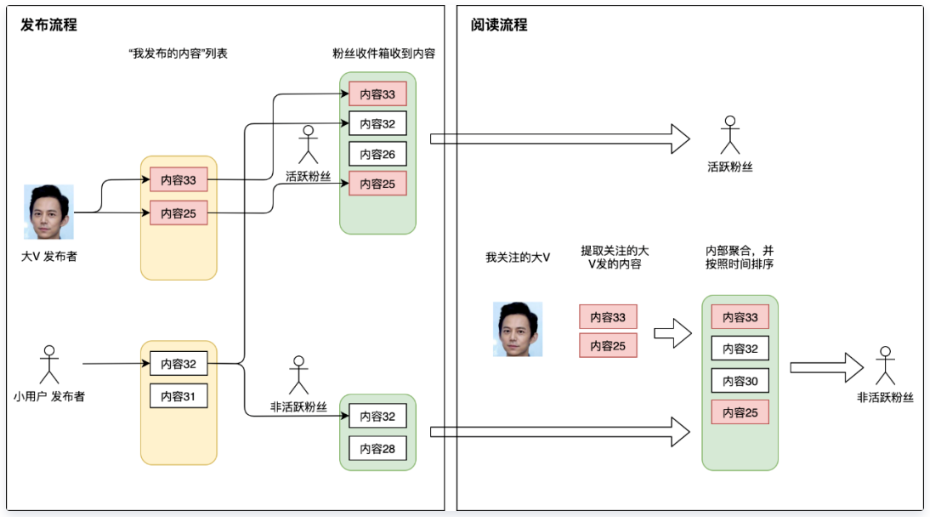

站在内容发布者这一边，当大V发帖时，将帖子写入到大V的收件箱，然后找到大V的活跃粉丝，将帖子写入到他们的收件箱。当一个粉丝量很小的普通用户发帖时，直接采用推模式，遍历他的所有粉丝并将帖子写入粉丝收件箱。

站在内容阅读者这一边，当活跃用户刷Feed流时，他直接从自己的收件箱读取帖子即可，保证了活跃用户的体验。当一个非活跃用户突然登录刷Feed流时，我们一方面需要读他的收件箱，另一方面需要遍历他所关注的大V用户发的收件箱提取帖子，并且做一下聚合展示。

推拉结合模式中，系统需要做两个判断，一个是哪些用户属于大V，另一个是哪些用户属于活跃粉丝。

### 5.3.4 Feed流实现

由于大众点评这种软件中很难出现粉丝量巨大的大V，因此本项目中的Feed流采用推模式实现。

需求：

- 在保存探店笔记到数据库的同时，推送到粉丝的收件箱
- 收件箱使用Redis中的SortedSet实现（推模式可以不使用发件箱）
- 查询收件箱数据时，分页查询

Feed流中的数据会不断更新，所以数据的角标也在变化，因此不能采用传统的分页模式。

**传统分页**。假设在t1时刻，我们去读取第一页，此时page=1，size=5，那么我们拿到的就是10-6这几条记录。假设现在t2时刻又发布了一条记录，t3时刻我们来读取第二页，读取第二页传入的参数是page=2，size=5，那么此时读取到的第二页实际上是从6开始，拿到的是6-2这几条记录。这样的话我们就读取到了重复的数据。所以Feed流的分页，不能采用这种传统方法。

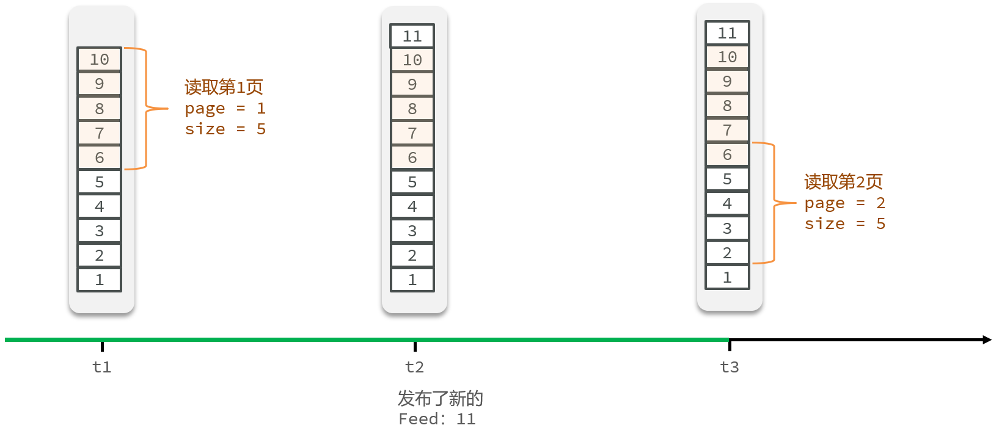

**Feed的滚动分页**：我们需要记录每次操作的最后一条数据的位置，然后从这个位置开始去读取数据。

举个例子，我们从t1时刻开始，读取第一页数据，拿到了10-6这几条记录，然后记录下当前最后一次获取的记录，也就是6。t2时刻发布了新的记录，也就是11。t3时刻来拿第二页数据，从6后面的5开始，拿到了5-1的这几条记录，并没有受到新插入数据的影响。

为了实现这一功能，我们使用redis中的SortedSet作为收件箱，当用户发布一条博客时，会将该博客的id推送到粉丝对应的SortedSet中。用户发布博客的代码如下：

```java
/**
 * 发布博客，在保存blog到数据库的同时，推送到粉丝的收件箱（推模式）
 * 收件箱要满足根据时间戳排序，使用redis的SortedSet实现
 * @param blog 博客对象
 */
@Override
public Result saveBlog(Blog blog) {
    // 1.获取登录用户id
    UserDTO user = UserHolder.getUser();
    blog.setUserId(user.getId());
    // 2.保存探店博文
    boolean isSuccess = save(blog);
    if(!isSuccess) {
        return Result.fail("新增笔记失败！");
    }
    // 3.查询笔记作者的所有粉丝 select * from tb_follow where follow_user_id = ?
    List<Follow> follows = followService.query().eq("follow_user_id", user.getId()).list();
    // 4.推送笔记id给所有粉丝
    for (Follow follow : follows) {
        // 4.1 获取粉丝id
        Long fansId = follow.getUserId();
        // 4.2 推送
        String key = FEED_KEY + fansId;
        stringRedisTemplate.opsForZSet().add(key, blog.getId().toString(), System.currentTimeMillis());
    }
    // 5.返回id
    return Result.ok(blog.getId());
}
```

我们进行分页查询的具体操作如下：

- 每次查询完成后，我们要分析出查询出来数据的最小时间戳，这个值会作为下一次查询的条件
- 另外，由于最小时间戳中可能对应多条数据，因此我还要记录此次查询中最小时间戳对应的数据个数。下次查询时，跳过这些查询过的数据，拿到我们需要的数据

综上，我们的请求参数中需要携带以下两个参数：

- `lastId`：上一次查询的最小时间戳 

- `offset`：上一次查询中最小时间戳对应的记录个数

这两个参数第一次会由前端来指定，以后的查询就根据后台结果作为条件，再次传递到后台。

定义的返回值实体类`ScrollResult`如下：

```java
/**
 * 滚动分页返回的结果对象
 */
@Data
public class ScrollResult {
    // 小于指定时间戳的数据集合
    private List<?> list;
    // 本次查询的推送的最小时间戳
    private Long minTime;
    // 偏移量
    private Integer offset;
}
```

`BlogController`中对应的handler代码如下：

```java
/**
 * 滚动分页查询收件箱
 * @param max 上次查询的最小时间戳，也就是此次查询的最大时间戳，以该时间戳为起始score查询SortedSet收件箱
 * @param offset 偏移量，当上次查询中有多个score值为max的数据时，offset就是值为max的数据的个数。当offset为0时，表明是第一次进行查询
 * @return 博客列表
 */
@GetMapping("/of/follow")
public Result queryBlogOfFollow(
        @RequestParam("lastId") Long max, @RequestParam(value = "offset", defaultValue = "0") Integer offset) {
    return blogService.queryBlogOfFollow(max, offset);
}
```

`BlogServiceImpl`中对应的代码实现如下：

```java
/**
 * 滚动分页查询收件箱
 * @param max 上次查询的最小时间戳，也就是此次查询的最大时间戳，以该时间戳为起始score查询SortedSet收件箱
 * @param offset 偏移量，当上次查询中有多个score值为max的数据时，offset就是值为max的数据的个数
 * @return 博客列表
 */
@Override
public Result queryBlogOfFollow(Long max, Integer offset) {
    // 1.获取当前用户id
    Long userId = UserHolder.getUser().getId();
    // 2.查询收件箱 ZREVRANGEBYSCORE key max min LIMIT offset count
    // 按时间戳由大到小查询，由于时间戳作为score，而score越小，优先级越大，
    // 因此时间戳大的数据排在最后，所以我们要从后往前进行查询，每次查询2个数据
    String key = FEED_KEY + userId;
    Set<ZSetOperations.TypedTuple<String>> typedTuples = stringRedisTemplate.opsForZSet()
            .reverseRangeByScoreWithScores(key, 0, max, offset, 2);
    // 3.非空判断
    if(typedTuples == null || typedTuples.isEmpty()) {
        return Result.ok();
    }
    // 4.解析数据，blogId、minTime（本次查询的最小时间戳）、newOffset（下次查询的offset）
    List<Long> ids = new ArrayList<>(typedTuples.size());
    long minTime = 0;
    int newOffset = 1;
    for (ZSetOperations.TypedTuple<String> tuple : typedTuples) {
        // 4.1 获取id
        ids.add(Long.valueOf(tuple.getValue()));
        // 4.2 获取score（时间戳）
        long time = tuple.getScore().longValue();
        // 4.3 计算newOffset，newOffset的值为此次查询中score值为minTime的个数
        if(time == minTime) {
            newOffset++;
        }
        else {
            minTime = time;
            newOffset = 1;
        }
    }
    // 5.根据id查询blog
    String idStr = StrUtil.join(",", ids);
    // 这里是为了保证在数据库中查询出数据顺序与之前在redis中查询的保持一致
    List<Blog> blogs = query().in("id", ids).last("ORDER BY FIELD(id," + idStr + ")").list();
    for(Blog blog : blogs) {
        // 5.1 查询blog有关的用户
        queryBlogUser(blog);
        // 5.2 查询blog是否被点赞
        isBlogLiked(blog);
    }
    // 6.封装并返回
    ScrollResult r = new ScrollResult();
    r.setList(blogs);
    r.setOffset(newOffset);
    r.setMinTime(minTime);

    return Result.ok(r);
}
```

# 6 问题总结

## 6.1 你在项目中遇到了哪些问题？

### 6.1.1 推模式下Feed流的分页问题

需求：

- 在保存探店笔记到数据库的同时，推送到粉丝的收件箱
- 收件箱使用Redis中的SortedSet实现（推模式可以不使用发件箱）
- 查询收件箱数据时，分页查询

Feed流中的数据会不断更新，所以数据的角标也在变化，因此不能采用传统的分页模式。

**传统分页**。假设在t1时刻，我们去读取第一页，此时page=1，size=5，那么我们拿到的就是10-6这几条记录。假设现在t2时刻又发布了一条记录，t3时刻我们来读取第二页，读取第二页传入的参数是page=2，size=5，那么此时读取到的第二页实际上是从6开始，拿到的是6-2这几条记录。这样的话我们就读取到了重复的数据。所以Feed流的分页，不能采用这种传统方法。


**Feed的滚动分页**：我们需要记录每次操作的最后一条数据的位置，然后从这个位置开始去读取数据。

举个例子，我们从t1时刻开始，读取第一页数据，拿到了10-6这几条记录，然后记录下当前最后一次获取的记录，也就是6。t2时刻发布了新的记录，也就是11。t3时刻来拿第二页数据，从6后面的5开始，拿到了5-1的这几条记录，并没有受到新插入数据的影响。

### 6.1.2 点赞排行榜顺序问题

实现点赞排行榜功能：

```java
/**
 * 查询博客的点赞排行榜，根据点赞时间由早到晚进行排序，
 * 点赞排行可以使用redis中的SortedSet实现，使用点赞时间的时间戳作为score
 * 由于redis中只存储了用户的id，所以我们需要去数据库汇总查询用户的详细信息以返回给前端
 * 但是每次都重新去数据库中查询是非常消耗资源的，由于前五名点赞的人几乎不会发生变化，
 * 所以我们可以将其缓存在redis中，从而直接在redis中查询，如果SortedSet中前五名的点赞用户发生变化（有用户取消点赞）
 * 则将redis中缓存的前五名点赞的人清空，等待下一次访问该数据时从数据库查询
 * @param id 博客id
 * @return 点赞排名top5的用户列表
 */
@Override
public Result queryBlogLikes(Long id) {
    String key = BLOG_LIKED_KEY + id;
    // 1.从SortedSet中查询top5的点赞用户
    Set<String> top5 = stringRedisTemplate.opsForZSet().range(key, 0, 4);
    if(top5 == null || top5.isEmpty()) {
        return Result.ok(Collections.emptyList());
    }
    // 2.解析出其中的用户id
    // stream流，map方法用于映射每个元素到对应的结果，collect配合Collectors类实现将流转换成集合和聚合元素
    List<Long> ids = top5.stream().map(Long::valueOf).collect(Collectors.toList());
    String idStr = StrUtil.join(",", ids);
    // 3.根据用户id查询用户 WHERE id IN (5, 1) ORDER BY FIELD(id, 5, 1)
    // 由于userService.listByIds()是使用IN进行条件判断的，查询出来的结果不一定是按照我们给定的id顺序排列的
    // 所以这里sql语句中要加上ORDER BY FIELD，然后指定我们想要的id排列顺序
    List<UserDTO> userDTOList = userService.query()
            .in("id", ids).last("ORDER BY FIELD(id," + idStr + ")").list()
            .stream()
            .map(user -> BeanUtil.copyProperties(user, UserDTO.class))
            .collect(Collectors.toList());
    // 4.返回
    return Result.ok(userDTOList);
}
```

刚开始点赞排行榜的实现是有问题的，查询出来的结果是乱序的，也就是没有按点赞时间早晚排序。

点赞排行榜的实现：当用户对某一博客点赞时候，会将该用户的id放入以博客id作为key的zset中，当前时间戳作为score。如果取消点赞，则将zset中该用户的id删除。我们查询点赞排行榜时，比如查询点赞排名前5的用户，只需要去redis中查询用户id，然后再根据用户id去数据库中查询用户具体信息即可。我遇到的问题就出在根据id查询数据库这一步。

我查询使用的SQL语句是`WHERE id IN (5,1)`，根据`IN`子句查询出来的结果是不保证有序的，所以就出现了我之前说的问题。解决办法就是使用`WHERE id IN (5,1) ORDER BY FIELD(id, 5, 1)`，也就是加上了一个`ORDER BY FIELD(参数)`子句，根据我们指定的字段顺序进行排序。

## 6.2 数据库中有哪些表？

数据库中主要有以下表：

- tb_user：用户表，存储用户的基本信息，比如手机号、密码、头像等。
- tb_user_info：用户详情表，存储用户的详情信息，比如性别、个人介绍、居住城市等。
- tb_shop：商户信息表，存储商户信息，比如商户名称、商户地址、营业时间等。
- tb_shop_type：商户类型表，存储商户类型信息。
- tb_blog：用户日记表（达人探店日记），存储用户发布的探店日记。
- tb_follow：用户关注表，存储用户之间关注的关系。
- tb_voucher：优惠券表，存储优惠券信息，比如优惠券所属的商铺id、优惠券价格、优惠券抵扣金额等。此外，还有优惠券类型，0表示普通券、1表示秒杀券。
- tb_seckill_voucher：存储秒杀券的相关信息，比如起止时间、库存等信息。
- tb_voucher_order：优惠券订单表。